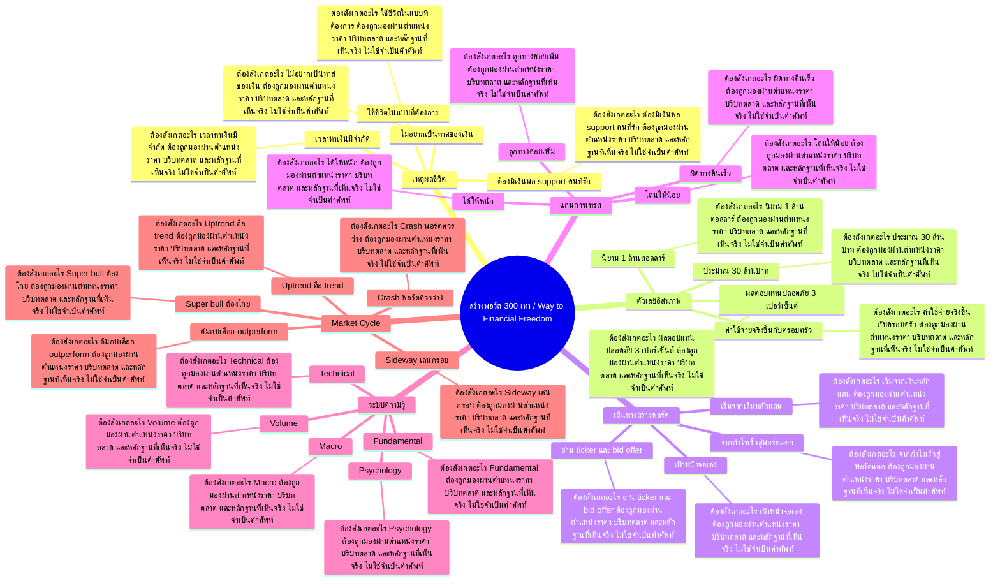

# Mind Map: สร้างพอร์ต 300 เท่า / Way to Financial Freedom

## Central Idea
Technical เป็นเพียงส่วนหนึ่งของเกม อิสรภาพทางการเงินต้องเริ่มจากเป้าหมายชีวิต เวลา ระบบคิด risk/reward และการอยู่รอดครบ market cycle

## Learning Context
- Phase: ตั้งเป้าหมายและระบบคิด
- Category: Mindset

## Learning Goals
- เข้าใจว่าทำไมการเรียนหุ้นต้องเริ่มจากเป้าหมาย ไม่ใช่เครื่องมือ
- แยกให้ออกว่า technical เป็นแค่ส่วนหนึ่งของระบบเทรด
- ตั้งกรอบเวลาและเหตุผลส่วนตัวว่าต้องการอิสรภาพทางการเงินเพื่ออะไร

## Keywords To Remember
day, บาท, time, นะครับ, ล้าน, ema, all, fundamental, market, high, management, swing

## Big Branches + Deep Branches
### เหตุผลชีวิต
- ภาพรวม: กิ่งนี้เชื่อมกับบทเรียนหลักเพราะ เหตุผลชีวิต เป็นตัวแปลงความรู้ให้กลายเป็นการตัดสินใจ โดยเฉพาะเรื่อง เวลาหาเงินมีจำกัด, ไม่อยากเป็นทาสของเงิน, ต้องมีเงินพอ support คนที่รัก
- เวลาหาเงินมีจำกัด
  - ต้องสังเกตอะไร: เวลาหาเงินมีจำกัด ต้องถูกมองผ่านตำแหน่งราคา บริบทตลาด และหลักฐานที่เห็นจริง ไม่ใช่จำเป็นคำศัพท์
  - ใช้ตอนไหน: ใช้ เวลาหาเงินมีจำกัด เพื่อช่วยตัดสินใจว่าแผนในกิ่ง เหตุผลชีวิต ควรเดินต่อ รอ ย่อขนาด หรือยกเลิก
  - ถ้าผิดต้องทำอะไร: ถ้าหลักฐานไม่ยืนยัน เวลาหาเงินมีจำกัด ให้ลดความมั่นใจทันที และกลับไปถามจุดผิดทางของแผน
- ไม่อยากเป็นทาสของเงิน
  - ต้องสังเกตอะไร: ไม่อยากเป็นทาสของเงิน ต้องถูกมองผ่านตำแหน่งราคา บริบทตลาด และหลักฐานที่เห็นจริง ไม่ใช่จำเป็นคำศัพท์
  - ใช้ตอนไหน: ใช้ ไม่อยากเป็นทาสของเงิน เพื่อช่วยตัดสินใจว่าแผนในกิ่ง เหตุผลชีวิต ควรเดินต่อ รอ ย่อขนาด หรือยกเลิก
  - ถ้าผิดต้องทำอะไร: ถ้าหลักฐานไม่ยืนยัน ไม่อยากเป็นทาสของเงิน ให้ลดความมั่นใจทันที และกลับไปถามจุดผิดทางของแผน
- ต้องมีเงินพอ support คนที่รัก
  - ต้องสังเกตอะไร: ต้องมีเงินพอ support คนที่รัก ต้องถูกมองผ่านตำแหน่งราคา บริบทตลาด และหลักฐานที่เห็นจริง ไม่ใช่จำเป็นคำศัพท์
  - ใช้ตอนไหน: ใช้ ต้องมีเงินพอ support คนที่รัก เพื่อช่วยตัดสินใจว่าแผนในกิ่ง เหตุผลชีวิต ควรเดินต่อ รอ ย่อขนาด หรือยกเลิก
  - ถ้าผิดต้องทำอะไร: ถ้าหลักฐานไม่ยืนยัน ต้องมีเงินพอ support คนที่รัก ให้ลดความมั่นใจทันที และกลับไปถามจุดผิดทางของแผน
- ใช้ชีวิตในแบบที่ต้องการ
  - ต้องสังเกตอะไร: ใช้ชีวิตในแบบที่ต้องการ ต้องถูกมองผ่านตำแหน่งราคา บริบทตลาด และหลักฐานที่เห็นจริง ไม่ใช่จำเป็นคำศัพท์
  - ใช้ตอนไหน: ใช้ ใช้ชีวิตในแบบที่ต้องการ เพื่อช่วยตัดสินใจว่าแผนในกิ่ง เหตุผลชีวิต ควรเดินต่อ รอ ย่อขนาด หรือยกเลิก
  - ถ้าผิดต้องทำอะไร: ถ้าหลักฐานไม่ยืนยัน ใช้ชีวิตในแบบที่ต้องการ ให้ลดความมั่นใจทันที และกลับไปถามจุดผิดทางของแผน

### ตัวเลขอิสรภาพ
- ภาพรวม: กิ่งนี้เชื่อมกับบทเรียนหลักเพราะ ตัวเลขอิสรภาพ เป็นตัวแปลงความรู้ให้กลายเป็นการตัดสินใจ โดยเฉพาะเรื่อง นิยาม 1 ล้านดอลลาร์, ประมาณ 30 ล้านบาท, ผลตอบแทนปลอดภัย 3 เปอร์เซ็นต์
- นิยาม 1 ล้านดอลลาร์
  - ต้องสังเกตอะไร: นิยาม 1 ล้านดอลลาร์ ต้องถูกมองผ่านตำแหน่งราคา บริบทตลาด และหลักฐานที่เห็นจริง ไม่ใช่จำเป็นคำศัพท์
  - ใช้ตอนไหน: ใช้ นิยาม 1 ล้านดอลลาร์ เพื่อช่วยตัดสินใจว่าแผนในกิ่ง ตัวเลขอิสรภาพ ควรเดินต่อ รอ ย่อขนาด หรือยกเลิก
  - ถ้าผิดต้องทำอะไร: ถ้าหลักฐานไม่ยืนยัน นิยาม 1 ล้านดอลลาร์ ให้ลดความมั่นใจทันที และกลับไปถามจุดผิดทางของแผน
- ประมาณ 30 ล้านบาท
  - ต้องสังเกตอะไร: ประมาณ 30 ล้านบาท ต้องถูกมองผ่านตำแหน่งราคา บริบทตลาด และหลักฐานที่เห็นจริง ไม่ใช่จำเป็นคำศัพท์
  - ใช้ตอนไหน: ใช้ ประมาณ 30 ล้านบาท เพื่อช่วยตัดสินใจว่าแผนในกิ่ง ตัวเลขอิสรภาพ ควรเดินต่อ รอ ย่อขนาด หรือยกเลิก
  - ถ้าผิดต้องทำอะไร: ถ้าหลักฐานไม่ยืนยัน ประมาณ 30 ล้านบาท ให้ลดความมั่นใจทันที และกลับไปถามจุดผิดทางของแผน
- ผลตอบแทนปลอดภัย 3 เปอร์เซ็นต์
  - ต้องสังเกตอะไร: ผลตอบแทนปลอดภัย 3 เปอร์เซ็นต์ ต้องถูกมองผ่านตำแหน่งราคา บริบทตลาด และหลักฐานที่เห็นจริง ไม่ใช่จำเป็นคำศัพท์
  - ใช้ตอนไหน: ใช้ ผลตอบแทนปลอดภัย 3 เปอร์เซ็นต์ เพื่อช่วยตัดสินใจว่าแผนในกิ่ง ตัวเลขอิสรภาพ ควรเดินต่อ รอ ย่อขนาด หรือยกเลิก
  - ถ้าผิดต้องทำอะไร: ถ้าหลักฐานไม่ยืนยัน ผลตอบแทนปลอดภัย 3 เปอร์เซ็นต์ ให้ลดความมั่นใจทันที และกลับไปถามจุดผิดทางของแผน
- ค่าใช้จ่ายจริงขึ้นกับครอบครัว
  - ต้องสังเกตอะไร: ค่าใช้จ่ายจริงขึ้นกับครอบครัว ต้องถูกมองผ่านตำแหน่งราคา บริบทตลาด และหลักฐานที่เห็นจริง ไม่ใช่จำเป็นคำศัพท์
  - ใช้ตอนไหน: ใช้ ค่าใช้จ่ายจริงขึ้นกับครอบครัว เพื่อช่วยตัดสินใจว่าแผนในกิ่ง ตัวเลขอิสรภาพ ควรเดินต่อ รอ ย่อขนาด หรือยกเลิก
  - ถ้าผิดต้องทำอะไร: ถ้าหลักฐานไม่ยืนยัน ค่าใช้จ่ายจริงขึ้นกับครอบครัว ให้ลดความมั่นใจทันที และกลับไปถามจุดผิดทางของแผน

### เส้นทางสร้างพอร์ต
- ภาพรวม: กิ่งนี้เชื่อมกับบทเรียนหลักเพราะ เส้นทางสร้างพอร์ต เป็นตัวแปลงความรู้ให้กลายเป็นการตัดสินใจ โดยเฉพาะเรื่อง เริ่มจากเงินหลักแสน, เฝ้าหน้าจอเอง, อ่าน ticker และ bid offer
- เริ่มจากเงินหลักแสน
  - ต้องสังเกตอะไร: เริ่มจากเงินหลักแสน ต้องถูกมองผ่านตำแหน่งราคา บริบทตลาด และหลักฐานที่เห็นจริง ไม่ใช่จำเป็นคำศัพท์
  - ใช้ตอนไหน: ใช้ เริ่มจากเงินหลักแสน เพื่อช่วยตัดสินใจว่าแผนในกิ่ง เส้นทางสร้างพอร์ต ควรเดินต่อ รอ ย่อขนาด หรือยกเลิก
  - ถ้าผิดต้องทำอะไร: ถ้าหลักฐานไม่ยืนยัน เริ่มจากเงินหลักแสน ให้ลดความมั่นใจทันที และกลับไปถามจุดผิดทางของแผน
- เฝ้าหน้าจอเอง
  - ต้องสังเกตอะไร: เฝ้าหน้าจอเอง ต้องถูกมองผ่านตำแหน่งราคา บริบทตลาด และหลักฐานที่เห็นจริง ไม่ใช่จำเป็นคำศัพท์
  - ใช้ตอนไหน: ใช้ เฝ้าหน้าจอเอง เพื่อช่วยตัดสินใจว่าแผนในกิ่ง เส้นทางสร้างพอร์ต ควรเดินต่อ รอ ย่อขนาด หรือยกเลิก
  - ถ้าผิดต้องทำอะไร: ถ้าหลักฐานไม่ยืนยัน เฝ้าหน้าจอเอง ให้ลดความมั่นใจทันที และกลับไปถามจุดผิดทางของแผน
- อ่าน ticker และ bid offer
  - ต้องสังเกตอะไร: อ่าน ticker และ bid offer ต้องถูกมองผ่านตำแหน่งราคา บริบทตลาด และหลักฐานที่เห็นจริง ไม่ใช่จำเป็นคำศัพท์
  - ใช้ตอนไหน: ใช้ อ่าน ticker และ bid offer เพื่อช่วยตัดสินใจว่าแผนในกิ่ง เส้นทางสร้างพอร์ต ควรเดินต่อ รอ ย่อขนาด หรือยกเลิก
  - ถ้าผิดต้องทำอะไร: ถ้าหลักฐานไม่ยืนยัน อ่าน ticker และ bid offer ให้ลดความมั่นใจทันที และกลับไปถามจุดผิดทางของแผน
- จากกำไรเร็วสู่พอร์ตแตก
  - ต้องสังเกตอะไร: จากกำไรเร็วสู่พอร์ตแตก ต้องถูกมองผ่านตำแหน่งราคา บริบทตลาด และหลักฐานที่เห็นจริง ไม่ใช่จำเป็นคำศัพท์
  - ใช้ตอนไหน: ใช้ จากกำไรเร็วสู่พอร์ตแตก เพื่อช่วยตัดสินใจว่าแผนในกิ่ง เส้นทางสร้างพอร์ต ควรเดินต่อ รอ ย่อขนาด หรือยกเลิก
  - ถ้าผิดต้องทำอะไร: ถ้าหลักฐานไม่ยืนยัน จากกำไรเร็วสู่พอร์ตแตก ให้ลดความมั่นใจทันที และกลับไปถามจุดผิดทางของแผน

### แก่นการเทรด
- ภาพรวม: กิ่งนี้เชื่อมกับบทเรียนหลักเพราะ แก่นการเทรด เป็นตัวแปลงความรู้ให้กลายเป็นการตัดสินใจ โดยเฉพาะเรื่อง โดนให้น้อย, ได้ให้หนัก, ถูกทางค่อยเพิ่ม
- โดนให้น้อย
  - ต้องสังเกตอะไร: โดนให้น้อย ต้องถูกมองผ่านตำแหน่งราคา บริบทตลาด และหลักฐานที่เห็นจริง ไม่ใช่จำเป็นคำศัพท์
  - ใช้ตอนไหน: ใช้ โดนให้น้อย เพื่อช่วยตัดสินใจว่าแผนในกิ่ง แก่นการเทรด ควรเดินต่อ รอ ย่อขนาด หรือยกเลิก
  - ถ้าผิดต้องทำอะไร: ถ้าหลักฐานไม่ยืนยัน โดนให้น้อย ให้ลดความมั่นใจทันที และกลับไปถามจุดผิดทางของแผน
- ได้ให้หนัก
  - ต้องสังเกตอะไร: ได้ให้หนัก ต้องถูกมองผ่านตำแหน่งราคา บริบทตลาด และหลักฐานที่เห็นจริง ไม่ใช่จำเป็นคำศัพท์
  - ใช้ตอนไหน: ใช้ ได้ให้หนัก เพื่อช่วยตัดสินใจว่าแผนในกิ่ง แก่นการเทรด ควรเดินต่อ รอ ย่อขนาด หรือยกเลิก
  - ถ้าผิดต้องทำอะไร: ถ้าหลักฐานไม่ยืนยัน ได้ให้หนัก ให้ลดความมั่นใจทันที และกลับไปถามจุดผิดทางของแผน
- ถูกทางค่อยเพิ่ม
  - ต้องสังเกตอะไร: ถูกทางค่อยเพิ่ม ต้องถูกมองผ่านตำแหน่งราคา บริบทตลาด และหลักฐานที่เห็นจริง ไม่ใช่จำเป็นคำศัพท์
  - ใช้ตอนไหน: ใช้ ถูกทางค่อยเพิ่ม เพื่อช่วยตัดสินใจว่าแผนในกิ่ง แก่นการเทรด ควรเดินต่อ รอ ย่อขนาด หรือยกเลิก
  - ถ้าผิดต้องทำอะไร: ถ้าหลักฐานไม่ยืนยัน ถูกทางค่อยเพิ่ม ให้ลดความมั่นใจทันที และกลับไปถามจุดผิดทางของแผน
- ผิดทางคืนเร็ว
  - ต้องสังเกตอะไร: ผิดทางคืนเร็ว ต้องถูกมองผ่านตำแหน่งราคา บริบทตลาด และหลักฐานที่เห็นจริง ไม่ใช่จำเป็นคำศัพท์
  - ใช้ตอนไหน: ใช้ ผิดทางคืนเร็ว เพื่อช่วยตัดสินใจว่าแผนในกิ่ง แก่นการเทรด ควรเดินต่อ รอ ย่อขนาด หรือยกเลิก
  - ถ้าผิดต้องทำอะไร: ถ้าหลักฐานไม่ยืนยัน ผิดทางคืนเร็ว ให้ลดความมั่นใจทันที และกลับไปถามจุดผิดทางของแผน

### ระบบความรู้
- ภาพรวม: กิ่งนี้เชื่อมกับบทเรียนหลักเพราะ ระบบความรู้ เป็นตัวแปลงความรู้ให้กลายเป็นการตัดสินใจ โดยเฉพาะเรื่อง Macro, Fundamental, Technical
- Macro
  - ต้องสังเกตอะไร: Macro ต้องถูกมองผ่านตำแหน่งราคา บริบทตลาด และหลักฐานที่เห็นจริง ไม่ใช่จำเป็นคำศัพท์
  - ใช้ตอนไหน: ใช้ Macro เพื่อช่วยตัดสินใจว่าแผนในกิ่ง ระบบความรู้ ควรเดินต่อ รอ ย่อขนาด หรือยกเลิก
  - ถ้าผิดต้องทำอะไร: ถ้าหลักฐานไม่ยืนยัน Macro ให้ลดความมั่นใจทันที และกลับไปถามจุดผิดทางของแผน
- Fundamental
  - ต้องสังเกตอะไร: Fundamental ต้องถูกมองผ่านตำแหน่งราคา บริบทตลาด และหลักฐานที่เห็นจริง ไม่ใช่จำเป็นคำศัพท์
  - ใช้ตอนไหน: ใช้ Fundamental เพื่อช่วยตัดสินใจว่าแผนในกิ่ง ระบบความรู้ ควรเดินต่อ รอ ย่อขนาด หรือยกเลิก
  - ถ้าผิดต้องทำอะไร: ถ้าหลักฐานไม่ยืนยัน Fundamental ให้ลดความมั่นใจทันที และกลับไปถามจุดผิดทางของแผน
- Technical
  - ต้องสังเกตอะไร: Technical ต้องถูกมองผ่านตำแหน่งราคา บริบทตลาด และหลักฐานที่เห็นจริง ไม่ใช่จำเป็นคำศัพท์
  - ใช้ตอนไหน: ใช้ Technical เพื่อช่วยตัดสินใจว่าแผนในกิ่ง ระบบความรู้ ควรเดินต่อ รอ ย่อขนาด หรือยกเลิก
  - ถ้าผิดต้องทำอะไร: ถ้าหลักฐานไม่ยืนยัน Technical ให้ลดความมั่นใจทันที และกลับไปถามจุดผิดทางของแผน
- Volume
  - ต้องสังเกตอะไร: Volume ต้องถูกมองผ่านตำแหน่งราคา บริบทตลาด และหลักฐานที่เห็นจริง ไม่ใช่จำเป็นคำศัพท์
  - ใช้ตอนไหน: ใช้ Volume เพื่อช่วยตัดสินใจว่าแผนในกิ่ง ระบบความรู้ ควรเดินต่อ รอ ย่อขนาด หรือยกเลิก
  - ถ้าผิดต้องทำอะไร: ถ้าหลักฐานไม่ยืนยัน Volume ให้ลดความมั่นใจทันที และกลับไปถามจุดผิดทางของแผน
- Psychology
  - ต้องสังเกตอะไร: Psychology ต้องถูกมองผ่านตำแหน่งราคา บริบทตลาด และหลักฐานที่เห็นจริง ไม่ใช่จำเป็นคำศัพท์
  - ใช้ตอนไหน: ใช้ Psychology เพื่อช่วยตัดสินใจว่าแผนในกิ่ง ระบบความรู้ ควรเดินต่อ รอ ย่อขนาด หรือยกเลิก
  - ถ้าผิดต้องทำอะไร: ถ้าหลักฐานไม่ยืนยัน Psychology ให้ลดความมั่นใจทันที และกลับไปถามจุดผิดทางของแผน

### Market Cycle
- ภาพรวม: กิ่งนี้เชื่อมกับบทเรียนหลักเพราะ Market Cycle เป็นตัวแปลงความรู้ให้กลายเป็นการตัดสินใจ โดยเฉพาะเรื่อง Super bull ต้องโกย, Uptrend ถือ trend, Sideway เล่นกรอบ
- Super bull ต้องโกย
  - ต้องสังเกตอะไร: Super bull ต้องโกย ต้องถูกมองผ่านตำแหน่งราคา บริบทตลาด และหลักฐานที่เห็นจริง ไม่ใช่จำเป็นคำศัพท์
  - ใช้ตอนไหน: ใช้ Super bull ต้องโกย เพื่อช่วยตัดสินใจว่าแผนในกิ่ง Market Cycle ควรเดินต่อ รอ ย่อขนาด หรือยกเลิก
  - ถ้าผิดต้องทำอะไร: ถ้าหลักฐานไม่ยืนยัน Super bull ต้องโกย ให้ลดความมั่นใจทันที และกลับไปถามจุดผิดทางของแผน
- Uptrend ถือ trend
  - ต้องสังเกตอะไร: Uptrend ถือ trend ต้องถูกมองผ่านตำแหน่งราคา บริบทตลาด และหลักฐานที่เห็นจริง ไม่ใช่จำเป็นคำศัพท์
  - ใช้ตอนไหน: ใช้ Uptrend ถือ trend เพื่อช่วยตัดสินใจว่าแผนในกิ่ง Market Cycle ควรเดินต่อ รอ ย่อขนาด หรือยกเลิก
  - ถ้าผิดต้องทำอะไร: ถ้าหลักฐานไม่ยืนยัน Uptrend ถือ trend ให้ลดความมั่นใจทันที และกลับไปถามจุดผิดทางของแผน
- Sideway เล่นกรอบ
  - ต้องสังเกตอะไร: Sideway เล่นกรอบ ต้องถูกมองผ่านตำแหน่งราคา บริบทตลาด และหลักฐานที่เห็นจริง ไม่ใช่จำเป็นคำศัพท์
  - ใช้ตอนไหน: ใช้ Sideway เล่นกรอบ เพื่อช่วยตัดสินใจว่าแผนในกิ่ง Market Cycle ควรเดินต่อ รอ ย่อขนาด หรือยกเลิก
  - ถ้าผิดต้องทำอะไร: ถ้าหลักฐานไม่ยืนยัน Sideway เล่นกรอบ ให้ลดความมั่นใจทันที และกลับไปถามจุดผิดทางของแผน
- ต้มกบเลือก outperform
  - ต้องสังเกตอะไร: ต้มกบเลือก outperform ต้องถูกมองผ่านตำแหน่งราคา บริบทตลาด และหลักฐานที่เห็นจริง ไม่ใช่จำเป็นคำศัพท์
  - ใช้ตอนไหน: ใช้ ต้มกบเลือก outperform เพื่อช่วยตัดสินใจว่าแผนในกิ่ง Market Cycle ควรเดินต่อ รอ ย่อขนาด หรือยกเลิก
  - ถ้าผิดต้องทำอะไร: ถ้าหลักฐานไม่ยืนยัน ต้มกบเลือก outperform ให้ลดความมั่นใจทันที และกลับไปถามจุดผิดทางของแผน
- Crash พอร์ตควรว่าง
  - ต้องสังเกตอะไร: Crash พอร์ตควรว่าง ต้องถูกมองผ่านตำแหน่งราคา บริบทตลาด และหลักฐานที่เห็นจริง ไม่ใช่จำเป็นคำศัพท์
  - ใช้ตอนไหน: ใช้ Crash พอร์ตควรว่าง เพื่อช่วยตัดสินใจว่าแผนในกิ่ง Market Cycle ควรเดินต่อ รอ ย่อขนาด หรือยกเลิก
  - ถ้าผิดต้องทำอะไร: ถ้าหลักฐานไม่ยืนยัน Crash พอร์ตควรว่าง ให้ลดความมั่นใจทันที และกลับไปถามจุดผิดทางของแผน

## Transcript Signals
> เชื่อว่าทุกท่านน่าจะมีความรู้เรื่องของ ทางเทคนิคมันก็จะมีโจทย์ถามว่าทำไมเรียน เทคนิคแล้วทำไมบางคนถึงประสบความสำเร็จ แต่ทำไมบางคนไม่ประสบความสำเร็จเพราะว่า Teทคnical Analysis เป็นแค่พเล็กๆครับ เป็นแค่พ มากสุดประมาณ 10% วันนี้ผมเลยอยากจะพูดภาพรวมนะครับว่าถ้า...

> รู้สึกว่าเฮ้ยอะไรวะผ่านมาเกินครึ่งชีวิต ละทำไมเวลาผ่านไปเร็วขนาดนี้ไอ้ตอนที่เรา อายุ 30 เราจะไม่ค่อยรู้สึกอะไรเท่าไหร่ แต่พอขึ้นอายุ 40 อย่างปีเนี้ยผมอายุ 44 45 ละผมจะรู้สึกเลยว่าเฮ้ยเราผ่านมาเกิน ครึ่งปีละเพราะฉะนั้นคือเราไม่ได้มีเวลา ในการหาเงินมาก...

> ใหญ่จะเข้ามาตอนตลาดดีจะเฮ้ๆๆๆแล้วหายหมด ตอนตลาดพัง แต่เราต้องอยู่ครับอยู่ให้ครบ market cycle ประคองตัวให้ได้ในวันที่ลำบากแล้วฟาดให้ เต็มในวันที่มันง่าย เพราะฉะนั้นวันเนี้ยก็คร่าวๆประมาณนี้ ครับเรามีpassชionก่อนผมว่าเราต้องมี...

## Decision Rules
- เหตุผลชีวิต: จะใช้กิ่งนี้ได้เมื่อเห็น เวลาหาเงินมีจำกัด และ ไม่อยากเป็นทาสของเงิน พร้อมกัน ถ้าเจอเงื่อนไขตรงข้ามกับ ใช้ชีวิตในแบบที่ต้องการ ให้ลดขนาดหรือหยุด
- ตัวเลขอิสรภาพ: จะใช้กิ่งนี้ได้เมื่อเห็น นิยาม 1 ล้านดอลลาร์ และ ประมาณ 30 ล้านบาท พร้อมกัน ถ้าเจอเงื่อนไขตรงข้ามกับ ค่าใช้จ่ายจริงขึ้นกับครอบครัว ให้ลดขนาดหรือหยุด
- เส้นทางสร้างพอร์ต: จะใช้กิ่งนี้ได้เมื่อเห็น เริ่มจากเงินหลักแสน และ เฝ้าหน้าจอเอง พร้อมกัน ถ้าเจอเงื่อนไขตรงข้ามกับ จากกำไรเร็วสู่พอร์ตแตก ให้ลดขนาดหรือหยุด
- แก่นการเทรด: จะใช้กิ่งนี้ได้เมื่อเห็น โดนให้น้อย และ ได้ให้หนัก พร้อมกัน ถ้าเจอเงื่อนไขตรงข้ามกับ ผิดทางคืนเร็ว ให้ลดขนาดหรือหยุด
- ระบบความรู้: จะใช้กิ่งนี้ได้เมื่อเห็น Macro และ Fundamental พร้อมกัน ถ้าเจอเงื่อนไขตรงข้ามกับ Psychology ให้ลดขนาดหรือหยุด
- Market Cycle: จะใช้กิ่งนี้ได้เมื่อเห็น Super bull ต้องโกย และ Uptrend ถือ trend พร้อมกัน ถ้าเจอเงื่อนไขตรงข้ามกับ Crash พอร์ตควรว่าง ให้ลดขนาดหรือหยุด

## Common Mistakes
- จำชื่อบทได้ แต่ไม่รู้ว่า เหตุผลชีวิต ต้องเปลี่ยนพฤติกรรมการเทรดตรงไหน
- เห็นสัญญาณหนึ่งอย่างแล้วรีบสรุป ทั้งที่ยังไม่ได้เช็กบริบทและหลักฐานประกอบ
- วางแผนตอนใจเย็น แต่พอราคาเคลื่อนไหวจริงกลับเปลี่ยนกฎตามอารมณ์
- สนใจ Market Cycle แค่ตอนอยากเข้า แต่ไม่ใช้เป็นเงื่อนไขตอนต้องออกหรือหยุด

## Practice Checklist
- ทวนเป้าหมายบทนี้ก่อนเริ่ม: เข้าใจว่าทำไมการเรียนหุ้นต้องเริ่มจากเป้าหมาย ไม่ใช่เครื่องมือ
- เปิดกราฟหรือกรณีศึกษาจริง 1 ตัว แล้วระบุว่าเกี่ยวกับกิ่ง 'เหตุผลชีวิต' ตรงไหน
- เขียนก่อนเข้าว่า thesis คืออะไร หลักฐานคืออะไร และถ้าผิดจะยอมรับตรงไหน
- แยกสิ่งที่เห็นจริงออกจากสิ่งที่อยากให้เกิด แล้วให้คะแนนความมั่นใจ 1-5
- หลังจบเคส ให้บันทึกว่าแพ้/ชนะเพราะระบบ หรือเพราะอารมณ์

## Final Destination
เลิกถามแค่ว่าหุ้นตัวไหนดี แล้วถามว่าอยู่สนามไหน เงินก้อนนี้ทำหน้าที่อะไร ถ้าผิดเสียเท่าไร และ trade นี้พาเข้าใกล้อิสรภาพจริงไหม

## Questions for Patiphan
1. กิ่งไหนคือแก่นที่สุดของบทนี้
2. กิ่งไหนเกี่ยวกับจุดอ่อนของ Patiphan มากที่สุด
3. ถ้าจะเอาไปใช้กับกราฟจริง ต้องเห็นหลักฐานอะไร
4. ถ้าทำผิด บทนี้เตือนให้หยุดตรงไหน
5. ปลายทางของบทนี้จะเข้าไปอยู่ในระบบเทรดส่วนไหน
