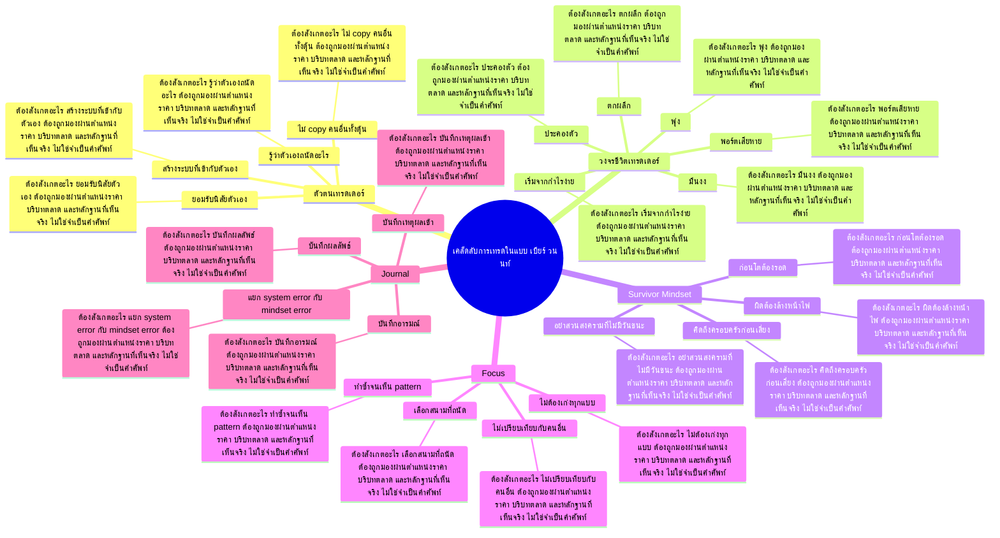

# Mind Map: เคล็ดลับการเทรดในแบบ เบียร์ วนนท์

## Central Idea
การเทรดแบบมืออาชีพไม่ได้เกิดจากสูตรเดียว แต่เกิดจากการสังเกตซ้ำ ตกผลึกเป็นระบบของตัวเอง และไม่หลอกตัวเองเวลาแพ้

## Learning Context
- Phase: เรียนจากประสบการณ์นักเทรด
- Category: Trader Mind

## Learning Goals
- จับหลักคิดจากกรณีศึกษาของนักเทรดจริง
- แยกพฤติกรรมที่ควรเลียนแบบออกจากรายละเอียดเฉพาะบุคคล
- แปลงประสบการณ์คนอื่นเป็น checklist ของตัวเอง

## Keywords To Remember
day, jkn, ล้าน, บาท, นะครับ, stop, วัน, ent, ipo, เทรด, หุ้น, time

## Big Branches + Deep Branches
### ตัวตนเทรดเดอร์
- ภาพรวม: กิ่งนี้เชื่อมกับบทเรียนหลักเพราะ ตัวตนเทรดเดอร์ เป็นตัวแปลงความรู้ให้กลายเป็นการตัดสินใจ โดยเฉพาะเรื่อง รู้ว่าตัวเองถนัดอะไร, ไม่ copy คนอื่นทั้งดุ้น, ยอมรับนิสัยตัวเอง
- รู้ว่าตัวเองถนัดอะไร
  - ต้องสังเกตอะไร: รู้ว่าตัวเองถนัดอะไร ต้องถูกมองผ่านตำแหน่งราคา บริบทตลาด และหลักฐานที่เห็นจริง ไม่ใช่จำเป็นคำศัพท์
  - ใช้ตอนไหน: ใช้ รู้ว่าตัวเองถนัดอะไร เพื่อช่วยตัดสินใจว่าแผนในกิ่ง ตัวตนเทรดเดอร์ ควรเดินต่อ รอ ย่อขนาด หรือยกเลิก
  - ถ้าผิดต้องทำอะไร: ถ้าหลักฐานไม่ยืนยัน รู้ว่าตัวเองถนัดอะไร ให้ลดความมั่นใจทันที และกลับไปถามจุดผิดทางของแผน
- ไม่ copy คนอื่นทั้งดุ้น
  - ต้องสังเกตอะไร: ไม่ copy คนอื่นทั้งดุ้น ต้องถูกมองผ่านตำแหน่งราคา บริบทตลาด และหลักฐานที่เห็นจริง ไม่ใช่จำเป็นคำศัพท์
  - ใช้ตอนไหน: ใช้ ไม่ copy คนอื่นทั้งดุ้น เพื่อช่วยตัดสินใจว่าแผนในกิ่ง ตัวตนเทรดเดอร์ ควรเดินต่อ รอ ย่อขนาด หรือยกเลิก
  - ถ้าผิดต้องทำอะไร: ถ้าหลักฐานไม่ยืนยัน ไม่ copy คนอื่นทั้งดุ้น ให้ลดความมั่นใจทันที และกลับไปถามจุดผิดทางของแผน
- ยอมรับนิสัยตัวเอง
  - ต้องสังเกตอะไร: ยอมรับนิสัยตัวเอง ต้องถูกมองผ่านตำแหน่งราคา บริบทตลาด และหลักฐานที่เห็นจริง ไม่ใช่จำเป็นคำศัพท์
  - ใช้ตอนไหน: ใช้ ยอมรับนิสัยตัวเอง เพื่อช่วยตัดสินใจว่าแผนในกิ่ง ตัวตนเทรดเดอร์ ควรเดินต่อ รอ ย่อขนาด หรือยกเลิก
  - ถ้าผิดต้องทำอะไร: ถ้าหลักฐานไม่ยืนยัน ยอมรับนิสัยตัวเอง ให้ลดความมั่นใจทันที และกลับไปถามจุดผิดทางของแผน
- สร้างระบบที่เข้ากับตัวเอง
  - ต้องสังเกตอะไร: สร้างระบบที่เข้ากับตัวเอง ต้องถูกมองผ่านตำแหน่งราคา บริบทตลาด และหลักฐานที่เห็นจริง ไม่ใช่จำเป็นคำศัพท์
  - ใช้ตอนไหน: ใช้ สร้างระบบที่เข้ากับตัวเอง เพื่อช่วยตัดสินใจว่าแผนในกิ่ง ตัวตนเทรดเดอร์ ควรเดินต่อ รอ ย่อขนาด หรือยกเลิก
  - ถ้าผิดต้องทำอะไร: ถ้าหลักฐานไม่ยืนยัน สร้างระบบที่เข้ากับตัวเอง ให้ลดความมั่นใจทันที และกลับไปถามจุดผิดทางของแผน

### วงจรชีวิตเทรดเดอร์
- ภาพรวม: กิ่งนี้เชื่อมกับบทเรียนหลักเพราะ วงจรชีวิตเทรดเดอร์ เป็นตัวแปลงความรู้ให้กลายเป็นการตัดสินใจ โดยเฉพาะเรื่อง เริ่มจากกำไรง่าย, มึนงง, พอร์ตเสียหาย
- เริ่มจากกำไรง่าย
  - ต้องสังเกตอะไร: เริ่มจากกำไรง่าย ต้องถูกมองผ่านตำแหน่งราคา บริบทตลาด และหลักฐานที่เห็นจริง ไม่ใช่จำเป็นคำศัพท์
  - ใช้ตอนไหน: ใช้ เริ่มจากกำไรง่าย เพื่อช่วยตัดสินใจว่าแผนในกิ่ง วงจรชีวิตเทรดเดอร์ ควรเดินต่อ รอ ย่อขนาด หรือยกเลิก
  - ถ้าผิดต้องทำอะไร: ถ้าหลักฐานไม่ยืนยัน เริ่มจากกำไรง่าย ให้ลดความมั่นใจทันที และกลับไปถามจุดผิดทางของแผน
- มึนงง
  - ต้องสังเกตอะไร: มึนงง ต้องถูกมองผ่านตำแหน่งราคา บริบทตลาด และหลักฐานที่เห็นจริง ไม่ใช่จำเป็นคำศัพท์
  - ใช้ตอนไหน: ใช้ มึนงง เพื่อช่วยตัดสินใจว่าแผนในกิ่ง วงจรชีวิตเทรดเดอร์ ควรเดินต่อ รอ ย่อขนาด หรือยกเลิก
  - ถ้าผิดต้องทำอะไร: ถ้าหลักฐานไม่ยืนยัน มึนงง ให้ลดความมั่นใจทันที และกลับไปถามจุดผิดทางของแผน
- พอร์ตเสียหาย
  - ต้องสังเกตอะไร: พอร์ตเสียหาย ต้องถูกมองผ่านตำแหน่งราคา บริบทตลาด และหลักฐานที่เห็นจริง ไม่ใช่จำเป็นคำศัพท์
  - ใช้ตอนไหน: ใช้ พอร์ตเสียหาย เพื่อช่วยตัดสินใจว่าแผนในกิ่ง วงจรชีวิตเทรดเดอร์ ควรเดินต่อ รอ ย่อขนาด หรือยกเลิก
  - ถ้าผิดต้องทำอะไร: ถ้าหลักฐานไม่ยืนยัน พอร์ตเสียหาย ให้ลดความมั่นใจทันที และกลับไปถามจุดผิดทางของแผน
- ตกผลึก
  - ต้องสังเกตอะไร: ตกผลึก ต้องถูกมองผ่านตำแหน่งราคา บริบทตลาด และหลักฐานที่เห็นจริง ไม่ใช่จำเป็นคำศัพท์
  - ใช้ตอนไหน: ใช้ ตกผลึก เพื่อช่วยตัดสินใจว่าแผนในกิ่ง วงจรชีวิตเทรดเดอร์ ควรเดินต่อ รอ ย่อขนาด หรือยกเลิก
  - ถ้าผิดต้องทำอะไร: ถ้าหลักฐานไม่ยืนยัน ตกผลึก ให้ลดความมั่นใจทันที และกลับไปถามจุดผิดทางของแผน
- ประคองตัว
  - ต้องสังเกตอะไร: ประคองตัว ต้องถูกมองผ่านตำแหน่งราคา บริบทตลาด และหลักฐานที่เห็นจริง ไม่ใช่จำเป็นคำศัพท์
  - ใช้ตอนไหน: ใช้ ประคองตัว เพื่อช่วยตัดสินใจว่าแผนในกิ่ง วงจรชีวิตเทรดเดอร์ ควรเดินต่อ รอ ย่อขนาด หรือยกเลิก
  - ถ้าผิดต้องทำอะไร: ถ้าหลักฐานไม่ยืนยัน ประคองตัว ให้ลดความมั่นใจทันที และกลับไปถามจุดผิดทางของแผน
- พุ่ง
  - ต้องสังเกตอะไร: พุ่ง ต้องถูกมองผ่านตำแหน่งราคา บริบทตลาด และหลักฐานที่เห็นจริง ไม่ใช่จำเป็นคำศัพท์
  - ใช้ตอนไหน: ใช้ พุ่ง เพื่อช่วยตัดสินใจว่าแผนในกิ่ง วงจรชีวิตเทรดเดอร์ ควรเดินต่อ รอ ย่อขนาด หรือยกเลิก
  - ถ้าผิดต้องทำอะไร: ถ้าหลักฐานไม่ยืนยัน พุ่ง ให้ลดความมั่นใจทันที และกลับไปถามจุดผิดทางของแผน

### Survivor Mindset
- ภาพรวม: กิ่งนี้เชื่อมกับบทเรียนหลักเพราะ Survivor Mindset เป็นตัวแปลงความรู้ให้กลายเป็นการตัดสินใจ โดยเฉพาะเรื่อง ก่อนโตต้องรอด, ผิดต้องล้างหน้าไพ่, อย่าสวนสงครามที่ไม่มีวันชนะ
- ก่อนโตต้องรอด
  - ต้องสังเกตอะไร: ก่อนโตต้องรอด ต้องถูกมองผ่านตำแหน่งราคา บริบทตลาด และหลักฐานที่เห็นจริง ไม่ใช่จำเป็นคำศัพท์
  - ใช้ตอนไหน: ใช้ ก่อนโตต้องรอด เพื่อช่วยตัดสินใจว่าแผนในกิ่ง Survivor Mindset ควรเดินต่อ รอ ย่อขนาด หรือยกเลิก
  - ถ้าผิดต้องทำอะไร: ถ้าหลักฐานไม่ยืนยัน ก่อนโตต้องรอด ให้ลดความมั่นใจทันที และกลับไปถามจุดผิดทางของแผน
- ผิดต้องล้างหน้าไพ่
  - ต้องสังเกตอะไร: ผิดต้องล้างหน้าไพ่ ต้องถูกมองผ่านตำแหน่งราคา บริบทตลาด และหลักฐานที่เห็นจริง ไม่ใช่จำเป็นคำศัพท์
  - ใช้ตอนไหน: ใช้ ผิดต้องล้างหน้าไพ่ เพื่อช่วยตัดสินใจว่าแผนในกิ่ง Survivor Mindset ควรเดินต่อ รอ ย่อขนาด หรือยกเลิก
  - ถ้าผิดต้องทำอะไร: ถ้าหลักฐานไม่ยืนยัน ผิดต้องล้างหน้าไพ่ ให้ลดความมั่นใจทันที และกลับไปถามจุดผิดทางของแผน
- อย่าสวนสงครามที่ไม่มีวันชนะ
  - ต้องสังเกตอะไร: อย่าสวนสงครามที่ไม่มีวันชนะ ต้องถูกมองผ่านตำแหน่งราคา บริบทตลาด และหลักฐานที่เห็นจริง ไม่ใช่จำเป็นคำศัพท์
  - ใช้ตอนไหน: ใช้ อย่าสวนสงครามที่ไม่มีวันชนะ เพื่อช่วยตัดสินใจว่าแผนในกิ่ง Survivor Mindset ควรเดินต่อ รอ ย่อขนาด หรือยกเลิก
  - ถ้าผิดต้องทำอะไร: ถ้าหลักฐานไม่ยืนยัน อย่าสวนสงครามที่ไม่มีวันชนะ ให้ลดความมั่นใจทันที และกลับไปถามจุดผิดทางของแผน
- คิดถึงครอบครัวก่อนเสี่ยง
  - ต้องสังเกตอะไร: คิดถึงครอบครัวก่อนเสี่ยง ต้องถูกมองผ่านตำแหน่งราคา บริบทตลาด และหลักฐานที่เห็นจริง ไม่ใช่จำเป็นคำศัพท์
  - ใช้ตอนไหน: ใช้ คิดถึงครอบครัวก่อนเสี่ยง เพื่อช่วยตัดสินใจว่าแผนในกิ่ง Survivor Mindset ควรเดินต่อ รอ ย่อขนาด หรือยกเลิก
  - ถ้าผิดต้องทำอะไร: ถ้าหลักฐานไม่ยืนยัน คิดถึงครอบครัวก่อนเสี่ยง ให้ลดความมั่นใจทันที และกลับไปถามจุดผิดทางของแผน

### Focus
- ภาพรวม: กิ่งนี้เชื่อมกับบทเรียนหลักเพราะ Focus เป็นตัวแปลงความรู้ให้กลายเป็นการตัดสินใจ โดยเฉพาะเรื่อง ไม่ต้องเก่งทุกแบบ, เลือกสนามที่ถนัด, ทำซ้ำจนเห็น pattern
- ไม่ต้องเก่งทุกแบบ
  - ต้องสังเกตอะไร: ไม่ต้องเก่งทุกแบบ ต้องถูกมองผ่านตำแหน่งราคา บริบทตลาด และหลักฐานที่เห็นจริง ไม่ใช่จำเป็นคำศัพท์
  - ใช้ตอนไหน: ใช้ ไม่ต้องเก่งทุกแบบ เพื่อช่วยตัดสินใจว่าแผนในกิ่ง Focus ควรเดินต่อ รอ ย่อขนาด หรือยกเลิก
  - ถ้าผิดต้องทำอะไร: ถ้าหลักฐานไม่ยืนยัน ไม่ต้องเก่งทุกแบบ ให้ลดความมั่นใจทันที และกลับไปถามจุดผิดทางของแผน
- เลือกสนามที่ถนัด
  - ต้องสังเกตอะไร: เลือกสนามที่ถนัด ต้องถูกมองผ่านตำแหน่งราคา บริบทตลาด และหลักฐานที่เห็นจริง ไม่ใช่จำเป็นคำศัพท์
  - ใช้ตอนไหน: ใช้ เลือกสนามที่ถนัด เพื่อช่วยตัดสินใจว่าแผนในกิ่ง Focus ควรเดินต่อ รอ ย่อขนาด หรือยกเลิก
  - ถ้าผิดต้องทำอะไร: ถ้าหลักฐานไม่ยืนยัน เลือกสนามที่ถนัด ให้ลดความมั่นใจทันที และกลับไปถามจุดผิดทางของแผน
- ทำซ้ำจนเห็น pattern
  - ต้องสังเกตอะไร: ทำซ้ำจนเห็น pattern ต้องถูกมองผ่านตำแหน่งราคา บริบทตลาด และหลักฐานที่เห็นจริง ไม่ใช่จำเป็นคำศัพท์
  - ใช้ตอนไหน: ใช้ ทำซ้ำจนเห็น pattern เพื่อช่วยตัดสินใจว่าแผนในกิ่ง Focus ควรเดินต่อ รอ ย่อขนาด หรือยกเลิก
  - ถ้าผิดต้องทำอะไร: ถ้าหลักฐานไม่ยืนยัน ทำซ้ำจนเห็น pattern ให้ลดความมั่นใจทันที และกลับไปถามจุดผิดทางของแผน
- ไม่เปรียบเทียบกับคนอื่น
  - ต้องสังเกตอะไร: ไม่เปรียบเทียบกับคนอื่น ต้องถูกมองผ่านตำแหน่งราคา บริบทตลาด และหลักฐานที่เห็นจริง ไม่ใช่จำเป็นคำศัพท์
  - ใช้ตอนไหน: ใช้ ไม่เปรียบเทียบกับคนอื่น เพื่อช่วยตัดสินใจว่าแผนในกิ่ง Focus ควรเดินต่อ รอ ย่อขนาด หรือยกเลิก
  - ถ้าผิดต้องทำอะไร: ถ้าหลักฐานไม่ยืนยัน ไม่เปรียบเทียบกับคนอื่น ให้ลดความมั่นใจทันที และกลับไปถามจุดผิดทางของแผน

### Journal
- ภาพรวม: กิ่งนี้เชื่อมกับบทเรียนหลักเพราะ Journal เป็นตัวแปลงความรู้ให้กลายเป็นการตัดสินใจ โดยเฉพาะเรื่อง บันทึกเหตุผลเข้า, บันทึกอารมณ์, บันทึกผลลัพธ์
- บันทึกเหตุผลเข้า
  - ต้องสังเกตอะไร: บันทึกเหตุผลเข้า ต้องถูกมองผ่านตำแหน่งราคา บริบทตลาด และหลักฐานที่เห็นจริง ไม่ใช่จำเป็นคำศัพท์
  - ใช้ตอนไหน: ใช้ บันทึกเหตุผลเข้า เพื่อช่วยตัดสินใจว่าแผนในกิ่ง Journal ควรเดินต่อ รอ ย่อขนาด หรือยกเลิก
  - ถ้าผิดต้องทำอะไร: ถ้าหลักฐานไม่ยืนยัน บันทึกเหตุผลเข้า ให้ลดความมั่นใจทันที และกลับไปถามจุดผิดทางของแผน
- บันทึกอารมณ์
  - ต้องสังเกตอะไร: บันทึกอารมณ์ ต้องถูกมองผ่านตำแหน่งราคา บริบทตลาด และหลักฐานที่เห็นจริง ไม่ใช่จำเป็นคำศัพท์
  - ใช้ตอนไหน: ใช้ บันทึกอารมณ์ เพื่อช่วยตัดสินใจว่าแผนในกิ่ง Journal ควรเดินต่อ รอ ย่อขนาด หรือยกเลิก
  - ถ้าผิดต้องทำอะไร: ถ้าหลักฐานไม่ยืนยัน บันทึกอารมณ์ ให้ลดความมั่นใจทันที และกลับไปถามจุดผิดทางของแผน
- บันทึกผลลัพธ์
  - ต้องสังเกตอะไร: บันทึกผลลัพธ์ ต้องถูกมองผ่านตำแหน่งราคา บริบทตลาด และหลักฐานที่เห็นจริง ไม่ใช่จำเป็นคำศัพท์
  - ใช้ตอนไหน: ใช้ บันทึกผลลัพธ์ เพื่อช่วยตัดสินใจว่าแผนในกิ่ง Journal ควรเดินต่อ รอ ย่อขนาด หรือยกเลิก
  - ถ้าผิดต้องทำอะไร: ถ้าหลักฐานไม่ยืนยัน บันทึกผลลัพธ์ ให้ลดความมั่นใจทันที และกลับไปถามจุดผิดทางของแผน
- แยก system error กับ mindset error
  - ต้องสังเกตอะไร: แยก system error กับ mindset error ต้องถูกมองผ่านตำแหน่งราคา บริบทตลาด และหลักฐานที่เห็นจริง ไม่ใช่จำเป็นคำศัพท์
  - ใช้ตอนไหน: ใช้ แยก system error กับ mindset error เพื่อช่วยตัดสินใจว่าแผนในกิ่ง Journal ควรเดินต่อ รอ ย่อขนาด หรือยกเลิก
  - ถ้าผิดต้องทำอะไร: ถ้าหลักฐานไม่ยืนยัน แยก system error กับ mindset error ให้ลดความมั่นใจทันที และกลับไปถามจุดผิดทางของแผน

## Transcript Signals
> ก็คือการเรียบเรียงตั้งแต่มันจะเป็นอย่าง งี้ครับหุ้นสด หุ้นสดหมายความว่าเล่นวันนั้นเราต้องมี หุ้นสดอยู่ในมือก่อนหุ้นสดกับหุ้นจริงแตก ต่างกันอย่างไรสดไม่ได้ความว่าไม่ได้หมาย ความว่าจะเป็นตัวจริง ตัวจริงคือซิเกอร์ JMK แต่ตอนนี้ไม่สด...

> อย่างแรกเลยนะครับต้องแยกว่าการขาดทุน นั้นนะครับมันเป็นการขาดทุนโดยที่เรารู้ มยว่าเรามีโอกาสขาดทุน หรือมันเป็นการขาดทุนแบบประสบการณ์ใหม่ โดยที่เราไม่รู้ว่าไอ้[ __ ]นี่กูขาดทุน หรอวะเนี่ยคือคือตอบมันอาจจะปั่นๆยกตัว อย่างเช่นในอาทิตย์ที่ผ่านมาเนี่ยถ้าคุณ เทรด...

> ครับคำถามในห้องอีกสัก 1 คำถามครับ อ่ะงั้น 2 เลยแล้วกันต่อนิดนึงเนาะเดี๋ยว สักครู่นะครับผมขอไมค์ไปใช่มั้โอตั้งหน้า ตั้งนานแล้วเนาะหยอกครับน้องครับ >> เอ่อผมอยากรู้หลักการเวลาขายอ่ะครับผมจะ มีปัญหาเรื่องการขายเวลาซื้อหุ้นไปแล้ว...

## Decision Rules
- ตัวตนเทรดเดอร์: จะใช้กิ่งนี้ได้เมื่อเห็น รู้ว่าตัวเองถนัดอะไร และ ไม่ copy คนอื่นทั้งดุ้น พร้อมกัน ถ้าเจอเงื่อนไขตรงข้ามกับ สร้างระบบที่เข้ากับตัวเอง ให้ลดขนาดหรือหยุด
- วงจรชีวิตเทรดเดอร์: จะใช้กิ่งนี้ได้เมื่อเห็น เริ่มจากกำไรง่าย และ มึนงง พร้อมกัน ถ้าเจอเงื่อนไขตรงข้ามกับ พุ่ง ให้ลดขนาดหรือหยุด
- Survivor Mindset: จะใช้กิ่งนี้ได้เมื่อเห็น ก่อนโตต้องรอด และ ผิดต้องล้างหน้าไพ่ พร้อมกัน ถ้าเจอเงื่อนไขตรงข้ามกับ คิดถึงครอบครัวก่อนเสี่ยง ให้ลดขนาดหรือหยุด
- Focus: จะใช้กิ่งนี้ได้เมื่อเห็น ไม่ต้องเก่งทุกแบบ และ เลือกสนามที่ถนัด พร้อมกัน ถ้าเจอเงื่อนไขตรงข้ามกับ ไม่เปรียบเทียบกับคนอื่น ให้ลดขนาดหรือหยุด
- Journal: จะใช้กิ่งนี้ได้เมื่อเห็น บันทึกเหตุผลเข้า และ บันทึกอารมณ์ พร้อมกัน ถ้าเจอเงื่อนไขตรงข้ามกับ แยก system error กับ mindset error ให้ลดขนาดหรือหยุด

## Common Mistakes
- จำชื่อบทได้ แต่ไม่รู้ว่า ตัวตนเทรดเดอร์ ต้องเปลี่ยนพฤติกรรมการเทรดตรงไหน
- เห็นสัญญาณหนึ่งอย่างแล้วรีบสรุป ทั้งที่ยังไม่ได้เช็กบริบทและหลักฐานประกอบ
- วางแผนตอนใจเย็น แต่พอราคาเคลื่อนไหวจริงกลับเปลี่ยนกฎตามอารมณ์
- สนใจ Journal แค่ตอนอยากเข้า แต่ไม่ใช้เป็นเงื่อนไขตอนต้องออกหรือหยุด

## Practice Checklist
- ทวนเป้าหมายบทนี้ก่อนเริ่ม: จับหลักคิดจากกรณีศึกษาของนักเทรดจริง
- เปิดกราฟหรือกรณีศึกษาจริง 1 ตัว แล้วระบุว่าเกี่ยวกับกิ่ง 'ตัวตนเทรดเดอร์' ตรงไหน
- เขียนก่อนเข้าว่า thesis คืออะไร หลักฐานคืออะไร และถ้าผิดจะยอมรับตรงไหน
- แยกสิ่งที่เห็นจริงออกจากสิ่งที่อยากให้เกิด แล้วให้คะแนนความมั่นใจ 1-5
- หลังจบเคส ให้บันทึกว่าแพ้/ชนะเพราะระบบ หรือเพราะอารมณ์

## Final Destination
เอาประสบการณ์คนอื่นมาเป็นกระจก แล้วสร้าง trading identity ของตัวเอง ไม่ใช่เป็นเงาของใคร

## Questions for Patiphan
1. กิ่งไหนคือแก่นที่สุดของบทนี้
2. กิ่งไหนเกี่ยวกับจุดอ่อนของ Patiphan มากที่สุด
3. ถ้าจะเอาไปใช้กับกราฟจริง ต้องเห็นหลักฐานอะไร
4. ถ้าทำผิด บทนี้เตือนให้หยุดตรงไหน
5. ปลายทางของบทนี้จะเข้าไปอยู่ในระบบเทรดส่วนไหน
