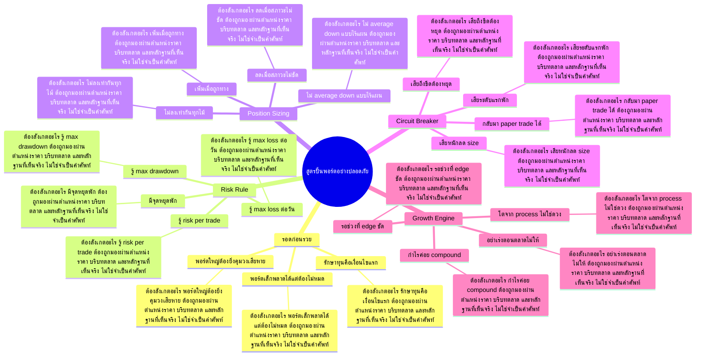

# Mind Map: สูตรปั้นพอร์ตอย่างปลอดภัย

## Central Idea
การปั้นพอร์ตที่แท้จริงคือการโตโดยไม่ตายก่อน ต้องคุม downside ก่อนเร่ง upside

## Learning Context
- Phase: วางระบบความเสี่ยง
- Category: Risk

## Learning Goals
- เข้าใจความต่างระหว่างโตเร็วกับโตอย่างอยู่รอด
- กำหนด risk per trade และจุดหยุดพัก
- รู้ว่าการรักษาทุนคือเงื่อนไขก่อนการเร่งพอร์ต

## Keywords To Remember
นะครับ, time, ล้าน, position, balance, แล้วก็, cat, mar, full, อ่า, big, shot

## Big Branches + Deep Branches
### รอดก่อนรวย
- ภาพรวม: กิ่งนี้เชื่อมกับบทเรียนหลักเพราะ รอดก่อนรวย เป็นตัวแปลงความรู้ให้กลายเป็นการตัดสินใจ โดยเฉพาะเรื่อง รักษาทุนคือเงื่อนไขแรก, พอร์ตเล็กพลาดได้แต่ต้องไม่หมด, พอร์ตใหญ่ต้องยิ่งคุมวงเสียหาย
- รักษาทุนคือเงื่อนไขแรก
  - ต้องสังเกตอะไร: รักษาทุนคือเงื่อนไขแรก ต้องถูกมองผ่านตำแหน่งราคา บริบทตลาด และหลักฐานที่เห็นจริง ไม่ใช่จำเป็นคำศัพท์
  - ใช้ตอนไหน: ใช้ รักษาทุนคือเงื่อนไขแรก เพื่อช่วยตัดสินใจว่าแผนในกิ่ง รอดก่อนรวย ควรเดินต่อ รอ ย่อขนาด หรือยกเลิก
  - ถ้าผิดต้องทำอะไร: ถ้าหลักฐานไม่ยืนยัน รักษาทุนคือเงื่อนไขแรก ให้ลดความมั่นใจทันที และกลับไปถามจุดผิดทางของแผน
- พอร์ตเล็กพลาดได้แต่ต้องไม่หมด
  - ต้องสังเกตอะไร: พอร์ตเล็กพลาดได้แต่ต้องไม่หมด ต้องถูกมองผ่านตำแหน่งราคา บริบทตลาด และหลักฐานที่เห็นจริง ไม่ใช่จำเป็นคำศัพท์
  - ใช้ตอนไหน: ใช้ พอร์ตเล็กพลาดได้แต่ต้องไม่หมด เพื่อช่วยตัดสินใจว่าแผนในกิ่ง รอดก่อนรวย ควรเดินต่อ รอ ย่อขนาด หรือยกเลิก
  - ถ้าผิดต้องทำอะไร: ถ้าหลักฐานไม่ยืนยัน พอร์ตเล็กพลาดได้แต่ต้องไม่หมด ให้ลดความมั่นใจทันที และกลับไปถามจุดผิดทางของแผน
- พอร์ตใหญ่ต้องยิ่งคุมวงเสียหาย
  - ต้องสังเกตอะไร: พอร์ตใหญ่ต้องยิ่งคุมวงเสียหาย ต้องถูกมองผ่านตำแหน่งราคา บริบทตลาด และหลักฐานที่เห็นจริง ไม่ใช่จำเป็นคำศัพท์
  - ใช้ตอนไหน: ใช้ พอร์ตใหญ่ต้องยิ่งคุมวงเสียหาย เพื่อช่วยตัดสินใจว่าแผนในกิ่ง รอดก่อนรวย ควรเดินต่อ รอ ย่อขนาด หรือยกเลิก
  - ถ้าผิดต้องทำอะไร: ถ้าหลักฐานไม่ยืนยัน พอร์ตใหญ่ต้องยิ่งคุมวงเสียหาย ให้ลดความมั่นใจทันที และกลับไปถามจุดผิดทางของแผน

### Risk Rule
- ภาพรวม: กิ่งนี้เชื่อมกับบทเรียนหลักเพราะ Risk Rule เป็นตัวแปลงความรู้ให้กลายเป็นการตัดสินใจ โดยเฉพาะเรื่อง รู้ risk per trade, รู้ max loss ต่อวัน, รู้ max drawdown
- รู้ risk per trade
  - ต้องสังเกตอะไร: รู้ risk per trade ต้องถูกมองผ่านตำแหน่งราคา บริบทตลาด และหลักฐานที่เห็นจริง ไม่ใช่จำเป็นคำศัพท์
  - ใช้ตอนไหน: ใช้ รู้ risk per trade เพื่อช่วยตัดสินใจว่าแผนในกิ่ง Risk Rule ควรเดินต่อ รอ ย่อขนาด หรือยกเลิก
  - ถ้าผิดต้องทำอะไร: ถ้าหลักฐานไม่ยืนยัน รู้ risk per trade ให้ลดความมั่นใจทันที และกลับไปถามจุดผิดทางของแผน
- รู้ max loss ต่อวัน
  - ต้องสังเกตอะไร: รู้ max loss ต่อวัน ต้องถูกมองผ่านตำแหน่งราคา บริบทตลาด และหลักฐานที่เห็นจริง ไม่ใช่จำเป็นคำศัพท์
  - ใช้ตอนไหน: ใช้ รู้ max loss ต่อวัน เพื่อช่วยตัดสินใจว่าแผนในกิ่ง Risk Rule ควรเดินต่อ รอ ย่อขนาด หรือยกเลิก
  - ถ้าผิดต้องทำอะไร: ถ้าหลักฐานไม่ยืนยัน รู้ max loss ต่อวัน ให้ลดความมั่นใจทันที และกลับไปถามจุดผิดทางของแผน
- รู้ max drawdown
  - ต้องสังเกตอะไร: รู้ max drawdown ต้องถูกมองผ่านตำแหน่งราคา บริบทตลาด และหลักฐานที่เห็นจริง ไม่ใช่จำเป็นคำศัพท์
  - ใช้ตอนไหน: ใช้ รู้ max drawdown เพื่อช่วยตัดสินใจว่าแผนในกิ่ง Risk Rule ควรเดินต่อ รอ ย่อขนาด หรือยกเลิก
  - ถ้าผิดต้องทำอะไร: ถ้าหลักฐานไม่ยืนยัน รู้ max drawdown ให้ลดความมั่นใจทันที และกลับไปถามจุดผิดทางของแผน
- มีจุดหยุดพัก
  - ต้องสังเกตอะไร: มีจุดหยุดพัก ต้องถูกมองผ่านตำแหน่งราคา บริบทตลาด และหลักฐานที่เห็นจริง ไม่ใช่จำเป็นคำศัพท์
  - ใช้ตอนไหน: ใช้ มีจุดหยุดพัก เพื่อช่วยตัดสินใจว่าแผนในกิ่ง Risk Rule ควรเดินต่อ รอ ย่อขนาด หรือยกเลิก
  - ถ้าผิดต้องทำอะไร: ถ้าหลักฐานไม่ยืนยัน มีจุดหยุดพัก ให้ลดความมั่นใจทันที และกลับไปถามจุดผิดทางของแผน

### Position Sizing
- ภาพรวม: กิ่งนี้เชื่อมกับบทเรียนหลักเพราะ Position Sizing เป็นตัวแปลงความรู้ให้กลายเป็นการตัดสินใจ โดยเฉพาะเรื่อง ไม่ลงเท่ากันทุกไม้, เพิ่มเมื่อถูกทาง, ลดเมื่อสภาวะไม่ชัด
- ไม่ลงเท่ากันทุกไม้
  - ต้องสังเกตอะไร: ไม่ลงเท่ากันทุกไม้ ต้องถูกมองผ่านตำแหน่งราคา บริบทตลาด และหลักฐานที่เห็นจริง ไม่ใช่จำเป็นคำศัพท์
  - ใช้ตอนไหน: ใช้ ไม่ลงเท่ากันทุกไม้ เพื่อช่วยตัดสินใจว่าแผนในกิ่ง Position Sizing ควรเดินต่อ รอ ย่อขนาด หรือยกเลิก
  - ถ้าผิดต้องทำอะไร: ถ้าหลักฐานไม่ยืนยัน ไม่ลงเท่ากันทุกไม้ ให้ลดความมั่นใจทันที และกลับไปถามจุดผิดทางของแผน
- เพิ่มเมื่อถูกทาง
  - ต้องสังเกตอะไร: เพิ่มเมื่อถูกทาง ต้องถูกมองผ่านตำแหน่งราคา บริบทตลาด และหลักฐานที่เห็นจริง ไม่ใช่จำเป็นคำศัพท์
  - ใช้ตอนไหน: ใช้ เพิ่มเมื่อถูกทาง เพื่อช่วยตัดสินใจว่าแผนในกิ่ง Position Sizing ควรเดินต่อ รอ ย่อขนาด หรือยกเลิก
  - ถ้าผิดต้องทำอะไร: ถ้าหลักฐานไม่ยืนยัน เพิ่มเมื่อถูกทาง ให้ลดความมั่นใจทันที และกลับไปถามจุดผิดทางของแผน
- ลดเมื่อสภาวะไม่ชัด
  - ต้องสังเกตอะไร: ลดเมื่อสภาวะไม่ชัด ต้องถูกมองผ่านตำแหน่งราคา บริบทตลาด และหลักฐานที่เห็นจริง ไม่ใช่จำเป็นคำศัพท์
  - ใช้ตอนไหน: ใช้ ลดเมื่อสภาวะไม่ชัด เพื่อช่วยตัดสินใจว่าแผนในกิ่ง Position Sizing ควรเดินต่อ รอ ย่อขนาด หรือยกเลิก
  - ถ้าผิดต้องทำอะไร: ถ้าหลักฐานไม่ยืนยัน ลดเมื่อสภาวะไม่ชัด ให้ลดความมั่นใจทันที และกลับไปถามจุดผิดทางของแผน
- ไม่ average down แบบไร้แผน
  - ต้องสังเกตอะไร: ไม่ average down แบบไร้แผน ต้องถูกมองผ่านตำแหน่งราคา บริบทตลาด และหลักฐานที่เห็นจริง ไม่ใช่จำเป็นคำศัพท์
  - ใช้ตอนไหน: ใช้ ไม่ average down แบบไร้แผน เพื่อช่วยตัดสินใจว่าแผนในกิ่ง Position Sizing ควรเดินต่อ รอ ย่อขนาด หรือยกเลิก
  - ถ้าผิดต้องทำอะไร: ถ้าหลักฐานไม่ยืนยัน ไม่ average down แบบไร้แผน ให้ลดความมั่นใจทันที และกลับไปถามจุดผิดทางของแผน

### Circuit Breaker
- ภาพรวม: กิ่งนี้เชื่อมกับบทเรียนหลักเพราะ Circuit Breaker เป็นตัวแปลงความรู้ให้กลายเป็นการตัดสินใจ โดยเฉพาะเรื่อง เสียระดับแรกพัก, เสียหนักลด size, เสียถึงขีดต้องหยุด
- เสียระดับแรกพัก
  - ต้องสังเกตอะไร: เสียระดับแรกพัก ต้องถูกมองผ่านตำแหน่งราคา บริบทตลาด และหลักฐานที่เห็นจริง ไม่ใช่จำเป็นคำศัพท์
  - ใช้ตอนไหน: ใช้ เสียระดับแรกพัก เพื่อช่วยตัดสินใจว่าแผนในกิ่ง Circuit Breaker ควรเดินต่อ รอ ย่อขนาด หรือยกเลิก
  - ถ้าผิดต้องทำอะไร: ถ้าหลักฐานไม่ยืนยัน เสียระดับแรกพัก ให้ลดความมั่นใจทันที และกลับไปถามจุดผิดทางของแผน
- เสียหนักลด size
  - ต้องสังเกตอะไร: เสียหนักลด size ต้องถูกมองผ่านตำแหน่งราคา บริบทตลาด และหลักฐานที่เห็นจริง ไม่ใช่จำเป็นคำศัพท์
  - ใช้ตอนไหน: ใช้ เสียหนักลด size เพื่อช่วยตัดสินใจว่าแผนในกิ่ง Circuit Breaker ควรเดินต่อ รอ ย่อขนาด หรือยกเลิก
  - ถ้าผิดต้องทำอะไร: ถ้าหลักฐานไม่ยืนยัน เสียหนักลด size ให้ลดความมั่นใจทันที และกลับไปถามจุดผิดทางของแผน
- เสียถึงขีดต้องหยุด
  - ต้องสังเกตอะไร: เสียถึงขีดต้องหยุด ต้องถูกมองผ่านตำแหน่งราคา บริบทตลาด และหลักฐานที่เห็นจริง ไม่ใช่จำเป็นคำศัพท์
  - ใช้ตอนไหน: ใช้ เสียถึงขีดต้องหยุด เพื่อช่วยตัดสินใจว่าแผนในกิ่ง Circuit Breaker ควรเดินต่อ รอ ย่อขนาด หรือยกเลิก
  - ถ้าผิดต้องทำอะไร: ถ้าหลักฐานไม่ยืนยัน เสียถึงขีดต้องหยุด ให้ลดความมั่นใจทันที และกลับไปถามจุดผิดทางของแผน
- กลับมา paper trade ได้
  - ต้องสังเกตอะไร: กลับมา paper trade ได้ ต้องถูกมองผ่านตำแหน่งราคา บริบทตลาด และหลักฐานที่เห็นจริง ไม่ใช่จำเป็นคำศัพท์
  - ใช้ตอนไหน: ใช้ กลับมา paper trade ได้ เพื่อช่วยตัดสินใจว่าแผนในกิ่ง Circuit Breaker ควรเดินต่อ รอ ย่อขนาด หรือยกเลิก
  - ถ้าผิดต้องทำอะไร: ถ้าหลักฐานไม่ยืนยัน กลับมา paper trade ได้ ให้ลดความมั่นใจทันที และกลับไปถามจุดผิดทางของแผน

### Growth Engine
- ภาพรวม: กิ่งนี้เชื่อมกับบทเรียนหลักเพราะ Growth Engine เป็นตัวแปลงความรู้ให้กลายเป็นการตัดสินใจ โดยเฉพาะเรื่อง กำไรค่อย compound, อย่าเร่งตอนตลาดไม่ให้, รอช่วงที่ edge ชัด
- กำไรค่อย compound
  - ต้องสังเกตอะไร: กำไรค่อย compound ต้องถูกมองผ่านตำแหน่งราคา บริบทตลาด และหลักฐานที่เห็นจริง ไม่ใช่จำเป็นคำศัพท์
  - ใช้ตอนไหน: ใช้ กำไรค่อย compound เพื่อช่วยตัดสินใจว่าแผนในกิ่ง Growth Engine ควรเดินต่อ รอ ย่อขนาด หรือยกเลิก
  - ถ้าผิดต้องทำอะไร: ถ้าหลักฐานไม่ยืนยัน กำไรค่อย compound ให้ลดความมั่นใจทันที และกลับไปถามจุดผิดทางของแผน
- อย่าเร่งตอนตลาดไม่ให้
  - ต้องสังเกตอะไร: อย่าเร่งตอนตลาดไม่ให้ ต้องถูกมองผ่านตำแหน่งราคา บริบทตลาด และหลักฐานที่เห็นจริง ไม่ใช่จำเป็นคำศัพท์
  - ใช้ตอนไหน: ใช้ อย่าเร่งตอนตลาดไม่ให้ เพื่อช่วยตัดสินใจว่าแผนในกิ่ง Growth Engine ควรเดินต่อ รอ ย่อขนาด หรือยกเลิก
  - ถ้าผิดต้องทำอะไร: ถ้าหลักฐานไม่ยืนยัน อย่าเร่งตอนตลาดไม่ให้ ให้ลดความมั่นใจทันที และกลับไปถามจุดผิดทางของแผน
- รอช่วงที่ edge ชัด
  - ต้องสังเกตอะไร: รอช่วงที่ edge ชัด ต้องถูกมองผ่านตำแหน่งราคา บริบทตลาด และหลักฐานที่เห็นจริง ไม่ใช่จำเป็นคำศัพท์
  - ใช้ตอนไหน: ใช้ รอช่วงที่ edge ชัด เพื่อช่วยตัดสินใจว่าแผนในกิ่ง Growth Engine ควรเดินต่อ รอ ย่อขนาด หรือยกเลิก
  - ถ้าผิดต้องทำอะไร: ถ้าหลักฐานไม่ยืนยัน รอช่วงที่ edge ชัด ให้ลดความมั่นใจทันที และกลับไปถามจุดผิดทางของแผน
- โตจาก process ไม่ใช่ดวง
  - ต้องสังเกตอะไร: โตจาก process ไม่ใช่ดวง ต้องถูกมองผ่านตำแหน่งราคา บริบทตลาด และหลักฐานที่เห็นจริง ไม่ใช่จำเป็นคำศัพท์
  - ใช้ตอนไหน: ใช้ โตจาก process ไม่ใช่ดวง เพื่อช่วยตัดสินใจว่าแผนในกิ่ง Growth Engine ควรเดินต่อ รอ ย่อขนาด หรือยกเลิก
  - ถ้าผิดต้องทำอะไร: ถ้าหลักฐานไม่ยืนยัน โตจาก process ไม่ใช่ดวง ให้ลดความมั่นใจทันที และกลับไปถามจุดผิดทางของแผน

## Transcript Signals
> ได้ดีสุดในช่วงของโควิดนะครับก็เป็นหุ้น ที่เทรนด์ชัดเจนนะครับพื้นฐานเปลี่ยนนะ ครับแล้วก็แล้วก็เกาะเทรนด์ตัวนั้นมาได้ นะครับ อันนี้ก็จะเป็นส่วนของ Trader นะครับพาร์ทสุดท้าย คือ Portfolio ของเราเนี่ยมันต้องมีเอ่อ คุม Down คือเราไม่ควรให้พอร์ตเราเนี่ย down...

> เอามาเป็นเกณฑ์ในการจับหุ้นติด Cat Balance นะครับ PE ก็ปัจจุบันก็อยู่ 40 เท่าทำให้ถ้าหุ้นที่ PE เกิน 40 เท่าหรือ PE ติดลบเนี่ยเรามีการเทรดเกณฑกำไรราย วันบวกเกิน 15% นะครับ 100 ล้านก็จะติดแค Balanceซหรือว่าอาจจะไม่ถึง 15% แต่มีการ...

> 2-5% ต่อเดือนนะครับแล้วก็ค่าใช้จ่าย อ่า 2-5% ต่อเดือนก็ถ้าเรามีค่าใช้จ่าย รายเดือน 30,000 นะครับเราก็ต้องเตรียม พอร์ตเงินสดที่เตรียมไว้นะครับอยู่ 1.5 5 ล้านพอได้ 2% ปุ๊บมันก็จะได้ได้เป้าหมาย 30,000 บาทพอดีนะครับหรือว่าถ้าเทรดได้...

## Decision Rules
- รอดก่อนรวย: จะใช้กิ่งนี้ได้เมื่อเห็น รักษาทุนคือเงื่อนไขแรก และ พอร์ตเล็กพลาดได้แต่ต้องไม่หมด พร้อมกัน ถ้าเจอเงื่อนไขตรงข้ามกับ พอร์ตใหญ่ต้องยิ่งคุมวงเสียหาย ให้ลดขนาดหรือหยุด
- Risk Rule: จะใช้กิ่งนี้ได้เมื่อเห็น รู้ risk per trade และ รู้ max loss ต่อวัน พร้อมกัน ถ้าเจอเงื่อนไขตรงข้ามกับ มีจุดหยุดพัก ให้ลดขนาดหรือหยุด
- Position Sizing: จะใช้กิ่งนี้ได้เมื่อเห็น ไม่ลงเท่ากันทุกไม้ และ เพิ่มเมื่อถูกทาง พร้อมกัน ถ้าเจอเงื่อนไขตรงข้ามกับ ไม่ average down แบบไร้แผน ให้ลดขนาดหรือหยุด
- Circuit Breaker: จะใช้กิ่งนี้ได้เมื่อเห็น เสียระดับแรกพัก และ เสียหนักลด size พร้อมกัน ถ้าเจอเงื่อนไขตรงข้ามกับ กลับมา paper trade ได้ ให้ลดขนาดหรือหยุด
- Growth Engine: จะใช้กิ่งนี้ได้เมื่อเห็น กำไรค่อย compound และ อย่าเร่งตอนตลาดไม่ให้ พร้อมกัน ถ้าเจอเงื่อนไขตรงข้ามกับ โตจาก process ไม่ใช่ดวง ให้ลดขนาดหรือหยุด

## Common Mistakes
- จำชื่อบทได้ แต่ไม่รู้ว่า รอดก่อนรวย ต้องเปลี่ยนพฤติกรรมการเทรดตรงไหน
- เห็นสัญญาณหนึ่งอย่างแล้วรีบสรุป ทั้งที่ยังไม่ได้เช็กบริบทและหลักฐานประกอบ
- วางแผนตอนใจเย็น แต่พอราคาเคลื่อนไหวจริงกลับเปลี่ยนกฎตามอารมณ์
- สนใจ Growth Engine แค่ตอนอยากเข้า แต่ไม่ใช้เป็นเงื่อนไขตอนต้องออกหรือหยุด

## Practice Checklist
- ทวนเป้าหมายบทนี้ก่อนเริ่ม: เข้าใจความต่างระหว่างโตเร็วกับโตอย่างอยู่รอด
- เปิดกราฟหรือกรณีศึกษาจริง 1 ตัว แล้วระบุว่าเกี่ยวกับกิ่ง 'รอดก่อนรวย' ตรงไหน
- เขียนก่อนเข้าว่า thesis คืออะไร หลักฐานคืออะไร และถ้าผิดจะยอมรับตรงไหน
- แยกสิ่งที่เห็นจริงออกจากสิ่งที่อยากให้เกิด แล้วให้คะแนนความมั่นใจ 1-5
- หลังจบเคส ให้บันทึกว่าแพ้/ชนะเพราะระบบ หรือเพราะอารมณ์

## Final Destination
มีระบบที่ทำให้พอร์ตโตได้โดยยังอยู่ในเกม แม้เจอช่วงผิดทางหลายครั้ง

## Questions for Patiphan
1. กิ่งไหนคือแก่นที่สุดของบทนี้
2. กิ่งไหนเกี่ยวกับจุดอ่อนของ Patiphan มากที่สุด
3. ถ้าจะเอาไปใช้กับกราฟจริง ต้องเห็นหลักฐานอะไร
4. ถ้าทำผิด บทนี้เตือนให้หยุดตรงไหน
5. ปลายทางของบทนี้จะเข้าไปอยู่ในระบบเทรดส่วนไหน
