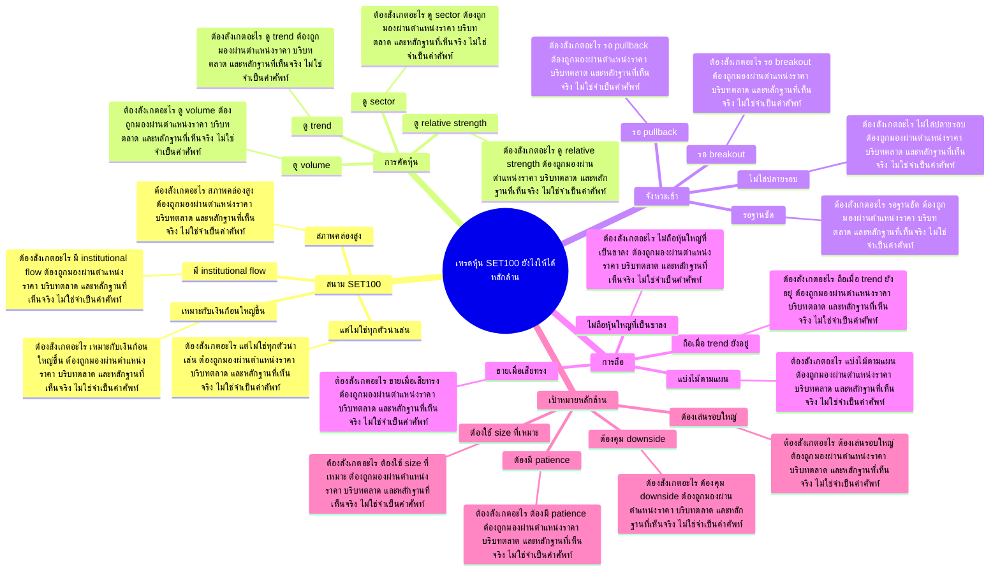

# Mind Map: เทรดหุ้น SET100 ยังไงให้ได้หลักล้าน

## Central Idea
หุ้นใหญ่ให้สนามที่มีสภาพคล่องและโครงสร้างชัด แต่ต้องเลือกตัวที่มีแรงและรอบ ไม่ใช่ซื้อเพราะใหญ่เฉย ๆ

## Learning Context
- Phase: เลือกสนามเทรด
- Category: Strategy

## Learning Goals
- เข้าใจข้อดีข้อจำกัดของหุ้น SET100
- แยกหุ้นมีสภาพคล่องจริงออกจากหุ้นที่เคลื่อนไหวยาก
- วางแผนเทรดหุ้นใหญ่ด้วย reward/risk ที่เหมาะสม

## Keywords To Remember
day, ล้าน, หุ้น, เทรด, time, บาท, del, รอบ, sbl, สภาพคล่อง, พอร์ต, patter

## Big Branches + Deep Branches
### สนาม SET100
- ภาพรวม: กิ่งนี้เชื่อมกับบทเรียนหลักเพราะ สนาม SET100 เป็นตัวแปลงความรู้ให้กลายเป็นการตัดสินใจ โดยเฉพาะเรื่อง สภาพคล่องสูง, เหมาะกับเงินก้อนใหญ่ขึ้น, มี institutional flow
- สภาพคล่องสูง
  - ต้องสังเกตอะไร: สภาพคล่องสูง ต้องถูกมองผ่านตำแหน่งราคา บริบทตลาด และหลักฐานที่เห็นจริง ไม่ใช่จำเป็นคำศัพท์
  - ใช้ตอนไหน: ใช้ สภาพคล่องสูง เพื่อช่วยตัดสินใจว่าแผนในกิ่ง สนาม SET100 ควรเดินต่อ รอ ย่อขนาด หรือยกเลิก
  - ถ้าผิดต้องทำอะไร: ถ้าหลักฐานไม่ยืนยัน สภาพคล่องสูง ให้ลดความมั่นใจทันที และกลับไปถามจุดผิดทางของแผน
- เหมาะกับเงินก้อนใหญ่ขึ้น
  - ต้องสังเกตอะไร: เหมาะกับเงินก้อนใหญ่ขึ้น ต้องถูกมองผ่านตำแหน่งราคา บริบทตลาด และหลักฐานที่เห็นจริง ไม่ใช่จำเป็นคำศัพท์
  - ใช้ตอนไหน: ใช้ เหมาะกับเงินก้อนใหญ่ขึ้น เพื่อช่วยตัดสินใจว่าแผนในกิ่ง สนาม SET100 ควรเดินต่อ รอ ย่อขนาด หรือยกเลิก
  - ถ้าผิดต้องทำอะไร: ถ้าหลักฐานไม่ยืนยัน เหมาะกับเงินก้อนใหญ่ขึ้น ให้ลดความมั่นใจทันที และกลับไปถามจุดผิดทางของแผน
- มี institutional flow
  - ต้องสังเกตอะไร: มี institutional flow ต้องถูกมองผ่านตำแหน่งราคา บริบทตลาด และหลักฐานที่เห็นจริง ไม่ใช่จำเป็นคำศัพท์
  - ใช้ตอนไหน: ใช้ มี institutional flow เพื่อช่วยตัดสินใจว่าแผนในกิ่ง สนาม SET100 ควรเดินต่อ รอ ย่อขนาด หรือยกเลิก
  - ถ้าผิดต้องทำอะไร: ถ้าหลักฐานไม่ยืนยัน มี institutional flow ให้ลดความมั่นใจทันที และกลับไปถามจุดผิดทางของแผน
- แต่ไม่ใช่ทุกตัวน่าเล่น
  - ต้องสังเกตอะไร: แต่ไม่ใช่ทุกตัวน่าเล่น ต้องถูกมองผ่านตำแหน่งราคา บริบทตลาด และหลักฐานที่เห็นจริง ไม่ใช่จำเป็นคำศัพท์
  - ใช้ตอนไหน: ใช้ แต่ไม่ใช่ทุกตัวน่าเล่น เพื่อช่วยตัดสินใจว่าแผนในกิ่ง สนาม SET100 ควรเดินต่อ รอ ย่อขนาด หรือยกเลิก
  - ถ้าผิดต้องทำอะไร: ถ้าหลักฐานไม่ยืนยัน แต่ไม่ใช่ทุกตัวน่าเล่น ให้ลดความมั่นใจทันที และกลับไปถามจุดผิดทางของแผน

### การคัดหุ้น
- ภาพรวม: กิ่งนี้เชื่อมกับบทเรียนหลักเพราะ การคัดหุ้น เป็นตัวแปลงความรู้ให้กลายเป็นการตัดสินใจ โดยเฉพาะเรื่อง ดู trend, ดู volume, ดู sector
- ดู trend
  - ต้องสังเกตอะไร: ดู trend ต้องถูกมองผ่านตำแหน่งราคา บริบทตลาด และหลักฐานที่เห็นจริง ไม่ใช่จำเป็นคำศัพท์
  - ใช้ตอนไหน: ใช้ ดู trend เพื่อช่วยตัดสินใจว่าแผนในกิ่ง การคัดหุ้น ควรเดินต่อ รอ ย่อขนาด หรือยกเลิก
  - ถ้าผิดต้องทำอะไร: ถ้าหลักฐานไม่ยืนยัน ดู trend ให้ลดความมั่นใจทันที และกลับไปถามจุดผิดทางของแผน
- ดู volume
  - ต้องสังเกตอะไร: ดู volume ต้องถูกมองผ่านตำแหน่งราคา บริบทตลาด และหลักฐานที่เห็นจริง ไม่ใช่จำเป็นคำศัพท์
  - ใช้ตอนไหน: ใช้ ดู volume เพื่อช่วยตัดสินใจว่าแผนในกิ่ง การคัดหุ้น ควรเดินต่อ รอ ย่อขนาด หรือยกเลิก
  - ถ้าผิดต้องทำอะไร: ถ้าหลักฐานไม่ยืนยัน ดู volume ให้ลดความมั่นใจทันที และกลับไปถามจุดผิดทางของแผน
- ดู sector
  - ต้องสังเกตอะไร: ดู sector ต้องถูกมองผ่านตำแหน่งราคา บริบทตลาด และหลักฐานที่เห็นจริง ไม่ใช่จำเป็นคำศัพท์
  - ใช้ตอนไหน: ใช้ ดู sector เพื่อช่วยตัดสินใจว่าแผนในกิ่ง การคัดหุ้น ควรเดินต่อ รอ ย่อขนาด หรือยกเลิก
  - ถ้าผิดต้องทำอะไร: ถ้าหลักฐานไม่ยืนยัน ดู sector ให้ลดความมั่นใจทันที และกลับไปถามจุดผิดทางของแผน
- ดู relative strength
  - ต้องสังเกตอะไร: ดู relative strength ต้องถูกมองผ่านตำแหน่งราคา บริบทตลาด และหลักฐานที่เห็นจริง ไม่ใช่จำเป็นคำศัพท์
  - ใช้ตอนไหน: ใช้ ดู relative strength เพื่อช่วยตัดสินใจว่าแผนในกิ่ง การคัดหุ้น ควรเดินต่อ รอ ย่อขนาด หรือยกเลิก
  - ถ้าผิดต้องทำอะไร: ถ้าหลักฐานไม่ยืนยัน ดู relative strength ให้ลดความมั่นใจทันที และกลับไปถามจุดผิดทางของแผน

### จังหวะเข้า
- ภาพรวม: กิ่งนี้เชื่อมกับบทเรียนหลักเพราะ จังหวะเข้า เป็นตัวแปลงความรู้ให้กลายเป็นการตัดสินใจ โดยเฉพาะเรื่อง รอ breakout, รอ pullback, รอฐานชัด
- รอ breakout
  - ต้องสังเกตอะไร: รอ breakout ต้องถูกมองผ่านตำแหน่งราคา บริบทตลาด และหลักฐานที่เห็นจริง ไม่ใช่จำเป็นคำศัพท์
  - ใช้ตอนไหน: ใช้ รอ breakout เพื่อช่วยตัดสินใจว่าแผนในกิ่ง จังหวะเข้า ควรเดินต่อ รอ ย่อขนาด หรือยกเลิก
  - ถ้าผิดต้องทำอะไร: ถ้าหลักฐานไม่ยืนยัน รอ breakout ให้ลดความมั่นใจทันที และกลับไปถามจุดผิดทางของแผน
- รอ pullback
  - ต้องสังเกตอะไร: รอ pullback ต้องถูกมองผ่านตำแหน่งราคา บริบทตลาด และหลักฐานที่เห็นจริง ไม่ใช่จำเป็นคำศัพท์
  - ใช้ตอนไหน: ใช้ รอ pullback เพื่อช่วยตัดสินใจว่าแผนในกิ่ง จังหวะเข้า ควรเดินต่อ รอ ย่อขนาด หรือยกเลิก
  - ถ้าผิดต้องทำอะไร: ถ้าหลักฐานไม่ยืนยัน รอ pullback ให้ลดความมั่นใจทันที และกลับไปถามจุดผิดทางของแผน
- รอฐานชัด
  - ต้องสังเกตอะไร: รอฐานชัด ต้องถูกมองผ่านตำแหน่งราคา บริบทตลาด และหลักฐานที่เห็นจริง ไม่ใช่จำเป็นคำศัพท์
  - ใช้ตอนไหน: ใช้ รอฐานชัด เพื่อช่วยตัดสินใจว่าแผนในกิ่ง จังหวะเข้า ควรเดินต่อ รอ ย่อขนาด หรือยกเลิก
  - ถ้าผิดต้องทำอะไร: ถ้าหลักฐานไม่ยืนยัน รอฐานชัด ให้ลดความมั่นใจทันที และกลับไปถามจุดผิดทางของแผน
- ไม่ไล่ปลายรอบ
  - ต้องสังเกตอะไร: ไม่ไล่ปลายรอบ ต้องถูกมองผ่านตำแหน่งราคา บริบทตลาด และหลักฐานที่เห็นจริง ไม่ใช่จำเป็นคำศัพท์
  - ใช้ตอนไหน: ใช้ ไม่ไล่ปลายรอบ เพื่อช่วยตัดสินใจว่าแผนในกิ่ง จังหวะเข้า ควรเดินต่อ รอ ย่อขนาด หรือยกเลิก
  - ถ้าผิดต้องทำอะไร: ถ้าหลักฐานไม่ยืนยัน ไม่ไล่ปลายรอบ ให้ลดความมั่นใจทันที และกลับไปถามจุดผิดทางของแผน

### การถือ
- ภาพรวม: กิ่งนี้เชื่อมกับบทเรียนหลักเพราะ การถือ เป็นตัวแปลงความรู้ให้กลายเป็นการตัดสินใจ โดยเฉพาะเรื่อง ถือเมื่อ trend ยังอยู่, ขายเมื่อเสียทรง, ไม่ถือหุ้นใหญ่ที่เป็นขาลง
- ถือเมื่อ trend ยังอยู่
  - ต้องสังเกตอะไร: ถือเมื่อ trend ยังอยู่ ต้องถูกมองผ่านตำแหน่งราคา บริบทตลาด และหลักฐานที่เห็นจริง ไม่ใช่จำเป็นคำศัพท์
  - ใช้ตอนไหน: ใช้ ถือเมื่อ trend ยังอยู่ เพื่อช่วยตัดสินใจว่าแผนในกิ่ง การถือ ควรเดินต่อ รอ ย่อขนาด หรือยกเลิก
  - ถ้าผิดต้องทำอะไร: ถ้าหลักฐานไม่ยืนยัน ถือเมื่อ trend ยังอยู่ ให้ลดความมั่นใจทันที และกลับไปถามจุดผิดทางของแผน
- ขายเมื่อเสียทรง
  - ต้องสังเกตอะไร: ขายเมื่อเสียทรง ต้องถูกมองผ่านตำแหน่งราคา บริบทตลาด และหลักฐานที่เห็นจริง ไม่ใช่จำเป็นคำศัพท์
  - ใช้ตอนไหน: ใช้ ขายเมื่อเสียทรง เพื่อช่วยตัดสินใจว่าแผนในกิ่ง การถือ ควรเดินต่อ รอ ย่อขนาด หรือยกเลิก
  - ถ้าผิดต้องทำอะไร: ถ้าหลักฐานไม่ยืนยัน ขายเมื่อเสียทรง ให้ลดความมั่นใจทันที และกลับไปถามจุดผิดทางของแผน
- ไม่ถือหุ้นใหญ่ที่เป็นขาลง
  - ต้องสังเกตอะไร: ไม่ถือหุ้นใหญ่ที่เป็นขาลง ต้องถูกมองผ่านตำแหน่งราคา บริบทตลาด และหลักฐานที่เห็นจริง ไม่ใช่จำเป็นคำศัพท์
  - ใช้ตอนไหน: ใช้ ไม่ถือหุ้นใหญ่ที่เป็นขาลง เพื่อช่วยตัดสินใจว่าแผนในกิ่ง การถือ ควรเดินต่อ รอ ย่อขนาด หรือยกเลิก
  - ถ้าผิดต้องทำอะไร: ถ้าหลักฐานไม่ยืนยัน ไม่ถือหุ้นใหญ่ที่เป็นขาลง ให้ลดความมั่นใจทันที และกลับไปถามจุดผิดทางของแผน
- แบ่งไม้ตามแผน
  - ต้องสังเกตอะไร: แบ่งไม้ตามแผน ต้องถูกมองผ่านตำแหน่งราคา บริบทตลาด และหลักฐานที่เห็นจริง ไม่ใช่จำเป็นคำศัพท์
  - ใช้ตอนไหน: ใช้ แบ่งไม้ตามแผน เพื่อช่วยตัดสินใจว่าแผนในกิ่ง การถือ ควรเดินต่อ รอ ย่อขนาด หรือยกเลิก
  - ถ้าผิดต้องทำอะไร: ถ้าหลักฐานไม่ยืนยัน แบ่งไม้ตามแผน ให้ลดความมั่นใจทันที และกลับไปถามจุดผิดทางของแผน

### เป้าหมายหลักล้าน
- ภาพรวม: กิ่งนี้เชื่อมกับบทเรียนหลักเพราะ เป้าหมายหลักล้าน เป็นตัวแปลงความรู้ให้กลายเป็นการตัดสินใจ โดยเฉพาะเรื่อง ต้องใช้ size ที่เหมาะ, ต้องคุม downside, ต้องเล่นรอบใหญ่
- ต้องใช้ size ที่เหมาะ
  - ต้องสังเกตอะไร: ต้องใช้ size ที่เหมาะ ต้องถูกมองผ่านตำแหน่งราคา บริบทตลาด และหลักฐานที่เห็นจริง ไม่ใช่จำเป็นคำศัพท์
  - ใช้ตอนไหน: ใช้ ต้องใช้ size ที่เหมาะ เพื่อช่วยตัดสินใจว่าแผนในกิ่ง เป้าหมายหลักล้าน ควรเดินต่อ รอ ย่อขนาด หรือยกเลิก
  - ถ้าผิดต้องทำอะไร: ถ้าหลักฐานไม่ยืนยัน ต้องใช้ size ที่เหมาะ ให้ลดความมั่นใจทันที และกลับไปถามจุดผิดทางของแผน
- ต้องคุม downside
  - ต้องสังเกตอะไร: ต้องคุม downside ต้องถูกมองผ่านตำแหน่งราคา บริบทตลาด และหลักฐานที่เห็นจริง ไม่ใช่จำเป็นคำศัพท์
  - ใช้ตอนไหน: ใช้ ต้องคุม downside เพื่อช่วยตัดสินใจว่าแผนในกิ่ง เป้าหมายหลักล้าน ควรเดินต่อ รอ ย่อขนาด หรือยกเลิก
  - ถ้าผิดต้องทำอะไร: ถ้าหลักฐานไม่ยืนยัน ต้องคุม downside ให้ลดความมั่นใจทันที และกลับไปถามจุดผิดทางของแผน
- ต้องเล่นรอบใหญ่
  - ต้องสังเกตอะไร: ต้องเล่นรอบใหญ่ ต้องถูกมองผ่านตำแหน่งราคา บริบทตลาด และหลักฐานที่เห็นจริง ไม่ใช่จำเป็นคำศัพท์
  - ใช้ตอนไหน: ใช้ ต้องเล่นรอบใหญ่ เพื่อช่วยตัดสินใจว่าแผนในกิ่ง เป้าหมายหลักล้าน ควรเดินต่อ รอ ย่อขนาด หรือยกเลิก
  - ถ้าผิดต้องทำอะไร: ถ้าหลักฐานไม่ยืนยัน ต้องเล่นรอบใหญ่ ให้ลดความมั่นใจทันที และกลับไปถามจุดผิดทางของแผน
- ต้องมี patience
  - ต้องสังเกตอะไร: ต้องมี patience ต้องถูกมองผ่านตำแหน่งราคา บริบทตลาด และหลักฐานที่เห็นจริง ไม่ใช่จำเป็นคำศัพท์
  - ใช้ตอนไหน: ใช้ ต้องมี patience เพื่อช่วยตัดสินใจว่าแผนในกิ่ง เป้าหมายหลักล้าน ควรเดินต่อ รอ ย่อขนาด หรือยกเลิก
  - ถ้าผิดต้องทำอะไร: ถ้าหลักฐานไม่ยืนยัน ต้องมี patience ให้ลดความมั่นใจทันที และกลับไปถามจุดผิดทางของแผน

## Transcript Signals
> ลงนะครับ ทีนี้ผมจะเริ่มอธิบายการวิธีในการเข้าใจ ในการเล่นของฝั่งขาลงเทรดขาลงว่าเค้าทำ กันยังไงโดยการเล่นขาลงเนี่ยคุณอาจจะเทรด หรือไม่เทรดก็ได้แต่ใจความสำคัญที่ผมอยาก จะให้เข้าใจคือคุณจะได้เข้าใจว่าบนตลาด เนี้ยคนที่เค้าทำกำไรในขาลงอ่ะเค้าทำกัน...

> อันนี้ก็เป็นไปได้แต่ทุกอย่างที่มันเกิด ขึ้นมันจะเริ่มต้นที่ตัวเราทั้งนั้นว่า เราเป็นรูปแบบไหนเช่นณวันนึงที่คุณเริ่ม เข้ามาเนี่ยคุณอาจจะบอกว่าโอเคนะวันเนี้ย เราลงทุนซัก 100,000 การที่คุณจะเติบโตจากพอร์ต 100,000 ขึ้น ไป 500,000 คุณว่าวิธีการเทรดจะยังเหมือน...

> >> มีทั้ง 2 อย่างทั้งก่อนทั้งหลังก็ขึ้น อยู่กับปัจจัย >> ใช่ปัจจัยของแต่ละตัวกราฟด้วยหรืออะไร เพราะว่าบางตัวมันอาจจะอยู่ต่ำมากบางตัว มันจะอยู่สูงมากหรืออะไรเราก็ต้องต้อง หยิบมาดูเป็นปัจจัยของของแต่ละอย่างอีกที นึงนะครับ เพราะฉะนั้นวิธีการเล่นเนี่ยมันไม่ใช่แค่...

## Decision Rules
- สนาม SET100: จะใช้กิ่งนี้ได้เมื่อเห็น สภาพคล่องสูง และ เหมาะกับเงินก้อนใหญ่ขึ้น พร้อมกัน ถ้าเจอเงื่อนไขตรงข้ามกับ แต่ไม่ใช่ทุกตัวน่าเล่น ให้ลดขนาดหรือหยุด
- การคัดหุ้น: จะใช้กิ่งนี้ได้เมื่อเห็น ดู trend และ ดู volume พร้อมกัน ถ้าเจอเงื่อนไขตรงข้ามกับ ดู relative strength ให้ลดขนาดหรือหยุด
- จังหวะเข้า: จะใช้กิ่งนี้ได้เมื่อเห็น รอ breakout และ รอ pullback พร้อมกัน ถ้าเจอเงื่อนไขตรงข้ามกับ ไม่ไล่ปลายรอบ ให้ลดขนาดหรือหยุด
- การถือ: จะใช้กิ่งนี้ได้เมื่อเห็น ถือเมื่อ trend ยังอยู่ และ ขายเมื่อเสียทรง พร้อมกัน ถ้าเจอเงื่อนไขตรงข้ามกับ แบ่งไม้ตามแผน ให้ลดขนาดหรือหยุด
- เป้าหมายหลักล้าน: จะใช้กิ่งนี้ได้เมื่อเห็น ต้องใช้ size ที่เหมาะ และ ต้องคุม downside พร้อมกัน ถ้าเจอเงื่อนไขตรงข้ามกับ ต้องมี patience ให้ลดขนาดหรือหยุด

## Common Mistakes
- จำชื่อบทได้ แต่ไม่รู้ว่า สนาม SET100 ต้องเปลี่ยนพฤติกรรมการเทรดตรงไหน
- เห็นสัญญาณหนึ่งอย่างแล้วรีบสรุป ทั้งที่ยังไม่ได้เช็กบริบทและหลักฐานประกอบ
- วางแผนตอนใจเย็น แต่พอราคาเคลื่อนไหวจริงกลับเปลี่ยนกฎตามอารมณ์
- สนใจ เป้าหมายหลักล้าน แค่ตอนอยากเข้า แต่ไม่ใช้เป็นเงื่อนไขตอนต้องออกหรือหยุด

## Practice Checklist
- ทวนเป้าหมายบทนี้ก่อนเริ่ม: เข้าใจข้อดีข้อจำกัดของหุ้น SET100
- เปิดกราฟหรือกรณีศึกษาจริง 1 ตัว แล้วระบุว่าเกี่ยวกับกิ่ง 'สนาม SET100' ตรงไหน
- เขียนก่อนเข้าว่า thesis คืออะไร หลักฐานคืออะไร และถ้าผิดจะยอมรับตรงไหน
- แยกสิ่งที่เห็นจริงออกจากสิ่งที่อยากให้เกิด แล้วให้คะแนนความมั่นใจ 1-5
- หลังจบเคส ให้บันทึกว่าแพ้/ชนะเพราะระบบ หรือเพราะอารมณ์

## Final Destination
ใช้ SET100 เป็นสนามเทรดที่มีวินัย เลือกเฉพาะตัวที่มีแรงและแผน ไม่ใช่สะสมทุกตัวที่ดูปลอดภัย

## Questions for Patiphan
1. กิ่งไหนคือแก่นที่สุดของบทนี้
2. กิ่งไหนเกี่ยวกับจุดอ่อนของ Patiphan มากที่สุด
3. ถ้าจะเอาไปใช้กับกราฟจริง ต้องเห็นหลักฐานอะไร
4. ถ้าทำผิด บทนี้เตือนให้หยุดตรงไหน
5. ปลายทางของบทนี้จะเข้าไปอยู่ในระบบเทรดส่วนไหน
