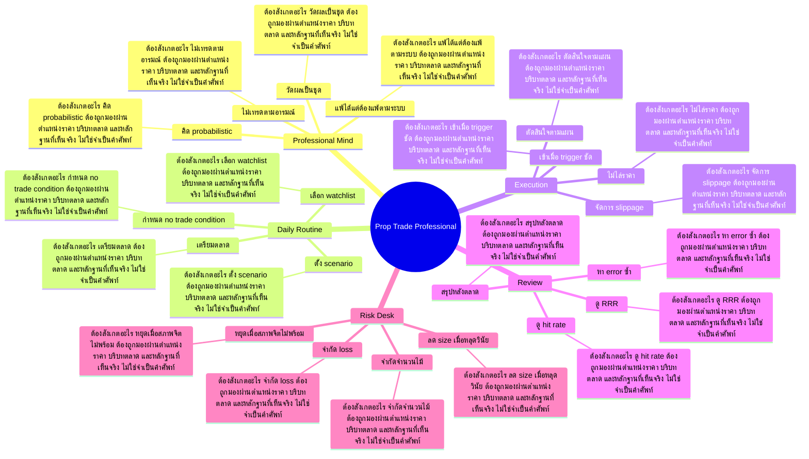

# Mind Map: Prop Trade Professional

## Central Idea
Prop trader คิดเป็น process และสถิติ ไม่คิดเป็นไม้เดียว ต้องมีวินัยก่อน ระหว่าง และหลัง trade

## Learning Context
- Phase: คิดแบบมืออาชีพ
- Category: Execution

## Learning Goals
- เข้าใจวิธีคิดแบบ professional trader
- แยกการตัดสินใจจากอารมณ์ระหว่างวัน
- สร้าง routine ก่อนเข้า ระหว่างถือ และหลังออก

## Keywords To Remember
day, นะครับ, vol, normal, high, poc, หรือ, week, เทรด, time, อ่า, gap

## Big Branches + Deep Branches
### Professional Mind
- ภาพรวม: กิ่งนี้เชื่อมกับบทเรียนหลักเพราะ Professional Mind เป็นตัวแปลงความรู้ให้กลายเป็นการตัดสินใจ โดยเฉพาะเรื่อง ไม่เทรดตามอารมณ์, วัดผลเป็นชุด, คิด probabilistic
- ไม่เทรดตามอารมณ์
  - ต้องสังเกตอะไร: ไม่เทรดตามอารมณ์ ต้องถูกมองผ่านตำแหน่งราคา บริบทตลาด และหลักฐานที่เห็นจริง ไม่ใช่จำเป็นคำศัพท์
  - ใช้ตอนไหน: ใช้ ไม่เทรดตามอารมณ์ เพื่อช่วยตัดสินใจว่าแผนในกิ่ง Professional Mind ควรเดินต่อ รอ ย่อขนาด หรือยกเลิก
  - ถ้าผิดต้องทำอะไร: ถ้าหลักฐานไม่ยืนยัน ไม่เทรดตามอารมณ์ ให้ลดความมั่นใจทันที และกลับไปถามจุดผิดทางของแผน
- วัดผลเป็นชุด
  - ต้องสังเกตอะไร: วัดผลเป็นชุด ต้องถูกมองผ่านตำแหน่งราคา บริบทตลาด และหลักฐานที่เห็นจริง ไม่ใช่จำเป็นคำศัพท์
  - ใช้ตอนไหน: ใช้ วัดผลเป็นชุด เพื่อช่วยตัดสินใจว่าแผนในกิ่ง Professional Mind ควรเดินต่อ รอ ย่อขนาด หรือยกเลิก
  - ถ้าผิดต้องทำอะไร: ถ้าหลักฐานไม่ยืนยัน วัดผลเป็นชุด ให้ลดความมั่นใจทันที และกลับไปถามจุดผิดทางของแผน
- คิด probabilistic
  - ต้องสังเกตอะไร: คิด probabilistic ต้องถูกมองผ่านตำแหน่งราคา บริบทตลาด และหลักฐานที่เห็นจริง ไม่ใช่จำเป็นคำศัพท์
  - ใช้ตอนไหน: ใช้ คิด probabilistic เพื่อช่วยตัดสินใจว่าแผนในกิ่ง Professional Mind ควรเดินต่อ รอ ย่อขนาด หรือยกเลิก
  - ถ้าผิดต้องทำอะไร: ถ้าหลักฐานไม่ยืนยัน คิด probabilistic ให้ลดความมั่นใจทันที และกลับไปถามจุดผิดทางของแผน
- แพ้ได้แต่ต้องแพ้ตามระบบ
  - ต้องสังเกตอะไร: แพ้ได้แต่ต้องแพ้ตามระบบ ต้องถูกมองผ่านตำแหน่งราคา บริบทตลาด และหลักฐานที่เห็นจริง ไม่ใช่จำเป็นคำศัพท์
  - ใช้ตอนไหน: ใช้ แพ้ได้แต่ต้องแพ้ตามระบบ เพื่อช่วยตัดสินใจว่าแผนในกิ่ง Professional Mind ควรเดินต่อ รอ ย่อขนาด หรือยกเลิก
  - ถ้าผิดต้องทำอะไร: ถ้าหลักฐานไม่ยืนยัน แพ้ได้แต่ต้องแพ้ตามระบบ ให้ลดความมั่นใจทันที และกลับไปถามจุดผิดทางของแผน

### Daily Routine
- ภาพรวม: กิ่งนี้เชื่อมกับบทเรียนหลักเพราะ Daily Routine เป็นตัวแปลงความรู้ให้กลายเป็นการตัดสินใจ โดยเฉพาะเรื่อง เตรียมตลาด, เลือก watchlist, ตั้ง scenario
- เตรียมตลาด
  - ต้องสังเกตอะไร: เตรียมตลาด ต้องถูกมองผ่านตำแหน่งราคา บริบทตลาด และหลักฐานที่เห็นจริง ไม่ใช่จำเป็นคำศัพท์
  - ใช้ตอนไหน: ใช้ เตรียมตลาด เพื่อช่วยตัดสินใจว่าแผนในกิ่ง Daily Routine ควรเดินต่อ รอ ย่อขนาด หรือยกเลิก
  - ถ้าผิดต้องทำอะไร: ถ้าหลักฐานไม่ยืนยัน เตรียมตลาด ให้ลดความมั่นใจทันที และกลับไปถามจุดผิดทางของแผน
- เลือก watchlist
  - ต้องสังเกตอะไร: เลือก watchlist ต้องถูกมองผ่านตำแหน่งราคา บริบทตลาด และหลักฐานที่เห็นจริง ไม่ใช่จำเป็นคำศัพท์
  - ใช้ตอนไหน: ใช้ เลือก watchlist เพื่อช่วยตัดสินใจว่าแผนในกิ่ง Daily Routine ควรเดินต่อ รอ ย่อขนาด หรือยกเลิก
  - ถ้าผิดต้องทำอะไร: ถ้าหลักฐานไม่ยืนยัน เลือก watchlist ให้ลดความมั่นใจทันที และกลับไปถามจุดผิดทางของแผน
- ตั้ง scenario
  - ต้องสังเกตอะไร: ตั้ง scenario ต้องถูกมองผ่านตำแหน่งราคา บริบทตลาด และหลักฐานที่เห็นจริง ไม่ใช่จำเป็นคำศัพท์
  - ใช้ตอนไหน: ใช้ ตั้ง scenario เพื่อช่วยตัดสินใจว่าแผนในกิ่ง Daily Routine ควรเดินต่อ รอ ย่อขนาด หรือยกเลิก
  - ถ้าผิดต้องทำอะไร: ถ้าหลักฐานไม่ยืนยัน ตั้ง scenario ให้ลดความมั่นใจทันที และกลับไปถามจุดผิดทางของแผน
- กำหนด no trade condition
  - ต้องสังเกตอะไร: กำหนด no trade condition ต้องถูกมองผ่านตำแหน่งราคา บริบทตลาด และหลักฐานที่เห็นจริง ไม่ใช่จำเป็นคำศัพท์
  - ใช้ตอนไหน: ใช้ กำหนด no trade condition เพื่อช่วยตัดสินใจว่าแผนในกิ่ง Daily Routine ควรเดินต่อ รอ ย่อขนาด หรือยกเลิก
  - ถ้าผิดต้องทำอะไร: ถ้าหลักฐานไม่ยืนยัน กำหนด no trade condition ให้ลดความมั่นใจทันที และกลับไปถามจุดผิดทางของแผน

### Execution
- ภาพรวม: กิ่งนี้เชื่อมกับบทเรียนหลักเพราะ Execution เป็นตัวแปลงความรู้ให้กลายเป็นการตัดสินใจ โดยเฉพาะเรื่อง เข้าเมื่อ trigger ชัด, ไม่ไล่ราคา, ตัดสินใจตามแผน
- เข้าเมื่อ trigger ชัด
  - ต้องสังเกตอะไร: เข้าเมื่อ trigger ชัด ต้องถูกมองผ่านตำแหน่งราคา บริบทตลาด และหลักฐานที่เห็นจริง ไม่ใช่จำเป็นคำศัพท์
  - ใช้ตอนไหน: ใช้ เข้าเมื่อ trigger ชัด เพื่อช่วยตัดสินใจว่าแผนในกิ่ง Execution ควรเดินต่อ รอ ย่อขนาด หรือยกเลิก
  - ถ้าผิดต้องทำอะไร: ถ้าหลักฐานไม่ยืนยัน เข้าเมื่อ trigger ชัด ให้ลดความมั่นใจทันที และกลับไปถามจุดผิดทางของแผน
- ไม่ไล่ราคา
  - ต้องสังเกตอะไร: ไม่ไล่ราคา ต้องถูกมองผ่านตำแหน่งราคา บริบทตลาด และหลักฐานที่เห็นจริง ไม่ใช่จำเป็นคำศัพท์
  - ใช้ตอนไหน: ใช้ ไม่ไล่ราคา เพื่อช่วยตัดสินใจว่าแผนในกิ่ง Execution ควรเดินต่อ รอ ย่อขนาด หรือยกเลิก
  - ถ้าผิดต้องทำอะไร: ถ้าหลักฐานไม่ยืนยัน ไม่ไล่ราคา ให้ลดความมั่นใจทันที และกลับไปถามจุดผิดทางของแผน
- ตัดสินใจตามแผน
  - ต้องสังเกตอะไร: ตัดสินใจตามแผน ต้องถูกมองผ่านตำแหน่งราคา บริบทตลาด และหลักฐานที่เห็นจริง ไม่ใช่จำเป็นคำศัพท์
  - ใช้ตอนไหน: ใช้ ตัดสินใจตามแผน เพื่อช่วยตัดสินใจว่าแผนในกิ่ง Execution ควรเดินต่อ รอ ย่อขนาด หรือยกเลิก
  - ถ้าผิดต้องทำอะไร: ถ้าหลักฐานไม่ยืนยัน ตัดสินใจตามแผน ให้ลดความมั่นใจทันที และกลับไปถามจุดผิดทางของแผน
- จัดการ slippage
  - ต้องสังเกตอะไร: จัดการ slippage ต้องถูกมองผ่านตำแหน่งราคา บริบทตลาด และหลักฐานที่เห็นจริง ไม่ใช่จำเป็นคำศัพท์
  - ใช้ตอนไหน: ใช้ จัดการ slippage เพื่อช่วยตัดสินใจว่าแผนในกิ่ง Execution ควรเดินต่อ รอ ย่อขนาด หรือยกเลิก
  - ถ้าผิดต้องทำอะไร: ถ้าหลักฐานไม่ยืนยัน จัดการ slippage ให้ลดความมั่นใจทันที และกลับไปถามจุดผิดทางของแผน

### Review
- ภาพรวม: กิ่งนี้เชื่อมกับบทเรียนหลักเพราะ Review เป็นตัวแปลงความรู้ให้กลายเป็นการตัดสินใจ โดยเฉพาะเรื่อง สรุปหลังตลาด, ดู hit rate, ดู RRR
- สรุปหลังตลาด
  - ต้องสังเกตอะไร: สรุปหลังตลาด ต้องถูกมองผ่านตำแหน่งราคา บริบทตลาด และหลักฐานที่เห็นจริง ไม่ใช่จำเป็นคำศัพท์
  - ใช้ตอนไหน: ใช้ สรุปหลังตลาด เพื่อช่วยตัดสินใจว่าแผนในกิ่ง Review ควรเดินต่อ รอ ย่อขนาด หรือยกเลิก
  - ถ้าผิดต้องทำอะไร: ถ้าหลักฐานไม่ยืนยัน สรุปหลังตลาด ให้ลดความมั่นใจทันที และกลับไปถามจุดผิดทางของแผน
- ดู hit rate
  - ต้องสังเกตอะไร: ดู hit rate ต้องถูกมองผ่านตำแหน่งราคา บริบทตลาด และหลักฐานที่เห็นจริง ไม่ใช่จำเป็นคำศัพท์
  - ใช้ตอนไหน: ใช้ ดู hit rate เพื่อช่วยตัดสินใจว่าแผนในกิ่ง Review ควรเดินต่อ รอ ย่อขนาด หรือยกเลิก
  - ถ้าผิดต้องทำอะไร: ถ้าหลักฐานไม่ยืนยัน ดู hit rate ให้ลดความมั่นใจทันที และกลับไปถามจุดผิดทางของแผน
- ดู RRR
  - ต้องสังเกตอะไร: ดู RRR ต้องถูกมองผ่านตำแหน่งราคา บริบทตลาด และหลักฐานที่เห็นจริง ไม่ใช่จำเป็นคำศัพท์
  - ใช้ตอนไหน: ใช้ ดู RRR เพื่อช่วยตัดสินใจว่าแผนในกิ่ง Review ควรเดินต่อ รอ ย่อขนาด หรือยกเลิก
  - ถ้าผิดต้องทำอะไร: ถ้าหลักฐานไม่ยืนยัน ดู RRR ให้ลดความมั่นใจทันที และกลับไปถามจุดผิดทางของแผน
- หา error ซ้ำ
  - ต้องสังเกตอะไร: หา error ซ้ำ ต้องถูกมองผ่านตำแหน่งราคา บริบทตลาด และหลักฐานที่เห็นจริง ไม่ใช่จำเป็นคำศัพท์
  - ใช้ตอนไหน: ใช้ หา error ซ้ำ เพื่อช่วยตัดสินใจว่าแผนในกิ่ง Review ควรเดินต่อ รอ ย่อขนาด หรือยกเลิก
  - ถ้าผิดต้องทำอะไร: ถ้าหลักฐานไม่ยืนยัน หา error ซ้ำ ให้ลดความมั่นใจทันที และกลับไปถามจุดผิดทางของแผน

### Risk Desk
- ภาพรวม: กิ่งนี้เชื่อมกับบทเรียนหลักเพราะ Risk Desk เป็นตัวแปลงความรู้ให้กลายเป็นการตัดสินใจ โดยเฉพาะเรื่อง จำกัด loss, จำกัดจำนวนไม้, ลด size เมื่อหลุดวินัย
- จำกัด loss
  - ต้องสังเกตอะไร: จำกัด loss ต้องถูกมองผ่านตำแหน่งราคา บริบทตลาด และหลักฐานที่เห็นจริง ไม่ใช่จำเป็นคำศัพท์
  - ใช้ตอนไหน: ใช้ จำกัด loss เพื่อช่วยตัดสินใจว่าแผนในกิ่ง Risk Desk ควรเดินต่อ รอ ย่อขนาด หรือยกเลิก
  - ถ้าผิดต้องทำอะไร: ถ้าหลักฐานไม่ยืนยัน จำกัด loss ให้ลดความมั่นใจทันที และกลับไปถามจุดผิดทางของแผน
- จำกัดจำนวนไม้
  - ต้องสังเกตอะไร: จำกัดจำนวนไม้ ต้องถูกมองผ่านตำแหน่งราคา บริบทตลาด และหลักฐานที่เห็นจริง ไม่ใช่จำเป็นคำศัพท์
  - ใช้ตอนไหน: ใช้ จำกัดจำนวนไม้ เพื่อช่วยตัดสินใจว่าแผนในกิ่ง Risk Desk ควรเดินต่อ รอ ย่อขนาด หรือยกเลิก
  - ถ้าผิดต้องทำอะไร: ถ้าหลักฐานไม่ยืนยัน จำกัดจำนวนไม้ ให้ลดความมั่นใจทันที และกลับไปถามจุดผิดทางของแผน
- ลด size เมื่อหลุดวินัย
  - ต้องสังเกตอะไร: ลด size เมื่อหลุดวินัย ต้องถูกมองผ่านตำแหน่งราคา บริบทตลาด และหลักฐานที่เห็นจริง ไม่ใช่จำเป็นคำศัพท์
  - ใช้ตอนไหน: ใช้ ลด size เมื่อหลุดวินัย เพื่อช่วยตัดสินใจว่าแผนในกิ่ง Risk Desk ควรเดินต่อ รอ ย่อขนาด หรือยกเลิก
  - ถ้าผิดต้องทำอะไร: ถ้าหลักฐานไม่ยืนยัน ลด size เมื่อหลุดวินัย ให้ลดความมั่นใจทันที และกลับไปถามจุดผิดทางของแผน
- หยุดเมื่อสภาพจิตไม่พร้อม
  - ต้องสังเกตอะไร: หยุดเมื่อสภาพจิตไม่พร้อม ต้องถูกมองผ่านตำแหน่งราคา บริบทตลาด และหลักฐานที่เห็นจริง ไม่ใช่จำเป็นคำศัพท์
  - ใช้ตอนไหน: ใช้ หยุดเมื่อสภาพจิตไม่พร้อม เพื่อช่วยตัดสินใจว่าแผนในกิ่ง Risk Desk ควรเดินต่อ รอ ย่อขนาด หรือยกเลิก
  - ถ้าผิดต้องทำอะไร: ถ้าหลักฐานไม่ยืนยัน หยุดเมื่อสภาพจิตไม่พร้อม ให้ลดความมั่นใจทันที และกลับไปถามจุดผิดทางของแผน

## Transcript Signals
> ผมใช้ในการเทรดอยู่ทุกวันนี้แล้วกันนะ ครับก็ครับอ่ะผมจะมาเกริ่นในส่วนของ Pop เทรดคืออะไรก่อนครับก็คือเผื่อคนไม่รู้ จักนะครับก็คืออ่าPopดเนี่ยก็เป็นอาชีพ นึงนะครับอ่าในโลกการเงินนะก็เป็นอาชีพ ที่อ่าเหมือนกับเราอารมณ์คล้ายๆกับมือปืน...

> เอ้ยเราก็ต้องหาวิธีการเทรดที่อ่ามันดี มันเทพอะไรอย่างเงี้ยในการที่จะสร้างผล ตอบแทนถูกมั้ยเข้าตรงนี้รู้ว่าตรงนี้จะ ขึ้นรู้ว่าตรงนี้จะลงอะไรี้ถูกมั้ยเข้า ซื้อเข้าขายเนาะนะครับแล้ว พอเทรดมานานๆอย่างเงี้ยพอเราเทรดมาเรื่อย ๆจนเข้าใจนะครับคือวิธีการเนี่ยมันมีหลาก...

> อ่ะผมขอยกตัวอย่างในการคำนวณ R ตอนวางแผน การเทรดนะครับเช่นสมมุติว่าเราวางแผนวาง แผนกำลังจะซื้อหุ้น AA ที่ราคา 5 บาทนะ ครับอ่าโดยวางแผนจุด Take Profit ที่ 5.50 บาทนะครับแล้วก็จุด Stop Loss ที่ 4.80 80 บาท อ่ะการคำนวณ RR เนี่ยเราจะราคาขายก็คือ...

## Decision Rules
- Professional Mind: จะใช้กิ่งนี้ได้เมื่อเห็น ไม่เทรดตามอารมณ์ และ วัดผลเป็นชุด พร้อมกัน ถ้าเจอเงื่อนไขตรงข้ามกับ แพ้ได้แต่ต้องแพ้ตามระบบ ให้ลดขนาดหรือหยุด
- Daily Routine: จะใช้กิ่งนี้ได้เมื่อเห็น เตรียมตลาด และ เลือก watchlist พร้อมกัน ถ้าเจอเงื่อนไขตรงข้ามกับ กำหนด no trade condition ให้ลดขนาดหรือหยุด
- Execution: จะใช้กิ่งนี้ได้เมื่อเห็น เข้าเมื่อ trigger ชัด และ ไม่ไล่ราคา พร้อมกัน ถ้าเจอเงื่อนไขตรงข้ามกับ จัดการ slippage ให้ลดขนาดหรือหยุด
- Review: จะใช้กิ่งนี้ได้เมื่อเห็น สรุปหลังตลาด และ ดู hit rate พร้อมกัน ถ้าเจอเงื่อนไขตรงข้ามกับ หา error ซ้ำ ให้ลดขนาดหรือหยุด
- Risk Desk: จะใช้กิ่งนี้ได้เมื่อเห็น จำกัด loss และ จำกัดจำนวนไม้ พร้อมกัน ถ้าเจอเงื่อนไขตรงข้ามกับ หยุดเมื่อสภาพจิตไม่พร้อม ให้ลดขนาดหรือหยุด

## Common Mistakes
- จำชื่อบทได้ แต่ไม่รู้ว่า Professional Mind ต้องเปลี่ยนพฤติกรรมการเทรดตรงไหน
- เห็นสัญญาณหนึ่งอย่างแล้วรีบสรุป ทั้งที่ยังไม่ได้เช็กบริบทและหลักฐานประกอบ
- วางแผนตอนใจเย็น แต่พอราคาเคลื่อนไหวจริงกลับเปลี่ยนกฎตามอารมณ์
- สนใจ Risk Desk แค่ตอนอยากเข้า แต่ไม่ใช้เป็นเงื่อนไขตอนต้องออกหรือหยุด

## Practice Checklist
- ทวนเป้าหมายบทนี้ก่อนเริ่ม: เข้าใจวิธีคิดแบบ professional trader
- เปิดกราฟหรือกรณีศึกษาจริง 1 ตัว แล้วระบุว่าเกี่ยวกับกิ่ง 'Professional Mind' ตรงไหน
- เขียนก่อนเข้าว่า thesis คืออะไร หลักฐานคืออะไร และถ้าผิดจะยอมรับตรงไหน
- แยกสิ่งที่เห็นจริงออกจากสิ่งที่อยากให้เกิด แล้วให้คะแนนความมั่นใจ 1-5
- หลังจบเคส ให้บันทึกว่าแพ้/ชนะเพราะระบบ หรือเพราะอารมณ์

## Final Destination
เปลี่ยนจากคนอยากชนะรายไม้ เป็น operator ที่ทำตาม process ซ้ำจน edge แสดงผล

## Questions for Patiphan
1. กิ่งไหนคือแก่นที่สุดของบทนี้
2. กิ่งไหนเกี่ยวกับจุดอ่อนของ Patiphan มากที่สุด
3. ถ้าจะเอาไปใช้กับกราฟจริง ต้องเห็นหลักฐานอะไร
4. ถ้าทำผิด บทนี้เตือนให้หยุดตรงไหน
5. ปลายทางของบทนี้จะเข้าไปอยู่ในระบบเทรดส่วนไหน
