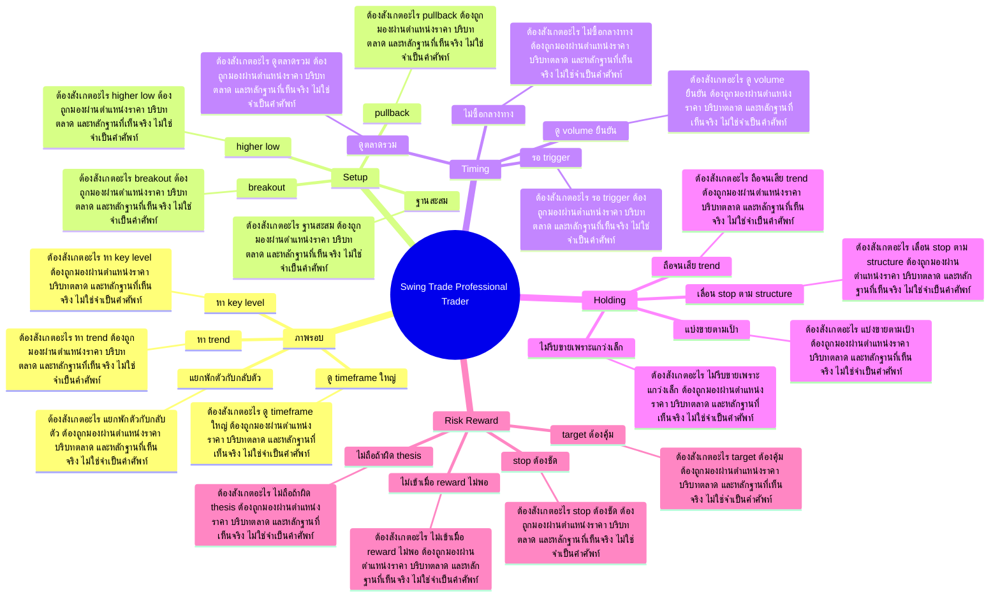

# Mind Map: Swing Trade Professional Trader

## Central Idea
Swing trade คือการจับรอบที่ราคา โครงสร้าง และแรงสนับสนุนอยู่ข้างเดียวกัน แล้วถือให้พอดีกับรอบ

## Learning Context
- Phase: จับรอบราคา
- Category: Strategy

## Learning Goals
- เข้าใจจังหวะเข้าออกของ swing trade
- ใช้โครงสร้างราคาเพื่อกำหนด stop และ target
- ฝึกความอดทนระหว่างถือรอบ

## Keywords To Remember
ema, เพลง, time, นะครับ, frame, reward, stop, position, loss, หรือ, high, rate

## Big Branches + Deep Branches
### ภาพรอบ
- ภาพรวม: กิ่งนี้เชื่อมกับบทเรียนหลักเพราะ ภาพรอบ เป็นตัวแปลงความรู้ให้กลายเป็นการตัดสินใจ โดยเฉพาะเรื่อง ดู timeframe ใหญ่, หา trend, หา key level
- ดู timeframe ใหญ่
  - ต้องสังเกตอะไร: ดู timeframe ใหญ่ ต้องถูกมองผ่านตำแหน่งราคา บริบทตลาด และหลักฐานที่เห็นจริง ไม่ใช่จำเป็นคำศัพท์
  - ใช้ตอนไหน: ใช้ ดู timeframe ใหญ่ เพื่อช่วยตัดสินใจว่าแผนในกิ่ง ภาพรอบ ควรเดินต่อ รอ ย่อขนาด หรือยกเลิก
  - ถ้าผิดต้องทำอะไร: ถ้าหลักฐานไม่ยืนยัน ดู timeframe ใหญ่ ให้ลดความมั่นใจทันที และกลับไปถามจุดผิดทางของแผน
- หา trend
  - ต้องสังเกตอะไร: หา trend ต้องถูกมองผ่านตำแหน่งราคา บริบทตลาด และหลักฐานที่เห็นจริง ไม่ใช่จำเป็นคำศัพท์
  - ใช้ตอนไหน: ใช้ หา trend เพื่อช่วยตัดสินใจว่าแผนในกิ่ง ภาพรอบ ควรเดินต่อ รอ ย่อขนาด หรือยกเลิก
  - ถ้าผิดต้องทำอะไร: ถ้าหลักฐานไม่ยืนยัน หา trend ให้ลดความมั่นใจทันที และกลับไปถามจุดผิดทางของแผน
- หา key level
  - ต้องสังเกตอะไร: หา key level ต้องถูกมองผ่านตำแหน่งราคา บริบทตลาด และหลักฐานที่เห็นจริง ไม่ใช่จำเป็นคำศัพท์
  - ใช้ตอนไหน: ใช้ หา key level เพื่อช่วยตัดสินใจว่าแผนในกิ่ง ภาพรอบ ควรเดินต่อ รอ ย่อขนาด หรือยกเลิก
  - ถ้าผิดต้องทำอะไร: ถ้าหลักฐานไม่ยืนยัน หา key level ให้ลดความมั่นใจทันที และกลับไปถามจุดผิดทางของแผน
- แยกพักตัวกับกลับตัว
  - ต้องสังเกตอะไร: แยกพักตัวกับกลับตัว ต้องถูกมองผ่านตำแหน่งราคา บริบทตลาด และหลักฐานที่เห็นจริง ไม่ใช่จำเป็นคำศัพท์
  - ใช้ตอนไหน: ใช้ แยกพักตัวกับกลับตัว เพื่อช่วยตัดสินใจว่าแผนในกิ่ง ภาพรอบ ควรเดินต่อ รอ ย่อขนาด หรือยกเลิก
  - ถ้าผิดต้องทำอะไร: ถ้าหลักฐานไม่ยืนยัน แยกพักตัวกับกลับตัว ให้ลดความมั่นใจทันที และกลับไปถามจุดผิดทางของแผน

### Setup
- ภาพรวม: กิ่งนี้เชื่อมกับบทเรียนหลักเพราะ Setup เป็นตัวแปลงความรู้ให้กลายเป็นการตัดสินใจ โดยเฉพาะเรื่อง breakout, pullback, ฐานสะสม
- breakout
  - ต้องสังเกตอะไร: breakout ต้องถูกมองผ่านตำแหน่งราคา บริบทตลาด และหลักฐานที่เห็นจริง ไม่ใช่จำเป็นคำศัพท์
  - ใช้ตอนไหน: ใช้ breakout เพื่อช่วยตัดสินใจว่าแผนในกิ่ง Setup ควรเดินต่อ รอ ย่อขนาด หรือยกเลิก
  - ถ้าผิดต้องทำอะไร: ถ้าหลักฐานไม่ยืนยัน breakout ให้ลดความมั่นใจทันที และกลับไปถามจุดผิดทางของแผน
- pullback
  - ต้องสังเกตอะไร: pullback ต้องถูกมองผ่านตำแหน่งราคา บริบทตลาด และหลักฐานที่เห็นจริง ไม่ใช่จำเป็นคำศัพท์
  - ใช้ตอนไหน: ใช้ pullback เพื่อช่วยตัดสินใจว่าแผนในกิ่ง Setup ควรเดินต่อ รอ ย่อขนาด หรือยกเลิก
  - ถ้าผิดต้องทำอะไร: ถ้าหลักฐานไม่ยืนยัน pullback ให้ลดความมั่นใจทันที และกลับไปถามจุดผิดทางของแผน
- ฐานสะสม
  - ต้องสังเกตอะไร: ฐานสะสม ต้องถูกมองผ่านตำแหน่งราคา บริบทตลาด และหลักฐานที่เห็นจริง ไม่ใช่จำเป็นคำศัพท์
  - ใช้ตอนไหน: ใช้ ฐานสะสม เพื่อช่วยตัดสินใจว่าแผนในกิ่ง Setup ควรเดินต่อ รอ ย่อขนาด หรือยกเลิก
  - ถ้าผิดต้องทำอะไร: ถ้าหลักฐานไม่ยืนยัน ฐานสะสม ให้ลดความมั่นใจทันที และกลับไปถามจุดผิดทางของแผน
- higher low
  - ต้องสังเกตอะไร: higher low ต้องถูกมองผ่านตำแหน่งราคา บริบทตลาด และหลักฐานที่เห็นจริง ไม่ใช่จำเป็นคำศัพท์
  - ใช้ตอนไหน: ใช้ higher low เพื่อช่วยตัดสินใจว่าแผนในกิ่ง Setup ควรเดินต่อ รอ ย่อขนาด หรือยกเลิก
  - ถ้าผิดต้องทำอะไร: ถ้าหลักฐานไม่ยืนยัน higher low ให้ลดความมั่นใจทันที และกลับไปถามจุดผิดทางของแผน

### Timing
- ภาพรวม: กิ่งนี้เชื่อมกับบทเรียนหลักเพราะ Timing เป็นตัวแปลงความรู้ให้กลายเป็นการตัดสินใจ โดยเฉพาะเรื่อง รอ trigger, ไม่ซื้อกลางทาง, ดู volume ยืนยัน
- รอ trigger
  - ต้องสังเกตอะไร: รอ trigger ต้องถูกมองผ่านตำแหน่งราคา บริบทตลาด และหลักฐานที่เห็นจริง ไม่ใช่จำเป็นคำศัพท์
  - ใช้ตอนไหน: ใช้ รอ trigger เพื่อช่วยตัดสินใจว่าแผนในกิ่ง Timing ควรเดินต่อ รอ ย่อขนาด หรือยกเลิก
  - ถ้าผิดต้องทำอะไร: ถ้าหลักฐานไม่ยืนยัน รอ trigger ให้ลดความมั่นใจทันที และกลับไปถามจุดผิดทางของแผน
- ไม่ซื้อกลางทาง
  - ต้องสังเกตอะไร: ไม่ซื้อกลางทาง ต้องถูกมองผ่านตำแหน่งราคา บริบทตลาด และหลักฐานที่เห็นจริง ไม่ใช่จำเป็นคำศัพท์
  - ใช้ตอนไหน: ใช้ ไม่ซื้อกลางทาง เพื่อช่วยตัดสินใจว่าแผนในกิ่ง Timing ควรเดินต่อ รอ ย่อขนาด หรือยกเลิก
  - ถ้าผิดต้องทำอะไร: ถ้าหลักฐานไม่ยืนยัน ไม่ซื้อกลางทาง ให้ลดความมั่นใจทันที และกลับไปถามจุดผิดทางของแผน
- ดู volume ยืนยัน
  - ต้องสังเกตอะไร: ดู volume ยืนยัน ต้องถูกมองผ่านตำแหน่งราคา บริบทตลาด และหลักฐานที่เห็นจริง ไม่ใช่จำเป็นคำศัพท์
  - ใช้ตอนไหน: ใช้ ดู volume ยืนยัน เพื่อช่วยตัดสินใจว่าแผนในกิ่ง Timing ควรเดินต่อ รอ ย่อขนาด หรือยกเลิก
  - ถ้าผิดต้องทำอะไร: ถ้าหลักฐานไม่ยืนยัน ดู volume ยืนยัน ให้ลดความมั่นใจทันที และกลับไปถามจุดผิดทางของแผน
- ดูตลาดรวม
  - ต้องสังเกตอะไร: ดูตลาดรวม ต้องถูกมองผ่านตำแหน่งราคา บริบทตลาด และหลักฐานที่เห็นจริง ไม่ใช่จำเป็นคำศัพท์
  - ใช้ตอนไหน: ใช้ ดูตลาดรวม เพื่อช่วยตัดสินใจว่าแผนในกิ่ง Timing ควรเดินต่อ รอ ย่อขนาด หรือยกเลิก
  - ถ้าผิดต้องทำอะไร: ถ้าหลักฐานไม่ยืนยัน ดูตลาดรวม ให้ลดความมั่นใจทันที และกลับไปถามจุดผิดทางของแผน

### Holding
- ภาพรวม: กิ่งนี้เชื่อมกับบทเรียนหลักเพราะ Holding เป็นตัวแปลงความรู้ให้กลายเป็นการตัดสินใจ โดยเฉพาะเรื่อง ถือจนเสีย trend, ไม่รีบขายเพราะแกว่งเล็ก, เลื่อน stop ตาม structure
- ถือจนเสีย trend
  - ต้องสังเกตอะไร: ถือจนเสีย trend ต้องถูกมองผ่านตำแหน่งราคา บริบทตลาด และหลักฐานที่เห็นจริง ไม่ใช่จำเป็นคำศัพท์
  - ใช้ตอนไหน: ใช้ ถือจนเสีย trend เพื่อช่วยตัดสินใจว่าแผนในกิ่ง Holding ควรเดินต่อ รอ ย่อขนาด หรือยกเลิก
  - ถ้าผิดต้องทำอะไร: ถ้าหลักฐานไม่ยืนยัน ถือจนเสีย trend ให้ลดความมั่นใจทันที และกลับไปถามจุดผิดทางของแผน
- ไม่รีบขายเพราะแกว่งเล็ก
  - ต้องสังเกตอะไร: ไม่รีบขายเพราะแกว่งเล็ก ต้องถูกมองผ่านตำแหน่งราคา บริบทตลาด และหลักฐานที่เห็นจริง ไม่ใช่จำเป็นคำศัพท์
  - ใช้ตอนไหน: ใช้ ไม่รีบขายเพราะแกว่งเล็ก เพื่อช่วยตัดสินใจว่าแผนในกิ่ง Holding ควรเดินต่อ รอ ย่อขนาด หรือยกเลิก
  - ถ้าผิดต้องทำอะไร: ถ้าหลักฐานไม่ยืนยัน ไม่รีบขายเพราะแกว่งเล็ก ให้ลดความมั่นใจทันที และกลับไปถามจุดผิดทางของแผน
- เลื่อน stop ตาม structure
  - ต้องสังเกตอะไร: เลื่อน stop ตาม structure ต้องถูกมองผ่านตำแหน่งราคา บริบทตลาด และหลักฐานที่เห็นจริง ไม่ใช่จำเป็นคำศัพท์
  - ใช้ตอนไหน: ใช้ เลื่อน stop ตาม structure เพื่อช่วยตัดสินใจว่าแผนในกิ่ง Holding ควรเดินต่อ รอ ย่อขนาด หรือยกเลิก
  - ถ้าผิดต้องทำอะไร: ถ้าหลักฐานไม่ยืนยัน เลื่อน stop ตาม structure ให้ลดความมั่นใจทันที และกลับไปถามจุดผิดทางของแผน
- แบ่งขายตามเป้า
  - ต้องสังเกตอะไร: แบ่งขายตามเป้า ต้องถูกมองผ่านตำแหน่งราคา บริบทตลาด และหลักฐานที่เห็นจริง ไม่ใช่จำเป็นคำศัพท์
  - ใช้ตอนไหน: ใช้ แบ่งขายตามเป้า เพื่อช่วยตัดสินใจว่าแผนในกิ่ง Holding ควรเดินต่อ รอ ย่อขนาด หรือยกเลิก
  - ถ้าผิดต้องทำอะไร: ถ้าหลักฐานไม่ยืนยัน แบ่งขายตามเป้า ให้ลดความมั่นใจทันที และกลับไปถามจุดผิดทางของแผน

### Risk Reward
- ภาพรวม: กิ่งนี้เชื่อมกับบทเรียนหลักเพราะ Risk Reward เป็นตัวแปลงความรู้ให้กลายเป็นการตัดสินใจ โดยเฉพาะเรื่อง stop ต้องชัด, target ต้องคุ้ม, ไม่เข้าเมื่อ reward ไม่พอ
- stop ต้องชัด
  - ต้องสังเกตอะไร: stop ต้องชัด ต้องถูกมองผ่านตำแหน่งราคา บริบทตลาด และหลักฐานที่เห็นจริง ไม่ใช่จำเป็นคำศัพท์
  - ใช้ตอนไหน: ใช้ stop ต้องชัด เพื่อช่วยตัดสินใจว่าแผนในกิ่ง Risk Reward ควรเดินต่อ รอ ย่อขนาด หรือยกเลิก
  - ถ้าผิดต้องทำอะไร: ถ้าหลักฐานไม่ยืนยัน stop ต้องชัด ให้ลดความมั่นใจทันที และกลับไปถามจุดผิดทางของแผน
- target ต้องคุ้ม
  - ต้องสังเกตอะไร: target ต้องคุ้ม ต้องถูกมองผ่านตำแหน่งราคา บริบทตลาด และหลักฐานที่เห็นจริง ไม่ใช่จำเป็นคำศัพท์
  - ใช้ตอนไหน: ใช้ target ต้องคุ้ม เพื่อช่วยตัดสินใจว่าแผนในกิ่ง Risk Reward ควรเดินต่อ รอ ย่อขนาด หรือยกเลิก
  - ถ้าผิดต้องทำอะไร: ถ้าหลักฐานไม่ยืนยัน target ต้องคุ้ม ให้ลดความมั่นใจทันที และกลับไปถามจุดผิดทางของแผน
- ไม่เข้าเมื่อ reward ไม่พอ
  - ต้องสังเกตอะไร: ไม่เข้าเมื่อ reward ไม่พอ ต้องถูกมองผ่านตำแหน่งราคา บริบทตลาด และหลักฐานที่เห็นจริง ไม่ใช่จำเป็นคำศัพท์
  - ใช้ตอนไหน: ใช้ ไม่เข้าเมื่อ reward ไม่พอ เพื่อช่วยตัดสินใจว่าแผนในกิ่ง Risk Reward ควรเดินต่อ รอ ย่อขนาด หรือยกเลิก
  - ถ้าผิดต้องทำอะไร: ถ้าหลักฐานไม่ยืนยัน ไม่เข้าเมื่อ reward ไม่พอ ให้ลดความมั่นใจทันที และกลับไปถามจุดผิดทางของแผน
- ไม่ถือถ้าผิด thesis
  - ต้องสังเกตอะไร: ไม่ถือถ้าผิด thesis ต้องถูกมองผ่านตำแหน่งราคา บริบทตลาด และหลักฐานที่เห็นจริง ไม่ใช่จำเป็นคำศัพท์
  - ใช้ตอนไหน: ใช้ ไม่ถือถ้าผิด thesis เพื่อช่วยตัดสินใจว่าแผนในกิ่ง Risk Reward ควรเดินต่อ รอ ย่อขนาด หรือยกเลิก
  - ถ้าผิดต้องทำอะไร: ถ้าหลักฐานไม่ยืนยัน ไม่ถือถ้าผิด thesis ให้ลดความมั่นใจทันที และกลับไปถามจุดผิดทางของแผน

## Transcript Signals
> ลงอ่อนอ่อนค่านะครับอ่อนค่าปึ๊บอ่อนค่า ขึ้นนะครับทีเนี้ยพออ่อนค่าขึ้นปุ๊บนะ ครับเค้าก็จะทำให้เค้าเนี่ยได้กำไรในส่วน ของการที่เา้าแลกค่าเงินตรงนี้ด้วยตลาดก็ จะค่อยๆปรับตัวลงมาเราจึงต้องเล่นสถานะ short position นะครับ นะครับทีนี้เรามามองนะครับต่อมานะครับเรา...

> ต่อๆไปนะครับจะมีสอนในเรื่องของเทคนิคตรง นี้นะครับแล้วก็อย่างสุดท้ายครับก็จะมอง ในเรื่องของเนลineนะครับบวกกับไแพทเทิร์น นะครับหลักๆในการดูแนวโน้มของราคาเนี่ยผม จะใช้ดูอย่างง่ายนะครับต้องบอกก่อนว่า 3 อย่างครับ 1 ดู EMA นะครับ 2 ดูใช้ทฤษฎี ดาวประกอบคู่กับตัวของ...

> ทำไมทุกๆครั้งที่มันเกิดไซด์ยมันถึงขึ้น แรงนะครับจุดของไซwayยเนี่ยมันคือจุดของ การที่มีคนมาเดิมพันทั้งฝั่งลงและก็ฝั่ง ขึ้นอยู่เสมอนะครับถ้าเป็นภาษาหุ้นก็คือ มีทั้งคนซื้อและคนขายอยู่ตรงนั้นนะครับที นี้ถ้าเราจะอธิบายชัดๆจริงๆก็คือมันมีคน...

## Decision Rules
- ภาพรอบ: จะใช้กิ่งนี้ได้เมื่อเห็น ดู timeframe ใหญ่ และ หา trend พร้อมกัน ถ้าเจอเงื่อนไขตรงข้ามกับ แยกพักตัวกับกลับตัว ให้ลดขนาดหรือหยุด
- Setup: จะใช้กิ่งนี้ได้เมื่อเห็น breakout และ pullback พร้อมกัน ถ้าเจอเงื่อนไขตรงข้ามกับ higher low ให้ลดขนาดหรือหยุด
- Timing: จะใช้กิ่งนี้ได้เมื่อเห็น รอ trigger และ ไม่ซื้อกลางทาง พร้อมกัน ถ้าเจอเงื่อนไขตรงข้ามกับ ดูตลาดรวม ให้ลดขนาดหรือหยุด
- Holding: จะใช้กิ่งนี้ได้เมื่อเห็น ถือจนเสีย trend และ ไม่รีบขายเพราะแกว่งเล็ก พร้อมกัน ถ้าเจอเงื่อนไขตรงข้ามกับ แบ่งขายตามเป้า ให้ลดขนาดหรือหยุด
- Risk Reward: จะใช้กิ่งนี้ได้เมื่อเห็น stop ต้องชัด และ target ต้องคุ้ม พร้อมกัน ถ้าเจอเงื่อนไขตรงข้ามกับ ไม่ถือถ้าผิด thesis ให้ลดขนาดหรือหยุด

## Common Mistakes
- จำชื่อบทได้ แต่ไม่รู้ว่า ภาพรอบ ต้องเปลี่ยนพฤติกรรมการเทรดตรงไหน
- เห็นสัญญาณหนึ่งอย่างแล้วรีบสรุป ทั้งที่ยังไม่ได้เช็กบริบทและหลักฐานประกอบ
- วางแผนตอนใจเย็น แต่พอราคาเคลื่อนไหวจริงกลับเปลี่ยนกฎตามอารมณ์
- สนใจ Risk Reward แค่ตอนอยากเข้า แต่ไม่ใช้เป็นเงื่อนไขตอนต้องออกหรือหยุด

## Practice Checklist
- ทวนเป้าหมายบทนี้ก่อนเริ่ม: เข้าใจจังหวะเข้าออกของ swing trade
- เปิดกราฟหรือกรณีศึกษาจริง 1 ตัว แล้วระบุว่าเกี่ยวกับกิ่ง 'ภาพรอบ' ตรงไหน
- เขียนก่อนเข้าว่า thesis คืออะไร หลักฐานคืออะไร และถ้าผิดจะยอมรับตรงไหน
- แยกสิ่งที่เห็นจริงออกจากสิ่งที่อยากให้เกิด แล้วให้คะแนนความมั่นใจ 1-5
- หลังจบเคส ให้บันทึกว่าแพ้/ชนะเพราะระบบ หรือเพราะอารมณ์

## Final Destination
มี playbook สำหรับจับรอบหลายวันถึงหลายสัปดาห์ โดยไม่กลายเป็นติดดอยระยะยาว

## Questions for Patiphan
1. กิ่งไหนคือแก่นที่สุดของบทนี้
2. กิ่งไหนเกี่ยวกับจุดอ่อนของ Patiphan มากที่สุด
3. ถ้าจะเอาไปใช้กับกราฟจริง ต้องเห็นหลักฐานอะไร
4. ถ้าทำผิด บทนี้เตือนให้หยุดตรงไหน
5. ปลายทางของบทนี้จะเข้าไปอยู่ในระบบเทรดส่วนไหน
