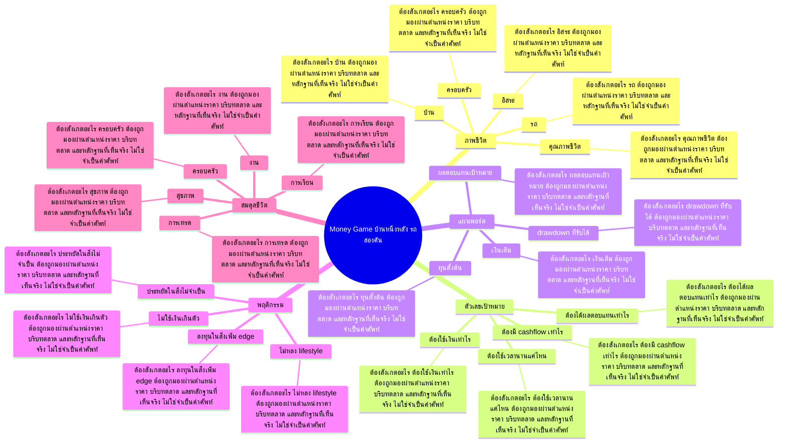

# Mind Map: Money Game บ้านหนึ่งหลัง รถสองคัน

## Central Idea
เงินไม่ใช่แค่ตัวเลขในพอร์ต แต่เป็นเครื่องมือสร้างชีวิตที่ต้องการ เป้าหมายต้องแปลงเป็นระบบลงมือ

## Learning Context
- Phase: เชื่อมเงินกับชีวิต
- Category: Mindset

## Learning Goals
- แปลงเป้าหมายชีวิตเป็นเป้าหมายการเงิน
- เห็นความสัมพันธ์ระหว่างพฤติกรรมวันนี้กับทรัพย์สินอนาคต
- วางแผนเรียนหุ้นให้สอดคล้องกับเป้าหมายจริง

## Keywords To Remember
นะครับ, day, out, low, high, ema, money, vol, เนี่ย, time, stop, game

## Big Branches + Deep Branches
### ภาพชีวิต
- ภาพรวม: กิ่งนี้เชื่อมกับบทเรียนหลักเพราะ ภาพชีวิต เป็นตัวแปลงความรู้ให้กลายเป็นการตัดสินใจ โดยเฉพาะเรื่อง บ้าน, รถ, ครอบครัว
- บ้าน
  - ต้องสังเกตอะไร: บ้าน ต้องถูกมองผ่านตำแหน่งราคา บริบทตลาด และหลักฐานที่เห็นจริง ไม่ใช่จำเป็นคำศัพท์
  - ใช้ตอนไหน: ใช้ บ้าน เพื่อช่วยตัดสินใจว่าแผนในกิ่ง ภาพชีวิต ควรเดินต่อ รอ ย่อขนาด หรือยกเลิก
  - ถ้าผิดต้องทำอะไร: ถ้าหลักฐานไม่ยืนยัน บ้าน ให้ลดความมั่นใจทันที และกลับไปถามจุดผิดทางของแผน
- รถ
  - ต้องสังเกตอะไร: รถ ต้องถูกมองผ่านตำแหน่งราคา บริบทตลาด และหลักฐานที่เห็นจริง ไม่ใช่จำเป็นคำศัพท์
  - ใช้ตอนไหน: ใช้ รถ เพื่อช่วยตัดสินใจว่าแผนในกิ่ง ภาพชีวิต ควรเดินต่อ รอ ย่อขนาด หรือยกเลิก
  - ถ้าผิดต้องทำอะไร: ถ้าหลักฐานไม่ยืนยัน รถ ให้ลดความมั่นใจทันที และกลับไปถามจุดผิดทางของแผน
- ครอบครัว
  - ต้องสังเกตอะไร: ครอบครัว ต้องถูกมองผ่านตำแหน่งราคา บริบทตลาด และหลักฐานที่เห็นจริง ไม่ใช่จำเป็นคำศัพท์
  - ใช้ตอนไหน: ใช้ ครอบครัว เพื่อช่วยตัดสินใจว่าแผนในกิ่ง ภาพชีวิต ควรเดินต่อ รอ ย่อขนาด หรือยกเลิก
  - ถ้าผิดต้องทำอะไร: ถ้าหลักฐานไม่ยืนยัน ครอบครัว ให้ลดความมั่นใจทันที และกลับไปถามจุดผิดทางของแผน
- อิสระ
  - ต้องสังเกตอะไร: อิสระ ต้องถูกมองผ่านตำแหน่งราคา บริบทตลาด และหลักฐานที่เห็นจริง ไม่ใช่จำเป็นคำศัพท์
  - ใช้ตอนไหน: ใช้ อิสระ เพื่อช่วยตัดสินใจว่าแผนในกิ่ง ภาพชีวิต ควรเดินต่อ รอ ย่อขนาด หรือยกเลิก
  - ถ้าผิดต้องทำอะไร: ถ้าหลักฐานไม่ยืนยัน อิสระ ให้ลดความมั่นใจทันที และกลับไปถามจุดผิดทางของแผน
- คุณภาพชีวิต
  - ต้องสังเกตอะไร: คุณภาพชีวิต ต้องถูกมองผ่านตำแหน่งราคา บริบทตลาด และหลักฐานที่เห็นจริง ไม่ใช่จำเป็นคำศัพท์
  - ใช้ตอนไหน: ใช้ คุณภาพชีวิต เพื่อช่วยตัดสินใจว่าแผนในกิ่ง ภาพชีวิต ควรเดินต่อ รอ ย่อขนาด หรือยกเลิก
  - ถ้าผิดต้องทำอะไร: ถ้าหลักฐานไม่ยืนยัน คุณภาพชีวิต ให้ลดความมั่นใจทันที และกลับไปถามจุดผิดทางของแผน

### ตัวเลขเป้าหมาย
- ภาพรวม: กิ่งนี้เชื่อมกับบทเรียนหลักเพราะ ตัวเลขเป้าหมาย เป็นตัวแปลงความรู้ให้กลายเป็นการตัดสินใจ โดยเฉพาะเรื่อง ต้องใช้เงินเท่าไร, ต้องมี cashflow เท่าไร, ต้องใช้เวลานานแค่ไหน
- ต้องใช้เงินเท่าไร
  - ต้องสังเกตอะไร: ต้องใช้เงินเท่าไร ต้องถูกมองผ่านตำแหน่งราคา บริบทตลาด และหลักฐานที่เห็นจริง ไม่ใช่จำเป็นคำศัพท์
  - ใช้ตอนไหน: ใช้ ต้องใช้เงินเท่าไร เพื่อช่วยตัดสินใจว่าแผนในกิ่ง ตัวเลขเป้าหมาย ควรเดินต่อ รอ ย่อขนาด หรือยกเลิก
  - ถ้าผิดต้องทำอะไร: ถ้าหลักฐานไม่ยืนยัน ต้องใช้เงินเท่าไร ให้ลดความมั่นใจทันที และกลับไปถามจุดผิดทางของแผน
- ต้องมี cashflow เท่าไร
  - ต้องสังเกตอะไร: ต้องมี cashflow เท่าไร ต้องถูกมองผ่านตำแหน่งราคา บริบทตลาด และหลักฐานที่เห็นจริง ไม่ใช่จำเป็นคำศัพท์
  - ใช้ตอนไหน: ใช้ ต้องมี cashflow เท่าไร เพื่อช่วยตัดสินใจว่าแผนในกิ่ง ตัวเลขเป้าหมาย ควรเดินต่อ รอ ย่อขนาด หรือยกเลิก
  - ถ้าผิดต้องทำอะไร: ถ้าหลักฐานไม่ยืนยัน ต้องมี cashflow เท่าไร ให้ลดความมั่นใจทันที และกลับไปถามจุดผิดทางของแผน
- ต้องใช้เวลานานแค่ไหน
  - ต้องสังเกตอะไร: ต้องใช้เวลานานแค่ไหน ต้องถูกมองผ่านตำแหน่งราคา บริบทตลาด และหลักฐานที่เห็นจริง ไม่ใช่จำเป็นคำศัพท์
  - ใช้ตอนไหน: ใช้ ต้องใช้เวลานานแค่ไหน เพื่อช่วยตัดสินใจว่าแผนในกิ่ง ตัวเลขเป้าหมาย ควรเดินต่อ รอ ย่อขนาด หรือยกเลิก
  - ถ้าผิดต้องทำอะไร: ถ้าหลักฐานไม่ยืนยัน ต้องใช้เวลานานแค่ไหน ให้ลดความมั่นใจทันที และกลับไปถามจุดผิดทางของแผน
- ต้องได้ผลตอบแทนเท่าไร
  - ต้องสังเกตอะไร: ต้องได้ผลตอบแทนเท่าไร ต้องถูกมองผ่านตำแหน่งราคา บริบทตลาด และหลักฐานที่เห็นจริง ไม่ใช่จำเป็นคำศัพท์
  - ใช้ตอนไหน: ใช้ ต้องได้ผลตอบแทนเท่าไร เพื่อช่วยตัดสินใจว่าแผนในกิ่ง ตัวเลขเป้าหมาย ควรเดินต่อ รอ ย่อขนาด หรือยกเลิก
  - ถ้าผิดต้องทำอะไร: ถ้าหลักฐานไม่ยืนยัน ต้องได้ผลตอบแทนเท่าไร ให้ลดความมั่นใจทันที และกลับไปถามจุดผิดทางของแผน

### แผนพอร์ต
- ภาพรวม: กิ่งนี้เชื่อมกับบทเรียนหลักเพราะ แผนพอร์ต เป็นตัวแปลงความรู้ให้กลายเป็นการตัดสินใจ โดยเฉพาะเรื่อง ทุนตั้งต้น, เงินเติม, ผลตอบแทนเป้าหมาย
- ทุนตั้งต้น
  - ต้องสังเกตอะไร: ทุนตั้งต้น ต้องถูกมองผ่านตำแหน่งราคา บริบทตลาด และหลักฐานที่เห็นจริง ไม่ใช่จำเป็นคำศัพท์
  - ใช้ตอนไหน: ใช้ ทุนตั้งต้น เพื่อช่วยตัดสินใจว่าแผนในกิ่ง แผนพอร์ต ควรเดินต่อ รอ ย่อขนาด หรือยกเลิก
  - ถ้าผิดต้องทำอะไร: ถ้าหลักฐานไม่ยืนยัน ทุนตั้งต้น ให้ลดความมั่นใจทันที และกลับไปถามจุดผิดทางของแผน
- เงินเติม
  - ต้องสังเกตอะไร: เงินเติม ต้องถูกมองผ่านตำแหน่งราคา บริบทตลาด และหลักฐานที่เห็นจริง ไม่ใช่จำเป็นคำศัพท์
  - ใช้ตอนไหน: ใช้ เงินเติม เพื่อช่วยตัดสินใจว่าแผนในกิ่ง แผนพอร์ต ควรเดินต่อ รอ ย่อขนาด หรือยกเลิก
  - ถ้าผิดต้องทำอะไร: ถ้าหลักฐานไม่ยืนยัน เงินเติม ให้ลดความมั่นใจทันที และกลับไปถามจุดผิดทางของแผน
- ผลตอบแทนเป้าหมาย
  - ต้องสังเกตอะไร: ผลตอบแทนเป้าหมาย ต้องถูกมองผ่านตำแหน่งราคา บริบทตลาด และหลักฐานที่เห็นจริง ไม่ใช่จำเป็นคำศัพท์
  - ใช้ตอนไหน: ใช้ ผลตอบแทนเป้าหมาย เพื่อช่วยตัดสินใจว่าแผนในกิ่ง แผนพอร์ต ควรเดินต่อ รอ ย่อขนาด หรือยกเลิก
  - ถ้าผิดต้องทำอะไร: ถ้าหลักฐานไม่ยืนยัน ผลตอบแทนเป้าหมาย ให้ลดความมั่นใจทันที และกลับไปถามจุดผิดทางของแผน
- drawdown ที่รับได้
  - ต้องสังเกตอะไร: drawdown ที่รับได้ ต้องถูกมองผ่านตำแหน่งราคา บริบทตลาด และหลักฐานที่เห็นจริง ไม่ใช่จำเป็นคำศัพท์
  - ใช้ตอนไหน: ใช้ drawdown ที่รับได้ เพื่อช่วยตัดสินใจว่าแผนในกิ่ง แผนพอร์ต ควรเดินต่อ รอ ย่อขนาด หรือยกเลิก
  - ถ้าผิดต้องทำอะไร: ถ้าหลักฐานไม่ยืนยัน drawdown ที่รับได้ ให้ลดความมั่นใจทันที และกลับไปถามจุดผิดทางของแผน

### พฤติกรรม
- ภาพรวม: กิ่งนี้เชื่อมกับบทเรียนหลักเพราะ พฤติกรรม เป็นตัวแปลงความรู้ให้กลายเป็นการตัดสินใจ โดยเฉพาะเรื่อง ประหยัดในสิ่งไม่จำเป็น, ลงทุนในสิ่งเพิ่ม edge, ไม่ใช้เงินเกินตัว
- ประหยัดในสิ่งไม่จำเป็น
  - ต้องสังเกตอะไร: ประหยัดในสิ่งไม่จำเป็น ต้องถูกมองผ่านตำแหน่งราคา บริบทตลาด และหลักฐานที่เห็นจริง ไม่ใช่จำเป็นคำศัพท์
  - ใช้ตอนไหน: ใช้ ประหยัดในสิ่งไม่จำเป็น เพื่อช่วยตัดสินใจว่าแผนในกิ่ง พฤติกรรม ควรเดินต่อ รอ ย่อขนาด หรือยกเลิก
  - ถ้าผิดต้องทำอะไร: ถ้าหลักฐานไม่ยืนยัน ประหยัดในสิ่งไม่จำเป็น ให้ลดความมั่นใจทันที และกลับไปถามจุดผิดทางของแผน
- ลงทุนในสิ่งเพิ่ม edge
  - ต้องสังเกตอะไร: ลงทุนในสิ่งเพิ่ม edge ต้องถูกมองผ่านตำแหน่งราคา บริบทตลาด และหลักฐานที่เห็นจริง ไม่ใช่จำเป็นคำศัพท์
  - ใช้ตอนไหน: ใช้ ลงทุนในสิ่งเพิ่ม edge เพื่อช่วยตัดสินใจว่าแผนในกิ่ง พฤติกรรม ควรเดินต่อ รอ ย่อขนาด หรือยกเลิก
  - ถ้าผิดต้องทำอะไร: ถ้าหลักฐานไม่ยืนยัน ลงทุนในสิ่งเพิ่ม edge ให้ลดความมั่นใจทันที และกลับไปถามจุดผิดทางของแผน
- ไม่ใช้เงินเกินตัว
  - ต้องสังเกตอะไร: ไม่ใช้เงินเกินตัว ต้องถูกมองผ่านตำแหน่งราคา บริบทตลาด และหลักฐานที่เห็นจริง ไม่ใช่จำเป็นคำศัพท์
  - ใช้ตอนไหน: ใช้ ไม่ใช้เงินเกินตัว เพื่อช่วยตัดสินใจว่าแผนในกิ่ง พฤติกรรม ควรเดินต่อ รอ ย่อขนาด หรือยกเลิก
  - ถ้าผิดต้องทำอะไร: ถ้าหลักฐานไม่ยืนยัน ไม่ใช้เงินเกินตัว ให้ลดความมั่นใจทันที และกลับไปถามจุดผิดทางของแผน
- ไม่หลง lifestyle
  - ต้องสังเกตอะไร: ไม่หลง lifestyle ต้องถูกมองผ่านตำแหน่งราคา บริบทตลาด และหลักฐานที่เห็นจริง ไม่ใช่จำเป็นคำศัพท์
  - ใช้ตอนไหน: ใช้ ไม่หลง lifestyle เพื่อช่วยตัดสินใจว่าแผนในกิ่ง พฤติกรรม ควรเดินต่อ รอ ย่อขนาด หรือยกเลิก
  - ถ้าผิดต้องทำอะไร: ถ้าหลักฐานไม่ยืนยัน ไม่หลง lifestyle ให้ลดความมั่นใจทันที และกลับไปถามจุดผิดทางของแผน

### สมดุลชีวิต
- ภาพรวม: กิ่งนี้เชื่อมกับบทเรียนหลักเพราะ สมดุลชีวิต เป็นตัวแปลงความรู้ให้กลายเป็นการตัดสินใจ โดยเฉพาะเรื่อง สุขภาพ, ครอบครัว, งาน
- สุขภาพ
  - ต้องสังเกตอะไร: สุขภาพ ต้องถูกมองผ่านตำแหน่งราคา บริบทตลาด และหลักฐานที่เห็นจริง ไม่ใช่จำเป็นคำศัพท์
  - ใช้ตอนไหน: ใช้ สุขภาพ เพื่อช่วยตัดสินใจว่าแผนในกิ่ง สมดุลชีวิต ควรเดินต่อ รอ ย่อขนาด หรือยกเลิก
  - ถ้าผิดต้องทำอะไร: ถ้าหลักฐานไม่ยืนยัน สุขภาพ ให้ลดความมั่นใจทันที และกลับไปถามจุดผิดทางของแผน
- ครอบครัว
  - ต้องสังเกตอะไร: ครอบครัว ต้องถูกมองผ่านตำแหน่งราคา บริบทตลาด และหลักฐานที่เห็นจริง ไม่ใช่จำเป็นคำศัพท์
  - ใช้ตอนไหน: ใช้ ครอบครัว เพื่อช่วยตัดสินใจว่าแผนในกิ่ง สมดุลชีวิต ควรเดินต่อ รอ ย่อขนาด หรือยกเลิก
  - ถ้าผิดต้องทำอะไร: ถ้าหลักฐานไม่ยืนยัน ครอบครัว ให้ลดความมั่นใจทันที และกลับไปถามจุดผิดทางของแผน
- งาน
  - ต้องสังเกตอะไร: งาน ต้องถูกมองผ่านตำแหน่งราคา บริบทตลาด และหลักฐานที่เห็นจริง ไม่ใช่จำเป็นคำศัพท์
  - ใช้ตอนไหน: ใช้ งาน เพื่อช่วยตัดสินใจว่าแผนในกิ่ง สมดุลชีวิต ควรเดินต่อ รอ ย่อขนาด หรือยกเลิก
  - ถ้าผิดต้องทำอะไร: ถ้าหลักฐานไม่ยืนยัน งาน ให้ลดความมั่นใจทันที และกลับไปถามจุดผิดทางของแผน
- การเรียน
  - ต้องสังเกตอะไร: การเรียน ต้องถูกมองผ่านตำแหน่งราคา บริบทตลาด และหลักฐานที่เห็นจริง ไม่ใช่จำเป็นคำศัพท์
  - ใช้ตอนไหน: ใช้ การเรียน เพื่อช่วยตัดสินใจว่าแผนในกิ่ง สมดุลชีวิต ควรเดินต่อ รอ ย่อขนาด หรือยกเลิก
  - ถ้าผิดต้องทำอะไร: ถ้าหลักฐานไม่ยืนยัน การเรียน ให้ลดความมั่นใจทันที และกลับไปถามจุดผิดทางของแผน
- การเทรด
  - ต้องสังเกตอะไร: การเทรด ต้องถูกมองผ่านตำแหน่งราคา บริบทตลาด และหลักฐานที่เห็นจริง ไม่ใช่จำเป็นคำศัพท์
  - ใช้ตอนไหน: ใช้ การเทรด เพื่อช่วยตัดสินใจว่าแผนในกิ่ง สมดุลชีวิต ควรเดินต่อ รอ ย่อขนาด หรือยกเลิก
  - ถ้าผิดต้องทำอะไร: ถ้าหลักฐานไม่ยืนยัน การเทรด ให้ลดความมั่นใจทันที และกลับไปถามจุดผิดทางของแผน

## Transcript Signals
> รู้เตรียมพร้อมก่อนคือคนที่จะพอร์ตโตได้ เนี่ยต้องมี 3 อย่างนะครับ 1 ต้องมีความ รู้นะครับ 1 ต้องมีความรู้แล้วก็ประสบการณ์นะครับ พอมีความรู้และประสบการณ์เนี่ย ถึงจะสามารถทำได้นะครับโดยอย่างที่ 2 เนี่ยพอร์ตจะโตได้เนี่ย 1 มีความรู้ ประสบการณ์นะครับ 2...

> น่าสนใจ Money เกมของนะครับเนี่ยก็คือ หุ้นลูกถูกมั้ยครับแต่หุ้นลูกเนี่ยเป็น หุ้นที่ไม่มีต้นทุนแล้วะกันหุ้นเนี่ยยัง มีราคาพาถูกมั้ยครับเจ้าของยังมีราคาพา หรือว่าซื้อบนกระดานแต่เนี่ยคือของฟรีที่ เค้าได้จากการถือหุ้นนะครับพอมันเป็นของ ฟรีเนี่ย...

> อ่ะก็ดูดิประกอบอย่างที่บอกถูกมยเราดู คrelationดิมันมาจริงวันศุกร์มันมาจริง ทีม G ก็มีโอกาสที่จะมาจริงเหมือนกันครับ >> แต่ตอนนี้ซื้อไป 89 คิดว่า 2 ตรงนั้นเอง 8.6 8.5 >> ดีครับก็เป็นจุดจุดที่เบรคขึ้นมานะคือย่อ เต็มที่ก็ไม่ควรหลุด 8.5 นะครับ 8.5...

## Decision Rules
- ภาพชีวิต: จะใช้กิ่งนี้ได้เมื่อเห็น บ้าน และ รถ พร้อมกัน ถ้าเจอเงื่อนไขตรงข้ามกับ คุณภาพชีวิต ให้ลดขนาดหรือหยุด
- ตัวเลขเป้าหมาย: จะใช้กิ่งนี้ได้เมื่อเห็น ต้องใช้เงินเท่าไร และ ต้องมี cashflow เท่าไร พร้อมกัน ถ้าเจอเงื่อนไขตรงข้ามกับ ต้องได้ผลตอบแทนเท่าไร ให้ลดขนาดหรือหยุด
- แผนพอร์ต: จะใช้กิ่งนี้ได้เมื่อเห็น ทุนตั้งต้น และ เงินเติม พร้อมกัน ถ้าเจอเงื่อนไขตรงข้ามกับ drawdown ที่รับได้ ให้ลดขนาดหรือหยุด
- พฤติกรรม: จะใช้กิ่งนี้ได้เมื่อเห็น ประหยัดในสิ่งไม่จำเป็น และ ลงทุนในสิ่งเพิ่ม edge พร้อมกัน ถ้าเจอเงื่อนไขตรงข้ามกับ ไม่หลง lifestyle ให้ลดขนาดหรือหยุด
- สมดุลชีวิต: จะใช้กิ่งนี้ได้เมื่อเห็น สุขภาพ และ ครอบครัว พร้อมกัน ถ้าเจอเงื่อนไขตรงข้ามกับ การเทรด ให้ลดขนาดหรือหยุด

## Common Mistakes
- จำชื่อบทได้ แต่ไม่รู้ว่า ภาพชีวิต ต้องเปลี่ยนพฤติกรรมการเทรดตรงไหน
- เห็นสัญญาณหนึ่งอย่างแล้วรีบสรุป ทั้งที่ยังไม่ได้เช็กบริบทและหลักฐานประกอบ
- วางแผนตอนใจเย็น แต่พอราคาเคลื่อนไหวจริงกลับเปลี่ยนกฎตามอารมณ์
- สนใจ สมดุลชีวิต แค่ตอนอยากเข้า แต่ไม่ใช้เป็นเงื่อนไขตอนต้องออกหรือหยุด

## Practice Checklist
- ทวนเป้าหมายบทนี้ก่อนเริ่ม: แปลงเป้าหมายชีวิตเป็นเป้าหมายการเงิน
- เปิดกราฟหรือกรณีศึกษาจริง 1 ตัว แล้วระบุว่าเกี่ยวกับกิ่ง 'ภาพชีวิต' ตรงไหน
- เขียนก่อนเข้าว่า thesis คืออะไร หลักฐานคืออะไร และถ้าผิดจะยอมรับตรงไหน
- แยกสิ่งที่เห็นจริงออกจากสิ่งที่อยากให้เกิด แล้วให้คะแนนความมั่นใจ 1-5
- หลังจบเคส ให้บันทึกว่าแพ้/ชนะเพราะระบบ หรือเพราะอารมณ์

## Final Destination
ทำให้เป้าหมายการเงินมีหน้าตาเป็นชีวิตจริง แล้วใช้พอร์ตเป็นเครื่องมือ ไม่ใช่ปล่อยให้พอร์ตกลายเป็นเจ้าของชีวิต

## Questions for Patiphan
1. กิ่งไหนคือแก่นที่สุดของบทนี้
2. กิ่งไหนเกี่ยวกับจุดอ่อนของ Patiphan มากที่สุด
3. ถ้าจะเอาไปใช้กับกราฟจริง ต้องเห็นหลักฐานอะไร
4. ถ้าทำผิด บทนี้เตือนให้หยุดตรงไหน
5. ปลายทางของบทนี้จะเข้าไปอยู่ในระบบเทรดส่วนไหน
