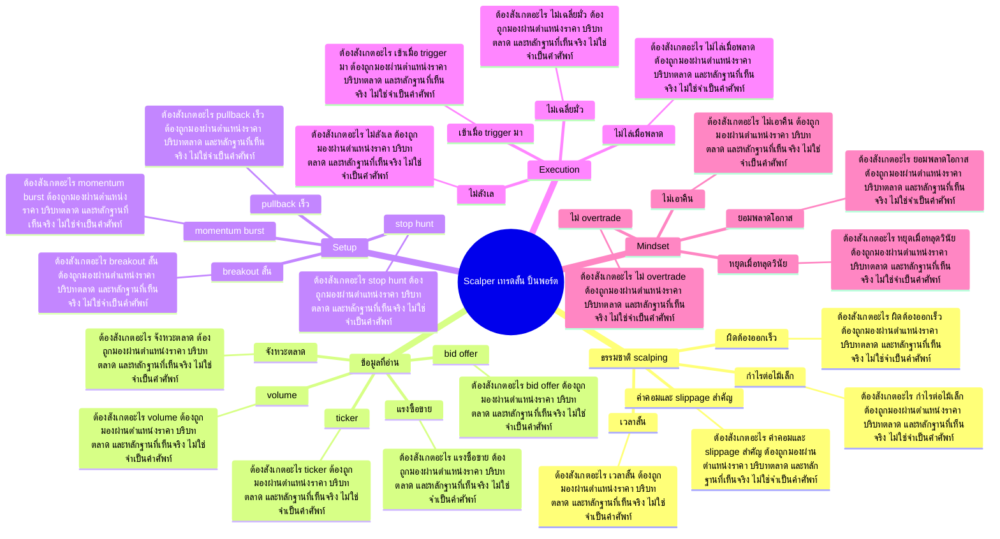

# Mind Map: Scalper เทรดสั้น ปั้นพอร์ต

## Central Idea
Scalping เป็นเกมของความเร็ว ความชัด และการยอมผิดทันที ต้องเอา process ชนะ impulse

## Learning Context
- Phase: ฝึกความเร็วและวินัย
- Category: Execution

## Learning Goals
- เข้าใจข้อจำกัดของการเทรดสั้น
- อ่านแรงซื้อขายระยะใกล้โดยไม่ไล่ราคาแบบไร้แผน
- สร้างกฎออกเร็วเมื่อ setup ไม่ทำงาน

## Keywords To Remember
offer, นะครับ, vol, ipo, บาท, ช่อง, day, timing, stop, bit, อ่ะ, off

## Big Branches + Deep Branches
### ธรรมชาติ scalping
- ภาพรวม: กิ่งนี้เชื่อมกับบทเรียนหลักเพราะ ธรรมชาติ scalping เป็นตัวแปลงความรู้ให้กลายเป็นการตัดสินใจ โดยเฉพาะเรื่อง เวลาสั้น, กำไรต่อไม้เล็ก, ผิดต้องออกเร็ว
- เวลาสั้น
  - ต้องสังเกตอะไร: เวลาสั้น ต้องถูกมองผ่านตำแหน่งราคา บริบทตลาด และหลักฐานที่เห็นจริง ไม่ใช่จำเป็นคำศัพท์
  - ใช้ตอนไหน: ใช้ เวลาสั้น เพื่อช่วยตัดสินใจว่าแผนในกิ่ง ธรรมชาติ scalping ควรเดินต่อ รอ ย่อขนาด หรือยกเลิก
  - ถ้าผิดต้องทำอะไร: ถ้าหลักฐานไม่ยืนยัน เวลาสั้น ให้ลดความมั่นใจทันที และกลับไปถามจุดผิดทางของแผน
- กำไรต่อไม้เล็ก
  - ต้องสังเกตอะไร: กำไรต่อไม้เล็ก ต้องถูกมองผ่านตำแหน่งราคา บริบทตลาด และหลักฐานที่เห็นจริง ไม่ใช่จำเป็นคำศัพท์
  - ใช้ตอนไหน: ใช้ กำไรต่อไม้เล็ก เพื่อช่วยตัดสินใจว่าแผนในกิ่ง ธรรมชาติ scalping ควรเดินต่อ รอ ย่อขนาด หรือยกเลิก
  - ถ้าผิดต้องทำอะไร: ถ้าหลักฐานไม่ยืนยัน กำไรต่อไม้เล็ก ให้ลดความมั่นใจทันที และกลับไปถามจุดผิดทางของแผน
- ผิดต้องออกเร็ว
  - ต้องสังเกตอะไร: ผิดต้องออกเร็ว ต้องถูกมองผ่านตำแหน่งราคา บริบทตลาด และหลักฐานที่เห็นจริง ไม่ใช่จำเป็นคำศัพท์
  - ใช้ตอนไหน: ใช้ ผิดต้องออกเร็ว เพื่อช่วยตัดสินใจว่าแผนในกิ่ง ธรรมชาติ scalping ควรเดินต่อ รอ ย่อขนาด หรือยกเลิก
  - ถ้าผิดต้องทำอะไร: ถ้าหลักฐานไม่ยืนยัน ผิดต้องออกเร็ว ให้ลดความมั่นใจทันที และกลับไปถามจุดผิดทางของแผน
- ค่าคอมและ slippage สำคัญ
  - ต้องสังเกตอะไร: ค่าคอมและ slippage สำคัญ ต้องถูกมองผ่านตำแหน่งราคา บริบทตลาด และหลักฐานที่เห็นจริง ไม่ใช่จำเป็นคำศัพท์
  - ใช้ตอนไหน: ใช้ ค่าคอมและ slippage สำคัญ เพื่อช่วยตัดสินใจว่าแผนในกิ่ง ธรรมชาติ scalping ควรเดินต่อ รอ ย่อขนาด หรือยกเลิก
  - ถ้าผิดต้องทำอะไร: ถ้าหลักฐานไม่ยืนยัน ค่าคอมและ slippage สำคัญ ให้ลดความมั่นใจทันที และกลับไปถามจุดผิดทางของแผน

### ข้อมูลที่อ่าน
- ภาพรวม: กิ่งนี้เชื่อมกับบทเรียนหลักเพราะ ข้อมูลที่อ่าน เป็นตัวแปลงความรู้ให้กลายเป็นการตัดสินใจ โดยเฉพาะเรื่อง ticker, bid offer, volume
- ticker
  - ต้องสังเกตอะไร: ticker ต้องถูกมองผ่านตำแหน่งราคา บริบทตลาด และหลักฐานที่เห็นจริง ไม่ใช่จำเป็นคำศัพท์
  - ใช้ตอนไหน: ใช้ ticker เพื่อช่วยตัดสินใจว่าแผนในกิ่ง ข้อมูลที่อ่าน ควรเดินต่อ รอ ย่อขนาด หรือยกเลิก
  - ถ้าผิดต้องทำอะไร: ถ้าหลักฐานไม่ยืนยัน ticker ให้ลดความมั่นใจทันที และกลับไปถามจุดผิดทางของแผน
- bid offer
  - ต้องสังเกตอะไร: bid offer ต้องถูกมองผ่านตำแหน่งราคา บริบทตลาด และหลักฐานที่เห็นจริง ไม่ใช่จำเป็นคำศัพท์
  - ใช้ตอนไหน: ใช้ bid offer เพื่อช่วยตัดสินใจว่าแผนในกิ่ง ข้อมูลที่อ่าน ควรเดินต่อ รอ ย่อขนาด หรือยกเลิก
  - ถ้าผิดต้องทำอะไร: ถ้าหลักฐานไม่ยืนยัน bid offer ให้ลดความมั่นใจทันที และกลับไปถามจุดผิดทางของแผน
- volume
  - ต้องสังเกตอะไร: volume ต้องถูกมองผ่านตำแหน่งราคา บริบทตลาด และหลักฐานที่เห็นจริง ไม่ใช่จำเป็นคำศัพท์
  - ใช้ตอนไหน: ใช้ volume เพื่อช่วยตัดสินใจว่าแผนในกิ่ง ข้อมูลที่อ่าน ควรเดินต่อ รอ ย่อขนาด หรือยกเลิก
  - ถ้าผิดต้องทำอะไร: ถ้าหลักฐานไม่ยืนยัน volume ให้ลดความมั่นใจทันที และกลับไปถามจุดผิดทางของแผน
- แรงซื้อขาย
  - ต้องสังเกตอะไร: แรงซื้อขาย ต้องถูกมองผ่านตำแหน่งราคา บริบทตลาด และหลักฐานที่เห็นจริง ไม่ใช่จำเป็นคำศัพท์
  - ใช้ตอนไหน: ใช้ แรงซื้อขาย เพื่อช่วยตัดสินใจว่าแผนในกิ่ง ข้อมูลที่อ่าน ควรเดินต่อ รอ ย่อขนาด หรือยกเลิก
  - ถ้าผิดต้องทำอะไร: ถ้าหลักฐานไม่ยืนยัน แรงซื้อขาย ให้ลดความมั่นใจทันที และกลับไปถามจุดผิดทางของแผน
- จังหวะตลาด
  - ต้องสังเกตอะไร: จังหวะตลาด ต้องถูกมองผ่านตำแหน่งราคา บริบทตลาด และหลักฐานที่เห็นจริง ไม่ใช่จำเป็นคำศัพท์
  - ใช้ตอนไหน: ใช้ จังหวะตลาด เพื่อช่วยตัดสินใจว่าแผนในกิ่ง ข้อมูลที่อ่าน ควรเดินต่อ รอ ย่อขนาด หรือยกเลิก
  - ถ้าผิดต้องทำอะไร: ถ้าหลักฐานไม่ยืนยัน จังหวะตลาด ให้ลดความมั่นใจทันที และกลับไปถามจุดผิดทางของแผน

### Setup
- ภาพรวม: กิ่งนี้เชื่อมกับบทเรียนหลักเพราะ Setup เป็นตัวแปลงความรู้ให้กลายเป็นการตัดสินใจ โดยเฉพาะเรื่อง momentum burst, breakout สั้น, pullback เร็ว
- momentum burst
  - ต้องสังเกตอะไร: momentum burst ต้องถูกมองผ่านตำแหน่งราคา บริบทตลาด และหลักฐานที่เห็นจริง ไม่ใช่จำเป็นคำศัพท์
  - ใช้ตอนไหน: ใช้ momentum burst เพื่อช่วยตัดสินใจว่าแผนในกิ่ง Setup ควรเดินต่อ รอ ย่อขนาด หรือยกเลิก
  - ถ้าผิดต้องทำอะไร: ถ้าหลักฐานไม่ยืนยัน momentum burst ให้ลดความมั่นใจทันที และกลับไปถามจุดผิดทางของแผน
- breakout สั้น
  - ต้องสังเกตอะไร: breakout สั้น ต้องถูกมองผ่านตำแหน่งราคา บริบทตลาด และหลักฐานที่เห็นจริง ไม่ใช่จำเป็นคำศัพท์
  - ใช้ตอนไหน: ใช้ breakout สั้น เพื่อช่วยตัดสินใจว่าแผนในกิ่ง Setup ควรเดินต่อ รอ ย่อขนาด หรือยกเลิก
  - ถ้าผิดต้องทำอะไร: ถ้าหลักฐานไม่ยืนยัน breakout สั้น ให้ลดความมั่นใจทันที และกลับไปถามจุดผิดทางของแผน
- pullback เร็ว
  - ต้องสังเกตอะไร: pullback เร็ว ต้องถูกมองผ่านตำแหน่งราคา บริบทตลาด และหลักฐานที่เห็นจริง ไม่ใช่จำเป็นคำศัพท์
  - ใช้ตอนไหน: ใช้ pullback เร็ว เพื่อช่วยตัดสินใจว่าแผนในกิ่ง Setup ควรเดินต่อ รอ ย่อขนาด หรือยกเลิก
  - ถ้าผิดต้องทำอะไร: ถ้าหลักฐานไม่ยืนยัน pullback เร็ว ให้ลดความมั่นใจทันที และกลับไปถามจุดผิดทางของแผน
- stop hunt
  - ต้องสังเกตอะไร: stop hunt ต้องถูกมองผ่านตำแหน่งราคา บริบทตลาด และหลักฐานที่เห็นจริง ไม่ใช่จำเป็นคำศัพท์
  - ใช้ตอนไหน: ใช้ stop hunt เพื่อช่วยตัดสินใจว่าแผนในกิ่ง Setup ควรเดินต่อ รอ ย่อขนาด หรือยกเลิก
  - ถ้าผิดต้องทำอะไร: ถ้าหลักฐานไม่ยืนยัน stop hunt ให้ลดความมั่นใจทันที และกลับไปถามจุดผิดทางของแผน

### Execution
- ภาพรวม: กิ่งนี้เชื่อมกับบทเรียนหลักเพราะ Execution เป็นตัวแปลงความรู้ให้กลายเป็นการตัดสินใจ โดยเฉพาะเรื่อง เข้าเมื่อ trigger มา, ไม่ลังเล, ไม่ไล่เมื่อพลาด
- เข้าเมื่อ trigger มา
  - ต้องสังเกตอะไร: เข้าเมื่อ trigger มา ต้องถูกมองผ่านตำแหน่งราคา บริบทตลาด และหลักฐานที่เห็นจริง ไม่ใช่จำเป็นคำศัพท์
  - ใช้ตอนไหน: ใช้ เข้าเมื่อ trigger มา เพื่อช่วยตัดสินใจว่าแผนในกิ่ง Execution ควรเดินต่อ รอ ย่อขนาด หรือยกเลิก
  - ถ้าผิดต้องทำอะไร: ถ้าหลักฐานไม่ยืนยัน เข้าเมื่อ trigger มา ให้ลดความมั่นใจทันที และกลับไปถามจุดผิดทางของแผน
- ไม่ลังเล
  - ต้องสังเกตอะไร: ไม่ลังเล ต้องถูกมองผ่านตำแหน่งราคา บริบทตลาด และหลักฐานที่เห็นจริง ไม่ใช่จำเป็นคำศัพท์
  - ใช้ตอนไหน: ใช้ ไม่ลังเล เพื่อช่วยตัดสินใจว่าแผนในกิ่ง Execution ควรเดินต่อ รอ ย่อขนาด หรือยกเลิก
  - ถ้าผิดต้องทำอะไร: ถ้าหลักฐานไม่ยืนยัน ไม่ลังเล ให้ลดความมั่นใจทันที และกลับไปถามจุดผิดทางของแผน
- ไม่ไล่เมื่อพลาด
  - ต้องสังเกตอะไร: ไม่ไล่เมื่อพลาด ต้องถูกมองผ่านตำแหน่งราคา บริบทตลาด และหลักฐานที่เห็นจริง ไม่ใช่จำเป็นคำศัพท์
  - ใช้ตอนไหน: ใช้ ไม่ไล่เมื่อพลาด เพื่อช่วยตัดสินใจว่าแผนในกิ่ง Execution ควรเดินต่อ รอ ย่อขนาด หรือยกเลิก
  - ถ้าผิดต้องทำอะไร: ถ้าหลักฐานไม่ยืนยัน ไม่ไล่เมื่อพลาด ให้ลดความมั่นใจทันที และกลับไปถามจุดผิดทางของแผน
- ไม่เฉลี่ยมั่ว
  - ต้องสังเกตอะไร: ไม่เฉลี่ยมั่ว ต้องถูกมองผ่านตำแหน่งราคา บริบทตลาด และหลักฐานที่เห็นจริง ไม่ใช่จำเป็นคำศัพท์
  - ใช้ตอนไหน: ใช้ ไม่เฉลี่ยมั่ว เพื่อช่วยตัดสินใจว่าแผนในกิ่ง Execution ควรเดินต่อ รอ ย่อขนาด หรือยกเลิก
  - ถ้าผิดต้องทำอะไร: ถ้าหลักฐานไม่ยืนยัน ไม่เฉลี่ยมั่ว ให้ลดความมั่นใจทันที และกลับไปถามจุดผิดทางของแผน

### Mindset
- ภาพรวม: กิ่งนี้เชื่อมกับบทเรียนหลักเพราะ Mindset เป็นตัวแปลงความรู้ให้กลายเป็นการตัดสินใจ โดยเฉพาะเรื่อง ไม่เอาคืน, ไม่ overtrade, หยุดเมื่อหลุดวินัย
- ไม่เอาคืน
  - ต้องสังเกตอะไร: ไม่เอาคืน ต้องถูกมองผ่านตำแหน่งราคา บริบทตลาด และหลักฐานที่เห็นจริง ไม่ใช่จำเป็นคำศัพท์
  - ใช้ตอนไหน: ใช้ ไม่เอาคืน เพื่อช่วยตัดสินใจว่าแผนในกิ่ง Mindset ควรเดินต่อ รอ ย่อขนาด หรือยกเลิก
  - ถ้าผิดต้องทำอะไร: ถ้าหลักฐานไม่ยืนยัน ไม่เอาคืน ให้ลดความมั่นใจทันที และกลับไปถามจุดผิดทางของแผน
- ไม่ overtrade
  - ต้องสังเกตอะไร: ไม่ overtrade ต้องถูกมองผ่านตำแหน่งราคา บริบทตลาด และหลักฐานที่เห็นจริง ไม่ใช่จำเป็นคำศัพท์
  - ใช้ตอนไหน: ใช้ ไม่ overtrade เพื่อช่วยตัดสินใจว่าแผนในกิ่ง Mindset ควรเดินต่อ รอ ย่อขนาด หรือยกเลิก
  - ถ้าผิดต้องทำอะไร: ถ้าหลักฐานไม่ยืนยัน ไม่ overtrade ให้ลดความมั่นใจทันที และกลับไปถามจุดผิดทางของแผน
- หยุดเมื่อหลุดวินัย
  - ต้องสังเกตอะไร: หยุดเมื่อหลุดวินัย ต้องถูกมองผ่านตำแหน่งราคา บริบทตลาด และหลักฐานที่เห็นจริง ไม่ใช่จำเป็นคำศัพท์
  - ใช้ตอนไหน: ใช้ หยุดเมื่อหลุดวินัย เพื่อช่วยตัดสินใจว่าแผนในกิ่ง Mindset ควรเดินต่อ รอ ย่อขนาด หรือยกเลิก
  - ถ้าผิดต้องทำอะไร: ถ้าหลักฐานไม่ยืนยัน หยุดเมื่อหลุดวินัย ให้ลดความมั่นใจทันที และกลับไปถามจุดผิดทางของแผน
- ยอมพลาดโอกาส
  - ต้องสังเกตอะไร: ยอมพลาดโอกาส ต้องถูกมองผ่านตำแหน่งราคา บริบทตลาด และหลักฐานที่เห็นจริง ไม่ใช่จำเป็นคำศัพท์
  - ใช้ตอนไหน: ใช้ ยอมพลาดโอกาส เพื่อช่วยตัดสินใจว่าแผนในกิ่ง Mindset ควรเดินต่อ รอ ย่อขนาด หรือยกเลิก
  - ถ้าผิดต้องทำอะไร: ถ้าหลักฐานไม่ยืนยัน ยอมพลาดโอกาส ให้ลดความมั่นใจทันที และกลับไปถามจุดผิดทางของแผน

## Transcript Signals
> อ่ะแต่ก็เดี๋ยวมันก็กลับขึ้นมาแถวๆแถว เดิมนะครับแล้วก็ซื้อใหม่ถามว่าถ้าเป็น เราอ่ะเราโดนคัชไปอย่างเงี้ยเราจะกลับ กล้ากลับมาซื้อใหม่มั้ยเพราะฉะนั้นน่ะถ้า สเกาทยังไง Mindset คือต้องแข็งแกร่ง หน่อยนะครับคือคัชแล้วก็ต้องกลับมากล้า...

> ข้อมูลในหัวมันก็หาอะไรไม่เจอนะครับมอง ติ๊กเกอร์ไม่เห็นอะไรอยู่ดีนะครับแต่ถ้า เรามีข้อมูลในหัวเช่นหุ้นตัวเนี้ยอ่ะ A B C จะเบรคที่ 5 บาทเห็นติกเกอร์มา 4.90 90 เรารู้เลยทันทีว่าใกล้เบรคแล้วแต่เรา ก็มาเฝ้าได้บางทีกราฟไม่ต้องเปิดเลยก็ได้ ครับดูบit offer...

> เราจะคิดหรือว่าประเมินได้ก็อาจจะใช้เวลา หน่อยนะครับแต่ถ้าหลังๆไปมันก็จะเร็วขึ้น นะครับบางทีเรามองปุ๊บอเรารู้เลยว่ามัน ได้หรือไม่ได้นะครับมันก็จะเป็นสัญชาตยาน ไปนะครับแล้วก่อนองค์ประกอบที่มันได้แล้ว ก็ต้องไปดูจังหวะปิด offer หน้างานครับ >> เอ่อ...

## Decision Rules
- ธรรมชาติ scalping: จะใช้กิ่งนี้ได้เมื่อเห็น เวลาสั้น และ กำไรต่อไม้เล็ก พร้อมกัน ถ้าเจอเงื่อนไขตรงข้ามกับ ค่าคอมและ slippage สำคัญ ให้ลดขนาดหรือหยุด
- ข้อมูลที่อ่าน: จะใช้กิ่งนี้ได้เมื่อเห็น ticker และ bid offer พร้อมกัน ถ้าเจอเงื่อนไขตรงข้ามกับ จังหวะตลาด ให้ลดขนาดหรือหยุด
- Setup: จะใช้กิ่งนี้ได้เมื่อเห็น momentum burst และ breakout สั้น พร้อมกัน ถ้าเจอเงื่อนไขตรงข้ามกับ stop hunt ให้ลดขนาดหรือหยุด
- Execution: จะใช้กิ่งนี้ได้เมื่อเห็น เข้าเมื่อ trigger มา และ ไม่ลังเล พร้อมกัน ถ้าเจอเงื่อนไขตรงข้ามกับ ไม่เฉลี่ยมั่ว ให้ลดขนาดหรือหยุด
- Mindset: จะใช้กิ่งนี้ได้เมื่อเห็น ไม่เอาคืน และ ไม่ overtrade พร้อมกัน ถ้าเจอเงื่อนไขตรงข้ามกับ ยอมพลาดโอกาส ให้ลดขนาดหรือหยุด

## Common Mistakes
- จำชื่อบทได้ แต่ไม่รู้ว่า ธรรมชาติ scalping ต้องเปลี่ยนพฤติกรรมการเทรดตรงไหน
- เห็นสัญญาณหนึ่งอย่างแล้วรีบสรุป ทั้งที่ยังไม่ได้เช็กบริบทและหลักฐานประกอบ
- วางแผนตอนใจเย็น แต่พอราคาเคลื่อนไหวจริงกลับเปลี่ยนกฎตามอารมณ์
- สนใจ Mindset แค่ตอนอยากเข้า แต่ไม่ใช้เป็นเงื่อนไขตอนต้องออกหรือหยุด

## Practice Checklist
- ทวนเป้าหมายบทนี้ก่อนเริ่ม: เข้าใจข้อจำกัดของการเทรดสั้น
- เปิดกราฟหรือกรณีศึกษาจริง 1 ตัว แล้วระบุว่าเกี่ยวกับกิ่ง 'ธรรมชาติ scalping' ตรงไหน
- เขียนก่อนเข้าว่า thesis คืออะไร หลักฐานคืออะไร และถ้าผิดจะยอมรับตรงไหน
- แยกสิ่งที่เห็นจริงออกจากสิ่งที่อยากให้เกิด แล้วให้คะแนนความมั่นใจ 1-5
- หลังจบเคส ให้บันทึกว่าแพ้/ชนะเพราะระบบ หรือเพราะอารมณ์

## Final Destination
ฝึกความเฉียบของการตัดสินใจ โดยมีกฎออกชัดกว่าความอยากชนะ

## Questions for Patiphan
1. กิ่งไหนคือแก่นที่สุดของบทนี้
2. กิ่งไหนเกี่ยวกับจุดอ่อนของ Patiphan มากที่สุด
3. ถ้าจะเอาไปใช้กับกราฟจริง ต้องเห็นหลักฐานอะไร
4. ถ้าทำผิด บทนี้เตือนให้หยุดตรงไหน
5. ปลายทางของบทนี้จะเข้าไปอยู่ในระบบเทรดส่วนไหน
