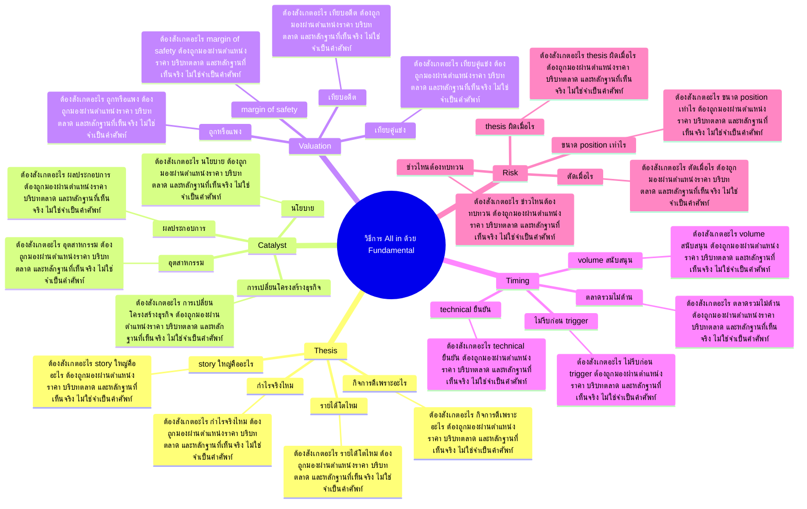

# Mind Map: วิธีการ All in ด้วย Fundamental

## Central Idea
All in ที่ดีไม่ใช่ความกล้า แต่คือ conviction ที่มี thesis, catalyst, timing และ invalidation ครบ

## Learning Context
- Phase: สร้าง conviction
- Category: Fundamental

## Learning Goals
- เข้าใจว่า conviction ต่างจากความมั่นใจลอย ๆ
- เชื่อมงบ กิจการ catalyst และ timing
- กำหนด invalidation point ของ thesis

## Keywords To Remember
fundamental, day, valuation, บาท, minds, iphone, ate, นะครับ, เนี่ย, model, all in, พื้นฐาน

## Big Branches + Deep Branches
### Thesis
- ภาพรวม: กิ่งนี้เชื่อมกับบทเรียนหลักเพราะ Thesis เป็นตัวแปลงความรู้ให้กลายเป็นการตัดสินใจ โดยเฉพาะเรื่อง กิจการดีเพราะอะไร, รายได้โตไหม, กำไรจริงไหม
- กิจการดีเพราะอะไร
  - ต้องสังเกตอะไร: กิจการดีเพราะอะไร ต้องถูกมองผ่านตำแหน่งราคา บริบทตลาด และหลักฐานที่เห็นจริง ไม่ใช่จำเป็นคำศัพท์
  - ใช้ตอนไหน: ใช้ กิจการดีเพราะอะไร เพื่อช่วยตัดสินใจว่าแผนในกิ่ง Thesis ควรเดินต่อ รอ ย่อขนาด หรือยกเลิก
  - ถ้าผิดต้องทำอะไร: ถ้าหลักฐานไม่ยืนยัน กิจการดีเพราะอะไร ให้ลดความมั่นใจทันที และกลับไปถามจุดผิดทางของแผน
- รายได้โตไหม
  - ต้องสังเกตอะไร: รายได้โตไหม ต้องถูกมองผ่านตำแหน่งราคา บริบทตลาด และหลักฐานที่เห็นจริง ไม่ใช่จำเป็นคำศัพท์
  - ใช้ตอนไหน: ใช้ รายได้โตไหม เพื่อช่วยตัดสินใจว่าแผนในกิ่ง Thesis ควรเดินต่อ รอ ย่อขนาด หรือยกเลิก
  - ถ้าผิดต้องทำอะไร: ถ้าหลักฐานไม่ยืนยัน รายได้โตไหม ให้ลดความมั่นใจทันที และกลับไปถามจุดผิดทางของแผน
- กำไรจริงไหม
  - ต้องสังเกตอะไร: กำไรจริงไหม ต้องถูกมองผ่านตำแหน่งราคา บริบทตลาด และหลักฐานที่เห็นจริง ไม่ใช่จำเป็นคำศัพท์
  - ใช้ตอนไหน: ใช้ กำไรจริงไหม เพื่อช่วยตัดสินใจว่าแผนในกิ่ง Thesis ควรเดินต่อ รอ ย่อขนาด หรือยกเลิก
  - ถ้าผิดต้องทำอะไร: ถ้าหลักฐานไม่ยืนยัน กำไรจริงไหม ให้ลดความมั่นใจทันที และกลับไปถามจุดผิดทางของแผน
- story ใหญ่คืออะไร
  - ต้องสังเกตอะไร: story ใหญ่คืออะไร ต้องถูกมองผ่านตำแหน่งราคา บริบทตลาด และหลักฐานที่เห็นจริง ไม่ใช่จำเป็นคำศัพท์
  - ใช้ตอนไหน: ใช้ story ใหญ่คืออะไร เพื่อช่วยตัดสินใจว่าแผนในกิ่ง Thesis ควรเดินต่อ รอ ย่อขนาด หรือยกเลิก
  - ถ้าผิดต้องทำอะไร: ถ้าหลักฐานไม่ยืนยัน story ใหญ่คืออะไร ให้ลดความมั่นใจทันที และกลับไปถามจุดผิดทางของแผน

### Catalyst
- ภาพรวม: กิ่งนี้เชื่อมกับบทเรียนหลักเพราะ Catalyst เป็นตัวแปลงความรู้ให้กลายเป็นการตัดสินใจ โดยเฉพาะเรื่อง ผลประกอบการ, อุตสาหกรรม, นโยบาย
- ผลประกอบการ
  - ต้องสังเกตอะไร: ผลประกอบการ ต้องถูกมองผ่านตำแหน่งราคา บริบทตลาด และหลักฐานที่เห็นจริง ไม่ใช่จำเป็นคำศัพท์
  - ใช้ตอนไหน: ใช้ ผลประกอบการ เพื่อช่วยตัดสินใจว่าแผนในกิ่ง Catalyst ควรเดินต่อ รอ ย่อขนาด หรือยกเลิก
  - ถ้าผิดต้องทำอะไร: ถ้าหลักฐานไม่ยืนยัน ผลประกอบการ ให้ลดความมั่นใจทันที และกลับไปถามจุดผิดทางของแผน
- อุตสาหกรรม
  - ต้องสังเกตอะไร: อุตสาหกรรม ต้องถูกมองผ่านตำแหน่งราคา บริบทตลาด และหลักฐานที่เห็นจริง ไม่ใช่จำเป็นคำศัพท์
  - ใช้ตอนไหน: ใช้ อุตสาหกรรม เพื่อช่วยตัดสินใจว่าแผนในกิ่ง Catalyst ควรเดินต่อ รอ ย่อขนาด หรือยกเลิก
  - ถ้าผิดต้องทำอะไร: ถ้าหลักฐานไม่ยืนยัน อุตสาหกรรม ให้ลดความมั่นใจทันที และกลับไปถามจุดผิดทางของแผน
- นโยบาย
  - ต้องสังเกตอะไร: นโยบาย ต้องถูกมองผ่านตำแหน่งราคา บริบทตลาด และหลักฐานที่เห็นจริง ไม่ใช่จำเป็นคำศัพท์
  - ใช้ตอนไหน: ใช้ นโยบาย เพื่อช่วยตัดสินใจว่าแผนในกิ่ง Catalyst ควรเดินต่อ รอ ย่อขนาด หรือยกเลิก
  - ถ้าผิดต้องทำอะไร: ถ้าหลักฐานไม่ยืนยัน นโยบาย ให้ลดความมั่นใจทันที และกลับไปถามจุดผิดทางของแผน
- การเปลี่ยนโครงสร้างธุรกิจ
  - ต้องสังเกตอะไร: การเปลี่ยนโครงสร้างธุรกิจ ต้องถูกมองผ่านตำแหน่งราคา บริบทตลาด และหลักฐานที่เห็นจริง ไม่ใช่จำเป็นคำศัพท์
  - ใช้ตอนไหน: ใช้ การเปลี่ยนโครงสร้างธุรกิจ เพื่อช่วยตัดสินใจว่าแผนในกิ่ง Catalyst ควรเดินต่อ รอ ย่อขนาด หรือยกเลิก
  - ถ้าผิดต้องทำอะไร: ถ้าหลักฐานไม่ยืนยัน การเปลี่ยนโครงสร้างธุรกิจ ให้ลดความมั่นใจทันที และกลับไปถามจุดผิดทางของแผน

### Valuation
- ภาพรวม: กิ่งนี้เชื่อมกับบทเรียนหลักเพราะ Valuation เป็นตัวแปลงความรู้ให้กลายเป็นการตัดสินใจ โดยเฉพาะเรื่อง ถูกหรือแพง, เทียบอดีต, เทียบคู่แข่ง
- ถูกหรือแพง
  - ต้องสังเกตอะไร: ถูกหรือแพง ต้องถูกมองผ่านตำแหน่งราคา บริบทตลาด และหลักฐานที่เห็นจริง ไม่ใช่จำเป็นคำศัพท์
  - ใช้ตอนไหน: ใช้ ถูกหรือแพง เพื่อช่วยตัดสินใจว่าแผนในกิ่ง Valuation ควรเดินต่อ รอ ย่อขนาด หรือยกเลิก
  - ถ้าผิดต้องทำอะไร: ถ้าหลักฐานไม่ยืนยัน ถูกหรือแพง ให้ลดความมั่นใจทันที และกลับไปถามจุดผิดทางของแผน
- เทียบอดีต
  - ต้องสังเกตอะไร: เทียบอดีต ต้องถูกมองผ่านตำแหน่งราคา บริบทตลาด และหลักฐานที่เห็นจริง ไม่ใช่จำเป็นคำศัพท์
  - ใช้ตอนไหน: ใช้ เทียบอดีต เพื่อช่วยตัดสินใจว่าแผนในกิ่ง Valuation ควรเดินต่อ รอ ย่อขนาด หรือยกเลิก
  - ถ้าผิดต้องทำอะไร: ถ้าหลักฐานไม่ยืนยัน เทียบอดีต ให้ลดความมั่นใจทันที และกลับไปถามจุดผิดทางของแผน
- เทียบคู่แข่ง
  - ต้องสังเกตอะไร: เทียบคู่แข่ง ต้องถูกมองผ่านตำแหน่งราคา บริบทตลาด และหลักฐานที่เห็นจริง ไม่ใช่จำเป็นคำศัพท์
  - ใช้ตอนไหน: ใช้ เทียบคู่แข่ง เพื่อช่วยตัดสินใจว่าแผนในกิ่ง Valuation ควรเดินต่อ รอ ย่อขนาด หรือยกเลิก
  - ถ้าผิดต้องทำอะไร: ถ้าหลักฐานไม่ยืนยัน เทียบคู่แข่ง ให้ลดความมั่นใจทันที และกลับไปถามจุดผิดทางของแผน
- margin of safety
  - ต้องสังเกตอะไร: margin of safety ต้องถูกมองผ่านตำแหน่งราคา บริบทตลาด และหลักฐานที่เห็นจริง ไม่ใช่จำเป็นคำศัพท์
  - ใช้ตอนไหน: ใช้ margin of safety เพื่อช่วยตัดสินใจว่าแผนในกิ่ง Valuation ควรเดินต่อ รอ ย่อขนาด หรือยกเลิก
  - ถ้าผิดต้องทำอะไร: ถ้าหลักฐานไม่ยืนยัน margin of safety ให้ลดความมั่นใจทันที และกลับไปถามจุดผิดทางของแผน

### Timing
- ภาพรวม: กิ่งนี้เชื่อมกับบทเรียนหลักเพราะ Timing เป็นตัวแปลงความรู้ให้กลายเป็นการตัดสินใจ โดยเฉพาะเรื่อง technical ยืนยัน, volume สนับสนุน, ตลาดรวมไม่ต้าน
- technical ยืนยัน
  - ต้องสังเกตอะไร: technical ยืนยัน ต้องถูกมองผ่านตำแหน่งราคา บริบทตลาด และหลักฐานที่เห็นจริง ไม่ใช่จำเป็นคำศัพท์
  - ใช้ตอนไหน: ใช้ technical ยืนยัน เพื่อช่วยตัดสินใจว่าแผนในกิ่ง Timing ควรเดินต่อ รอ ย่อขนาด หรือยกเลิก
  - ถ้าผิดต้องทำอะไร: ถ้าหลักฐานไม่ยืนยัน technical ยืนยัน ให้ลดความมั่นใจทันที และกลับไปถามจุดผิดทางของแผน
- volume สนับสนุน
  - ต้องสังเกตอะไร: volume สนับสนุน ต้องถูกมองผ่านตำแหน่งราคา บริบทตลาด และหลักฐานที่เห็นจริง ไม่ใช่จำเป็นคำศัพท์
  - ใช้ตอนไหน: ใช้ volume สนับสนุน เพื่อช่วยตัดสินใจว่าแผนในกิ่ง Timing ควรเดินต่อ รอ ย่อขนาด หรือยกเลิก
  - ถ้าผิดต้องทำอะไร: ถ้าหลักฐานไม่ยืนยัน volume สนับสนุน ให้ลดความมั่นใจทันที และกลับไปถามจุดผิดทางของแผน
- ตลาดรวมไม่ต้าน
  - ต้องสังเกตอะไร: ตลาดรวมไม่ต้าน ต้องถูกมองผ่านตำแหน่งราคา บริบทตลาด และหลักฐานที่เห็นจริง ไม่ใช่จำเป็นคำศัพท์
  - ใช้ตอนไหน: ใช้ ตลาดรวมไม่ต้าน เพื่อช่วยตัดสินใจว่าแผนในกิ่ง Timing ควรเดินต่อ รอ ย่อขนาด หรือยกเลิก
  - ถ้าผิดต้องทำอะไร: ถ้าหลักฐานไม่ยืนยัน ตลาดรวมไม่ต้าน ให้ลดความมั่นใจทันที และกลับไปถามจุดผิดทางของแผน
- ไม่รีบก่อน trigger
  - ต้องสังเกตอะไร: ไม่รีบก่อน trigger ต้องถูกมองผ่านตำแหน่งราคา บริบทตลาด และหลักฐานที่เห็นจริง ไม่ใช่จำเป็นคำศัพท์
  - ใช้ตอนไหน: ใช้ ไม่รีบก่อน trigger เพื่อช่วยตัดสินใจว่าแผนในกิ่ง Timing ควรเดินต่อ รอ ย่อขนาด หรือยกเลิก
  - ถ้าผิดต้องทำอะไร: ถ้าหลักฐานไม่ยืนยัน ไม่รีบก่อน trigger ให้ลดความมั่นใจทันที และกลับไปถามจุดผิดทางของแผน

### Risk
- ภาพรวม: กิ่งนี้เชื่อมกับบทเรียนหลักเพราะ Risk เป็นตัวแปลงความรู้ให้กลายเป็นการตัดสินใจ โดยเฉพาะเรื่อง thesis ผิดเมื่อไร, ตัดเมื่อไร, ขนาด position เท่าไร
- thesis ผิดเมื่อไร
  - ต้องสังเกตอะไร: thesis ผิดเมื่อไร ต้องถูกมองผ่านตำแหน่งราคา บริบทตลาด และหลักฐานที่เห็นจริง ไม่ใช่จำเป็นคำศัพท์
  - ใช้ตอนไหน: ใช้ thesis ผิดเมื่อไร เพื่อช่วยตัดสินใจว่าแผนในกิ่ง Risk ควรเดินต่อ รอ ย่อขนาด หรือยกเลิก
  - ถ้าผิดต้องทำอะไร: ถ้าหลักฐานไม่ยืนยัน thesis ผิดเมื่อไร ให้ลดความมั่นใจทันที และกลับไปถามจุดผิดทางของแผน
- ตัดเมื่อไร
  - ต้องสังเกตอะไร: ตัดเมื่อไร ต้องถูกมองผ่านตำแหน่งราคา บริบทตลาด และหลักฐานที่เห็นจริง ไม่ใช่จำเป็นคำศัพท์
  - ใช้ตอนไหน: ใช้ ตัดเมื่อไร เพื่อช่วยตัดสินใจว่าแผนในกิ่ง Risk ควรเดินต่อ รอ ย่อขนาด หรือยกเลิก
  - ถ้าผิดต้องทำอะไร: ถ้าหลักฐานไม่ยืนยัน ตัดเมื่อไร ให้ลดความมั่นใจทันที และกลับไปถามจุดผิดทางของแผน
- ขนาด position เท่าไร
  - ต้องสังเกตอะไร: ขนาด position เท่าไร ต้องถูกมองผ่านตำแหน่งราคา บริบทตลาด และหลักฐานที่เห็นจริง ไม่ใช่จำเป็นคำศัพท์
  - ใช้ตอนไหน: ใช้ ขนาด position เท่าไร เพื่อช่วยตัดสินใจว่าแผนในกิ่ง Risk ควรเดินต่อ รอ ย่อขนาด หรือยกเลิก
  - ถ้าผิดต้องทำอะไร: ถ้าหลักฐานไม่ยืนยัน ขนาด position เท่าไร ให้ลดความมั่นใจทันที และกลับไปถามจุดผิดทางของแผน
- ข่าวไหนต้องทบทวน
  - ต้องสังเกตอะไร: ข่าวไหนต้องทบทวน ต้องถูกมองผ่านตำแหน่งราคา บริบทตลาด และหลักฐานที่เห็นจริง ไม่ใช่จำเป็นคำศัพท์
  - ใช้ตอนไหน: ใช้ ข่าวไหนต้องทบทวน เพื่อช่วยตัดสินใจว่าแผนในกิ่ง Risk ควรเดินต่อ รอ ย่อขนาด หรือยกเลิก
  - ถ้าผิดต้องทำอะไร: ถ้าหลักฐานไม่ยืนยัน ข่าวไหนต้องทบทวน ให้ลดความมั่นใจทันที และกลับไปถามจุดผิดทางของแผน

## Transcript Signals
> ต้องนะครับก็คือผมมองว่าเดี๋ยวรับหนังสือ ไปด้วยนะตอนจบนะครับคือเนี่ยแหละคือความ เข้าใจในเรื่องธุรกิจคือคุณต้องเข้าใจตรง นี้ก่อนนะครับว่าเฮ้ยมันจำเป็นต้องใช้ หรือไม่ต้องใช้อย่างถ้าสป้ตอนเนี้ยถ้าเรา ดูงบนะเป้ตอนเนี้ย เนี่ยมันมีมันมีโอกาสเติบโตได้จริงนะครับ...

> กำไรขาดทุน 2 เอ่องบงบแสดงฐานะการเงิน หรือว่างบงูดุลแล้วก็ 3 งบกระแสเงินสดเรา ก็ไปดูที่งบกระแสเงินสดในงบกระแสเงินสด เนี่ยมันจะมีมันจะมี 3 หัวข้อหลักๆคือ เงินสดจากกิจกรรมดำเนินงานกิจกรรมจัดหา เงินกิจกรรมลงทุนในหัวข้อแรกเนี่ยจาก...

> ที่ไม่ใช่รายได้หลักเป็นรายได้พิเศษดูได้ ในงบการเงินได้ครับดูในโน้ตก็ได้เนาะใน โน๊ตก็มีบอกหรือว่าจะดูในมันจะเป็นรายได้ ทางอื่นน่ะเดี๋ยวให้พี่หญิงชัยสอนก็ได้ เนี่ยพี่ชัยเค้ามีเปิดคอร์สผมเชียร์เลย เดี๋พี่หญิงชัยเจะเปิดคอร์สนะครับคอร์ส ชื่ออะไรนะ Super VI >>...

## Decision Rules
- Thesis: จะใช้กิ่งนี้ได้เมื่อเห็น กิจการดีเพราะอะไร และ รายได้โตไหม พร้อมกัน ถ้าเจอเงื่อนไขตรงข้ามกับ story ใหญ่คืออะไร ให้ลดขนาดหรือหยุด
- Catalyst: จะใช้กิ่งนี้ได้เมื่อเห็น ผลประกอบการ และ อุตสาหกรรม พร้อมกัน ถ้าเจอเงื่อนไขตรงข้ามกับ การเปลี่ยนโครงสร้างธุรกิจ ให้ลดขนาดหรือหยุด
- Valuation: จะใช้กิ่งนี้ได้เมื่อเห็น ถูกหรือแพง และ เทียบอดีต พร้อมกัน ถ้าเจอเงื่อนไขตรงข้ามกับ margin of safety ให้ลดขนาดหรือหยุด
- Timing: จะใช้กิ่งนี้ได้เมื่อเห็น technical ยืนยัน และ volume สนับสนุน พร้อมกัน ถ้าเจอเงื่อนไขตรงข้ามกับ ไม่รีบก่อน trigger ให้ลดขนาดหรือหยุด
- Risk: จะใช้กิ่งนี้ได้เมื่อเห็น thesis ผิดเมื่อไร และ ตัดเมื่อไร พร้อมกัน ถ้าเจอเงื่อนไขตรงข้ามกับ ข่าวไหนต้องทบทวน ให้ลดขนาดหรือหยุด

## Common Mistakes
- จำชื่อบทได้ แต่ไม่รู้ว่า Thesis ต้องเปลี่ยนพฤติกรรมการเทรดตรงไหน
- เห็นสัญญาณหนึ่งอย่างแล้วรีบสรุป ทั้งที่ยังไม่ได้เช็กบริบทและหลักฐานประกอบ
- วางแผนตอนใจเย็น แต่พอราคาเคลื่อนไหวจริงกลับเปลี่ยนกฎตามอารมณ์
- สนใจ Risk แค่ตอนอยากเข้า แต่ไม่ใช้เป็นเงื่อนไขตอนต้องออกหรือหยุด

## Practice Checklist
- ทวนเป้าหมายบทนี้ก่อนเริ่ม: เข้าใจว่า conviction ต่างจากความมั่นใจลอย ๆ
- เปิดกราฟหรือกรณีศึกษาจริง 1 ตัว แล้วระบุว่าเกี่ยวกับกิ่ง 'Thesis' ตรงไหน
- เขียนก่อนเข้าว่า thesis คืออะไร หลักฐานคืออะไร และถ้าผิดจะยอมรับตรงไหน
- แยกสิ่งที่เห็นจริงออกจากสิ่งที่อยากให้เกิด แล้วให้คะแนนความมั่นใจ 1-5
- หลังจบเคส ให้บันทึกว่าแพ้/ชนะเพราะระบบ หรือเพราะอารมณ์

## Final Destination
กล้าเพิ่มน้ำหนักเฉพาะเมื่อรู้ทั้งเหตุผลที่จะชนะและเงื่อนไขที่ต้องยอมรับว่าผิด

## Questions for Patiphan
1. กิ่งไหนคือแก่นที่สุดของบทนี้
2. กิ่งไหนเกี่ยวกับจุดอ่อนของ Patiphan มากที่สุด
3. ถ้าจะเอาไปใช้กับกราฟจริง ต้องเห็นหลักฐานอะไร
4. ถ้าทำผิด บทนี้เตือนให้หยุดตรงไหน
5. ปลายทางของบทนี้จะเข้าไปอยู่ในระบบเทรดส่วนไหน
