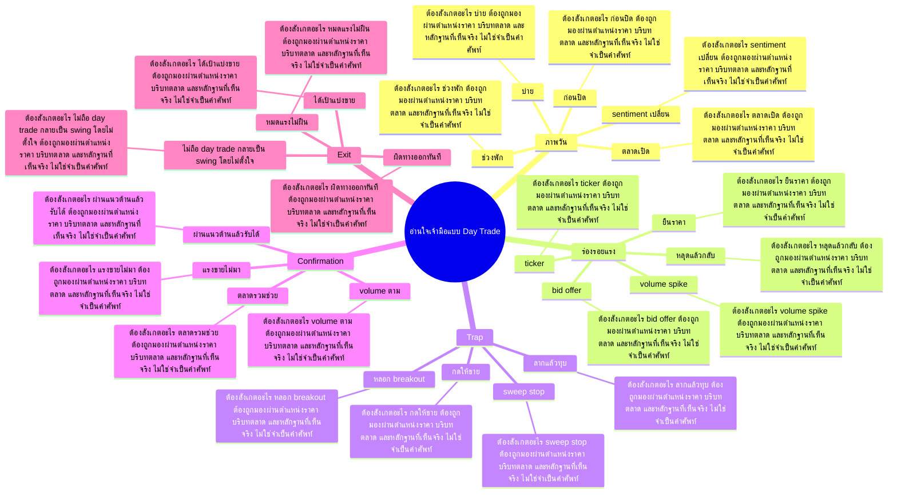

# Mind Map: อ่านใจเจ้ามือแบบ Day Trade

## Central Idea
การอ่านเจ้ามือคืออ่านร่องรอย supply demand และ trap ในวัน ไม่ใช่เดาใจคน

## Learning Context
- Phase: อ่านพฤติกรรมรายวัน
- Category: Execution

## Learning Goals
- อ่านแรงซื้อขายในวันผ่านราคาและ volume
- แยก breakout จริงออกจากการหลอก
- ตั้งแผน day trade ที่มีจุดผิดชัด

## Keywords To Remember
time, high, day, out, all, บาท, ล้าน, vol, ipo, sideway, stop, low

## Big Branches + Deep Branches
### ภาพวัน
- ภาพรวม: กิ่งนี้เชื่อมกับบทเรียนหลักเพราะ ภาพวัน เป็นตัวแปลงความรู้ให้กลายเป็นการตัดสินใจ โดยเฉพาะเรื่อง ตลาดเปิด, ช่วงพัก, บ่าย
- ตลาดเปิด
  - ต้องสังเกตอะไร: ตลาดเปิด ต้องถูกมองผ่านตำแหน่งราคา บริบทตลาด และหลักฐานที่เห็นจริง ไม่ใช่จำเป็นคำศัพท์
  - ใช้ตอนไหน: ใช้ ตลาดเปิด เพื่อช่วยตัดสินใจว่าแผนในกิ่ง ภาพวัน ควรเดินต่อ รอ ย่อขนาด หรือยกเลิก
  - ถ้าผิดต้องทำอะไร: ถ้าหลักฐานไม่ยืนยัน ตลาดเปิด ให้ลดความมั่นใจทันที และกลับไปถามจุดผิดทางของแผน
- ช่วงพัก
  - ต้องสังเกตอะไร: ช่วงพัก ต้องถูกมองผ่านตำแหน่งราคา บริบทตลาด และหลักฐานที่เห็นจริง ไม่ใช่จำเป็นคำศัพท์
  - ใช้ตอนไหน: ใช้ ช่วงพัก เพื่อช่วยตัดสินใจว่าแผนในกิ่ง ภาพวัน ควรเดินต่อ รอ ย่อขนาด หรือยกเลิก
  - ถ้าผิดต้องทำอะไร: ถ้าหลักฐานไม่ยืนยัน ช่วงพัก ให้ลดความมั่นใจทันที และกลับไปถามจุดผิดทางของแผน
- บ่าย
  - ต้องสังเกตอะไร: บ่าย ต้องถูกมองผ่านตำแหน่งราคา บริบทตลาด และหลักฐานที่เห็นจริง ไม่ใช่จำเป็นคำศัพท์
  - ใช้ตอนไหน: ใช้ บ่าย เพื่อช่วยตัดสินใจว่าแผนในกิ่ง ภาพวัน ควรเดินต่อ รอ ย่อขนาด หรือยกเลิก
  - ถ้าผิดต้องทำอะไร: ถ้าหลักฐานไม่ยืนยัน บ่าย ให้ลดความมั่นใจทันที และกลับไปถามจุดผิดทางของแผน
- ก่อนปิด
  - ต้องสังเกตอะไร: ก่อนปิด ต้องถูกมองผ่านตำแหน่งราคา บริบทตลาด และหลักฐานที่เห็นจริง ไม่ใช่จำเป็นคำศัพท์
  - ใช้ตอนไหน: ใช้ ก่อนปิด เพื่อช่วยตัดสินใจว่าแผนในกิ่ง ภาพวัน ควรเดินต่อ รอ ย่อขนาด หรือยกเลิก
  - ถ้าผิดต้องทำอะไร: ถ้าหลักฐานไม่ยืนยัน ก่อนปิด ให้ลดความมั่นใจทันที และกลับไปถามจุดผิดทางของแผน
- sentiment เปลี่ยน
  - ต้องสังเกตอะไร: sentiment เปลี่ยน ต้องถูกมองผ่านตำแหน่งราคา บริบทตลาด และหลักฐานที่เห็นจริง ไม่ใช่จำเป็นคำศัพท์
  - ใช้ตอนไหน: ใช้ sentiment เปลี่ยน เพื่อช่วยตัดสินใจว่าแผนในกิ่ง ภาพวัน ควรเดินต่อ รอ ย่อขนาด หรือยกเลิก
  - ถ้าผิดต้องทำอะไร: ถ้าหลักฐานไม่ยืนยัน sentiment เปลี่ยน ให้ลดความมั่นใจทันที และกลับไปถามจุดผิดทางของแผน

### ร่องรอยแรง
- ภาพรวม: กิ่งนี้เชื่อมกับบทเรียนหลักเพราะ ร่องรอยแรง เป็นตัวแปลงความรู้ให้กลายเป็นการตัดสินใจ โดยเฉพาะเรื่อง volume spike, bid offer, ticker
- volume spike
  - ต้องสังเกตอะไร: volume spike ต้องถูกมองผ่านตำแหน่งราคา บริบทตลาด และหลักฐานที่เห็นจริง ไม่ใช่จำเป็นคำศัพท์
  - ใช้ตอนไหน: ใช้ volume spike เพื่อช่วยตัดสินใจว่าแผนในกิ่ง ร่องรอยแรง ควรเดินต่อ รอ ย่อขนาด หรือยกเลิก
  - ถ้าผิดต้องทำอะไร: ถ้าหลักฐานไม่ยืนยัน volume spike ให้ลดความมั่นใจทันที และกลับไปถามจุดผิดทางของแผน
- bid offer
  - ต้องสังเกตอะไร: bid offer ต้องถูกมองผ่านตำแหน่งราคา บริบทตลาด และหลักฐานที่เห็นจริง ไม่ใช่จำเป็นคำศัพท์
  - ใช้ตอนไหน: ใช้ bid offer เพื่อช่วยตัดสินใจว่าแผนในกิ่ง ร่องรอยแรง ควรเดินต่อ รอ ย่อขนาด หรือยกเลิก
  - ถ้าผิดต้องทำอะไร: ถ้าหลักฐานไม่ยืนยัน bid offer ให้ลดความมั่นใจทันที และกลับไปถามจุดผิดทางของแผน
- ticker
  - ต้องสังเกตอะไร: ticker ต้องถูกมองผ่านตำแหน่งราคา บริบทตลาด และหลักฐานที่เห็นจริง ไม่ใช่จำเป็นคำศัพท์
  - ใช้ตอนไหน: ใช้ ticker เพื่อช่วยตัดสินใจว่าแผนในกิ่ง ร่องรอยแรง ควรเดินต่อ รอ ย่อขนาด หรือยกเลิก
  - ถ้าผิดต้องทำอะไร: ถ้าหลักฐานไม่ยืนยัน ticker ให้ลดความมั่นใจทันที และกลับไปถามจุดผิดทางของแผน
- ยืนราคา
  - ต้องสังเกตอะไร: ยืนราคา ต้องถูกมองผ่านตำแหน่งราคา บริบทตลาด และหลักฐานที่เห็นจริง ไม่ใช่จำเป็นคำศัพท์
  - ใช้ตอนไหน: ใช้ ยืนราคา เพื่อช่วยตัดสินใจว่าแผนในกิ่ง ร่องรอยแรง ควรเดินต่อ รอ ย่อขนาด หรือยกเลิก
  - ถ้าผิดต้องทำอะไร: ถ้าหลักฐานไม่ยืนยัน ยืนราคา ให้ลดความมั่นใจทันที และกลับไปถามจุดผิดทางของแผน
- หลุดแล้วกลับ
  - ต้องสังเกตอะไร: หลุดแล้วกลับ ต้องถูกมองผ่านตำแหน่งราคา บริบทตลาด และหลักฐานที่เห็นจริง ไม่ใช่จำเป็นคำศัพท์
  - ใช้ตอนไหน: ใช้ หลุดแล้วกลับ เพื่อช่วยตัดสินใจว่าแผนในกิ่ง ร่องรอยแรง ควรเดินต่อ รอ ย่อขนาด หรือยกเลิก
  - ถ้าผิดต้องทำอะไร: ถ้าหลักฐานไม่ยืนยัน หลุดแล้วกลับ ให้ลดความมั่นใจทันที และกลับไปถามจุดผิดทางของแผน

### Trap
- ภาพรวม: กิ่งนี้เชื่อมกับบทเรียนหลักเพราะ Trap เป็นตัวแปลงความรู้ให้กลายเป็นการตัดสินใจ โดยเฉพาะเรื่อง หลอก breakout, sweep stop, ลากแล้วทุบ
- หลอก breakout
  - ต้องสังเกตอะไร: หลอก breakout ต้องถูกมองผ่านตำแหน่งราคา บริบทตลาด และหลักฐานที่เห็นจริง ไม่ใช่จำเป็นคำศัพท์
  - ใช้ตอนไหน: ใช้ หลอก breakout เพื่อช่วยตัดสินใจว่าแผนในกิ่ง Trap ควรเดินต่อ รอ ย่อขนาด หรือยกเลิก
  - ถ้าผิดต้องทำอะไร: ถ้าหลักฐานไม่ยืนยัน หลอก breakout ให้ลดความมั่นใจทันที และกลับไปถามจุดผิดทางของแผน
- sweep stop
  - ต้องสังเกตอะไร: sweep stop ต้องถูกมองผ่านตำแหน่งราคา บริบทตลาด และหลักฐานที่เห็นจริง ไม่ใช่จำเป็นคำศัพท์
  - ใช้ตอนไหน: ใช้ sweep stop เพื่อช่วยตัดสินใจว่าแผนในกิ่ง Trap ควรเดินต่อ รอ ย่อขนาด หรือยกเลิก
  - ถ้าผิดต้องทำอะไร: ถ้าหลักฐานไม่ยืนยัน sweep stop ให้ลดความมั่นใจทันที และกลับไปถามจุดผิดทางของแผน
- ลากแล้วทุบ
  - ต้องสังเกตอะไร: ลากแล้วทุบ ต้องถูกมองผ่านตำแหน่งราคา บริบทตลาด และหลักฐานที่เห็นจริง ไม่ใช่จำเป็นคำศัพท์
  - ใช้ตอนไหน: ใช้ ลากแล้วทุบ เพื่อช่วยตัดสินใจว่าแผนในกิ่ง Trap ควรเดินต่อ รอ ย่อขนาด หรือยกเลิก
  - ถ้าผิดต้องทำอะไร: ถ้าหลักฐานไม่ยืนยัน ลากแล้วทุบ ให้ลดความมั่นใจทันที และกลับไปถามจุดผิดทางของแผน
- กดให้ขาย
  - ต้องสังเกตอะไร: กดให้ขาย ต้องถูกมองผ่านตำแหน่งราคา บริบทตลาด และหลักฐานที่เห็นจริง ไม่ใช่จำเป็นคำศัพท์
  - ใช้ตอนไหน: ใช้ กดให้ขาย เพื่อช่วยตัดสินใจว่าแผนในกิ่ง Trap ควรเดินต่อ รอ ย่อขนาด หรือยกเลิก
  - ถ้าผิดต้องทำอะไร: ถ้าหลักฐานไม่ยืนยัน กดให้ขาย ให้ลดความมั่นใจทันที และกลับไปถามจุดผิดทางของแผน

### Confirmation
- ภาพรวม: กิ่งนี้เชื่อมกับบทเรียนหลักเพราะ Confirmation เป็นตัวแปลงความรู้ให้กลายเป็นการตัดสินใจ โดยเฉพาะเรื่อง ผ่านแนวต้านแล้วรับได้, volume ตาม, แรงขายไม่มา
- ผ่านแนวต้านแล้วรับได้
  - ต้องสังเกตอะไร: ผ่านแนวต้านแล้วรับได้ ต้องถูกมองผ่านตำแหน่งราคา บริบทตลาด และหลักฐานที่เห็นจริง ไม่ใช่จำเป็นคำศัพท์
  - ใช้ตอนไหน: ใช้ ผ่านแนวต้านแล้วรับได้ เพื่อช่วยตัดสินใจว่าแผนในกิ่ง Confirmation ควรเดินต่อ รอ ย่อขนาด หรือยกเลิก
  - ถ้าผิดต้องทำอะไร: ถ้าหลักฐานไม่ยืนยัน ผ่านแนวต้านแล้วรับได้ ให้ลดความมั่นใจทันที และกลับไปถามจุดผิดทางของแผน
- volume ตาม
  - ต้องสังเกตอะไร: volume ตาม ต้องถูกมองผ่านตำแหน่งราคา บริบทตลาด และหลักฐานที่เห็นจริง ไม่ใช่จำเป็นคำศัพท์
  - ใช้ตอนไหน: ใช้ volume ตาม เพื่อช่วยตัดสินใจว่าแผนในกิ่ง Confirmation ควรเดินต่อ รอ ย่อขนาด หรือยกเลิก
  - ถ้าผิดต้องทำอะไร: ถ้าหลักฐานไม่ยืนยัน volume ตาม ให้ลดความมั่นใจทันที และกลับไปถามจุดผิดทางของแผน
- แรงขายไม่มา
  - ต้องสังเกตอะไร: แรงขายไม่มา ต้องถูกมองผ่านตำแหน่งราคา บริบทตลาด และหลักฐานที่เห็นจริง ไม่ใช่จำเป็นคำศัพท์
  - ใช้ตอนไหน: ใช้ แรงขายไม่มา เพื่อช่วยตัดสินใจว่าแผนในกิ่ง Confirmation ควรเดินต่อ รอ ย่อขนาด หรือยกเลิก
  - ถ้าผิดต้องทำอะไร: ถ้าหลักฐานไม่ยืนยัน แรงขายไม่มา ให้ลดความมั่นใจทันที และกลับไปถามจุดผิดทางของแผน
- ตลาดรวมช่วย
  - ต้องสังเกตอะไร: ตลาดรวมช่วย ต้องถูกมองผ่านตำแหน่งราคา บริบทตลาด และหลักฐานที่เห็นจริง ไม่ใช่จำเป็นคำศัพท์
  - ใช้ตอนไหน: ใช้ ตลาดรวมช่วย เพื่อช่วยตัดสินใจว่าแผนในกิ่ง Confirmation ควรเดินต่อ รอ ย่อขนาด หรือยกเลิก
  - ถ้าผิดต้องทำอะไร: ถ้าหลักฐานไม่ยืนยัน ตลาดรวมช่วย ให้ลดความมั่นใจทันที และกลับไปถามจุดผิดทางของแผน

### Exit
- ภาพรวม: กิ่งนี้เชื่อมกับบทเรียนหลักเพราะ Exit เป็นตัวแปลงความรู้ให้กลายเป็นการตัดสินใจ โดยเฉพาะเรื่อง ผิดทางออกทันที, ได้เป้าแบ่งขาย, หมดแรงไม่ฝืน
- ผิดทางออกทันที
  - ต้องสังเกตอะไร: ผิดทางออกทันที ต้องถูกมองผ่านตำแหน่งราคา บริบทตลาด และหลักฐานที่เห็นจริง ไม่ใช่จำเป็นคำศัพท์
  - ใช้ตอนไหน: ใช้ ผิดทางออกทันที เพื่อช่วยตัดสินใจว่าแผนในกิ่ง Exit ควรเดินต่อ รอ ย่อขนาด หรือยกเลิก
  - ถ้าผิดต้องทำอะไร: ถ้าหลักฐานไม่ยืนยัน ผิดทางออกทันที ให้ลดความมั่นใจทันที และกลับไปถามจุดผิดทางของแผน
- ได้เป้าแบ่งขาย
  - ต้องสังเกตอะไร: ได้เป้าแบ่งขาย ต้องถูกมองผ่านตำแหน่งราคา บริบทตลาด และหลักฐานที่เห็นจริง ไม่ใช่จำเป็นคำศัพท์
  - ใช้ตอนไหน: ใช้ ได้เป้าแบ่งขาย เพื่อช่วยตัดสินใจว่าแผนในกิ่ง Exit ควรเดินต่อ รอ ย่อขนาด หรือยกเลิก
  - ถ้าผิดต้องทำอะไร: ถ้าหลักฐานไม่ยืนยัน ได้เป้าแบ่งขาย ให้ลดความมั่นใจทันที และกลับไปถามจุดผิดทางของแผน
- หมดแรงไม่ฝืน
  - ต้องสังเกตอะไร: หมดแรงไม่ฝืน ต้องถูกมองผ่านตำแหน่งราคา บริบทตลาด และหลักฐานที่เห็นจริง ไม่ใช่จำเป็นคำศัพท์
  - ใช้ตอนไหน: ใช้ หมดแรงไม่ฝืน เพื่อช่วยตัดสินใจว่าแผนในกิ่ง Exit ควรเดินต่อ รอ ย่อขนาด หรือยกเลิก
  - ถ้าผิดต้องทำอะไร: ถ้าหลักฐานไม่ยืนยัน หมดแรงไม่ฝืน ให้ลดความมั่นใจทันที และกลับไปถามจุดผิดทางของแผน
- ไม่ถือ day trade กลายเป็น swing โดยไม่ตั้งใจ
  - ต้องสังเกตอะไร: ไม่ถือ day trade กลายเป็น swing โดยไม่ตั้งใจ ต้องถูกมองผ่านตำแหน่งราคา บริบทตลาด และหลักฐานที่เห็นจริง ไม่ใช่จำเป็นคำศัพท์
  - ใช้ตอนไหน: ใช้ ไม่ถือ day trade กลายเป็น swing โดยไม่ตั้งใจ เพื่อช่วยตัดสินใจว่าแผนในกิ่ง Exit ควรเดินต่อ รอ ย่อขนาด หรือยกเลิก
  - ถ้าผิดต้องทำอะไร: ถ้าหลักฐานไม่ยืนยัน ไม่ถือ day trade กลายเป็น swing โดยไม่ตั้งใจ ให้ลดความมั่นใจทันที และกลับไปถามจุดผิดทางของแผน

## Transcript Signals
> แต่มันไม่มีใครรู้นะคือถ้าเราเทรดยังไงก็ ต้องออกอยู่แล้วเจอแท่งนี้คือเบรคใช่มย ทุบหลุดลงมาหลุดลงมาอีกครั้งใครจะอยู่ถูก ป่ะแต่พอเป็นแบบเนี้ยภาพใหญ่อีกครั้งอาจ จะบอกว่าเฮ้ยเหมือนเดิมป่ะเนี่ยไม่ออกดี กว่าไม่ออกดีกว่าสุดท้ายไปไง...

> อย่างเงี้ยกราฟหลอกป่ะ กราฟมันไม่หลอกกราฟมันก็บอกตรงๆว่ามัน หลุดหลุดก็คือหลุดกราฟไม่ได้หลอก แต่คนที่หลอกก็คือคนที่อยู่หลังกราฟไงอ้า หลุดใช่กูก็ดึงกลับไงดึงกลับแล้วถามว่า อ้าวเนี่ยมันหลุดลงไปหลอกมันไม่หลอกเนี่ย พ่ออีกวันนึงมันก็บอกว่ามันก็กลับมาถูก...

> มีมยทางบ้านตอบมาก็ได้นะครับว่าเราเล่น Dayเทดแล้วจริงๆอ่ะเราเล่นหุ้นDayเทดเรา เล่นกับใครเราเล่นกับเจ้ามือหรือเล่นกับ ใครครับ ใครครับใครเราเล่นกับใคร ครับพี่พี่พี่ใช่ป่ะที่ตอบอ่ะคนเลยกับ เจ้ามือ >> นอกจากเจ้ามือเราเล่นกับใครครับDayเทดอ่ะ...

## Decision Rules
- ภาพวัน: จะใช้กิ่งนี้ได้เมื่อเห็น ตลาดเปิด และ ช่วงพัก พร้อมกัน ถ้าเจอเงื่อนไขตรงข้ามกับ sentiment เปลี่ยน ให้ลดขนาดหรือหยุด
- ร่องรอยแรง: จะใช้กิ่งนี้ได้เมื่อเห็น volume spike และ bid offer พร้อมกัน ถ้าเจอเงื่อนไขตรงข้ามกับ หลุดแล้วกลับ ให้ลดขนาดหรือหยุด
- Trap: จะใช้กิ่งนี้ได้เมื่อเห็น หลอก breakout และ sweep stop พร้อมกัน ถ้าเจอเงื่อนไขตรงข้ามกับ กดให้ขาย ให้ลดขนาดหรือหยุด
- Confirmation: จะใช้กิ่งนี้ได้เมื่อเห็น ผ่านแนวต้านแล้วรับได้ และ volume ตาม พร้อมกัน ถ้าเจอเงื่อนไขตรงข้ามกับ ตลาดรวมช่วย ให้ลดขนาดหรือหยุด
- Exit: จะใช้กิ่งนี้ได้เมื่อเห็น ผิดทางออกทันที และ ได้เป้าแบ่งขาย พร้อมกัน ถ้าเจอเงื่อนไขตรงข้ามกับ ไม่ถือ day trade กลายเป็น swing โดยไม่ตั้งใจ ให้ลดขนาดหรือหยุด

## Common Mistakes
- จำชื่อบทได้ แต่ไม่รู้ว่า ภาพวัน ต้องเปลี่ยนพฤติกรรมการเทรดตรงไหน
- เห็นสัญญาณหนึ่งอย่างแล้วรีบสรุป ทั้งที่ยังไม่ได้เช็กบริบทและหลักฐานประกอบ
- วางแผนตอนใจเย็น แต่พอราคาเคลื่อนไหวจริงกลับเปลี่ยนกฎตามอารมณ์
- สนใจ Exit แค่ตอนอยากเข้า แต่ไม่ใช้เป็นเงื่อนไขตอนต้องออกหรือหยุด

## Practice Checklist
- ทวนเป้าหมายบทนี้ก่อนเริ่ม: อ่านแรงซื้อขายในวันผ่านราคาและ volume
- เปิดกราฟหรือกรณีศึกษาจริง 1 ตัว แล้วระบุว่าเกี่ยวกับกิ่ง 'ภาพวัน' ตรงไหน
- เขียนก่อนเข้าว่า thesis คืออะไร หลักฐานคืออะไร และถ้าผิดจะยอมรับตรงไหน
- แยกสิ่งที่เห็นจริงออกจากสิ่งที่อยากให้เกิด แล้วให้คะแนนความมั่นใจ 1-5
- หลังจบเคส ให้บันทึกว่าแพ้/ชนะเพราะระบบ หรือเพราะอารมณ์

## Final Destination
อ่านพฤติกรรมระหว่างวันให้เป็นหลักฐาน เพื่อเลือกเข้าออก ไม่ใช่ปล่อยให้อารมณ์ของแท่งเทียนพาไป

## Questions for Patiphan
1. กิ่งไหนคือแก่นที่สุดของบทนี้
2. กิ่งไหนเกี่ยวกับจุดอ่อนของ Patiphan มากที่สุด
3. ถ้าจะเอาไปใช้กับกราฟจริง ต้องเห็นหลักฐานอะไร
4. ถ้าทำผิด บทนี้เตือนให้หยุดตรงไหน
5. ปลายทางของบทนี้จะเข้าไปอยู่ในระบบเทรดส่วนไหน
