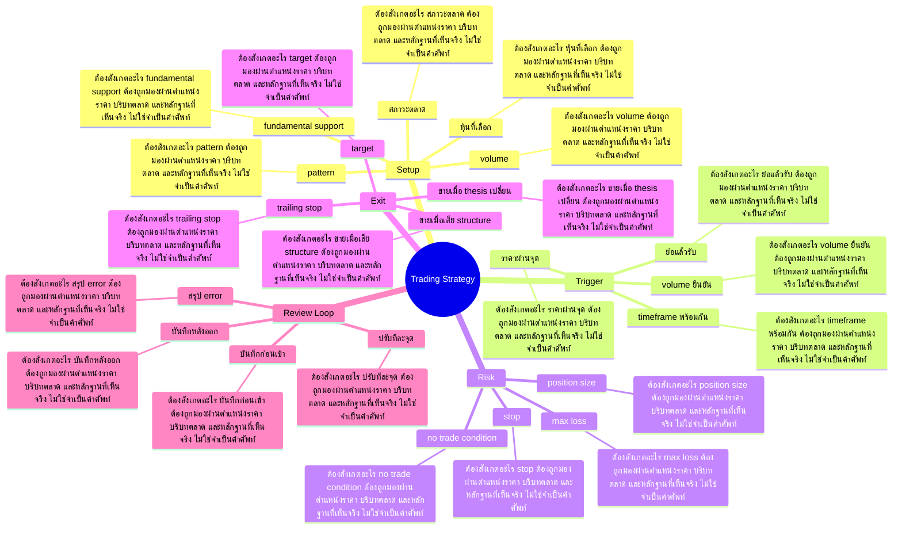

# Mind Map: Trading Strategy

## Central Idea
กลยุทธ์ที่ใช้ได้จริงต้องตอบครบว่าเข้าเมื่อไร ออกเมื่อไร ผิดตรงไหน size เท่าไร และ review อย่างไร

## Learning Context
- Phase: ประกอบระบบเทรด
- Category: Strategy

## Learning Goals
- ประกอบ entry, exit, stop, target และ sizing เป็นระบบเดียว
- แยก strategy ออกจากความรู้สึกระหว่างตลาดวิ่ง
- สร้าง journal เพื่อปรับระบบจากข้อมูลจริง

## Keywords To Remember
day, ใช่, อือ, time, high, low, stop, ema, นะครับ, อ่ะ, buy, เนี่ย

## Big Branches + Deep Branches
### Setup
- ภาพรวม: กิ่งนี้เชื่อมกับบทเรียนหลักเพราะ Setup เป็นตัวแปลงความรู้ให้กลายเป็นการตัดสินใจ โดยเฉพาะเรื่อง สภาวะตลาด, หุ้นที่เลือก, pattern
- สภาวะตลาด
  - ต้องสังเกตอะไร: สภาวะตลาด ต้องถูกมองผ่านตำแหน่งราคา บริบทตลาด และหลักฐานที่เห็นจริง ไม่ใช่จำเป็นคำศัพท์
  - ใช้ตอนไหน: ใช้ สภาวะตลาด เพื่อช่วยตัดสินใจว่าแผนในกิ่ง Setup ควรเดินต่อ รอ ย่อขนาด หรือยกเลิก
  - ถ้าผิดต้องทำอะไร: ถ้าหลักฐานไม่ยืนยัน สภาวะตลาด ให้ลดความมั่นใจทันที และกลับไปถามจุดผิดทางของแผน
- หุ้นที่เลือก
  - ต้องสังเกตอะไร: หุ้นที่เลือก ต้องถูกมองผ่านตำแหน่งราคา บริบทตลาด และหลักฐานที่เห็นจริง ไม่ใช่จำเป็นคำศัพท์
  - ใช้ตอนไหน: ใช้ หุ้นที่เลือก เพื่อช่วยตัดสินใจว่าแผนในกิ่ง Setup ควรเดินต่อ รอ ย่อขนาด หรือยกเลิก
  - ถ้าผิดต้องทำอะไร: ถ้าหลักฐานไม่ยืนยัน หุ้นที่เลือก ให้ลดความมั่นใจทันที และกลับไปถามจุดผิดทางของแผน
- pattern
  - ต้องสังเกตอะไร: pattern ต้องถูกมองผ่านตำแหน่งราคา บริบทตลาด และหลักฐานที่เห็นจริง ไม่ใช่จำเป็นคำศัพท์
  - ใช้ตอนไหน: ใช้ pattern เพื่อช่วยตัดสินใจว่าแผนในกิ่ง Setup ควรเดินต่อ รอ ย่อขนาด หรือยกเลิก
  - ถ้าผิดต้องทำอะไร: ถ้าหลักฐานไม่ยืนยัน pattern ให้ลดความมั่นใจทันที และกลับไปถามจุดผิดทางของแผน
- volume
  - ต้องสังเกตอะไร: volume ต้องถูกมองผ่านตำแหน่งราคา บริบทตลาด และหลักฐานที่เห็นจริง ไม่ใช่จำเป็นคำศัพท์
  - ใช้ตอนไหน: ใช้ volume เพื่อช่วยตัดสินใจว่าแผนในกิ่ง Setup ควรเดินต่อ รอ ย่อขนาด หรือยกเลิก
  - ถ้าผิดต้องทำอะไร: ถ้าหลักฐานไม่ยืนยัน volume ให้ลดความมั่นใจทันที และกลับไปถามจุดผิดทางของแผน
- fundamental support
  - ต้องสังเกตอะไร: fundamental support ต้องถูกมองผ่านตำแหน่งราคา บริบทตลาด และหลักฐานที่เห็นจริง ไม่ใช่จำเป็นคำศัพท์
  - ใช้ตอนไหน: ใช้ fundamental support เพื่อช่วยตัดสินใจว่าแผนในกิ่ง Setup ควรเดินต่อ รอ ย่อขนาด หรือยกเลิก
  - ถ้าผิดต้องทำอะไร: ถ้าหลักฐานไม่ยืนยัน fundamental support ให้ลดความมั่นใจทันที และกลับไปถามจุดผิดทางของแผน

### Trigger
- ภาพรวม: กิ่งนี้เชื่อมกับบทเรียนหลักเพราะ Trigger เป็นตัวแปลงความรู้ให้กลายเป็นการตัดสินใจ โดยเฉพาะเรื่อง ราคาผ่านจุด, ย่อแล้วรับ, volume ยืนยัน
- ราคาผ่านจุด
  - ต้องสังเกตอะไร: ราคาผ่านจุด ต้องถูกมองผ่านตำแหน่งราคา บริบทตลาด และหลักฐานที่เห็นจริง ไม่ใช่จำเป็นคำศัพท์
  - ใช้ตอนไหน: ใช้ ราคาผ่านจุด เพื่อช่วยตัดสินใจว่าแผนในกิ่ง Trigger ควรเดินต่อ รอ ย่อขนาด หรือยกเลิก
  - ถ้าผิดต้องทำอะไร: ถ้าหลักฐานไม่ยืนยัน ราคาผ่านจุด ให้ลดความมั่นใจทันที และกลับไปถามจุดผิดทางของแผน
- ย่อแล้วรับ
  - ต้องสังเกตอะไร: ย่อแล้วรับ ต้องถูกมองผ่านตำแหน่งราคา บริบทตลาด และหลักฐานที่เห็นจริง ไม่ใช่จำเป็นคำศัพท์
  - ใช้ตอนไหน: ใช้ ย่อแล้วรับ เพื่อช่วยตัดสินใจว่าแผนในกิ่ง Trigger ควรเดินต่อ รอ ย่อขนาด หรือยกเลิก
  - ถ้าผิดต้องทำอะไร: ถ้าหลักฐานไม่ยืนยัน ย่อแล้วรับ ให้ลดความมั่นใจทันที และกลับไปถามจุดผิดทางของแผน
- volume ยืนยัน
  - ต้องสังเกตอะไร: volume ยืนยัน ต้องถูกมองผ่านตำแหน่งราคา บริบทตลาด และหลักฐานที่เห็นจริง ไม่ใช่จำเป็นคำศัพท์
  - ใช้ตอนไหน: ใช้ volume ยืนยัน เพื่อช่วยตัดสินใจว่าแผนในกิ่ง Trigger ควรเดินต่อ รอ ย่อขนาด หรือยกเลิก
  - ถ้าผิดต้องทำอะไร: ถ้าหลักฐานไม่ยืนยัน volume ยืนยัน ให้ลดความมั่นใจทันที และกลับไปถามจุดผิดทางของแผน
- timeframe พร้อมกัน
  - ต้องสังเกตอะไร: timeframe พร้อมกัน ต้องถูกมองผ่านตำแหน่งราคา บริบทตลาด และหลักฐานที่เห็นจริง ไม่ใช่จำเป็นคำศัพท์
  - ใช้ตอนไหน: ใช้ timeframe พร้อมกัน เพื่อช่วยตัดสินใจว่าแผนในกิ่ง Trigger ควรเดินต่อ รอ ย่อขนาด หรือยกเลิก
  - ถ้าผิดต้องทำอะไร: ถ้าหลักฐานไม่ยืนยัน timeframe พร้อมกัน ให้ลดความมั่นใจทันที และกลับไปถามจุดผิดทางของแผน

### Risk
- ภาพรวม: กิ่งนี้เชื่อมกับบทเรียนหลักเพราะ Risk เป็นตัวแปลงความรู้ให้กลายเป็นการตัดสินใจ โดยเฉพาะเรื่อง stop, position size, max loss
- stop
  - ต้องสังเกตอะไร: stop ต้องถูกมองผ่านตำแหน่งราคา บริบทตลาด และหลักฐานที่เห็นจริง ไม่ใช่จำเป็นคำศัพท์
  - ใช้ตอนไหน: ใช้ stop เพื่อช่วยตัดสินใจว่าแผนในกิ่ง Risk ควรเดินต่อ รอ ย่อขนาด หรือยกเลิก
  - ถ้าผิดต้องทำอะไร: ถ้าหลักฐานไม่ยืนยัน stop ให้ลดความมั่นใจทันที และกลับไปถามจุดผิดทางของแผน
- position size
  - ต้องสังเกตอะไร: position size ต้องถูกมองผ่านตำแหน่งราคา บริบทตลาด และหลักฐานที่เห็นจริง ไม่ใช่จำเป็นคำศัพท์
  - ใช้ตอนไหน: ใช้ position size เพื่อช่วยตัดสินใจว่าแผนในกิ่ง Risk ควรเดินต่อ รอ ย่อขนาด หรือยกเลิก
  - ถ้าผิดต้องทำอะไร: ถ้าหลักฐานไม่ยืนยัน position size ให้ลดความมั่นใจทันที และกลับไปถามจุดผิดทางของแผน
- max loss
  - ต้องสังเกตอะไร: max loss ต้องถูกมองผ่านตำแหน่งราคา บริบทตลาด และหลักฐานที่เห็นจริง ไม่ใช่จำเป็นคำศัพท์
  - ใช้ตอนไหน: ใช้ max loss เพื่อช่วยตัดสินใจว่าแผนในกิ่ง Risk ควรเดินต่อ รอ ย่อขนาด หรือยกเลิก
  - ถ้าผิดต้องทำอะไร: ถ้าหลักฐานไม่ยืนยัน max loss ให้ลดความมั่นใจทันที และกลับไปถามจุดผิดทางของแผน
- no trade condition
  - ต้องสังเกตอะไร: no trade condition ต้องถูกมองผ่านตำแหน่งราคา บริบทตลาด และหลักฐานที่เห็นจริง ไม่ใช่จำเป็นคำศัพท์
  - ใช้ตอนไหน: ใช้ no trade condition เพื่อช่วยตัดสินใจว่าแผนในกิ่ง Risk ควรเดินต่อ รอ ย่อขนาด หรือยกเลิก
  - ถ้าผิดต้องทำอะไร: ถ้าหลักฐานไม่ยืนยัน no trade condition ให้ลดความมั่นใจทันที และกลับไปถามจุดผิดทางของแผน

### Exit
- ภาพรวม: กิ่งนี้เชื่อมกับบทเรียนหลักเพราะ Exit เป็นตัวแปลงความรู้ให้กลายเป็นการตัดสินใจ โดยเฉพาะเรื่อง target, trailing stop, ขายเมื่อเสีย structure
- target
  - ต้องสังเกตอะไร: target ต้องถูกมองผ่านตำแหน่งราคา บริบทตลาด และหลักฐานที่เห็นจริง ไม่ใช่จำเป็นคำศัพท์
  - ใช้ตอนไหน: ใช้ target เพื่อช่วยตัดสินใจว่าแผนในกิ่ง Exit ควรเดินต่อ รอ ย่อขนาด หรือยกเลิก
  - ถ้าผิดต้องทำอะไร: ถ้าหลักฐานไม่ยืนยัน target ให้ลดความมั่นใจทันที และกลับไปถามจุดผิดทางของแผน
- trailing stop
  - ต้องสังเกตอะไร: trailing stop ต้องถูกมองผ่านตำแหน่งราคา บริบทตลาด และหลักฐานที่เห็นจริง ไม่ใช่จำเป็นคำศัพท์
  - ใช้ตอนไหน: ใช้ trailing stop เพื่อช่วยตัดสินใจว่าแผนในกิ่ง Exit ควรเดินต่อ รอ ย่อขนาด หรือยกเลิก
  - ถ้าผิดต้องทำอะไร: ถ้าหลักฐานไม่ยืนยัน trailing stop ให้ลดความมั่นใจทันที และกลับไปถามจุดผิดทางของแผน
- ขายเมื่อเสีย structure
  - ต้องสังเกตอะไร: ขายเมื่อเสีย structure ต้องถูกมองผ่านตำแหน่งราคา บริบทตลาด และหลักฐานที่เห็นจริง ไม่ใช่จำเป็นคำศัพท์
  - ใช้ตอนไหน: ใช้ ขายเมื่อเสีย structure เพื่อช่วยตัดสินใจว่าแผนในกิ่ง Exit ควรเดินต่อ รอ ย่อขนาด หรือยกเลิก
  - ถ้าผิดต้องทำอะไร: ถ้าหลักฐานไม่ยืนยัน ขายเมื่อเสีย structure ให้ลดความมั่นใจทันที และกลับไปถามจุดผิดทางของแผน
- ขายเมื่อ thesis เปลี่ยน
  - ต้องสังเกตอะไร: ขายเมื่อ thesis เปลี่ยน ต้องถูกมองผ่านตำแหน่งราคา บริบทตลาด และหลักฐานที่เห็นจริง ไม่ใช่จำเป็นคำศัพท์
  - ใช้ตอนไหน: ใช้ ขายเมื่อ thesis เปลี่ยน เพื่อช่วยตัดสินใจว่าแผนในกิ่ง Exit ควรเดินต่อ รอ ย่อขนาด หรือยกเลิก
  - ถ้าผิดต้องทำอะไร: ถ้าหลักฐานไม่ยืนยัน ขายเมื่อ thesis เปลี่ยน ให้ลดความมั่นใจทันที และกลับไปถามจุดผิดทางของแผน

### Review Loop
- ภาพรวม: กิ่งนี้เชื่อมกับบทเรียนหลักเพราะ Review Loop เป็นตัวแปลงความรู้ให้กลายเป็นการตัดสินใจ โดยเฉพาะเรื่อง บันทึกก่อนเข้า, บันทึกหลังออก, สรุป error
- บันทึกก่อนเข้า
  - ต้องสังเกตอะไร: บันทึกก่อนเข้า ต้องถูกมองผ่านตำแหน่งราคา บริบทตลาด และหลักฐานที่เห็นจริง ไม่ใช่จำเป็นคำศัพท์
  - ใช้ตอนไหน: ใช้ บันทึกก่อนเข้า เพื่อช่วยตัดสินใจว่าแผนในกิ่ง Review Loop ควรเดินต่อ รอ ย่อขนาด หรือยกเลิก
  - ถ้าผิดต้องทำอะไร: ถ้าหลักฐานไม่ยืนยัน บันทึกก่อนเข้า ให้ลดความมั่นใจทันที และกลับไปถามจุดผิดทางของแผน
- บันทึกหลังออก
  - ต้องสังเกตอะไร: บันทึกหลังออก ต้องถูกมองผ่านตำแหน่งราคา บริบทตลาด และหลักฐานที่เห็นจริง ไม่ใช่จำเป็นคำศัพท์
  - ใช้ตอนไหน: ใช้ บันทึกหลังออก เพื่อช่วยตัดสินใจว่าแผนในกิ่ง Review Loop ควรเดินต่อ รอ ย่อขนาด หรือยกเลิก
  - ถ้าผิดต้องทำอะไร: ถ้าหลักฐานไม่ยืนยัน บันทึกหลังออก ให้ลดความมั่นใจทันที และกลับไปถามจุดผิดทางของแผน
- สรุป error
  - ต้องสังเกตอะไร: สรุป error ต้องถูกมองผ่านตำแหน่งราคา บริบทตลาด และหลักฐานที่เห็นจริง ไม่ใช่จำเป็นคำศัพท์
  - ใช้ตอนไหน: ใช้ สรุป error เพื่อช่วยตัดสินใจว่าแผนในกิ่ง Review Loop ควรเดินต่อ รอ ย่อขนาด หรือยกเลิก
  - ถ้าผิดต้องทำอะไร: ถ้าหลักฐานไม่ยืนยัน สรุป error ให้ลดความมั่นใจทันที และกลับไปถามจุดผิดทางของแผน
- ปรับทีละจุด
  - ต้องสังเกตอะไร: ปรับทีละจุด ต้องถูกมองผ่านตำแหน่งราคา บริบทตลาด และหลักฐานที่เห็นจริง ไม่ใช่จำเป็นคำศัพท์
  - ใช้ตอนไหน: ใช้ ปรับทีละจุด เพื่อช่วยตัดสินใจว่าแผนในกิ่ง Review Loop ควรเดินต่อ รอ ย่อขนาด หรือยกเลิก
  - ถ้าผิดต้องทำอะไร: ถ้าหลักฐานไม่ยืนยัน ปรับทีละจุด ให้ลดความมั่นใจทันที และกลับไปถามจุดผิดทางของแผน

## Transcript Signals
> ทนจะเริ่มเก็บละสอดบิดเก็บสอดบิดเก็บสอด บิดเก็บไปเรื่อยๆครับ >> ก็จากการ์ดตัวเนี้ยผมมีจังหวะเข้าเนี่ย ตามความอย่างที่บอกตามคาแรคเตอร์ของคนได้ 2 แบบนะครับคาแรคเตอร์แบบแรกคนเล่นเบรก เาจะมาเก็บกันตรงนี้ >> อ่าใช่ครับ >> อันนี้คือจังหวะใบที่ 1 ครับแล้วก็จังหวะ ที่...

> ตัวแบบชัดๆนะฮะก็ผมให้ดูว่าการเข้า Advanceนซาอ่ะเข้ายังไงนะ นี่ฮะ position Advance เ้าเข้าที่ประมาณ 194 เห็นมั้ย 194 ก็คือการย่อกลับมา TB ชุด เนี้ยแถวๆเนี้ย >> อื >> แล้วก็ buy and Ho แค่นั้นเอง >> ใช่ >> พอก็เค้ารอรอคอยอย่างเดียวเลย >> อื >>...

> background เดิมพอเราวิเคราะห์เราก็จะ มองว่าเฮ้ยหุ้นตัวเนี้ยมีโอกาสกลับตัวสูง แล้วเย็นวันนั้นเนี่ยมันมี flow เข้าการ ตัดสินใจสำหรับคนสกาทคือเค้าอาจจะไม่ทำ การบ้านมาก่อนครับเค้ามองแค่ว่าเฮ้ยโฟมา ตรงเนี้ยครับแนวต้านอยู่ 41.75 >> อื >> แนวรับอยู่ 40.75 75...

## Decision Rules
- Setup: จะใช้กิ่งนี้ได้เมื่อเห็น สภาวะตลาด และ หุ้นที่เลือก พร้อมกัน ถ้าเจอเงื่อนไขตรงข้ามกับ fundamental support ให้ลดขนาดหรือหยุด
- Trigger: จะใช้กิ่งนี้ได้เมื่อเห็น ราคาผ่านจุด และ ย่อแล้วรับ พร้อมกัน ถ้าเจอเงื่อนไขตรงข้ามกับ timeframe พร้อมกัน ให้ลดขนาดหรือหยุด
- Risk: จะใช้กิ่งนี้ได้เมื่อเห็น stop และ position size พร้อมกัน ถ้าเจอเงื่อนไขตรงข้ามกับ no trade condition ให้ลดขนาดหรือหยุด
- Exit: จะใช้กิ่งนี้ได้เมื่อเห็น target และ trailing stop พร้อมกัน ถ้าเจอเงื่อนไขตรงข้ามกับ ขายเมื่อ thesis เปลี่ยน ให้ลดขนาดหรือหยุด
- Review Loop: จะใช้กิ่งนี้ได้เมื่อเห็น บันทึกก่อนเข้า และ บันทึกหลังออก พร้อมกัน ถ้าเจอเงื่อนไขตรงข้ามกับ ปรับทีละจุด ให้ลดขนาดหรือหยุด

## Common Mistakes
- จำชื่อบทได้ แต่ไม่รู้ว่า Setup ต้องเปลี่ยนพฤติกรรมการเทรดตรงไหน
- เห็นสัญญาณหนึ่งอย่างแล้วรีบสรุป ทั้งที่ยังไม่ได้เช็กบริบทและหลักฐานประกอบ
- วางแผนตอนใจเย็น แต่พอราคาเคลื่อนไหวจริงกลับเปลี่ยนกฎตามอารมณ์
- สนใจ Review Loop แค่ตอนอยากเข้า แต่ไม่ใช้เป็นเงื่อนไขตอนต้องออกหรือหยุด

## Practice Checklist
- ทวนเป้าหมายบทนี้ก่อนเริ่ม: ประกอบ entry, exit, stop, target และ sizing เป็นระบบเดียว
- เปิดกราฟหรือกรณีศึกษาจริง 1 ตัว แล้วระบุว่าเกี่ยวกับกิ่ง 'Setup' ตรงไหน
- เขียนก่อนเข้าว่า thesis คืออะไร หลักฐานคืออะไร และถ้าผิดจะยอมรับตรงไหน
- แยกสิ่งที่เห็นจริงออกจากสิ่งที่อยากให้เกิด แล้วให้คะแนนความมั่นใจ 1-5
- หลังจบเคส ให้บันทึกว่าแพ้/ชนะเพราะระบบ หรือเพราะอารมณ์

## Final Destination
มี strategy card ที่ทำซ้ำได้ วัดผลได้ และแก้ได้ ไม่ใช่ระบบที่เปลี่ยนตามอารมณ์ตลาด

## Questions for Patiphan
1. กิ่งไหนคือแก่นที่สุดของบทนี้
2. กิ่งไหนเกี่ยวกับจุดอ่อนของ Patiphan มากที่สุด
3. ถ้าจะเอาไปใช้กับกราฟจริง ต้องเห็นหลักฐานอะไร
4. ถ้าทำผิด บทนี้เตือนให้หยุดตรงไหน
5. ปลายทางของบทนี้จะเข้าไปอยู่ในระบบเทรดส่วนไหน
