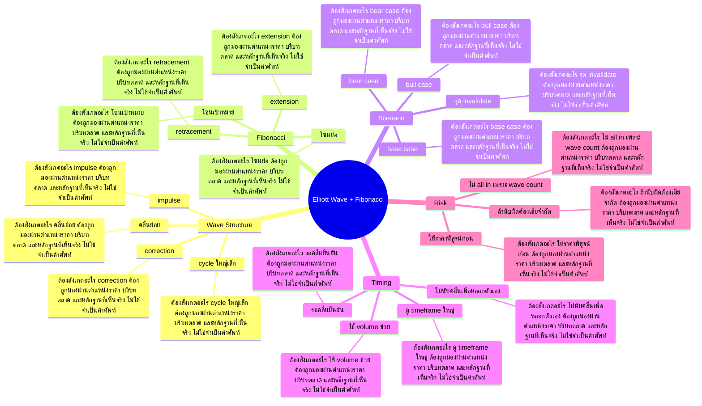

# Mind Map: Elliott Wave + Fibonacci

## Central Idea
Wave และ Fibonacci เป็นแผนที่ scenario ไม่ใช่คำทำนาย ต้องใช้เพื่อวางจุดคุ้มเสี่ยง

## Learning Context
- Phase: อ่านโครงสร้างคลื่น
- Category: Technical

## Learning Goals
- เข้าใจโครงสร้างคลื่นและจังหวะย่อ/ไปต่อ
- ใช้ Fibonacci เพื่อวัดโซน ไม่ใช่เส้นศักดิ์สิทธิ์
- สร้างหลาย scenario แล้วเลือกแผนที่ risk/reward คุ้ม

## Keywords To Remember
wave, time, frame, นะคะ, simple, double, rsi, triangle, เวฟ, complex, เว็บ, overlap

## Big Branches + Deep Branches
### Wave Structure
- ภาพรวม: กิ่งนี้เชื่อมกับบทเรียนหลักเพราะ Wave Structure เป็นตัวแปลงความรู้ให้กลายเป็นการตัดสินใจ โดยเฉพาะเรื่อง impulse, correction, คลื่นย่อย
- impulse
  - ต้องสังเกตอะไร: impulse ต้องถูกมองผ่านตำแหน่งราคา บริบทตลาด และหลักฐานที่เห็นจริง ไม่ใช่จำเป็นคำศัพท์
  - ใช้ตอนไหน: ใช้ impulse เพื่อช่วยตัดสินใจว่าแผนในกิ่ง Wave Structure ควรเดินต่อ รอ ย่อขนาด หรือยกเลิก
  - ถ้าผิดต้องทำอะไร: ถ้าหลักฐานไม่ยืนยัน impulse ให้ลดความมั่นใจทันที และกลับไปถามจุดผิดทางของแผน
- correction
  - ต้องสังเกตอะไร: correction ต้องถูกมองผ่านตำแหน่งราคา บริบทตลาด และหลักฐานที่เห็นจริง ไม่ใช่จำเป็นคำศัพท์
  - ใช้ตอนไหน: ใช้ correction เพื่อช่วยตัดสินใจว่าแผนในกิ่ง Wave Structure ควรเดินต่อ รอ ย่อขนาด หรือยกเลิก
  - ถ้าผิดต้องทำอะไร: ถ้าหลักฐานไม่ยืนยัน correction ให้ลดความมั่นใจทันที และกลับไปถามจุดผิดทางของแผน
- คลื่นย่อย
  - ต้องสังเกตอะไร: คลื่นย่อย ต้องถูกมองผ่านตำแหน่งราคา บริบทตลาด และหลักฐานที่เห็นจริง ไม่ใช่จำเป็นคำศัพท์
  - ใช้ตอนไหน: ใช้ คลื่นย่อย เพื่อช่วยตัดสินใจว่าแผนในกิ่ง Wave Structure ควรเดินต่อ รอ ย่อขนาด หรือยกเลิก
  - ถ้าผิดต้องทำอะไร: ถ้าหลักฐานไม่ยืนยัน คลื่นย่อย ให้ลดความมั่นใจทันที และกลับไปถามจุดผิดทางของแผน
- cycle ใหญ่เล็ก
  - ต้องสังเกตอะไร: cycle ใหญ่เล็ก ต้องถูกมองผ่านตำแหน่งราคา บริบทตลาด และหลักฐานที่เห็นจริง ไม่ใช่จำเป็นคำศัพท์
  - ใช้ตอนไหน: ใช้ cycle ใหญ่เล็ก เพื่อช่วยตัดสินใจว่าแผนในกิ่ง Wave Structure ควรเดินต่อ รอ ย่อขนาด หรือยกเลิก
  - ถ้าผิดต้องทำอะไร: ถ้าหลักฐานไม่ยืนยัน cycle ใหญ่เล็ก ให้ลดความมั่นใจทันที และกลับไปถามจุดผิดทางของแผน

### Fibonacci
- ภาพรวม: กิ่งนี้เชื่อมกับบทเรียนหลักเพราะ Fibonacci เป็นตัวแปลงความรู้ให้กลายเป็นการตัดสินใจ โดยเฉพาะเรื่อง retracement, extension, โซนย่อ
- retracement
  - ต้องสังเกตอะไร: retracement ต้องถูกมองผ่านตำแหน่งราคา บริบทตลาด และหลักฐานที่เห็นจริง ไม่ใช่จำเป็นคำศัพท์
  - ใช้ตอนไหน: ใช้ retracement เพื่อช่วยตัดสินใจว่าแผนในกิ่ง Fibonacci ควรเดินต่อ รอ ย่อขนาด หรือยกเลิก
  - ถ้าผิดต้องทำอะไร: ถ้าหลักฐานไม่ยืนยัน retracement ให้ลดความมั่นใจทันที และกลับไปถามจุดผิดทางของแผน
- extension
  - ต้องสังเกตอะไร: extension ต้องถูกมองผ่านตำแหน่งราคา บริบทตลาด และหลักฐานที่เห็นจริง ไม่ใช่จำเป็นคำศัพท์
  - ใช้ตอนไหน: ใช้ extension เพื่อช่วยตัดสินใจว่าแผนในกิ่ง Fibonacci ควรเดินต่อ รอ ย่อขนาด หรือยกเลิก
  - ถ้าผิดต้องทำอะไร: ถ้าหลักฐานไม่ยืนยัน extension ให้ลดความมั่นใจทันที และกลับไปถามจุดผิดทางของแผน
- โซนย่อ
  - ต้องสังเกตอะไร: โซนย่อ ต้องถูกมองผ่านตำแหน่งราคา บริบทตลาด และหลักฐานที่เห็นจริง ไม่ใช่จำเป็นคำศัพท์
  - ใช้ตอนไหน: ใช้ โซนย่อ เพื่อช่วยตัดสินใจว่าแผนในกิ่ง Fibonacci ควรเดินต่อ รอ ย่อขนาด หรือยกเลิก
  - ถ้าผิดต้องทำอะไร: ถ้าหลักฐานไม่ยืนยัน โซนย่อ ให้ลดความมั่นใจทันที และกลับไปถามจุดผิดทางของแผน
- โซนเป้าหมาย
  - ต้องสังเกตอะไร: โซนเป้าหมาย ต้องถูกมองผ่านตำแหน่งราคา บริบทตลาด และหลักฐานที่เห็นจริง ไม่ใช่จำเป็นคำศัพท์
  - ใช้ตอนไหน: ใช้ โซนเป้าหมาย เพื่อช่วยตัดสินใจว่าแผนในกิ่ง Fibonacci ควรเดินต่อ รอ ย่อขนาด หรือยกเลิก
  - ถ้าผิดต้องทำอะไร: ถ้าหลักฐานไม่ยืนยัน โซนเป้าหมาย ให้ลดความมั่นใจทันที และกลับไปถามจุดผิดทางของแผน

### Scenario
- ภาพรวม: กิ่งนี้เชื่อมกับบทเรียนหลักเพราะ Scenario เป็นตัวแปลงความรู้ให้กลายเป็นการตัดสินใจ โดยเฉพาะเรื่อง bull case, base case, bear case
- bull case
  - ต้องสังเกตอะไร: bull case ต้องถูกมองผ่านตำแหน่งราคา บริบทตลาด และหลักฐานที่เห็นจริง ไม่ใช่จำเป็นคำศัพท์
  - ใช้ตอนไหน: ใช้ bull case เพื่อช่วยตัดสินใจว่าแผนในกิ่ง Scenario ควรเดินต่อ รอ ย่อขนาด หรือยกเลิก
  - ถ้าผิดต้องทำอะไร: ถ้าหลักฐานไม่ยืนยัน bull case ให้ลดความมั่นใจทันที และกลับไปถามจุดผิดทางของแผน
- base case
  - ต้องสังเกตอะไร: base case ต้องถูกมองผ่านตำแหน่งราคา บริบทตลาด และหลักฐานที่เห็นจริง ไม่ใช่จำเป็นคำศัพท์
  - ใช้ตอนไหน: ใช้ base case เพื่อช่วยตัดสินใจว่าแผนในกิ่ง Scenario ควรเดินต่อ รอ ย่อขนาด หรือยกเลิก
  - ถ้าผิดต้องทำอะไร: ถ้าหลักฐานไม่ยืนยัน base case ให้ลดความมั่นใจทันที และกลับไปถามจุดผิดทางของแผน
- bear case
  - ต้องสังเกตอะไร: bear case ต้องถูกมองผ่านตำแหน่งราคา บริบทตลาด และหลักฐานที่เห็นจริง ไม่ใช่จำเป็นคำศัพท์
  - ใช้ตอนไหน: ใช้ bear case เพื่อช่วยตัดสินใจว่าแผนในกิ่ง Scenario ควรเดินต่อ รอ ย่อขนาด หรือยกเลิก
  - ถ้าผิดต้องทำอะไร: ถ้าหลักฐานไม่ยืนยัน bear case ให้ลดความมั่นใจทันที และกลับไปถามจุดผิดทางของแผน
- จุด invalidate
  - ต้องสังเกตอะไร: จุด invalidate ต้องถูกมองผ่านตำแหน่งราคา บริบทตลาด และหลักฐานที่เห็นจริง ไม่ใช่จำเป็นคำศัพท์
  - ใช้ตอนไหน: ใช้ จุด invalidate เพื่อช่วยตัดสินใจว่าแผนในกิ่ง Scenario ควรเดินต่อ รอ ย่อขนาด หรือยกเลิก
  - ถ้าผิดต้องทำอะไร: ถ้าหลักฐานไม่ยืนยัน จุด invalidate ให้ลดความมั่นใจทันที และกลับไปถามจุดผิดทางของแผน

### Timing
- ภาพรวม: กิ่งนี้เชื่อมกับบทเรียนหลักเพราะ Timing เป็นตัวแปลงความรู้ให้กลายเป็นการตัดสินใจ โดยเฉพาะเรื่อง รอคลื่นยืนยัน, ไม่นับคลื่นเพื่อหลอกตัวเอง, ใช้ volume ช่วย
- รอคลื่นยืนยัน
  - ต้องสังเกตอะไร: รอคลื่นยืนยัน ต้องถูกมองผ่านตำแหน่งราคา บริบทตลาด และหลักฐานที่เห็นจริง ไม่ใช่จำเป็นคำศัพท์
  - ใช้ตอนไหน: ใช้ รอคลื่นยืนยัน เพื่อช่วยตัดสินใจว่าแผนในกิ่ง Timing ควรเดินต่อ รอ ย่อขนาด หรือยกเลิก
  - ถ้าผิดต้องทำอะไร: ถ้าหลักฐานไม่ยืนยัน รอคลื่นยืนยัน ให้ลดความมั่นใจทันที และกลับไปถามจุดผิดทางของแผน
- ไม่นับคลื่นเพื่อหลอกตัวเอง
  - ต้องสังเกตอะไร: ไม่นับคลื่นเพื่อหลอกตัวเอง ต้องถูกมองผ่านตำแหน่งราคา บริบทตลาด และหลักฐานที่เห็นจริง ไม่ใช่จำเป็นคำศัพท์
  - ใช้ตอนไหน: ใช้ ไม่นับคลื่นเพื่อหลอกตัวเอง เพื่อช่วยตัดสินใจว่าแผนในกิ่ง Timing ควรเดินต่อ รอ ย่อขนาด หรือยกเลิก
  - ถ้าผิดต้องทำอะไร: ถ้าหลักฐานไม่ยืนยัน ไม่นับคลื่นเพื่อหลอกตัวเอง ให้ลดความมั่นใจทันที และกลับไปถามจุดผิดทางของแผน
- ใช้ volume ช่วย
  - ต้องสังเกตอะไร: ใช้ volume ช่วย ต้องถูกมองผ่านตำแหน่งราคา บริบทตลาด และหลักฐานที่เห็นจริง ไม่ใช่จำเป็นคำศัพท์
  - ใช้ตอนไหน: ใช้ ใช้ volume ช่วย เพื่อช่วยตัดสินใจว่าแผนในกิ่ง Timing ควรเดินต่อ รอ ย่อขนาด หรือยกเลิก
  - ถ้าผิดต้องทำอะไร: ถ้าหลักฐานไม่ยืนยัน ใช้ volume ช่วย ให้ลดความมั่นใจทันที และกลับไปถามจุดผิดทางของแผน
- ดู timeframe ใหญ่
  - ต้องสังเกตอะไร: ดู timeframe ใหญ่ ต้องถูกมองผ่านตำแหน่งราคา บริบทตลาด และหลักฐานที่เห็นจริง ไม่ใช่จำเป็นคำศัพท์
  - ใช้ตอนไหน: ใช้ ดู timeframe ใหญ่ เพื่อช่วยตัดสินใจว่าแผนในกิ่ง Timing ควรเดินต่อ รอ ย่อขนาด หรือยกเลิก
  - ถ้าผิดต้องทำอะไร: ถ้าหลักฐานไม่ยืนยัน ดู timeframe ใหญ่ ให้ลดความมั่นใจทันที และกลับไปถามจุดผิดทางของแผน

### Risk
- ภาพรวม: กิ่งนี้เชื่อมกับบทเรียนหลักเพราะ Risk เป็นตัวแปลงความรู้ให้กลายเป็นการตัดสินใจ โดยเฉพาะเรื่อง ถ้านับผิดต้องเสียจำกัด, ไม่ all in เพราะ wave count, ให้ราคาพิสูจน์ก่อน
- ถ้านับผิดต้องเสียจำกัด
  - ต้องสังเกตอะไร: ถ้านับผิดต้องเสียจำกัด ต้องถูกมองผ่านตำแหน่งราคา บริบทตลาด และหลักฐานที่เห็นจริง ไม่ใช่จำเป็นคำศัพท์
  - ใช้ตอนไหน: ใช้ ถ้านับผิดต้องเสียจำกัด เพื่อช่วยตัดสินใจว่าแผนในกิ่ง Risk ควรเดินต่อ รอ ย่อขนาด หรือยกเลิก
  - ถ้าผิดต้องทำอะไร: ถ้าหลักฐานไม่ยืนยัน ถ้านับผิดต้องเสียจำกัด ให้ลดความมั่นใจทันที และกลับไปถามจุดผิดทางของแผน
- ไม่ all in เพราะ wave count
  - ต้องสังเกตอะไร: ไม่ all in เพราะ wave count ต้องถูกมองผ่านตำแหน่งราคา บริบทตลาด และหลักฐานที่เห็นจริง ไม่ใช่จำเป็นคำศัพท์
  - ใช้ตอนไหน: ใช้ ไม่ all in เพราะ wave count เพื่อช่วยตัดสินใจว่าแผนในกิ่ง Risk ควรเดินต่อ รอ ย่อขนาด หรือยกเลิก
  - ถ้าผิดต้องทำอะไร: ถ้าหลักฐานไม่ยืนยัน ไม่ all in เพราะ wave count ให้ลดความมั่นใจทันที และกลับไปถามจุดผิดทางของแผน
- ให้ราคาพิสูจน์ก่อน
  - ต้องสังเกตอะไร: ให้ราคาพิสูจน์ก่อน ต้องถูกมองผ่านตำแหน่งราคา บริบทตลาด และหลักฐานที่เห็นจริง ไม่ใช่จำเป็นคำศัพท์
  - ใช้ตอนไหน: ใช้ ให้ราคาพิสูจน์ก่อน เพื่อช่วยตัดสินใจว่าแผนในกิ่ง Risk ควรเดินต่อ รอ ย่อขนาด หรือยกเลิก
  - ถ้าผิดต้องทำอะไร: ถ้าหลักฐานไม่ยืนยัน ให้ราคาพิสูจน์ก่อน ให้ลดความมั่นใจทันที และกลับไปถามจุดผิดทางของแผน

## Transcript Signals
> A เนี่ยเนี่ยส่งให้มันลงเหมือนกันแต่เวบ A เนี่ยเค้าจะมีความพิเศษนะคะมันจะอยู่ ในเงื่อนไขของอยู่ในไกด์ไลน์ของทฤษฎีเวฟ ตัวเนี้ยเวฟ A เนี่ยเป็นได้ทั้งคลื่นส่ง และคลื่นรับนะคะแต่ตอนเนี้ยเราเห็นภาพของ คลื่นส่งคนที่ตอบ A กับ C ถูกต้องนะคะใคร ตอบ A B C...

> เนลsonอiadนะคะเอ่อทฤษฎีในส่วนของตัวรับ อีดเนี่ยเค้าก็ต่อยอดนะคะต่อยอดจากทฤษฎี ดาวเี่นะคะในเรื่องของเฟสต่างๆนะคะมาใน ส่วนของตัว เอ่อภาพของเวฟนะคะเราก็มาดูนะคะว่า ทฤษฎี Wave เนี่ยจะให้ความสำคัญนะคะอยู่ 3 รูปแบบนะคะ 3 ส่วนที่ 1 นะคะก็คือรูปแบบ...

> ประมาณ 20-25 ปีค่ะขึ้นอยู่กับแต่ละโดแต่ ละหุ้นบางตัวด้วยนะคะ อ่ะเลื่อนกลับ ครูสอนตรงไหนละโอเค อ่ะเราก็จะเห็นนะคะตอนเนี้ยครูชี้ให้เห็น เรื่องของทฤษฎีFibนciในเรื่องของFibนcy Number นะคะว่ามีความสัมพันธ์นะคะกับใน ส่วนของตัวทฤษฎี Wave นะคะที่ตรงไหนก็คือ...

## Decision Rules
- Wave Structure: จะใช้กิ่งนี้ได้เมื่อเห็น impulse และ correction พร้อมกัน ถ้าเจอเงื่อนไขตรงข้ามกับ cycle ใหญ่เล็ก ให้ลดขนาดหรือหยุด
- Fibonacci: จะใช้กิ่งนี้ได้เมื่อเห็น retracement และ extension พร้อมกัน ถ้าเจอเงื่อนไขตรงข้ามกับ โซนเป้าหมาย ให้ลดขนาดหรือหยุด
- Scenario: จะใช้กิ่งนี้ได้เมื่อเห็น bull case และ base case พร้อมกัน ถ้าเจอเงื่อนไขตรงข้ามกับ จุด invalidate ให้ลดขนาดหรือหยุด
- Timing: จะใช้กิ่งนี้ได้เมื่อเห็น รอคลื่นยืนยัน และ ไม่นับคลื่นเพื่อหลอกตัวเอง พร้อมกัน ถ้าเจอเงื่อนไขตรงข้ามกับ ดู timeframe ใหญ่ ให้ลดขนาดหรือหยุด
- Risk: จะใช้กิ่งนี้ได้เมื่อเห็น ถ้านับผิดต้องเสียจำกัด และ ไม่ all in เพราะ wave count พร้อมกัน ถ้าเจอเงื่อนไขตรงข้ามกับ ให้ราคาพิสูจน์ก่อน ให้ลดขนาดหรือหยุด

## Common Mistakes
- จำชื่อบทได้ แต่ไม่รู้ว่า Wave Structure ต้องเปลี่ยนพฤติกรรมการเทรดตรงไหน
- เห็นสัญญาณหนึ่งอย่างแล้วรีบสรุป ทั้งที่ยังไม่ได้เช็กบริบทและหลักฐานประกอบ
- วางแผนตอนใจเย็น แต่พอราคาเคลื่อนไหวจริงกลับเปลี่ยนกฎตามอารมณ์
- สนใจ Risk แค่ตอนอยากเข้า แต่ไม่ใช้เป็นเงื่อนไขตอนต้องออกหรือหยุด

## Practice Checklist
- ทวนเป้าหมายบทนี้ก่อนเริ่ม: เข้าใจโครงสร้างคลื่นและจังหวะย่อ/ไปต่อ
- เปิดกราฟหรือกรณีศึกษาจริง 1 ตัว แล้วระบุว่าเกี่ยวกับกิ่ง 'Wave Structure' ตรงไหน
- เขียนก่อนเข้าว่า thesis คืออะไร หลักฐานคืออะไร และถ้าผิดจะยอมรับตรงไหน
- แยกสิ่งที่เห็นจริงออกจากสิ่งที่อยากให้เกิด แล้วให้คะแนนความมั่นใจ 1-5
- หลังจบเคส ให้บันทึกว่าแพ้/ชนะเพราะระบบ หรือเพราะอารมณ์

## Final Destination
ใช้ wave/fibo เพื่อจัดความน่าจะเป็นและ risk ไม่ใช่เพื่อทำนายอนาคตแบบมั่นใจเกินจริง

## Questions for Patiphan
1. กิ่งไหนคือแก่นที่สุดของบทนี้
2. กิ่งไหนเกี่ยวกับจุดอ่อนของ Patiphan มากที่สุด
3. ถ้าจะเอาไปใช้กับกราฟจริง ต้องเห็นหลักฐานอะไร
4. ถ้าทำผิด บทนี้เตือนให้หยุดตรงไหน
5. ปลายทางของบทนี้จะเข้าไปอยู่ในระบบเทรดส่วนไหน
