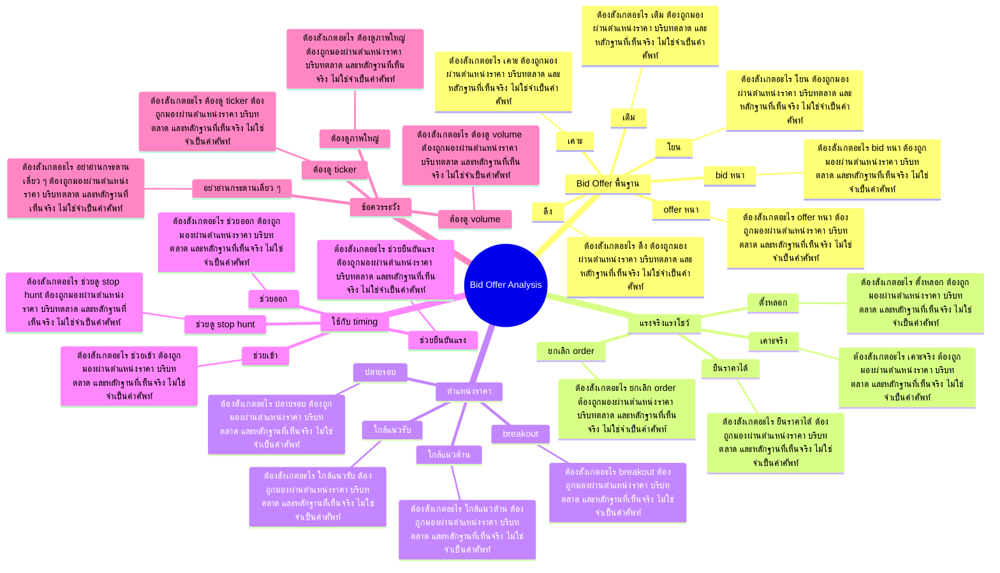

# Mind Map: Bid Offer Analysis

## Central Idea
Bid Offer คือข้อมูลใกล้ตลาดที่สุด แต่ต้องอ่านคู่กับราคา volume และ reaction เพราะกระดานถูกจัดฉากได้

## Learning Context
- Phase: อ่าน order flow
- Category: Order Flow

## Learning Goals
- เข้าใจ bid, offer, การดึง, การเติม และการชน
- แยกแรงจริงออกจากแรงโชว์
- ใช้ order flow เพื่อช่วย timing โดยไม่ลืมภาพใหญ่

## Keywords To Remember
offer, off, vol, ล้าน, bit, โอเค, นะครับ, บาท, หรือ, stop, อ่ะ, บิด

## Big Branches + Deep Branches
### Bid Offer พื้นฐาน
- ภาพรวม: กิ่งนี้เชื่อมกับบทเรียนหลักเพราะ Bid Offer พื้นฐาน เป็นตัวแปลงความรู้ให้กลายเป็นการตัดสินใจ โดยเฉพาะเรื่อง bid หนา, offer หนา, เติม
- bid หนา
  - ต้องสังเกตอะไร: bid หนา ต้องถูกมองผ่านตำแหน่งราคา บริบทตลาด และหลักฐานที่เห็นจริง ไม่ใช่จำเป็นคำศัพท์
  - ใช้ตอนไหน: ใช้ bid หนา เพื่อช่วยตัดสินใจว่าแผนในกิ่ง Bid Offer พื้นฐาน ควรเดินต่อ รอ ย่อขนาด หรือยกเลิก
  - ถ้าผิดต้องทำอะไร: ถ้าหลักฐานไม่ยืนยัน bid หนา ให้ลดความมั่นใจทันที และกลับไปถามจุดผิดทางของแผน
- offer หนา
  - ต้องสังเกตอะไร: offer หนา ต้องถูกมองผ่านตำแหน่งราคา บริบทตลาด และหลักฐานที่เห็นจริง ไม่ใช่จำเป็นคำศัพท์
  - ใช้ตอนไหน: ใช้ offer หนา เพื่อช่วยตัดสินใจว่าแผนในกิ่ง Bid Offer พื้นฐาน ควรเดินต่อ รอ ย่อขนาด หรือยกเลิก
  - ถ้าผิดต้องทำอะไร: ถ้าหลักฐานไม่ยืนยัน offer หนา ให้ลดความมั่นใจทันที และกลับไปถามจุดผิดทางของแผน
- เติม
  - ต้องสังเกตอะไร: เติม ต้องถูกมองผ่านตำแหน่งราคา บริบทตลาด และหลักฐานที่เห็นจริง ไม่ใช่จำเป็นคำศัพท์
  - ใช้ตอนไหน: ใช้ เติม เพื่อช่วยตัดสินใจว่าแผนในกิ่ง Bid Offer พื้นฐาน ควรเดินต่อ รอ ย่อขนาด หรือยกเลิก
  - ถ้าผิดต้องทำอะไร: ถ้าหลักฐานไม่ยืนยัน เติม ให้ลดความมั่นใจทันที และกลับไปถามจุดผิดทางของแผน
- ดึง
  - ต้องสังเกตอะไร: ดึง ต้องถูกมองผ่านตำแหน่งราคา บริบทตลาด และหลักฐานที่เห็นจริง ไม่ใช่จำเป็นคำศัพท์
  - ใช้ตอนไหน: ใช้ ดึง เพื่อช่วยตัดสินใจว่าแผนในกิ่ง Bid Offer พื้นฐาน ควรเดินต่อ รอ ย่อขนาด หรือยกเลิก
  - ถ้าผิดต้องทำอะไร: ถ้าหลักฐานไม่ยืนยัน ดึง ให้ลดความมั่นใจทันที และกลับไปถามจุดผิดทางของแผน
- เคาะ
  - ต้องสังเกตอะไร: เคาะ ต้องถูกมองผ่านตำแหน่งราคา บริบทตลาด และหลักฐานที่เห็นจริง ไม่ใช่จำเป็นคำศัพท์
  - ใช้ตอนไหน: ใช้ เคาะ เพื่อช่วยตัดสินใจว่าแผนในกิ่ง Bid Offer พื้นฐาน ควรเดินต่อ รอ ย่อขนาด หรือยกเลิก
  - ถ้าผิดต้องทำอะไร: ถ้าหลักฐานไม่ยืนยัน เคาะ ให้ลดความมั่นใจทันที และกลับไปถามจุดผิดทางของแผน
- โยน
  - ต้องสังเกตอะไร: โยน ต้องถูกมองผ่านตำแหน่งราคา บริบทตลาด และหลักฐานที่เห็นจริง ไม่ใช่จำเป็นคำศัพท์
  - ใช้ตอนไหน: ใช้ โยน เพื่อช่วยตัดสินใจว่าแผนในกิ่ง Bid Offer พื้นฐาน ควรเดินต่อ รอ ย่อขนาด หรือยกเลิก
  - ถ้าผิดต้องทำอะไร: ถ้าหลักฐานไม่ยืนยัน โยน ให้ลดความมั่นใจทันที และกลับไปถามจุดผิดทางของแผน

### แรงจริงแรงโชว์
- ภาพรวม: กิ่งนี้เชื่อมกับบทเรียนหลักเพราะ แรงจริงแรงโชว์ เป็นตัวแปลงความรู้ให้กลายเป็นการตัดสินใจ โดยเฉพาะเรื่อง ตั้งหลอก, ยกเลิก order, เคาะจริง
- ตั้งหลอก
  - ต้องสังเกตอะไร: ตั้งหลอก ต้องถูกมองผ่านตำแหน่งราคา บริบทตลาด และหลักฐานที่เห็นจริง ไม่ใช่จำเป็นคำศัพท์
  - ใช้ตอนไหน: ใช้ ตั้งหลอก เพื่อช่วยตัดสินใจว่าแผนในกิ่ง แรงจริงแรงโชว์ ควรเดินต่อ รอ ย่อขนาด หรือยกเลิก
  - ถ้าผิดต้องทำอะไร: ถ้าหลักฐานไม่ยืนยัน ตั้งหลอก ให้ลดความมั่นใจทันที และกลับไปถามจุดผิดทางของแผน
- ยกเลิก order
  - ต้องสังเกตอะไร: ยกเลิก order ต้องถูกมองผ่านตำแหน่งราคา บริบทตลาด และหลักฐานที่เห็นจริง ไม่ใช่จำเป็นคำศัพท์
  - ใช้ตอนไหน: ใช้ ยกเลิก order เพื่อช่วยตัดสินใจว่าแผนในกิ่ง แรงจริงแรงโชว์ ควรเดินต่อ รอ ย่อขนาด หรือยกเลิก
  - ถ้าผิดต้องทำอะไร: ถ้าหลักฐานไม่ยืนยัน ยกเลิก order ให้ลดความมั่นใจทันที และกลับไปถามจุดผิดทางของแผน
- เคาะจริง
  - ต้องสังเกตอะไร: เคาะจริง ต้องถูกมองผ่านตำแหน่งราคา บริบทตลาด และหลักฐานที่เห็นจริง ไม่ใช่จำเป็นคำศัพท์
  - ใช้ตอนไหน: ใช้ เคาะจริง เพื่อช่วยตัดสินใจว่าแผนในกิ่ง แรงจริงแรงโชว์ ควรเดินต่อ รอ ย่อขนาด หรือยกเลิก
  - ถ้าผิดต้องทำอะไร: ถ้าหลักฐานไม่ยืนยัน เคาะจริง ให้ลดความมั่นใจทันที และกลับไปถามจุดผิดทางของแผน
- ยืนราคาได้
  - ต้องสังเกตอะไร: ยืนราคาได้ ต้องถูกมองผ่านตำแหน่งราคา บริบทตลาด และหลักฐานที่เห็นจริง ไม่ใช่จำเป็นคำศัพท์
  - ใช้ตอนไหน: ใช้ ยืนราคาได้ เพื่อช่วยตัดสินใจว่าแผนในกิ่ง แรงจริงแรงโชว์ ควรเดินต่อ รอ ย่อขนาด หรือยกเลิก
  - ถ้าผิดต้องทำอะไร: ถ้าหลักฐานไม่ยืนยัน ยืนราคาได้ ให้ลดความมั่นใจทันที และกลับไปถามจุดผิดทางของแผน

### ตำแหน่งราคา
- ภาพรวม: กิ่งนี้เชื่อมกับบทเรียนหลักเพราะ ตำแหน่งราคา เป็นตัวแปลงความรู้ให้กลายเป็นการตัดสินใจ โดยเฉพาะเรื่อง ใกล้แนวรับ, ใกล้แนวต้าน, breakout
- ใกล้แนวรับ
  - ต้องสังเกตอะไร: ใกล้แนวรับ ต้องถูกมองผ่านตำแหน่งราคา บริบทตลาด และหลักฐานที่เห็นจริง ไม่ใช่จำเป็นคำศัพท์
  - ใช้ตอนไหน: ใช้ ใกล้แนวรับ เพื่อช่วยตัดสินใจว่าแผนในกิ่ง ตำแหน่งราคา ควรเดินต่อ รอ ย่อขนาด หรือยกเลิก
  - ถ้าผิดต้องทำอะไร: ถ้าหลักฐานไม่ยืนยัน ใกล้แนวรับ ให้ลดความมั่นใจทันที และกลับไปถามจุดผิดทางของแผน
- ใกล้แนวต้าน
  - ต้องสังเกตอะไร: ใกล้แนวต้าน ต้องถูกมองผ่านตำแหน่งราคา บริบทตลาด และหลักฐานที่เห็นจริง ไม่ใช่จำเป็นคำศัพท์
  - ใช้ตอนไหน: ใช้ ใกล้แนวต้าน เพื่อช่วยตัดสินใจว่าแผนในกิ่ง ตำแหน่งราคา ควรเดินต่อ รอ ย่อขนาด หรือยกเลิก
  - ถ้าผิดต้องทำอะไร: ถ้าหลักฐานไม่ยืนยัน ใกล้แนวต้าน ให้ลดความมั่นใจทันที และกลับไปถามจุดผิดทางของแผน
- breakout
  - ต้องสังเกตอะไร: breakout ต้องถูกมองผ่านตำแหน่งราคา บริบทตลาด และหลักฐานที่เห็นจริง ไม่ใช่จำเป็นคำศัพท์
  - ใช้ตอนไหน: ใช้ breakout เพื่อช่วยตัดสินใจว่าแผนในกิ่ง ตำแหน่งราคา ควรเดินต่อ รอ ย่อขนาด หรือยกเลิก
  - ถ้าผิดต้องทำอะไร: ถ้าหลักฐานไม่ยืนยัน breakout ให้ลดความมั่นใจทันที และกลับไปถามจุดผิดทางของแผน
- ปลายรอบ
  - ต้องสังเกตอะไร: ปลายรอบ ต้องถูกมองผ่านตำแหน่งราคา บริบทตลาด และหลักฐานที่เห็นจริง ไม่ใช่จำเป็นคำศัพท์
  - ใช้ตอนไหน: ใช้ ปลายรอบ เพื่อช่วยตัดสินใจว่าแผนในกิ่ง ตำแหน่งราคา ควรเดินต่อ รอ ย่อขนาด หรือยกเลิก
  - ถ้าผิดต้องทำอะไร: ถ้าหลักฐานไม่ยืนยัน ปลายรอบ ให้ลดความมั่นใจทันที และกลับไปถามจุดผิดทางของแผน

### ใช้กับ timing
- ภาพรวม: กิ่งนี้เชื่อมกับบทเรียนหลักเพราะ ใช้กับ timing เป็นตัวแปลงความรู้ให้กลายเป็นการตัดสินใจ โดยเฉพาะเรื่อง ช่วยเข้า, ช่วยออก, ช่วยดู stop hunt
- ช่วยเข้า
  - ต้องสังเกตอะไร: ช่วยเข้า ต้องถูกมองผ่านตำแหน่งราคา บริบทตลาด และหลักฐานที่เห็นจริง ไม่ใช่จำเป็นคำศัพท์
  - ใช้ตอนไหน: ใช้ ช่วยเข้า เพื่อช่วยตัดสินใจว่าแผนในกิ่ง ใช้กับ timing ควรเดินต่อ รอ ย่อขนาด หรือยกเลิก
  - ถ้าผิดต้องทำอะไร: ถ้าหลักฐานไม่ยืนยัน ช่วยเข้า ให้ลดความมั่นใจทันที และกลับไปถามจุดผิดทางของแผน
- ช่วยออก
  - ต้องสังเกตอะไร: ช่วยออก ต้องถูกมองผ่านตำแหน่งราคา บริบทตลาด และหลักฐานที่เห็นจริง ไม่ใช่จำเป็นคำศัพท์
  - ใช้ตอนไหน: ใช้ ช่วยออก เพื่อช่วยตัดสินใจว่าแผนในกิ่ง ใช้กับ timing ควรเดินต่อ รอ ย่อขนาด หรือยกเลิก
  - ถ้าผิดต้องทำอะไร: ถ้าหลักฐานไม่ยืนยัน ช่วยออก ให้ลดความมั่นใจทันที และกลับไปถามจุดผิดทางของแผน
- ช่วยดู stop hunt
  - ต้องสังเกตอะไร: ช่วยดู stop hunt ต้องถูกมองผ่านตำแหน่งราคา บริบทตลาด และหลักฐานที่เห็นจริง ไม่ใช่จำเป็นคำศัพท์
  - ใช้ตอนไหน: ใช้ ช่วยดู stop hunt เพื่อช่วยตัดสินใจว่าแผนในกิ่ง ใช้กับ timing ควรเดินต่อ รอ ย่อขนาด หรือยกเลิก
  - ถ้าผิดต้องทำอะไร: ถ้าหลักฐานไม่ยืนยัน ช่วยดู stop hunt ให้ลดความมั่นใจทันที และกลับไปถามจุดผิดทางของแผน
- ช่วยยืนยันแรง
  - ต้องสังเกตอะไร: ช่วยยืนยันแรง ต้องถูกมองผ่านตำแหน่งราคา บริบทตลาด และหลักฐานที่เห็นจริง ไม่ใช่จำเป็นคำศัพท์
  - ใช้ตอนไหน: ใช้ ช่วยยืนยันแรง เพื่อช่วยตัดสินใจว่าแผนในกิ่ง ใช้กับ timing ควรเดินต่อ รอ ย่อขนาด หรือยกเลิก
  - ถ้าผิดต้องทำอะไร: ถ้าหลักฐานไม่ยืนยัน ช่วยยืนยันแรง ให้ลดความมั่นใจทันที และกลับไปถามจุดผิดทางของแผน

### ข้อควรระวัง
- ภาพรวม: กิ่งนี้เชื่อมกับบทเรียนหลักเพราะ ข้อควรระวัง เป็นตัวแปลงความรู้ให้กลายเป็นการตัดสินใจ โดยเฉพาะเรื่อง อย่าอ่านกระดานเดี่ยว ๆ, ต้องดู ticker, ต้องดู volume
- อย่าอ่านกระดานเดี่ยว ๆ
  - ต้องสังเกตอะไร: อย่าอ่านกระดานเดี่ยว ๆ ต้องถูกมองผ่านตำแหน่งราคา บริบทตลาด และหลักฐานที่เห็นจริง ไม่ใช่จำเป็นคำศัพท์
  - ใช้ตอนไหน: ใช้ อย่าอ่านกระดานเดี่ยว ๆ เพื่อช่วยตัดสินใจว่าแผนในกิ่ง ข้อควรระวัง ควรเดินต่อ รอ ย่อขนาด หรือยกเลิก
  - ถ้าผิดต้องทำอะไร: ถ้าหลักฐานไม่ยืนยัน อย่าอ่านกระดานเดี่ยว ๆ ให้ลดความมั่นใจทันที และกลับไปถามจุดผิดทางของแผน
- ต้องดู ticker
  - ต้องสังเกตอะไร: ต้องดู ticker ต้องถูกมองผ่านตำแหน่งราคา บริบทตลาด และหลักฐานที่เห็นจริง ไม่ใช่จำเป็นคำศัพท์
  - ใช้ตอนไหน: ใช้ ต้องดู ticker เพื่อช่วยตัดสินใจว่าแผนในกิ่ง ข้อควรระวัง ควรเดินต่อ รอ ย่อขนาด หรือยกเลิก
  - ถ้าผิดต้องทำอะไร: ถ้าหลักฐานไม่ยืนยัน ต้องดู ticker ให้ลดความมั่นใจทันที และกลับไปถามจุดผิดทางของแผน
- ต้องดู volume
  - ต้องสังเกตอะไร: ต้องดู volume ต้องถูกมองผ่านตำแหน่งราคา บริบทตลาด และหลักฐานที่เห็นจริง ไม่ใช่จำเป็นคำศัพท์
  - ใช้ตอนไหน: ใช้ ต้องดู volume เพื่อช่วยตัดสินใจว่าแผนในกิ่ง ข้อควรระวัง ควรเดินต่อ รอ ย่อขนาด หรือยกเลิก
  - ถ้าผิดต้องทำอะไร: ถ้าหลักฐานไม่ยืนยัน ต้องดู volume ให้ลดความมั่นใจทันที และกลับไปถามจุดผิดทางของแผน
- ต้องดูภาพใหญ่
  - ต้องสังเกตอะไร: ต้องดูภาพใหญ่ ต้องถูกมองผ่านตำแหน่งราคา บริบทตลาด และหลักฐานที่เห็นจริง ไม่ใช่จำเป็นคำศัพท์
  - ใช้ตอนไหน: ใช้ ต้องดูภาพใหญ่ เพื่อช่วยตัดสินใจว่าแผนในกิ่ง ข้อควรระวัง ควรเดินต่อ รอ ย่อขนาด หรือยกเลิก
  - ถ้าผิดต้องทำอะไร: ถ้าหลักฐานไม่ยืนยัน ต้องดูภาพใหญ่ ให้ลดความมั่นใจทันที และกลับไปถามจุดผิดทางของแผน

## Transcript Signals
> โอเคอ่ะ เนี่ยครับเวลาเราจะซื้อหุ้นแต่ละตัว อ่ะเราจะซื้อหุ้นแต่ละตัวมันก็ต้องมี offเerร์ให้เราเห็นอยู่ละถูกมั้ครับ อ่ะตัวเนี้ย 4.98 98 จะซื้อ 50,000 หุ้น จะซื้อยังไงอ่ะซื้อ 10,000 หุ้นจะซื้อยัง ไงอ่ะมันอย่างเงี้ยอ่ะต่อให้กราฟสวยถ้า...

> แล้วไม่ลงนี่แหละครับแสดงว่าไม่เกิน 2-3 วันเนี้ย AV มีอะไรแน่นอนไม่เenderประกาศเenderก็จะ ประกาศข่าวดีและเปิดgปข้ามหัวเราไปเลย อะไรสักอย่างนี่แหละครับเเรียกว่าความผิด ปกติ สิ่งที่เราเห็นซ้ำๆแล้วมันเกิดถ้าเราเห็น AV ซ้ำๆเราจะตอบได้ว่าวันนี้ผิดปกติมัน...

> สวัสดีครับ เดี๋ยวก่อน Ah. ฮัลโหลค่ะ >> อันนี้เริ่มแล้วใช่มั้ย >> ได้ยินมั้ >> ใช่ค่ะเริ่มแล้วค่ะ >> โอเคค่ะค่ะ โอเคสวัสดีครับนี่นะ [เพลง] โอเคสวัสดีนะครับภาพเสียงชัดมั้นะ โอเค ขอคอมเมนต์หน่อยนะครับพอดีไม่เห็นว่าภาพ เสียงชัด แค...

## Decision Rules
- Bid Offer พื้นฐาน: จะใช้กิ่งนี้ได้เมื่อเห็น bid หนา และ offer หนา พร้อมกัน ถ้าเจอเงื่อนไขตรงข้ามกับ โยน ให้ลดขนาดหรือหยุด
- แรงจริงแรงโชว์: จะใช้กิ่งนี้ได้เมื่อเห็น ตั้งหลอก และ ยกเลิก order พร้อมกัน ถ้าเจอเงื่อนไขตรงข้ามกับ ยืนราคาได้ ให้ลดขนาดหรือหยุด
- ตำแหน่งราคา: จะใช้กิ่งนี้ได้เมื่อเห็น ใกล้แนวรับ และ ใกล้แนวต้าน พร้อมกัน ถ้าเจอเงื่อนไขตรงข้ามกับ ปลายรอบ ให้ลดขนาดหรือหยุด
- ใช้กับ timing: จะใช้กิ่งนี้ได้เมื่อเห็น ช่วยเข้า และ ช่วยออก พร้อมกัน ถ้าเจอเงื่อนไขตรงข้ามกับ ช่วยยืนยันแรง ให้ลดขนาดหรือหยุด
- ข้อควรระวัง: จะใช้กิ่งนี้ได้เมื่อเห็น อย่าอ่านกระดานเดี่ยว ๆ และ ต้องดู ticker พร้อมกัน ถ้าเจอเงื่อนไขตรงข้ามกับ ต้องดูภาพใหญ่ ให้ลดขนาดหรือหยุด

## Common Mistakes
- จำชื่อบทได้ แต่ไม่รู้ว่า Bid Offer พื้นฐาน ต้องเปลี่ยนพฤติกรรมการเทรดตรงไหน
- เห็นสัญญาณหนึ่งอย่างแล้วรีบสรุป ทั้งที่ยังไม่ได้เช็กบริบทและหลักฐานประกอบ
- วางแผนตอนใจเย็น แต่พอราคาเคลื่อนไหวจริงกลับเปลี่ยนกฎตามอารมณ์
- สนใจ ข้อควรระวัง แค่ตอนอยากเข้า แต่ไม่ใช้เป็นเงื่อนไขตอนต้องออกหรือหยุด

## Practice Checklist
- ทวนเป้าหมายบทนี้ก่อนเริ่ม: เข้าใจ bid, offer, การดึง, การเติม และการชน
- เปิดกราฟหรือกรณีศึกษาจริง 1 ตัว แล้วระบุว่าเกี่ยวกับกิ่ง 'Bid Offer พื้นฐาน' ตรงไหน
- เขียนก่อนเข้าว่า thesis คืออะไร หลักฐานคืออะไร และถ้าผิดจะยอมรับตรงไหน
- แยกสิ่งที่เห็นจริงออกจากสิ่งที่อยากให้เกิด แล้วให้คะแนนความมั่นใจ 1-5
- หลังจบเคส ให้บันทึกว่าแพ้/ชนะเพราะระบบ หรือเพราะอารมณ์

## Final Destination
ใช้ bid offer เป็นเลนส์ระยะใกล้ ไม่ใช่เป็นเหตุผลเดียวในการตัดสินใจ

## Questions for Patiphan
1. กิ่งไหนคือแก่นที่สุดของบทนี้
2. กิ่งไหนเกี่ยวกับจุดอ่อนของ Patiphan มากที่สุด
3. ถ้าจะเอาไปใช้กับกราฟจริง ต้องเห็นหลักฐานอะไร
4. ถ้าทำผิด บทนี้เตือนให้หยุดตรงไหน
5. ปลายทางของบทนี้จะเข้าไปอยู่ในระบบเทรดส่วนไหน
