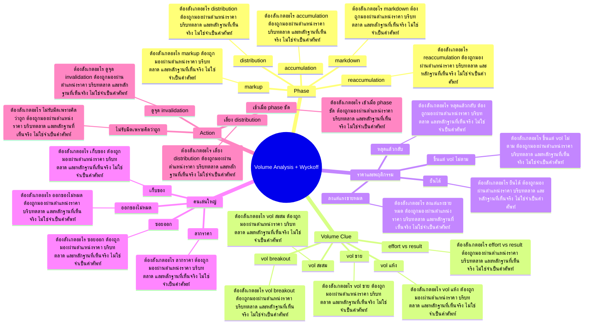

# Mind Map: Volume Analysis + Wyckoff

## Central Idea
Wyckoff ทำให้เห็น story ของราคา volume และผู้เล่นใหญ่ ว่ากำลังสะสม ไล่ราคา แจกจ่าย หรือเริ่มลง

## Learning Context
- Phase: อ่านเกมสะสมและแจกจ่าย
- Category: Volume

## Learning Goals
- เข้าใจ accumulation, markup, distribution, markdown
- อ่าน volume เทียบตำแหน่งราคา
- มองกราฟเป็นเรื่องราว ไม่ใช่แท่งเทียนแยกกัน

## Keywords To Remember
vol, volume, high, low, distribution, big, new, นะครับ, selling, price, day, time

## Big Branches + Deep Branches
### Phase
- ภาพรวม: กิ่งนี้เชื่อมกับบทเรียนหลักเพราะ Phase เป็นตัวแปลงความรู้ให้กลายเป็นการตัดสินใจ โดยเฉพาะเรื่อง accumulation, markup, distribution
- accumulation
  - ต้องสังเกตอะไร: accumulation ต้องถูกมองผ่านตำแหน่งราคา บริบทตลาด และหลักฐานที่เห็นจริง ไม่ใช่จำเป็นคำศัพท์
  - ใช้ตอนไหน: ใช้ accumulation เพื่อช่วยตัดสินใจว่าแผนในกิ่ง Phase ควรเดินต่อ รอ ย่อขนาด หรือยกเลิก
  - ถ้าผิดต้องทำอะไร: ถ้าหลักฐานไม่ยืนยัน accumulation ให้ลดความมั่นใจทันที และกลับไปถามจุดผิดทางของแผน
- markup
  - ต้องสังเกตอะไร: markup ต้องถูกมองผ่านตำแหน่งราคา บริบทตลาด และหลักฐานที่เห็นจริง ไม่ใช่จำเป็นคำศัพท์
  - ใช้ตอนไหน: ใช้ markup เพื่อช่วยตัดสินใจว่าแผนในกิ่ง Phase ควรเดินต่อ รอ ย่อขนาด หรือยกเลิก
  - ถ้าผิดต้องทำอะไร: ถ้าหลักฐานไม่ยืนยัน markup ให้ลดความมั่นใจทันที และกลับไปถามจุดผิดทางของแผน
- distribution
  - ต้องสังเกตอะไร: distribution ต้องถูกมองผ่านตำแหน่งราคา บริบทตลาด และหลักฐานที่เห็นจริง ไม่ใช่จำเป็นคำศัพท์
  - ใช้ตอนไหน: ใช้ distribution เพื่อช่วยตัดสินใจว่าแผนในกิ่ง Phase ควรเดินต่อ รอ ย่อขนาด หรือยกเลิก
  - ถ้าผิดต้องทำอะไร: ถ้าหลักฐานไม่ยืนยัน distribution ให้ลดความมั่นใจทันที และกลับไปถามจุดผิดทางของแผน
- markdown
  - ต้องสังเกตอะไร: markdown ต้องถูกมองผ่านตำแหน่งราคา บริบทตลาด และหลักฐานที่เห็นจริง ไม่ใช่จำเป็นคำศัพท์
  - ใช้ตอนไหน: ใช้ markdown เพื่อช่วยตัดสินใจว่าแผนในกิ่ง Phase ควรเดินต่อ รอ ย่อขนาด หรือยกเลิก
  - ถ้าผิดต้องทำอะไร: ถ้าหลักฐานไม่ยืนยัน markdown ให้ลดความมั่นใจทันที และกลับไปถามจุดผิดทางของแผน
- reaccumulation
  - ต้องสังเกตอะไร: reaccumulation ต้องถูกมองผ่านตำแหน่งราคา บริบทตลาด และหลักฐานที่เห็นจริง ไม่ใช่จำเป็นคำศัพท์
  - ใช้ตอนไหน: ใช้ reaccumulation เพื่อช่วยตัดสินใจว่าแผนในกิ่ง Phase ควรเดินต่อ รอ ย่อขนาด หรือยกเลิก
  - ถ้าผิดต้องทำอะไร: ถ้าหลักฐานไม่ยืนยัน reaccumulation ให้ลดความมั่นใจทันที และกลับไปถามจุดผิดทางของแผน

### Volume Clue
- ภาพรวม: กิ่งนี้เชื่อมกับบทเรียนหลักเพราะ Volume Clue เป็นตัวแปลงความรู้ให้กลายเป็นการตัดสินใจ โดยเฉพาะเรื่อง vol สะสม, vol breakout, vol ขาย
- vol สะสม
  - ต้องสังเกตอะไร: vol สะสม ต้องถูกมองผ่านตำแหน่งราคา บริบทตลาด และหลักฐานที่เห็นจริง ไม่ใช่จำเป็นคำศัพท์
  - ใช้ตอนไหน: ใช้ vol สะสม เพื่อช่วยตัดสินใจว่าแผนในกิ่ง Volume Clue ควรเดินต่อ รอ ย่อขนาด หรือยกเลิก
  - ถ้าผิดต้องทำอะไร: ถ้าหลักฐานไม่ยืนยัน vol สะสม ให้ลดความมั่นใจทันที และกลับไปถามจุดผิดทางของแผน
- vol breakout
  - ต้องสังเกตอะไร: vol breakout ต้องถูกมองผ่านตำแหน่งราคา บริบทตลาด และหลักฐานที่เห็นจริง ไม่ใช่จำเป็นคำศัพท์
  - ใช้ตอนไหน: ใช้ vol breakout เพื่อช่วยตัดสินใจว่าแผนในกิ่ง Volume Clue ควรเดินต่อ รอ ย่อขนาด หรือยกเลิก
  - ถ้าผิดต้องทำอะไร: ถ้าหลักฐานไม่ยืนยัน vol breakout ให้ลดความมั่นใจทันที และกลับไปถามจุดผิดทางของแผน
- vol ขาย
  - ต้องสังเกตอะไร: vol ขาย ต้องถูกมองผ่านตำแหน่งราคา บริบทตลาด และหลักฐานที่เห็นจริง ไม่ใช่จำเป็นคำศัพท์
  - ใช้ตอนไหน: ใช้ vol ขาย เพื่อช่วยตัดสินใจว่าแผนในกิ่ง Volume Clue ควรเดินต่อ รอ ย่อขนาด หรือยกเลิก
  - ถ้าผิดต้องทำอะไร: ถ้าหลักฐานไม่ยืนยัน vol ขาย ให้ลดความมั่นใจทันที และกลับไปถามจุดผิดทางของแผน
- vol แห้ง
  - ต้องสังเกตอะไร: vol แห้ง ต้องถูกมองผ่านตำแหน่งราคา บริบทตลาด และหลักฐานที่เห็นจริง ไม่ใช่จำเป็นคำศัพท์
  - ใช้ตอนไหน: ใช้ vol แห้ง เพื่อช่วยตัดสินใจว่าแผนในกิ่ง Volume Clue ควรเดินต่อ รอ ย่อขนาด หรือยกเลิก
  - ถ้าผิดต้องทำอะไร: ถ้าหลักฐานไม่ยืนยัน vol แห้ง ให้ลดความมั่นใจทันที และกลับไปถามจุดผิดทางของแผน
- effort vs result
  - ต้องสังเกตอะไร: effort vs result ต้องถูกมองผ่านตำแหน่งราคา บริบทตลาด และหลักฐานที่เห็นจริง ไม่ใช่จำเป็นคำศัพท์
  - ใช้ตอนไหน: ใช้ effort vs result เพื่อช่วยตัดสินใจว่าแผนในกิ่ง Volume Clue ควรเดินต่อ รอ ย่อขนาด หรือยกเลิก
  - ถ้าผิดต้องทำอะไร: ถ้าหลักฐานไม่ยืนยัน effort vs result ให้ลดความมั่นใจทันที และกลับไปถามจุดผิดทางของแผน

### ราคาและพฤติกรรม
- ภาพรวม: กิ่งนี้เชื่อมกับบทเรียนหลักเพราะ ราคาและพฤติกรรม เป็นตัวแปลงความรู้ให้กลายเป็นการตัดสินใจ โดยเฉพาะเรื่อง ยืนได้, หลุดแล้วกลับ, ขึ้นแต่ vol ไม่ตาม
- ยืนได้
  - ต้องสังเกตอะไร: ยืนได้ ต้องถูกมองผ่านตำแหน่งราคา บริบทตลาด และหลักฐานที่เห็นจริง ไม่ใช่จำเป็นคำศัพท์
  - ใช้ตอนไหน: ใช้ ยืนได้ เพื่อช่วยตัดสินใจว่าแผนในกิ่ง ราคาและพฤติกรรม ควรเดินต่อ รอ ย่อขนาด หรือยกเลิก
  - ถ้าผิดต้องทำอะไร: ถ้าหลักฐานไม่ยืนยัน ยืนได้ ให้ลดความมั่นใจทันที และกลับไปถามจุดผิดทางของแผน
- หลุดแล้วกลับ
  - ต้องสังเกตอะไร: หลุดแล้วกลับ ต้องถูกมองผ่านตำแหน่งราคา บริบทตลาด และหลักฐานที่เห็นจริง ไม่ใช่จำเป็นคำศัพท์
  - ใช้ตอนไหน: ใช้ หลุดแล้วกลับ เพื่อช่วยตัดสินใจว่าแผนในกิ่ง ราคาและพฤติกรรม ควรเดินต่อ รอ ย่อขนาด หรือยกเลิก
  - ถ้าผิดต้องทำอะไร: ถ้าหลักฐานไม่ยืนยัน หลุดแล้วกลับ ให้ลดความมั่นใจทันที และกลับไปถามจุดผิดทางของแผน
- ขึ้นแต่ vol ไม่ตาม
  - ต้องสังเกตอะไร: ขึ้นแต่ vol ไม่ตาม ต้องถูกมองผ่านตำแหน่งราคา บริบทตลาด และหลักฐานที่เห็นจริง ไม่ใช่จำเป็นคำศัพท์
  - ใช้ตอนไหน: ใช้ ขึ้นแต่ vol ไม่ตาม เพื่อช่วยตัดสินใจว่าแผนในกิ่ง ราคาและพฤติกรรม ควรเดินต่อ รอ ย่อขนาด หรือยกเลิก
  - ถ้าผิดต้องทำอะไร: ถ้าหลักฐานไม่ยืนยัน ขึ้นแต่ vol ไม่ตาม ให้ลดความมั่นใจทันที และกลับไปถามจุดผิดทางของแผน
- ลงแต่แรงขายหมด
  - ต้องสังเกตอะไร: ลงแต่แรงขายหมด ต้องถูกมองผ่านตำแหน่งราคา บริบทตลาด และหลักฐานที่เห็นจริง ไม่ใช่จำเป็นคำศัพท์
  - ใช้ตอนไหน: ใช้ ลงแต่แรงขายหมด เพื่อช่วยตัดสินใจว่าแผนในกิ่ง ราคาและพฤติกรรม ควรเดินต่อ รอ ย่อขนาด หรือยกเลิก
  - ถ้าผิดต้องทำอะไร: ถ้าหลักฐานไม่ยืนยัน ลงแต่แรงขายหมด ให้ลดความมั่นใจทันที และกลับไปถามจุดผิดทางของแผน

### คนเล่นใหญ่
- ภาพรวม: กิ่งนี้เชื่อมกับบทเรียนหลักเพราะ คนเล่นใหญ่ เป็นตัวแปลงความรู้ให้กลายเป็นการตัดสินใจ โดยเฉพาะเรื่อง เก็บของ, ลากราคา, ซอยออก
- เก็บของ
  - ต้องสังเกตอะไร: เก็บของ ต้องถูกมองผ่านตำแหน่งราคา บริบทตลาด และหลักฐานที่เห็นจริง ไม่ใช่จำเป็นคำศัพท์
  - ใช้ตอนไหน: ใช้ เก็บของ เพื่อช่วยตัดสินใจว่าแผนในกิ่ง คนเล่นใหญ่ ควรเดินต่อ รอ ย่อขนาด หรือยกเลิก
  - ถ้าผิดต้องทำอะไร: ถ้าหลักฐานไม่ยืนยัน เก็บของ ให้ลดความมั่นใจทันที และกลับไปถามจุดผิดทางของแผน
- ลากราคา
  - ต้องสังเกตอะไร: ลากราคา ต้องถูกมองผ่านตำแหน่งราคา บริบทตลาด และหลักฐานที่เห็นจริง ไม่ใช่จำเป็นคำศัพท์
  - ใช้ตอนไหน: ใช้ ลากราคา เพื่อช่วยตัดสินใจว่าแผนในกิ่ง คนเล่นใหญ่ ควรเดินต่อ รอ ย่อขนาด หรือยกเลิก
  - ถ้าผิดต้องทำอะไร: ถ้าหลักฐานไม่ยืนยัน ลากราคา ให้ลดความมั่นใจทันที และกลับไปถามจุดผิดทางของแผน
- ซอยออก
  - ต้องสังเกตอะไร: ซอยออก ต้องถูกมองผ่านตำแหน่งราคา บริบทตลาด และหลักฐานที่เห็นจริง ไม่ใช่จำเป็นคำศัพท์
  - ใช้ตอนไหน: ใช้ ซอยออก เพื่อช่วยตัดสินใจว่าแผนในกิ่ง คนเล่นใหญ่ ควรเดินต่อ รอ ย่อขนาด หรือยกเลิก
  - ถ้าผิดต้องทำอะไร: ถ้าหลักฐานไม่ยืนยัน ซอยออก ให้ลดความมั่นใจทันที และกลับไปถามจุดผิดทางของแผน
- ออกของไม่หมด
  - ต้องสังเกตอะไร: ออกของไม่หมด ต้องถูกมองผ่านตำแหน่งราคา บริบทตลาด และหลักฐานที่เห็นจริง ไม่ใช่จำเป็นคำศัพท์
  - ใช้ตอนไหน: ใช้ ออกของไม่หมด เพื่อช่วยตัดสินใจว่าแผนในกิ่ง คนเล่นใหญ่ ควรเดินต่อ รอ ย่อขนาด หรือยกเลิก
  - ถ้าผิดต้องทำอะไร: ถ้าหลักฐานไม่ยืนยัน ออกของไม่หมด ให้ลดความมั่นใจทันที และกลับไปถามจุดผิดทางของแผน

### Action
- ภาพรวม: กิ่งนี้เชื่อมกับบทเรียนหลักเพราะ Action เป็นตัวแปลงความรู้ให้กลายเป็นการตัดสินใจ โดยเฉพาะเรื่อง เข้าเมื่อ phase ชัด, เลี่ยง distribution, ดูจุด invalidation
- เข้าเมื่อ phase ชัด
  - ต้องสังเกตอะไร: เข้าเมื่อ phase ชัด ต้องถูกมองผ่านตำแหน่งราคา บริบทตลาด และหลักฐานที่เห็นจริง ไม่ใช่จำเป็นคำศัพท์
  - ใช้ตอนไหน: ใช้ เข้าเมื่อ phase ชัด เพื่อช่วยตัดสินใจว่าแผนในกิ่ง Action ควรเดินต่อ รอ ย่อขนาด หรือยกเลิก
  - ถ้าผิดต้องทำอะไร: ถ้าหลักฐานไม่ยืนยัน เข้าเมื่อ phase ชัด ให้ลดความมั่นใจทันที และกลับไปถามจุดผิดทางของแผน
- เลี่ยง distribution
  - ต้องสังเกตอะไร: เลี่ยง distribution ต้องถูกมองผ่านตำแหน่งราคา บริบทตลาด และหลักฐานที่เห็นจริง ไม่ใช่จำเป็นคำศัพท์
  - ใช้ตอนไหน: ใช้ เลี่ยง distribution เพื่อช่วยตัดสินใจว่าแผนในกิ่ง Action ควรเดินต่อ รอ ย่อขนาด หรือยกเลิก
  - ถ้าผิดต้องทำอะไร: ถ้าหลักฐานไม่ยืนยัน เลี่ยง distribution ให้ลดความมั่นใจทันที และกลับไปถามจุดผิดทางของแผน
- ดูจุด invalidation
  - ต้องสังเกตอะไร: ดูจุด invalidation ต้องถูกมองผ่านตำแหน่งราคา บริบทตลาด และหลักฐานที่เห็นจริง ไม่ใช่จำเป็นคำศัพท์
  - ใช้ตอนไหน: ใช้ ดูจุด invalidation เพื่อช่วยตัดสินใจว่าแผนในกิ่ง Action ควรเดินต่อ รอ ย่อขนาด หรือยกเลิก
  - ถ้าผิดต้องทำอะไร: ถ้าหลักฐานไม่ยืนยัน ดูจุด invalidation ให้ลดความมั่นใจทันที และกลับไปถามจุดผิดทางของแผน
- ไม่รับมีดเพราะคิดว่าถูก
  - ต้องสังเกตอะไร: ไม่รับมีดเพราะคิดว่าถูก ต้องถูกมองผ่านตำแหน่งราคา บริบทตลาด และหลักฐานที่เห็นจริง ไม่ใช่จำเป็นคำศัพท์
  - ใช้ตอนไหน: ใช้ ไม่รับมีดเพราะคิดว่าถูก เพื่อช่วยตัดสินใจว่าแผนในกิ่ง Action ควรเดินต่อ รอ ย่อขนาด หรือยกเลิก
  - ถ้าผิดต้องทำอะไร: ถ้าหลักฐานไม่ยืนยัน ไม่รับมีดเพราะคิดว่าถูก ให้ลดความมั่นใจทันที และกลับไปถามจุดผิดทางของแผน

## Transcript Signals
> ตรงเนี้ยกลับพุ่งขึ้นอย่างรวดเร็วพร้อม กับราคาที่พุ่งขึ้นอย่างรุนแรงมากๆหลัง จากที่ขึ้นมานานอันนี้เราเรียกว่าเป็น panic buy หรือ buying cmax และหลัง จากนั้นน่ะราคาเริ่มลดต่ำลงถือว่าจุดนั้น น่ะเป็นจุดจบของแนวโน้มขาขึ้นและจะ เปลี่ยนกลายเป็นแนวโน้มขาลงในอนาคต...

> สัญญาณ volume pe ที่ข้างล่างก่อนจะเข้า สู่กรอบสะสมครั้งใหม่ หลังจากเกิด SC แล้วเนี่ยหุ้นตัวนั้น เนี่ยจะ หมดขาลงและจะเริ่มปรับปตัวขึ้นอาจจะมีการ เด้งแบบvsชฟก่อนในช่วงแรกๆครับคือปรับตัว ขึ้นติดต่อกันหลายวันแต่ปริมาณการซื้อขาย...

> หรือคนที่มีเงินมหาศาลเนี่ยครับเค้าเข้า มาเก็บสะสมหุ้นเนาะอือาจจะมองว่ามันเริ่ม ถูกมั้ยหรือว่าราคามันเริ่ม price in ข่าวร้ายไปหมดแล้วเงี้ยครับก็เริ่มมาเก็บ สะสมเพราะมองมองถึงการฟื้นตัวที่จะเกิด ขึ้นในอนาคตหรือเอาจจะรู้ข้อมูลบางอย่าง...

## Decision Rules
- Phase: จะใช้กิ่งนี้ได้เมื่อเห็น accumulation และ markup พร้อมกัน ถ้าเจอเงื่อนไขตรงข้ามกับ reaccumulation ให้ลดขนาดหรือหยุด
- Volume Clue: จะใช้กิ่งนี้ได้เมื่อเห็น vol สะสม และ vol breakout พร้อมกัน ถ้าเจอเงื่อนไขตรงข้ามกับ effort vs result ให้ลดขนาดหรือหยุด
- ราคาและพฤติกรรม: จะใช้กิ่งนี้ได้เมื่อเห็น ยืนได้ และ หลุดแล้วกลับ พร้อมกัน ถ้าเจอเงื่อนไขตรงข้ามกับ ลงแต่แรงขายหมด ให้ลดขนาดหรือหยุด
- คนเล่นใหญ่: จะใช้กิ่งนี้ได้เมื่อเห็น เก็บของ และ ลากราคา พร้อมกัน ถ้าเจอเงื่อนไขตรงข้ามกับ ออกของไม่หมด ให้ลดขนาดหรือหยุด
- Action: จะใช้กิ่งนี้ได้เมื่อเห็น เข้าเมื่อ phase ชัด และ เลี่ยง distribution พร้อมกัน ถ้าเจอเงื่อนไขตรงข้ามกับ ไม่รับมีดเพราะคิดว่าถูก ให้ลดขนาดหรือหยุด

## Common Mistakes
- จำชื่อบทได้ แต่ไม่รู้ว่า Phase ต้องเปลี่ยนพฤติกรรมการเทรดตรงไหน
- เห็นสัญญาณหนึ่งอย่างแล้วรีบสรุป ทั้งที่ยังไม่ได้เช็กบริบทและหลักฐานประกอบ
- วางแผนตอนใจเย็น แต่พอราคาเคลื่อนไหวจริงกลับเปลี่ยนกฎตามอารมณ์
- สนใจ Action แค่ตอนอยากเข้า แต่ไม่ใช้เป็นเงื่อนไขตอนต้องออกหรือหยุด

## Practice Checklist
- ทวนเป้าหมายบทนี้ก่อนเริ่ม: เข้าใจ accumulation, markup, distribution, markdown
- เปิดกราฟหรือกรณีศึกษาจริง 1 ตัว แล้วระบุว่าเกี่ยวกับกิ่ง 'Phase' ตรงไหน
- เขียนก่อนเข้าว่า thesis คืออะไร หลักฐานคืออะไร และถ้าผิดจะยอมรับตรงไหน
- แยกสิ่งที่เห็นจริงออกจากสิ่งที่อยากให้เกิด แล้วให้คะแนนความมั่นใจ 1-5
- หลังจบเคส ให้บันทึกว่าแพ้/ชนะเพราะระบบ หรือเพราะอารมณ์

## Final Destination
อ่านกราฟเป็นเรื่องราว ไม่ใช่แท่งแยกกัน และรู้ว่าเงินใหญ่กำลังทำอะไรกับราคา

## Questions for Patiphan
1. กิ่งไหนคือแก่นที่สุดของบทนี้
2. กิ่งไหนเกี่ยวกับจุดอ่อนของ Patiphan มากที่สุด
3. ถ้าจะเอาไปใช้กับกราฟจริง ต้องเห็นหลักฐานอะไร
4. ถ้าทำผิด บทนี้เตือนให้หยุดตรงไหน
5. ปลายทางของบทนี้จะเข้าไปอยู่ในระบบเทรดส่วนไหน
