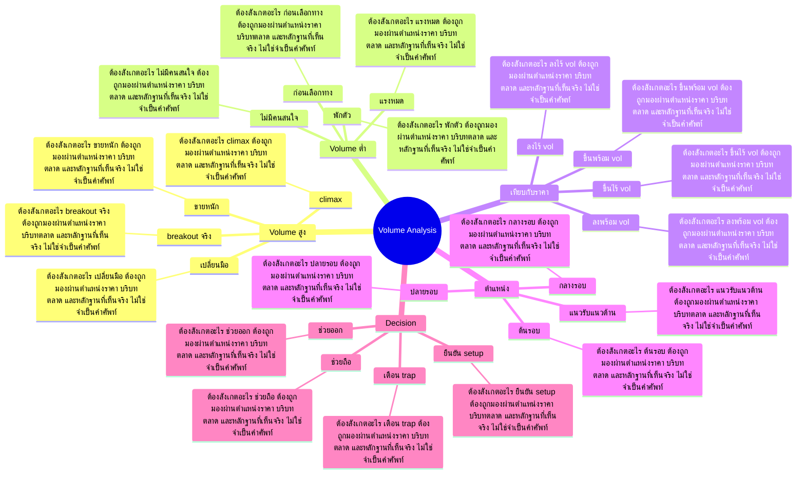

# Mind Map: Volume Analysis

## Central Idea
Volume คือหลักฐานของความจริงจัง แต่ความหมายขึ้นกับตำแหน่งราคาและบริบทของ trend

## Learning Context
- Phase: อ่านหลักฐานของแรง
- Category: Volume

## Learning Goals
- อ่าน volume สูง/ต่ำในบริบทต่างกัน
- แยกแรงซื้อจริง แรงขายจริง และแรงหมด
- ใช้ volume ยืนยันหรือปฏิเสธ price action

## Keywords To Remember
vol, volume, อ่า, stop, view, นะครับ, อ่ะ, trading, high, เอ่อ, low, เนี่ย

## Big Branches + Deep Branches
### Volume สูง
- ภาพรวม: กิ่งนี้เชื่อมกับบทเรียนหลักเพราะ Volume สูง เป็นตัวแปลงความรู้ให้กลายเป็นการตัดสินใจ โดยเฉพาะเรื่อง breakout จริง, ขายหนัก, climax
- breakout จริง
  - ต้องสังเกตอะไร: breakout จริง ต้องถูกมองผ่านตำแหน่งราคา บริบทตลาด และหลักฐานที่เห็นจริง ไม่ใช่จำเป็นคำศัพท์
  - ใช้ตอนไหน: ใช้ breakout จริง เพื่อช่วยตัดสินใจว่าแผนในกิ่ง Volume สูง ควรเดินต่อ รอ ย่อขนาด หรือยกเลิก
  - ถ้าผิดต้องทำอะไร: ถ้าหลักฐานไม่ยืนยัน breakout จริง ให้ลดความมั่นใจทันที และกลับไปถามจุดผิดทางของแผน
- ขายหนัก
  - ต้องสังเกตอะไร: ขายหนัก ต้องถูกมองผ่านตำแหน่งราคา บริบทตลาด และหลักฐานที่เห็นจริง ไม่ใช่จำเป็นคำศัพท์
  - ใช้ตอนไหน: ใช้ ขายหนัก เพื่อช่วยตัดสินใจว่าแผนในกิ่ง Volume สูง ควรเดินต่อ รอ ย่อขนาด หรือยกเลิก
  - ถ้าผิดต้องทำอะไร: ถ้าหลักฐานไม่ยืนยัน ขายหนัก ให้ลดความมั่นใจทันที และกลับไปถามจุดผิดทางของแผน
- climax
  - ต้องสังเกตอะไร: climax ต้องถูกมองผ่านตำแหน่งราคา บริบทตลาด และหลักฐานที่เห็นจริง ไม่ใช่จำเป็นคำศัพท์
  - ใช้ตอนไหน: ใช้ climax เพื่อช่วยตัดสินใจว่าแผนในกิ่ง Volume สูง ควรเดินต่อ รอ ย่อขนาด หรือยกเลิก
  - ถ้าผิดต้องทำอะไร: ถ้าหลักฐานไม่ยืนยัน climax ให้ลดความมั่นใจทันที และกลับไปถามจุดผิดทางของแผน
- เปลี่ยนมือ
  - ต้องสังเกตอะไร: เปลี่ยนมือ ต้องถูกมองผ่านตำแหน่งราคา บริบทตลาด และหลักฐานที่เห็นจริง ไม่ใช่จำเป็นคำศัพท์
  - ใช้ตอนไหน: ใช้ เปลี่ยนมือ เพื่อช่วยตัดสินใจว่าแผนในกิ่ง Volume สูง ควรเดินต่อ รอ ย่อขนาด หรือยกเลิก
  - ถ้าผิดต้องทำอะไร: ถ้าหลักฐานไม่ยืนยัน เปลี่ยนมือ ให้ลดความมั่นใจทันที และกลับไปถามจุดผิดทางของแผน

### Volume ต่ำ
- ภาพรวม: กิ่งนี้เชื่อมกับบทเรียนหลักเพราะ Volume ต่ำ เป็นตัวแปลงความรู้ให้กลายเป็นการตัดสินใจ โดยเฉพาะเรื่อง พักตัว, ไม่มีคนสนใจ, แรงหมด
- พักตัว
  - ต้องสังเกตอะไร: พักตัว ต้องถูกมองผ่านตำแหน่งราคา บริบทตลาด และหลักฐานที่เห็นจริง ไม่ใช่จำเป็นคำศัพท์
  - ใช้ตอนไหน: ใช้ พักตัว เพื่อช่วยตัดสินใจว่าแผนในกิ่ง Volume ต่ำ ควรเดินต่อ รอ ย่อขนาด หรือยกเลิก
  - ถ้าผิดต้องทำอะไร: ถ้าหลักฐานไม่ยืนยัน พักตัว ให้ลดความมั่นใจทันที และกลับไปถามจุดผิดทางของแผน
- ไม่มีคนสนใจ
  - ต้องสังเกตอะไร: ไม่มีคนสนใจ ต้องถูกมองผ่านตำแหน่งราคา บริบทตลาด และหลักฐานที่เห็นจริง ไม่ใช่จำเป็นคำศัพท์
  - ใช้ตอนไหน: ใช้ ไม่มีคนสนใจ เพื่อช่วยตัดสินใจว่าแผนในกิ่ง Volume ต่ำ ควรเดินต่อ รอ ย่อขนาด หรือยกเลิก
  - ถ้าผิดต้องทำอะไร: ถ้าหลักฐานไม่ยืนยัน ไม่มีคนสนใจ ให้ลดความมั่นใจทันที และกลับไปถามจุดผิดทางของแผน
- แรงหมด
  - ต้องสังเกตอะไร: แรงหมด ต้องถูกมองผ่านตำแหน่งราคา บริบทตลาด และหลักฐานที่เห็นจริง ไม่ใช่จำเป็นคำศัพท์
  - ใช้ตอนไหน: ใช้ แรงหมด เพื่อช่วยตัดสินใจว่าแผนในกิ่ง Volume ต่ำ ควรเดินต่อ รอ ย่อขนาด หรือยกเลิก
  - ถ้าผิดต้องทำอะไร: ถ้าหลักฐานไม่ยืนยัน แรงหมด ให้ลดความมั่นใจทันที และกลับไปถามจุดผิดทางของแผน
- ก่อนเลือกทาง
  - ต้องสังเกตอะไร: ก่อนเลือกทาง ต้องถูกมองผ่านตำแหน่งราคา บริบทตลาด และหลักฐานที่เห็นจริง ไม่ใช่จำเป็นคำศัพท์
  - ใช้ตอนไหน: ใช้ ก่อนเลือกทาง เพื่อช่วยตัดสินใจว่าแผนในกิ่ง Volume ต่ำ ควรเดินต่อ รอ ย่อขนาด หรือยกเลิก
  - ถ้าผิดต้องทำอะไร: ถ้าหลักฐานไม่ยืนยัน ก่อนเลือกทาง ให้ลดความมั่นใจทันที และกลับไปถามจุดผิดทางของแผน

### เทียบกับราคา
- ภาพรวม: กิ่งนี้เชื่อมกับบทเรียนหลักเพราะ เทียบกับราคา เป็นตัวแปลงความรู้ให้กลายเป็นการตัดสินใจ โดยเฉพาะเรื่อง ขึ้นพร้อม vol, ขึ้นไร้ vol, ลงพร้อม vol
- ขึ้นพร้อม vol
  - ต้องสังเกตอะไร: ขึ้นพร้อม vol ต้องถูกมองผ่านตำแหน่งราคา บริบทตลาด และหลักฐานที่เห็นจริง ไม่ใช่จำเป็นคำศัพท์
  - ใช้ตอนไหน: ใช้ ขึ้นพร้อม vol เพื่อช่วยตัดสินใจว่าแผนในกิ่ง เทียบกับราคา ควรเดินต่อ รอ ย่อขนาด หรือยกเลิก
  - ถ้าผิดต้องทำอะไร: ถ้าหลักฐานไม่ยืนยัน ขึ้นพร้อม vol ให้ลดความมั่นใจทันที และกลับไปถามจุดผิดทางของแผน
- ขึ้นไร้ vol
  - ต้องสังเกตอะไร: ขึ้นไร้ vol ต้องถูกมองผ่านตำแหน่งราคา บริบทตลาด และหลักฐานที่เห็นจริง ไม่ใช่จำเป็นคำศัพท์
  - ใช้ตอนไหน: ใช้ ขึ้นไร้ vol เพื่อช่วยตัดสินใจว่าแผนในกิ่ง เทียบกับราคา ควรเดินต่อ รอ ย่อขนาด หรือยกเลิก
  - ถ้าผิดต้องทำอะไร: ถ้าหลักฐานไม่ยืนยัน ขึ้นไร้ vol ให้ลดความมั่นใจทันที และกลับไปถามจุดผิดทางของแผน
- ลงพร้อม vol
  - ต้องสังเกตอะไร: ลงพร้อม vol ต้องถูกมองผ่านตำแหน่งราคา บริบทตลาด และหลักฐานที่เห็นจริง ไม่ใช่จำเป็นคำศัพท์
  - ใช้ตอนไหน: ใช้ ลงพร้อม vol เพื่อช่วยตัดสินใจว่าแผนในกิ่ง เทียบกับราคา ควรเดินต่อ รอ ย่อขนาด หรือยกเลิก
  - ถ้าผิดต้องทำอะไร: ถ้าหลักฐานไม่ยืนยัน ลงพร้อม vol ให้ลดความมั่นใจทันที และกลับไปถามจุดผิดทางของแผน
- ลงไร้ vol
  - ต้องสังเกตอะไร: ลงไร้ vol ต้องถูกมองผ่านตำแหน่งราคา บริบทตลาด และหลักฐานที่เห็นจริง ไม่ใช่จำเป็นคำศัพท์
  - ใช้ตอนไหน: ใช้ ลงไร้ vol เพื่อช่วยตัดสินใจว่าแผนในกิ่ง เทียบกับราคา ควรเดินต่อ รอ ย่อขนาด หรือยกเลิก
  - ถ้าผิดต้องทำอะไร: ถ้าหลักฐานไม่ยืนยัน ลงไร้ vol ให้ลดความมั่นใจทันที และกลับไปถามจุดผิดทางของแผน

### ตำแหน่ง
- ภาพรวม: กิ่งนี้เชื่อมกับบทเรียนหลักเพราะ ตำแหน่ง เป็นตัวแปลงความรู้ให้กลายเป็นการตัดสินใจ โดยเฉพาะเรื่อง ต้นรอบ, กลางรอบ, ปลายรอบ
- ต้นรอบ
  - ต้องสังเกตอะไร: ต้นรอบ ต้องถูกมองผ่านตำแหน่งราคา บริบทตลาด และหลักฐานที่เห็นจริง ไม่ใช่จำเป็นคำศัพท์
  - ใช้ตอนไหน: ใช้ ต้นรอบ เพื่อช่วยตัดสินใจว่าแผนในกิ่ง ตำแหน่ง ควรเดินต่อ รอ ย่อขนาด หรือยกเลิก
  - ถ้าผิดต้องทำอะไร: ถ้าหลักฐานไม่ยืนยัน ต้นรอบ ให้ลดความมั่นใจทันที และกลับไปถามจุดผิดทางของแผน
- กลางรอบ
  - ต้องสังเกตอะไร: กลางรอบ ต้องถูกมองผ่านตำแหน่งราคา บริบทตลาด และหลักฐานที่เห็นจริง ไม่ใช่จำเป็นคำศัพท์
  - ใช้ตอนไหน: ใช้ กลางรอบ เพื่อช่วยตัดสินใจว่าแผนในกิ่ง ตำแหน่ง ควรเดินต่อ รอ ย่อขนาด หรือยกเลิก
  - ถ้าผิดต้องทำอะไร: ถ้าหลักฐานไม่ยืนยัน กลางรอบ ให้ลดความมั่นใจทันที และกลับไปถามจุดผิดทางของแผน
- ปลายรอบ
  - ต้องสังเกตอะไร: ปลายรอบ ต้องถูกมองผ่านตำแหน่งราคา บริบทตลาด และหลักฐานที่เห็นจริง ไม่ใช่จำเป็นคำศัพท์
  - ใช้ตอนไหน: ใช้ ปลายรอบ เพื่อช่วยตัดสินใจว่าแผนในกิ่ง ตำแหน่ง ควรเดินต่อ รอ ย่อขนาด หรือยกเลิก
  - ถ้าผิดต้องทำอะไร: ถ้าหลักฐานไม่ยืนยัน ปลายรอบ ให้ลดความมั่นใจทันที และกลับไปถามจุดผิดทางของแผน
- แนวรับแนวต้าน
  - ต้องสังเกตอะไร: แนวรับแนวต้าน ต้องถูกมองผ่านตำแหน่งราคา บริบทตลาด และหลักฐานที่เห็นจริง ไม่ใช่จำเป็นคำศัพท์
  - ใช้ตอนไหน: ใช้ แนวรับแนวต้าน เพื่อช่วยตัดสินใจว่าแผนในกิ่ง ตำแหน่ง ควรเดินต่อ รอ ย่อขนาด หรือยกเลิก
  - ถ้าผิดต้องทำอะไร: ถ้าหลักฐานไม่ยืนยัน แนวรับแนวต้าน ให้ลดความมั่นใจทันที และกลับไปถามจุดผิดทางของแผน

### Decision
- ภาพรวม: กิ่งนี้เชื่อมกับบทเรียนหลักเพราะ Decision เป็นตัวแปลงความรู้ให้กลายเป็นการตัดสินใจ โดยเฉพาะเรื่อง ยืนยัน setup, เตือน trap, ช่วยถือ
- ยืนยัน setup
  - ต้องสังเกตอะไร: ยืนยัน setup ต้องถูกมองผ่านตำแหน่งราคา บริบทตลาด และหลักฐานที่เห็นจริง ไม่ใช่จำเป็นคำศัพท์
  - ใช้ตอนไหน: ใช้ ยืนยัน setup เพื่อช่วยตัดสินใจว่าแผนในกิ่ง Decision ควรเดินต่อ รอ ย่อขนาด หรือยกเลิก
  - ถ้าผิดต้องทำอะไร: ถ้าหลักฐานไม่ยืนยัน ยืนยัน setup ให้ลดความมั่นใจทันที และกลับไปถามจุดผิดทางของแผน
- เตือน trap
  - ต้องสังเกตอะไร: เตือน trap ต้องถูกมองผ่านตำแหน่งราคา บริบทตลาด และหลักฐานที่เห็นจริง ไม่ใช่จำเป็นคำศัพท์
  - ใช้ตอนไหน: ใช้ เตือน trap เพื่อช่วยตัดสินใจว่าแผนในกิ่ง Decision ควรเดินต่อ รอ ย่อขนาด หรือยกเลิก
  - ถ้าผิดต้องทำอะไร: ถ้าหลักฐานไม่ยืนยัน เตือน trap ให้ลดความมั่นใจทันที และกลับไปถามจุดผิดทางของแผน
- ช่วยถือ
  - ต้องสังเกตอะไร: ช่วยถือ ต้องถูกมองผ่านตำแหน่งราคา บริบทตลาด และหลักฐานที่เห็นจริง ไม่ใช่จำเป็นคำศัพท์
  - ใช้ตอนไหน: ใช้ ช่วยถือ เพื่อช่วยตัดสินใจว่าแผนในกิ่ง Decision ควรเดินต่อ รอ ย่อขนาด หรือยกเลิก
  - ถ้าผิดต้องทำอะไร: ถ้าหลักฐานไม่ยืนยัน ช่วยถือ ให้ลดความมั่นใจทันที และกลับไปถามจุดผิดทางของแผน
- ช่วยออก
  - ต้องสังเกตอะไร: ช่วยออก ต้องถูกมองผ่านตำแหน่งราคา บริบทตลาด และหลักฐานที่เห็นจริง ไม่ใช่จำเป็นคำศัพท์
  - ใช้ตอนไหน: ใช้ ช่วยออก เพื่อช่วยตัดสินใจว่าแผนในกิ่ง Decision ควรเดินต่อ รอ ย่อขนาด หรือยกเลิก
  - ถ้าผิดต้องทำอะไร: ถ้าหลักฐานไม่ยืนยัน ช่วยออก ให้ลดความมั่นใจทันที และกลับไปถามจุดผิดทางของแผน

## Transcript Signals
> แล้วมีตัวไหนอีกเอ่อเอ่อ ชุดนี้ก็เป็นวิ่งผลัดตรงหน้าเค้านี่เห็น ป่ะเนี่ยมันจะใกล้เคียงกันแบบนี้ครับ เพื่อนๆ นี่เห็นป่ะชุบเห็นมั้ยชุบชุบชุบชุบชุบ เห็นมั้ย A B เห็นป่ะสะสมไม่เยอะเห็นป่ะตีสุดท้าย สุดท้ายใครใครคือเม่าใครคือรายย่อยที่สุด...

> >> มันค่อยเริ่มลง >> สุดท้ายถ้าราคาลงคนนั้นไม่มีศักยภาพภาพ ยังไงก็ต้องลง ถ้ามันยังขึ้นต่อปล่อยมันขึ้นต่อไปเรื่อย ๆเรื่อยๆเรื่อยๆมันจะมีคนนึงที่ไม่มี ศักยภาพที่ทำราคาต่อไปขายให้ F ไม่ได้ แล้วราคามันจะโรยคือจบรอบ งงมั้ยครับ >>...

> ขายๆขายให้สุดท้ายปุ๊บขายจบเห็นป่ะราคาลง จบรอบทุนถึงเรื่องของทุนถึงค่อนข้างที่จะ สำคัญมากๆนะครับเนี่ยเหมือนกันน่ะเนี่ยดู กรอบพวกนี้นะผมย้ำอีกครั้งนึงนะท่านี้ถ้า จะเข้า ถ้าจะเล่นนะต้องเข้าพร้อมเค้าเห็นกรอบ อยู่ด้านล่างเข้าตามแล้วไปขายเบรค out ตาม ถ้าเราเข้าเบรค...

## Decision Rules
- Volume สูง: จะใช้กิ่งนี้ได้เมื่อเห็น breakout จริง และ ขายหนัก พร้อมกัน ถ้าเจอเงื่อนไขตรงข้ามกับ เปลี่ยนมือ ให้ลดขนาดหรือหยุด
- Volume ต่ำ: จะใช้กิ่งนี้ได้เมื่อเห็น พักตัว และ ไม่มีคนสนใจ พร้อมกัน ถ้าเจอเงื่อนไขตรงข้ามกับ ก่อนเลือกทาง ให้ลดขนาดหรือหยุด
- เทียบกับราคา: จะใช้กิ่งนี้ได้เมื่อเห็น ขึ้นพร้อม vol และ ขึ้นไร้ vol พร้อมกัน ถ้าเจอเงื่อนไขตรงข้ามกับ ลงไร้ vol ให้ลดขนาดหรือหยุด
- ตำแหน่ง: จะใช้กิ่งนี้ได้เมื่อเห็น ต้นรอบ และ กลางรอบ พร้อมกัน ถ้าเจอเงื่อนไขตรงข้ามกับ แนวรับแนวต้าน ให้ลดขนาดหรือหยุด
- Decision: จะใช้กิ่งนี้ได้เมื่อเห็น ยืนยัน setup และ เตือน trap พร้อมกัน ถ้าเจอเงื่อนไขตรงข้ามกับ ช่วยออก ให้ลดขนาดหรือหยุด

## Common Mistakes
- จำชื่อบทได้ แต่ไม่รู้ว่า Volume สูง ต้องเปลี่ยนพฤติกรรมการเทรดตรงไหน
- เห็นสัญญาณหนึ่งอย่างแล้วรีบสรุป ทั้งที่ยังไม่ได้เช็กบริบทและหลักฐานประกอบ
- วางแผนตอนใจเย็น แต่พอราคาเคลื่อนไหวจริงกลับเปลี่ยนกฎตามอารมณ์
- สนใจ Decision แค่ตอนอยากเข้า แต่ไม่ใช้เป็นเงื่อนไขตอนต้องออกหรือหยุด

## Practice Checklist
- ทวนเป้าหมายบทนี้ก่อนเริ่ม: อ่าน volume สูง/ต่ำในบริบทต่างกัน
- เปิดกราฟหรือกรณีศึกษาจริง 1 ตัว แล้วระบุว่าเกี่ยวกับกิ่ง 'Volume สูง' ตรงไหน
- เขียนก่อนเข้าว่า thesis คืออะไร หลักฐานคืออะไร และถ้าผิดจะยอมรับตรงไหน
- แยกสิ่งที่เห็นจริงออกจากสิ่งที่อยากให้เกิด แล้วให้คะแนนความมั่นใจ 1-5
- หลังจบเคส ให้บันทึกว่าแพ้/ชนะเพราะระบบ หรือเพราะอารมณ์

## Final Destination
อ่าน volume เพื่อยืนยันหรือปฏิเสธ price action ไม่ใช่มองแท่ง volume แบบโดด ๆ

## Questions for Patiphan
1. กิ่งไหนคือแก่นที่สุดของบทนี้
2. กิ่งไหนเกี่ยวกับจุดอ่อนของ Patiphan มากที่สุด
3. ถ้าจะเอาไปใช้กับกราฟจริง ต้องเห็นหลักฐานอะไร
4. ถ้าทำผิด บทนี้เตือนให้หยุดตรงไหน
5. ปลายทางของบทนี้จะเข้าไปอยู่ในระบบเทรดส่วนไหน
