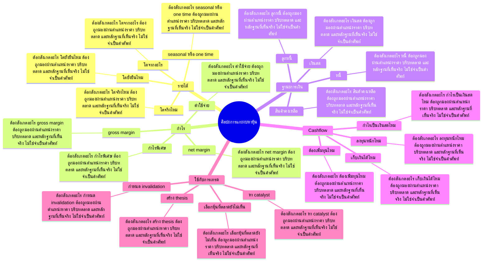

# Mind Map: ศิลปะการแกะงบหาหุ้น

## Central Idea
งบการเงินทำให้เห็นคุณภาพกิจการและความจริงของ story ก่อนเอาเงินไปเชื่อ

## Learning Context
- Phase: อ่านคุณภาพกิจการ
- Category: Fundamental

## Learning Goals
- อ่านงบเพื่อหาคุณภาพ ไม่ใช่แค่ตัวเลขสวย
- เชื่อมรายได้ กำไร หนี้ และ cash flow
- ใช้ fundamental เป็นฐานของ conviction ก่อนเพิ่มน้ำหนัก

## Keywords To Remember
ipo, asset, ล้าน, mbk, market, cap, packaging, business, model, กำไร, ประมาณ, บาท

## Big Branches + Deep Branches
### รายได้
- ภาพรวม: กิ่งนี้เชื่อมกับบทเรียนหลักเพราะ รายได้ เป็นตัวแปลงความรู้ให้กลายเป็นการตัดสินใจ โดยเฉพาะเรื่อง โตจริงไหม, โตจากอะไร, โตยั่งยืนไหม
- โตจริงไหม
  - ต้องสังเกตอะไร: โตจริงไหม ต้องถูกมองผ่านตำแหน่งราคา บริบทตลาด และหลักฐานที่เห็นจริง ไม่ใช่จำเป็นคำศัพท์
  - ใช้ตอนไหน: ใช้ โตจริงไหม เพื่อช่วยตัดสินใจว่าแผนในกิ่ง รายได้ ควรเดินต่อ รอ ย่อขนาด หรือยกเลิก
  - ถ้าผิดต้องทำอะไร: ถ้าหลักฐานไม่ยืนยัน โตจริงไหม ให้ลดความมั่นใจทันที และกลับไปถามจุดผิดทางของแผน
- โตจากอะไร
  - ต้องสังเกตอะไร: โตจากอะไร ต้องถูกมองผ่านตำแหน่งราคา บริบทตลาด และหลักฐานที่เห็นจริง ไม่ใช่จำเป็นคำศัพท์
  - ใช้ตอนไหน: ใช้ โตจากอะไร เพื่อช่วยตัดสินใจว่าแผนในกิ่ง รายได้ ควรเดินต่อ รอ ย่อขนาด หรือยกเลิก
  - ถ้าผิดต้องทำอะไร: ถ้าหลักฐานไม่ยืนยัน โตจากอะไร ให้ลดความมั่นใจทันที และกลับไปถามจุดผิดทางของแผน
- โตยั่งยืนไหม
  - ต้องสังเกตอะไร: โตยั่งยืนไหม ต้องถูกมองผ่านตำแหน่งราคา บริบทตลาด และหลักฐานที่เห็นจริง ไม่ใช่จำเป็นคำศัพท์
  - ใช้ตอนไหน: ใช้ โตยั่งยืนไหม เพื่อช่วยตัดสินใจว่าแผนในกิ่ง รายได้ ควรเดินต่อ รอ ย่อขนาด หรือยกเลิก
  - ถ้าผิดต้องทำอะไร: ถ้าหลักฐานไม่ยืนยัน โตยั่งยืนไหม ให้ลดความมั่นใจทันที และกลับไปถามจุดผิดทางของแผน
- seasonal หรือ one time
  - ต้องสังเกตอะไร: seasonal หรือ one time ต้องถูกมองผ่านตำแหน่งราคา บริบทตลาด และหลักฐานที่เห็นจริง ไม่ใช่จำเป็นคำศัพท์
  - ใช้ตอนไหน: ใช้ seasonal หรือ one time เพื่อช่วยตัดสินใจว่าแผนในกิ่ง รายได้ ควรเดินต่อ รอ ย่อขนาด หรือยกเลิก
  - ถ้าผิดต้องทำอะไร: ถ้าหลักฐานไม่ยืนยัน seasonal หรือ one time ให้ลดความมั่นใจทันที และกลับไปถามจุดผิดทางของแผน

### กำไร
- ภาพรวม: กิ่งนี้เชื่อมกับบทเรียนหลักเพราะ กำไร เป็นตัวแปลงความรู้ให้กลายเป็นการตัดสินใจ โดยเฉพาะเรื่อง gross margin, net margin, ค่าใช้จ่าย
- gross margin
  - ต้องสังเกตอะไร: gross margin ต้องถูกมองผ่านตำแหน่งราคา บริบทตลาด และหลักฐานที่เห็นจริง ไม่ใช่จำเป็นคำศัพท์
  - ใช้ตอนไหน: ใช้ gross margin เพื่อช่วยตัดสินใจว่าแผนในกิ่ง กำไร ควรเดินต่อ รอ ย่อขนาด หรือยกเลิก
  - ถ้าผิดต้องทำอะไร: ถ้าหลักฐานไม่ยืนยัน gross margin ให้ลดความมั่นใจทันที และกลับไปถามจุดผิดทางของแผน
- net margin
  - ต้องสังเกตอะไร: net margin ต้องถูกมองผ่านตำแหน่งราคา บริบทตลาด และหลักฐานที่เห็นจริง ไม่ใช่จำเป็นคำศัพท์
  - ใช้ตอนไหน: ใช้ net margin เพื่อช่วยตัดสินใจว่าแผนในกิ่ง กำไร ควรเดินต่อ รอ ย่อขนาด หรือยกเลิก
  - ถ้าผิดต้องทำอะไร: ถ้าหลักฐานไม่ยืนยัน net margin ให้ลดความมั่นใจทันที และกลับไปถามจุดผิดทางของแผน
- ค่าใช้จ่าย
  - ต้องสังเกตอะไร: ค่าใช้จ่าย ต้องถูกมองผ่านตำแหน่งราคา บริบทตลาด และหลักฐานที่เห็นจริง ไม่ใช่จำเป็นคำศัพท์
  - ใช้ตอนไหน: ใช้ ค่าใช้จ่าย เพื่อช่วยตัดสินใจว่าแผนในกิ่ง กำไร ควรเดินต่อ รอ ย่อขนาด หรือยกเลิก
  - ถ้าผิดต้องทำอะไร: ถ้าหลักฐานไม่ยืนยัน ค่าใช้จ่าย ให้ลดความมั่นใจทันที และกลับไปถามจุดผิดทางของแผน
- กำไรพิเศษ
  - ต้องสังเกตอะไร: กำไรพิเศษ ต้องถูกมองผ่านตำแหน่งราคา บริบทตลาด และหลักฐานที่เห็นจริง ไม่ใช่จำเป็นคำศัพท์
  - ใช้ตอนไหน: ใช้ กำไรพิเศษ เพื่อช่วยตัดสินใจว่าแผนในกิ่ง กำไร ควรเดินต่อ รอ ย่อขนาด หรือยกเลิก
  - ถ้าผิดต้องทำอะไร: ถ้าหลักฐานไม่ยืนยัน กำไรพิเศษ ให้ลดความมั่นใจทันที และกลับไปถามจุดผิดทางของแผน

### ฐานะการเงิน
- ภาพรวม: กิ่งนี้เชื่อมกับบทเรียนหลักเพราะ ฐานะการเงิน เป็นตัวแปลงความรู้ให้กลายเป็นการตัดสินใจ โดยเฉพาะเรื่อง หนี้, เงินสด, ลูกหนี้
- หนี้
  - ต้องสังเกตอะไร: หนี้ ต้องถูกมองผ่านตำแหน่งราคา บริบทตลาด และหลักฐานที่เห็นจริง ไม่ใช่จำเป็นคำศัพท์
  - ใช้ตอนไหน: ใช้ หนี้ เพื่อช่วยตัดสินใจว่าแผนในกิ่ง ฐานะการเงิน ควรเดินต่อ รอ ย่อขนาด หรือยกเลิก
  - ถ้าผิดต้องทำอะไร: ถ้าหลักฐานไม่ยืนยัน หนี้ ให้ลดความมั่นใจทันที และกลับไปถามจุดผิดทางของแผน
- เงินสด
  - ต้องสังเกตอะไร: เงินสด ต้องถูกมองผ่านตำแหน่งราคา บริบทตลาด และหลักฐานที่เห็นจริง ไม่ใช่จำเป็นคำศัพท์
  - ใช้ตอนไหน: ใช้ เงินสด เพื่อช่วยตัดสินใจว่าแผนในกิ่ง ฐานะการเงิน ควรเดินต่อ รอ ย่อขนาด หรือยกเลิก
  - ถ้าผิดต้องทำอะไร: ถ้าหลักฐานไม่ยืนยัน เงินสด ให้ลดความมั่นใจทันที และกลับไปถามจุดผิดทางของแผน
- ลูกหนี้
  - ต้องสังเกตอะไร: ลูกหนี้ ต้องถูกมองผ่านตำแหน่งราคา บริบทตลาด และหลักฐานที่เห็นจริง ไม่ใช่จำเป็นคำศัพท์
  - ใช้ตอนไหน: ใช้ ลูกหนี้ เพื่อช่วยตัดสินใจว่าแผนในกิ่ง ฐานะการเงิน ควรเดินต่อ รอ ย่อขนาด หรือยกเลิก
  - ถ้าผิดต้องทำอะไร: ถ้าหลักฐานไม่ยืนยัน ลูกหนี้ ให้ลดความมั่นใจทันที และกลับไปถามจุดผิดทางของแผน
- สินค้าคงเหลือ
  - ต้องสังเกตอะไร: สินค้าคงเหลือ ต้องถูกมองผ่านตำแหน่งราคา บริบทตลาด และหลักฐานที่เห็นจริง ไม่ใช่จำเป็นคำศัพท์
  - ใช้ตอนไหน: ใช้ สินค้าคงเหลือ เพื่อช่วยตัดสินใจว่าแผนในกิ่ง ฐานะการเงิน ควรเดินต่อ รอ ย่อขนาด หรือยกเลิก
  - ถ้าผิดต้องทำอะไร: ถ้าหลักฐานไม่ยืนยัน สินค้าคงเหลือ ให้ลดความมั่นใจทันที และกลับไปถามจุดผิดทางของแผน

### Cashflow
- ภาพรวม: กิ่งนี้เชื่อมกับบทเรียนหลักเพราะ Cashflow เป็นตัวแปลงความรู้ให้กลายเป็นการตัดสินใจ โดยเฉพาะเรื่อง กำไรเป็นเงินสดไหม, ลงทุนหนักไหม, เก็บเงินได้ไหม
- กำไรเป็นเงินสดไหม
  - ต้องสังเกตอะไร: กำไรเป็นเงินสดไหม ต้องถูกมองผ่านตำแหน่งราคา บริบทตลาด และหลักฐานที่เห็นจริง ไม่ใช่จำเป็นคำศัพท์
  - ใช้ตอนไหน: ใช้ กำไรเป็นเงินสดไหม เพื่อช่วยตัดสินใจว่าแผนในกิ่ง Cashflow ควรเดินต่อ รอ ย่อขนาด หรือยกเลิก
  - ถ้าผิดต้องทำอะไร: ถ้าหลักฐานไม่ยืนยัน กำไรเป็นเงินสดไหม ให้ลดความมั่นใจทันที และกลับไปถามจุดผิดทางของแผน
- ลงทุนหนักไหม
  - ต้องสังเกตอะไร: ลงทุนหนักไหม ต้องถูกมองผ่านตำแหน่งราคา บริบทตลาด และหลักฐานที่เห็นจริง ไม่ใช่จำเป็นคำศัพท์
  - ใช้ตอนไหน: ใช้ ลงทุนหนักไหม เพื่อช่วยตัดสินใจว่าแผนในกิ่ง Cashflow ควรเดินต่อ รอ ย่อขนาด หรือยกเลิก
  - ถ้าผิดต้องทำอะไร: ถ้าหลักฐานไม่ยืนยัน ลงทุนหนักไหม ให้ลดความมั่นใจทันที และกลับไปถามจุดผิดทางของแผน
- เก็บเงินได้ไหม
  - ต้องสังเกตอะไร: เก็บเงินได้ไหม ต้องถูกมองผ่านตำแหน่งราคา บริบทตลาด และหลักฐานที่เห็นจริง ไม่ใช่จำเป็นคำศัพท์
  - ใช้ตอนไหน: ใช้ เก็บเงินได้ไหม เพื่อช่วยตัดสินใจว่าแผนในกิ่ง Cashflow ควรเดินต่อ รอ ย่อขนาด หรือยกเลิก
  - ถ้าผิดต้องทำอะไร: ถ้าหลักฐานไม่ยืนยัน เก็บเงินได้ไหม ให้ลดความมั่นใจทันที และกลับไปถามจุดผิดทางของแผน
- ต้องเพิ่มทุนไหม
  - ต้องสังเกตอะไร: ต้องเพิ่มทุนไหม ต้องถูกมองผ่านตำแหน่งราคา บริบทตลาด และหลักฐานที่เห็นจริง ไม่ใช่จำเป็นคำศัพท์
  - ใช้ตอนไหน: ใช้ ต้องเพิ่มทุนไหม เพื่อช่วยตัดสินใจว่าแผนในกิ่ง Cashflow ควรเดินต่อ รอ ย่อขนาด หรือยกเลิก
  - ถ้าผิดต้องทำอะไร: ถ้าหลักฐานไม่ยืนยัน ต้องเพิ่มทุนไหม ให้ลดความมั่นใจทันที และกลับไปถามจุดผิดทางของแผน

### ใช้กับการเทรด
- ภาพรวม: กิ่งนี้เชื่อมกับบทเรียนหลักเพราะ ใช้กับการเทรด เป็นตัวแปลงความรู้ให้กลายเป็นการตัดสินใจ โดยเฉพาะเรื่อง สร้าง thesis, หา catalyst, กำหนด invalidation
- สร้าง thesis
  - ต้องสังเกตอะไร: สร้าง thesis ต้องถูกมองผ่านตำแหน่งราคา บริบทตลาด และหลักฐานที่เห็นจริง ไม่ใช่จำเป็นคำศัพท์
  - ใช้ตอนไหน: ใช้ สร้าง thesis เพื่อช่วยตัดสินใจว่าแผนในกิ่ง ใช้กับการเทรด ควรเดินต่อ รอ ย่อขนาด หรือยกเลิก
  - ถ้าผิดต้องทำอะไร: ถ้าหลักฐานไม่ยืนยัน สร้าง thesis ให้ลดความมั่นใจทันที และกลับไปถามจุดผิดทางของแผน
- หา catalyst
  - ต้องสังเกตอะไร: หา catalyst ต้องถูกมองผ่านตำแหน่งราคา บริบทตลาด และหลักฐานที่เห็นจริง ไม่ใช่จำเป็นคำศัพท์
  - ใช้ตอนไหน: ใช้ หา catalyst เพื่อช่วยตัดสินใจว่าแผนในกิ่ง ใช้กับการเทรด ควรเดินต่อ รอ ย่อขนาด หรือยกเลิก
  - ถ้าผิดต้องทำอะไร: ถ้าหลักฐานไม่ยืนยัน หา catalyst ให้ลดความมั่นใจทันที และกลับไปถามจุดผิดทางของแผน
- กำหนด invalidation
  - ต้องสังเกตอะไร: กำหนด invalidation ต้องถูกมองผ่านตำแหน่งราคา บริบทตลาด และหลักฐานที่เห็นจริง ไม่ใช่จำเป็นคำศัพท์
  - ใช้ตอนไหน: ใช้ กำหนด invalidation เพื่อช่วยตัดสินใจว่าแผนในกิ่ง ใช้กับการเทรด ควรเดินต่อ รอ ย่อขนาด หรือยกเลิก
  - ถ้าผิดต้องทำอะไร: ถ้าหลักฐานไม่ยืนยัน กำหนด invalidation ให้ลดความมั่นใจทันที และกลับไปถามจุดผิดทางของแผน
- เลือกหุ้นที่ตลาดยังไม่เห็น
  - ต้องสังเกตอะไร: เลือกหุ้นที่ตลาดยังไม่เห็น ต้องถูกมองผ่านตำแหน่งราคา บริบทตลาด และหลักฐานที่เห็นจริง ไม่ใช่จำเป็นคำศัพท์
  - ใช้ตอนไหน: ใช้ เลือกหุ้นที่ตลาดยังไม่เห็น เพื่อช่วยตัดสินใจว่าแผนในกิ่ง ใช้กับการเทรด ควรเดินต่อ รอ ย่อขนาด หรือยกเลิก
  - ถ้าผิดต้องทำอะไร: ถ้าหลักฐานไม่ยืนยัน เลือกหุ้นที่ตลาดยังไม่เห็น ให้ลดความมั่นใจทันที และกลับไปถามจุดผิดทางของแผน

## Transcript Signals
> บริษัทเวลาซื้อกิจการกิจการหนึ่งไปซื้อ อีกกิจการหนึ่งเนี่ยมันก็จะมีรายงานที่ ปรึกษาการทางการเงินมันจะยาวนิดนึง 200-300 หน้าแต่เราก็โฟกัสแค่ว่าเออ มันจะมีรายได้จากอะไรเมื่อกี้มีคนถาม โกคอนก็คล้ายๆอย่างงี้แหละเอ่อมันจะไป ซื้อราคาเท่าไหร่รายได้กำไรงบปีนี้จะเป็น...

> ศัพท์บัญชีที่แบบกลัวว่าหลายๆคนไม่เข้าใจ อะไรเงี้ยค่ะ โอเคถ้าไม่มีคำถามเดี๋ยวจะต่อในเรื่องของ ส่วนประกอบ อื่นในงบการเงินนะคะ โอเค อันที่ 2 ก็คืองบแสดงฐานะทางการเงินถ้า สมมุติว่าเข้าไปดูค่ะมันก็คืองบที่แสดง ความมั่งคั่งของกิจการว่ากิจการเนี่ยเค้า...

> วันนี้ที่ผมจะสอนแก่เพราะว่าผมอยากจะลง รายละเอียดให้เนื่องจากว่าโอเคเวลาเราไป อ่านบทวิเคราะห์ของโบคอ่ะถามว่าดีมั้ยดี แต่บทวิเคราะห์ของโบคอ่ะมันก็จะเป็นหุ้น ตัวใหญ่หรือว่าหุ้นมวลชนปตท. Advance เรา เล่นหุ้นแบบนี้บางทีเราไม่รวยไงแต่วัน...

## Decision Rules
- รายได้: จะใช้กิ่งนี้ได้เมื่อเห็น โตจริงไหม และ โตจากอะไร พร้อมกัน ถ้าเจอเงื่อนไขตรงข้ามกับ seasonal หรือ one time ให้ลดขนาดหรือหยุด
- กำไร: จะใช้กิ่งนี้ได้เมื่อเห็น gross margin และ net margin พร้อมกัน ถ้าเจอเงื่อนไขตรงข้ามกับ กำไรพิเศษ ให้ลดขนาดหรือหยุด
- ฐานะการเงิน: จะใช้กิ่งนี้ได้เมื่อเห็น หนี้ และ เงินสด พร้อมกัน ถ้าเจอเงื่อนไขตรงข้ามกับ สินค้าคงเหลือ ให้ลดขนาดหรือหยุด
- Cashflow: จะใช้กิ่งนี้ได้เมื่อเห็น กำไรเป็นเงินสดไหม และ ลงทุนหนักไหม พร้อมกัน ถ้าเจอเงื่อนไขตรงข้ามกับ ต้องเพิ่มทุนไหม ให้ลดขนาดหรือหยุด
- ใช้กับการเทรด: จะใช้กิ่งนี้ได้เมื่อเห็น สร้าง thesis และ หา catalyst พร้อมกัน ถ้าเจอเงื่อนไขตรงข้ามกับ เลือกหุ้นที่ตลาดยังไม่เห็น ให้ลดขนาดหรือหยุด

## Common Mistakes
- จำชื่อบทได้ แต่ไม่รู้ว่า รายได้ ต้องเปลี่ยนพฤติกรรมการเทรดตรงไหน
- เห็นสัญญาณหนึ่งอย่างแล้วรีบสรุป ทั้งที่ยังไม่ได้เช็กบริบทและหลักฐานประกอบ
- วางแผนตอนใจเย็น แต่พอราคาเคลื่อนไหวจริงกลับเปลี่ยนกฎตามอารมณ์
- สนใจ ใช้กับการเทรด แค่ตอนอยากเข้า แต่ไม่ใช้เป็นเงื่อนไขตอนต้องออกหรือหยุด

## Practice Checklist
- ทวนเป้าหมายบทนี้ก่อนเริ่ม: อ่านงบเพื่อหาคุณภาพ ไม่ใช่แค่ตัวเลขสวย
- เปิดกราฟหรือกรณีศึกษาจริง 1 ตัว แล้วระบุว่าเกี่ยวกับกิ่ง 'รายได้' ตรงไหน
- เขียนก่อนเข้าว่า thesis คืออะไร หลักฐานคืออะไร และถ้าผิดจะยอมรับตรงไหน
- แยกสิ่งที่เห็นจริงออกจากสิ่งที่อยากให้เกิด แล้วให้คะแนนความมั่นใจ 1-5
- หลังจบเคส ให้บันทึกว่าแพ้/ชนะเพราะระบบ หรือเพราะอารมณ์

## Final Destination
ไม่ซื้อเพราะ story สวย แต่ซื้อเมื่อ story งบ และราคามีหลักฐานสนับสนุนกัน

## Questions for Patiphan
1. กิ่งไหนคือแก่นที่สุดของบทนี้
2. กิ่งไหนเกี่ยวกับจุดอ่อนของ Patiphan มากที่สุด
3. ถ้าจะเอาไปใช้กับกราฟจริง ต้องเห็นหลักฐานอะไร
4. ถ้าทำผิด บทนี้เตือนให้หยุดตรงไหน
5. ปลายทางของบทนี้จะเข้าไปอยู่ในระบบเทรดส่วนไหน
