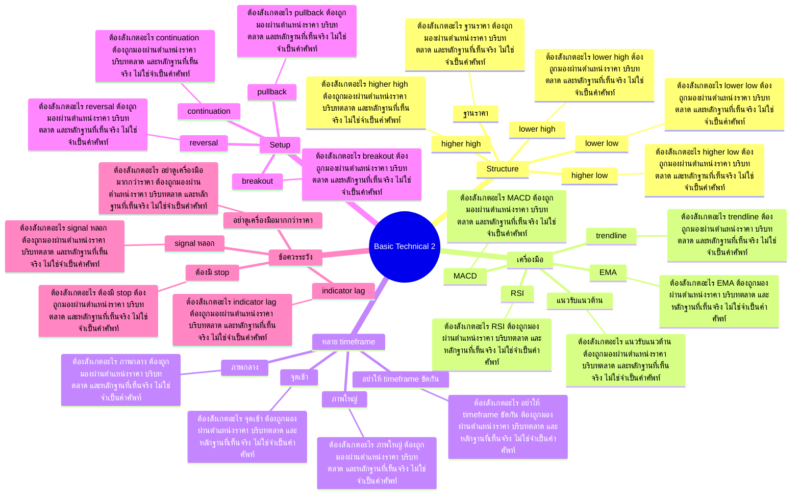

# Mind Map: Basic Technical 2

## Central Idea
Technical ขั้นต่อยอดคือการอ่าน context ของราคา ไม่ใช่สะสม indicator

## Learning Context
- Phase: ต่อยอดภาษาเทคนิค
- Category: Technical

## Learning Goals
- ต่อยอดจากแนวโน้ม แนวรับ แนวต้าน และ pattern
- ใช้เครื่องมือเพื่อช่วยตัดสินใจ ไม่ใช่แทนการคิด
- เชื่อม technical กับ strategy และ risk

## Keywords To Remember
ema, high, divergent, store, mad, อ่ะ, low, macd, isi, rsi, average, fibo

## Big Branches + Deep Branches
### Structure
- ภาพรวม: กิ่งนี้เชื่อมกับบทเรียนหลักเพราะ Structure เป็นตัวแปลงความรู้ให้กลายเป็นการตัดสินใจ โดยเฉพาะเรื่อง higher high, higher low, lower high
- higher high
  - ต้องสังเกตอะไร: higher high ต้องถูกมองผ่านตำแหน่งราคา บริบทตลาด และหลักฐานที่เห็นจริง ไม่ใช่จำเป็นคำศัพท์
  - ใช้ตอนไหน: ใช้ higher high เพื่อช่วยตัดสินใจว่าแผนในกิ่ง Structure ควรเดินต่อ รอ ย่อขนาด หรือยกเลิก
  - ถ้าผิดต้องทำอะไร: ถ้าหลักฐานไม่ยืนยัน higher high ให้ลดความมั่นใจทันที และกลับไปถามจุดผิดทางของแผน
- higher low
  - ต้องสังเกตอะไร: higher low ต้องถูกมองผ่านตำแหน่งราคา บริบทตลาด และหลักฐานที่เห็นจริง ไม่ใช่จำเป็นคำศัพท์
  - ใช้ตอนไหน: ใช้ higher low เพื่อช่วยตัดสินใจว่าแผนในกิ่ง Structure ควรเดินต่อ รอ ย่อขนาด หรือยกเลิก
  - ถ้าผิดต้องทำอะไร: ถ้าหลักฐานไม่ยืนยัน higher low ให้ลดความมั่นใจทันที และกลับไปถามจุดผิดทางของแผน
- lower high
  - ต้องสังเกตอะไร: lower high ต้องถูกมองผ่านตำแหน่งราคา บริบทตลาด และหลักฐานที่เห็นจริง ไม่ใช่จำเป็นคำศัพท์
  - ใช้ตอนไหน: ใช้ lower high เพื่อช่วยตัดสินใจว่าแผนในกิ่ง Structure ควรเดินต่อ รอ ย่อขนาด หรือยกเลิก
  - ถ้าผิดต้องทำอะไร: ถ้าหลักฐานไม่ยืนยัน lower high ให้ลดความมั่นใจทันที และกลับไปถามจุดผิดทางของแผน
- lower low
  - ต้องสังเกตอะไร: lower low ต้องถูกมองผ่านตำแหน่งราคา บริบทตลาด และหลักฐานที่เห็นจริง ไม่ใช่จำเป็นคำศัพท์
  - ใช้ตอนไหน: ใช้ lower low เพื่อช่วยตัดสินใจว่าแผนในกิ่ง Structure ควรเดินต่อ รอ ย่อขนาด หรือยกเลิก
  - ถ้าผิดต้องทำอะไร: ถ้าหลักฐานไม่ยืนยัน lower low ให้ลดความมั่นใจทันที และกลับไปถามจุดผิดทางของแผน
- ฐานราคา
  - ต้องสังเกตอะไร: ฐานราคา ต้องถูกมองผ่านตำแหน่งราคา บริบทตลาด และหลักฐานที่เห็นจริง ไม่ใช่จำเป็นคำศัพท์
  - ใช้ตอนไหน: ใช้ ฐานราคา เพื่อช่วยตัดสินใจว่าแผนในกิ่ง Structure ควรเดินต่อ รอ ย่อขนาด หรือยกเลิก
  - ถ้าผิดต้องทำอะไร: ถ้าหลักฐานไม่ยืนยัน ฐานราคา ให้ลดความมั่นใจทันที และกลับไปถามจุดผิดทางของแผน

### เครื่องมือ
- ภาพรวม: กิ่งนี้เชื่อมกับบทเรียนหลักเพราะ เครื่องมือ เป็นตัวแปลงความรู้ให้กลายเป็นการตัดสินใจ โดยเฉพาะเรื่อง EMA, MACD, RSI
- EMA
  - ต้องสังเกตอะไร: EMA ต้องถูกมองผ่านตำแหน่งราคา บริบทตลาด และหลักฐานที่เห็นจริง ไม่ใช่จำเป็นคำศัพท์
  - ใช้ตอนไหน: ใช้ EMA เพื่อช่วยตัดสินใจว่าแผนในกิ่ง เครื่องมือ ควรเดินต่อ รอ ย่อขนาด หรือยกเลิก
  - ถ้าผิดต้องทำอะไร: ถ้าหลักฐานไม่ยืนยัน EMA ให้ลดความมั่นใจทันที และกลับไปถามจุดผิดทางของแผน
- MACD
  - ต้องสังเกตอะไร: MACD ต้องถูกมองผ่านตำแหน่งราคา บริบทตลาด และหลักฐานที่เห็นจริง ไม่ใช่จำเป็นคำศัพท์
  - ใช้ตอนไหน: ใช้ MACD เพื่อช่วยตัดสินใจว่าแผนในกิ่ง เครื่องมือ ควรเดินต่อ รอ ย่อขนาด หรือยกเลิก
  - ถ้าผิดต้องทำอะไร: ถ้าหลักฐานไม่ยืนยัน MACD ให้ลดความมั่นใจทันที และกลับไปถามจุดผิดทางของแผน
- RSI
  - ต้องสังเกตอะไร: RSI ต้องถูกมองผ่านตำแหน่งราคา บริบทตลาด และหลักฐานที่เห็นจริง ไม่ใช่จำเป็นคำศัพท์
  - ใช้ตอนไหน: ใช้ RSI เพื่อช่วยตัดสินใจว่าแผนในกิ่ง เครื่องมือ ควรเดินต่อ รอ ย่อขนาด หรือยกเลิก
  - ถ้าผิดต้องทำอะไร: ถ้าหลักฐานไม่ยืนยัน RSI ให้ลดความมั่นใจทันที และกลับไปถามจุดผิดทางของแผน
- trendline
  - ต้องสังเกตอะไร: trendline ต้องถูกมองผ่านตำแหน่งราคา บริบทตลาด และหลักฐานที่เห็นจริง ไม่ใช่จำเป็นคำศัพท์
  - ใช้ตอนไหน: ใช้ trendline เพื่อช่วยตัดสินใจว่าแผนในกิ่ง เครื่องมือ ควรเดินต่อ รอ ย่อขนาด หรือยกเลิก
  - ถ้าผิดต้องทำอะไร: ถ้าหลักฐานไม่ยืนยัน trendline ให้ลดความมั่นใจทันที และกลับไปถามจุดผิดทางของแผน
- แนวรับแนวต้าน
  - ต้องสังเกตอะไร: แนวรับแนวต้าน ต้องถูกมองผ่านตำแหน่งราคา บริบทตลาด และหลักฐานที่เห็นจริง ไม่ใช่จำเป็นคำศัพท์
  - ใช้ตอนไหน: ใช้ แนวรับแนวต้าน เพื่อช่วยตัดสินใจว่าแผนในกิ่ง เครื่องมือ ควรเดินต่อ รอ ย่อขนาด หรือยกเลิก
  - ถ้าผิดต้องทำอะไร: ถ้าหลักฐานไม่ยืนยัน แนวรับแนวต้าน ให้ลดความมั่นใจทันที และกลับไปถามจุดผิดทางของแผน

### หลาย timeframe
- ภาพรวม: กิ่งนี้เชื่อมกับบทเรียนหลักเพราะ หลาย timeframe เป็นตัวแปลงความรู้ให้กลายเป็นการตัดสินใจ โดยเฉพาะเรื่อง ภาพใหญ่, ภาพกลาง, จุดเข้า
- ภาพใหญ่
  - ต้องสังเกตอะไร: ภาพใหญ่ ต้องถูกมองผ่านตำแหน่งราคา บริบทตลาด และหลักฐานที่เห็นจริง ไม่ใช่จำเป็นคำศัพท์
  - ใช้ตอนไหน: ใช้ ภาพใหญ่ เพื่อช่วยตัดสินใจว่าแผนในกิ่ง หลาย timeframe ควรเดินต่อ รอ ย่อขนาด หรือยกเลิก
  - ถ้าผิดต้องทำอะไร: ถ้าหลักฐานไม่ยืนยัน ภาพใหญ่ ให้ลดความมั่นใจทันที และกลับไปถามจุดผิดทางของแผน
- ภาพกลาง
  - ต้องสังเกตอะไร: ภาพกลาง ต้องถูกมองผ่านตำแหน่งราคา บริบทตลาด และหลักฐานที่เห็นจริง ไม่ใช่จำเป็นคำศัพท์
  - ใช้ตอนไหน: ใช้ ภาพกลาง เพื่อช่วยตัดสินใจว่าแผนในกิ่ง หลาย timeframe ควรเดินต่อ รอ ย่อขนาด หรือยกเลิก
  - ถ้าผิดต้องทำอะไร: ถ้าหลักฐานไม่ยืนยัน ภาพกลาง ให้ลดความมั่นใจทันที และกลับไปถามจุดผิดทางของแผน
- จุดเข้า
  - ต้องสังเกตอะไร: จุดเข้า ต้องถูกมองผ่านตำแหน่งราคา บริบทตลาด และหลักฐานที่เห็นจริง ไม่ใช่จำเป็นคำศัพท์
  - ใช้ตอนไหน: ใช้ จุดเข้า เพื่อช่วยตัดสินใจว่าแผนในกิ่ง หลาย timeframe ควรเดินต่อ รอ ย่อขนาด หรือยกเลิก
  - ถ้าผิดต้องทำอะไร: ถ้าหลักฐานไม่ยืนยัน จุดเข้า ให้ลดความมั่นใจทันที และกลับไปถามจุดผิดทางของแผน
- อย่าให้ timeframe ขัดกัน
  - ต้องสังเกตอะไร: อย่าให้ timeframe ขัดกัน ต้องถูกมองผ่านตำแหน่งราคา บริบทตลาด และหลักฐานที่เห็นจริง ไม่ใช่จำเป็นคำศัพท์
  - ใช้ตอนไหน: ใช้ อย่าให้ timeframe ขัดกัน เพื่อช่วยตัดสินใจว่าแผนในกิ่ง หลาย timeframe ควรเดินต่อ รอ ย่อขนาด หรือยกเลิก
  - ถ้าผิดต้องทำอะไร: ถ้าหลักฐานไม่ยืนยัน อย่าให้ timeframe ขัดกัน ให้ลดความมั่นใจทันที และกลับไปถามจุดผิดทางของแผน

### Setup
- ภาพรวม: กิ่งนี้เชื่อมกับบทเรียนหลักเพราะ Setup เป็นตัวแปลงความรู้ให้กลายเป็นการตัดสินใจ โดยเฉพาะเรื่อง breakout, pullback, reversal
- breakout
  - ต้องสังเกตอะไร: breakout ต้องถูกมองผ่านตำแหน่งราคา บริบทตลาด และหลักฐานที่เห็นจริง ไม่ใช่จำเป็นคำศัพท์
  - ใช้ตอนไหน: ใช้ breakout เพื่อช่วยตัดสินใจว่าแผนในกิ่ง Setup ควรเดินต่อ รอ ย่อขนาด หรือยกเลิก
  - ถ้าผิดต้องทำอะไร: ถ้าหลักฐานไม่ยืนยัน breakout ให้ลดความมั่นใจทันที และกลับไปถามจุดผิดทางของแผน
- pullback
  - ต้องสังเกตอะไร: pullback ต้องถูกมองผ่านตำแหน่งราคา บริบทตลาด และหลักฐานที่เห็นจริง ไม่ใช่จำเป็นคำศัพท์
  - ใช้ตอนไหน: ใช้ pullback เพื่อช่วยตัดสินใจว่าแผนในกิ่ง Setup ควรเดินต่อ รอ ย่อขนาด หรือยกเลิก
  - ถ้าผิดต้องทำอะไร: ถ้าหลักฐานไม่ยืนยัน pullback ให้ลดความมั่นใจทันที และกลับไปถามจุดผิดทางของแผน
- reversal
  - ต้องสังเกตอะไร: reversal ต้องถูกมองผ่านตำแหน่งราคา บริบทตลาด และหลักฐานที่เห็นจริง ไม่ใช่จำเป็นคำศัพท์
  - ใช้ตอนไหน: ใช้ reversal เพื่อช่วยตัดสินใจว่าแผนในกิ่ง Setup ควรเดินต่อ รอ ย่อขนาด หรือยกเลิก
  - ถ้าผิดต้องทำอะไร: ถ้าหลักฐานไม่ยืนยัน reversal ให้ลดความมั่นใจทันที และกลับไปถามจุดผิดทางของแผน
- continuation
  - ต้องสังเกตอะไร: continuation ต้องถูกมองผ่านตำแหน่งราคา บริบทตลาด และหลักฐานที่เห็นจริง ไม่ใช่จำเป็นคำศัพท์
  - ใช้ตอนไหน: ใช้ continuation เพื่อช่วยตัดสินใจว่าแผนในกิ่ง Setup ควรเดินต่อ รอ ย่อขนาด หรือยกเลิก
  - ถ้าผิดต้องทำอะไร: ถ้าหลักฐานไม่ยืนยัน continuation ให้ลดความมั่นใจทันที และกลับไปถามจุดผิดทางของแผน

### ข้อควรระวัง
- ภาพรวม: กิ่งนี้เชื่อมกับบทเรียนหลักเพราะ ข้อควรระวัง เป็นตัวแปลงความรู้ให้กลายเป็นการตัดสินใจ โดยเฉพาะเรื่อง indicator lag, signal หลอก, อย่าดูเครื่องมือมากกว่าราคา
- indicator lag
  - ต้องสังเกตอะไร: indicator lag ต้องถูกมองผ่านตำแหน่งราคา บริบทตลาด และหลักฐานที่เห็นจริง ไม่ใช่จำเป็นคำศัพท์
  - ใช้ตอนไหน: ใช้ indicator lag เพื่อช่วยตัดสินใจว่าแผนในกิ่ง ข้อควรระวัง ควรเดินต่อ รอ ย่อขนาด หรือยกเลิก
  - ถ้าผิดต้องทำอะไร: ถ้าหลักฐานไม่ยืนยัน indicator lag ให้ลดความมั่นใจทันที และกลับไปถามจุดผิดทางของแผน
- signal หลอก
  - ต้องสังเกตอะไร: signal หลอก ต้องถูกมองผ่านตำแหน่งราคา บริบทตลาด และหลักฐานที่เห็นจริง ไม่ใช่จำเป็นคำศัพท์
  - ใช้ตอนไหน: ใช้ signal หลอก เพื่อช่วยตัดสินใจว่าแผนในกิ่ง ข้อควรระวัง ควรเดินต่อ รอ ย่อขนาด หรือยกเลิก
  - ถ้าผิดต้องทำอะไร: ถ้าหลักฐานไม่ยืนยัน signal หลอก ให้ลดความมั่นใจทันที และกลับไปถามจุดผิดทางของแผน
- อย่าดูเครื่องมือมากกว่าราคา
  - ต้องสังเกตอะไร: อย่าดูเครื่องมือมากกว่าราคา ต้องถูกมองผ่านตำแหน่งราคา บริบทตลาด และหลักฐานที่เห็นจริง ไม่ใช่จำเป็นคำศัพท์
  - ใช้ตอนไหน: ใช้ อย่าดูเครื่องมือมากกว่าราคา เพื่อช่วยตัดสินใจว่าแผนในกิ่ง ข้อควรระวัง ควรเดินต่อ รอ ย่อขนาด หรือยกเลิก
  - ถ้าผิดต้องทำอะไร: ถ้าหลักฐานไม่ยืนยัน อย่าดูเครื่องมือมากกว่าราคา ให้ลดความมั่นใจทันที และกลับไปถามจุดผิดทางของแผน
- ต้องมี stop
  - ต้องสังเกตอะไร: ต้องมี stop ต้องถูกมองผ่านตำแหน่งราคา บริบทตลาด และหลักฐานที่เห็นจริง ไม่ใช่จำเป็นคำศัพท์
  - ใช้ตอนไหน: ใช้ ต้องมี stop เพื่อช่วยตัดสินใจว่าแผนในกิ่ง ข้อควรระวัง ควรเดินต่อ รอ ย่อขนาด หรือยกเลิก
  - ถ้าผิดต้องทำอะไร: ถ้าหลักฐานไม่ยืนยัน ต้องมี stop ให้ลดความมั่นใจทันที และกลับไปถามจุดผิดทางของแผน

## Transcript Signals
> โอนี่มันขาลงเนาะเดี๋ยวๆเอาใหม่เอาใหม่ เอา นี้ก็ขึ้นแรงไป ออเก็บแล้วครับ อ่ะ เราดูนะเนี่ยปึ้งลงมาชนเส้น 75 เด้งแสดง ว่าตรงนี้เป็นอะไรครับเป็นแนวรับลงมาชน ปึ้งเด้งตรงนี้เป็นแนวรับป่ะนี่ลงมาแตะ อีกเห็นป่ะลงมาทำหางเลยอ่ะก็เด้งแสดงว่า...

> ราคาไม่เบรค high อินดิเคเตอร์เบรค high แต่ราคาไม่เบรคสุดท้ายมันก็ปรับ เห็นมั้ยครับประมาณนี้มีคำถามมั้ครับ งงมั้ยมีใครงงมั้ยหรืองงหมดเอาใหม่ตั้ง แต่ต้นเลยได้มั้อะไรเงี้เหรอ อืมีคำถามมั้ครับถามได้เลยนะผมผมรู้แหละ ว่าผมตอนผมเรียนเรื่องเให้เข้าใจทุกอย่าง...

> บ้างตามความนิยมอันเนี้ยมันก็อัน default มัน 14 ถ้าพี่อยากเปลี่ยนเป็นอีเมลเท่า ไหร่ 75 อย่างเงี้ยเห็นป่ะมันก็จะเปลี่ยน อย่างเงี้ยวิธีใส่ก็คือจุดแล้วก็ใส่ EMA ขึ้นมาอันเนี้ยเป็นวิธีการใส่ EMA EMA บ่งบอกความเป็นคือหมายความว่าอะไรถ้าหุ้น...

## Decision Rules
- Structure: จะใช้กิ่งนี้ได้เมื่อเห็น higher high และ higher low พร้อมกัน ถ้าเจอเงื่อนไขตรงข้ามกับ ฐานราคา ให้ลดขนาดหรือหยุด
- เครื่องมือ: จะใช้กิ่งนี้ได้เมื่อเห็น EMA และ MACD พร้อมกัน ถ้าเจอเงื่อนไขตรงข้ามกับ แนวรับแนวต้าน ให้ลดขนาดหรือหยุด
- หลาย timeframe: จะใช้กิ่งนี้ได้เมื่อเห็น ภาพใหญ่ และ ภาพกลาง พร้อมกัน ถ้าเจอเงื่อนไขตรงข้ามกับ อย่าให้ timeframe ขัดกัน ให้ลดขนาดหรือหยุด
- Setup: จะใช้กิ่งนี้ได้เมื่อเห็น breakout และ pullback พร้อมกัน ถ้าเจอเงื่อนไขตรงข้ามกับ continuation ให้ลดขนาดหรือหยุด
- ข้อควรระวัง: จะใช้กิ่งนี้ได้เมื่อเห็น indicator lag และ signal หลอก พร้อมกัน ถ้าเจอเงื่อนไขตรงข้ามกับ ต้องมี stop ให้ลดขนาดหรือหยุด

## Common Mistakes
- จำชื่อบทได้ แต่ไม่รู้ว่า Structure ต้องเปลี่ยนพฤติกรรมการเทรดตรงไหน
- เห็นสัญญาณหนึ่งอย่างแล้วรีบสรุป ทั้งที่ยังไม่ได้เช็กบริบทและหลักฐานประกอบ
- วางแผนตอนใจเย็น แต่พอราคาเคลื่อนไหวจริงกลับเปลี่ยนกฎตามอารมณ์
- สนใจ ข้อควรระวัง แค่ตอนอยากเข้า แต่ไม่ใช้เป็นเงื่อนไขตอนต้องออกหรือหยุด

## Practice Checklist
- ทวนเป้าหมายบทนี้ก่อนเริ่ม: ต่อยอดจากแนวโน้ม แนวรับ แนวต้าน และ pattern
- เปิดกราฟหรือกรณีศึกษาจริง 1 ตัว แล้วระบุว่าเกี่ยวกับกิ่ง 'Structure' ตรงไหน
- เขียนก่อนเข้าว่า thesis คืออะไร หลักฐานคืออะไร และถ้าผิดจะยอมรับตรงไหน
- แยกสิ่งที่เห็นจริงออกจากสิ่งที่อยากให้เกิด แล้วให้คะแนนความมั่นใจ 1-5
- หลังจบเคส ให้บันทึกว่าแพ้/ชนะเพราะระบบ หรือเพราะอารมณ์

## Final Destination
ใช้ technical เป็นภาษาอ่านตลาดและวางแผน ไม่ใช่เป็นเครื่องรางบอกซื้อขาย

## Questions for Patiphan
1. กิ่งไหนคือแก่นที่สุดของบทนี้
2. กิ่งไหนเกี่ยวกับจุดอ่อนของ Patiphan มากที่สุด
3. ถ้าจะเอาไปใช้กับกราฟจริง ต้องเห็นหลักฐานอะไร
4. ถ้าทำผิด บทนี้เตือนให้หยุดตรงไหน
5. ปลายทางของบทนี้จะเข้าไปอยู่ในระบบเทรดส่วนไหน
