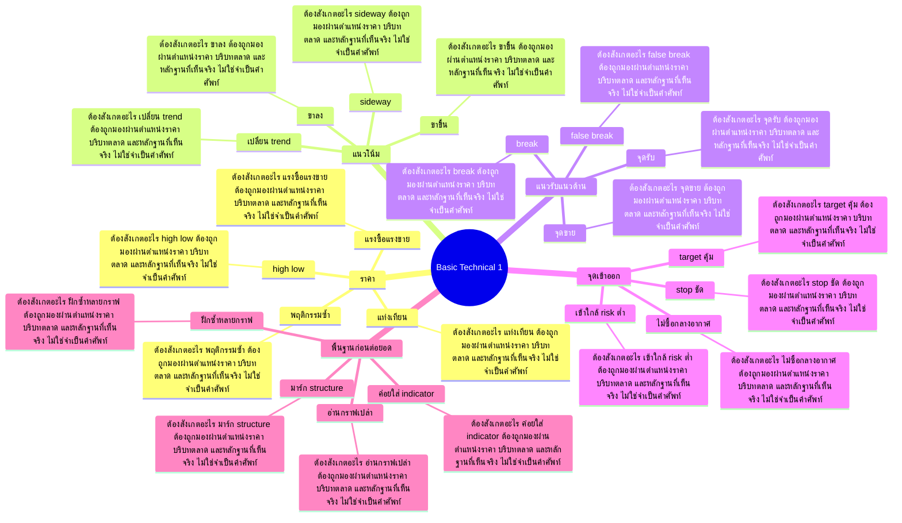

# Mind Map: Basic Technical 1

## Central Idea
พื้นฐาน technical คือการอ่านราคา แนวโน้ม แนวรับแนวต้าน และจุดผิดทางก่อนใช้เครื่องมือซับซ้อน

## Learning Context
- Phase: พื้นฐานการอ่านกราฟ
- Category: Technical

## Learning Goals
- เข้าใจ price structure เบื้องต้น
- อ่านแนวโน้ม แนวรับ แนวต้าน และ momentum
- วางพื้นฐานสำหรับ volume, wave และ strategy

## Keywords To Remember
low, high, time, frame, day, stop, sideway, loss, vol, บาท, out, week

## Big Branches + Deep Branches
### ราคา
- ภาพรวม: กิ่งนี้เชื่อมกับบทเรียนหลักเพราะ ราคา เป็นตัวแปลงความรู้ให้กลายเป็นการตัดสินใจ โดยเฉพาะเรื่อง แท่งเทียน, high low, แรงซื้อแรงขาย
- แท่งเทียน
  - ต้องสังเกตอะไร: แท่งเทียน ต้องถูกมองผ่านตำแหน่งราคา บริบทตลาด และหลักฐานที่เห็นจริง ไม่ใช่จำเป็นคำศัพท์
  - ใช้ตอนไหน: ใช้ แท่งเทียน เพื่อช่วยตัดสินใจว่าแผนในกิ่ง ราคา ควรเดินต่อ รอ ย่อขนาด หรือยกเลิก
  - ถ้าผิดต้องทำอะไร: ถ้าหลักฐานไม่ยืนยัน แท่งเทียน ให้ลดความมั่นใจทันที และกลับไปถามจุดผิดทางของแผน
- high low
  - ต้องสังเกตอะไร: high low ต้องถูกมองผ่านตำแหน่งราคา บริบทตลาด และหลักฐานที่เห็นจริง ไม่ใช่จำเป็นคำศัพท์
  - ใช้ตอนไหน: ใช้ high low เพื่อช่วยตัดสินใจว่าแผนในกิ่ง ราคา ควรเดินต่อ รอ ย่อขนาด หรือยกเลิก
  - ถ้าผิดต้องทำอะไร: ถ้าหลักฐานไม่ยืนยัน high low ให้ลดความมั่นใจทันที และกลับไปถามจุดผิดทางของแผน
- แรงซื้อแรงขาย
  - ต้องสังเกตอะไร: แรงซื้อแรงขาย ต้องถูกมองผ่านตำแหน่งราคา บริบทตลาด และหลักฐานที่เห็นจริง ไม่ใช่จำเป็นคำศัพท์
  - ใช้ตอนไหน: ใช้ แรงซื้อแรงขาย เพื่อช่วยตัดสินใจว่าแผนในกิ่ง ราคา ควรเดินต่อ รอ ย่อขนาด หรือยกเลิก
  - ถ้าผิดต้องทำอะไร: ถ้าหลักฐานไม่ยืนยัน แรงซื้อแรงขาย ให้ลดความมั่นใจทันที และกลับไปถามจุดผิดทางของแผน
- พฤติกรรมซ้ำ
  - ต้องสังเกตอะไร: พฤติกรรมซ้ำ ต้องถูกมองผ่านตำแหน่งราคา บริบทตลาด และหลักฐานที่เห็นจริง ไม่ใช่จำเป็นคำศัพท์
  - ใช้ตอนไหน: ใช้ พฤติกรรมซ้ำ เพื่อช่วยตัดสินใจว่าแผนในกิ่ง ราคา ควรเดินต่อ รอ ย่อขนาด หรือยกเลิก
  - ถ้าผิดต้องทำอะไร: ถ้าหลักฐานไม่ยืนยัน พฤติกรรมซ้ำ ให้ลดความมั่นใจทันที และกลับไปถามจุดผิดทางของแผน

### แนวโน้ม
- ภาพรวม: กิ่งนี้เชื่อมกับบทเรียนหลักเพราะ แนวโน้ม เป็นตัวแปลงความรู้ให้กลายเป็นการตัดสินใจ โดยเฉพาะเรื่อง ขาขึ้น, ขาลง, sideway
- ขาขึ้น
  - ต้องสังเกตอะไร: ขาขึ้น ต้องถูกมองผ่านตำแหน่งราคา บริบทตลาด และหลักฐานที่เห็นจริง ไม่ใช่จำเป็นคำศัพท์
  - ใช้ตอนไหน: ใช้ ขาขึ้น เพื่อช่วยตัดสินใจว่าแผนในกิ่ง แนวโน้ม ควรเดินต่อ รอ ย่อขนาด หรือยกเลิก
  - ถ้าผิดต้องทำอะไร: ถ้าหลักฐานไม่ยืนยัน ขาขึ้น ให้ลดความมั่นใจทันที และกลับไปถามจุดผิดทางของแผน
- ขาลง
  - ต้องสังเกตอะไร: ขาลง ต้องถูกมองผ่านตำแหน่งราคา บริบทตลาด และหลักฐานที่เห็นจริง ไม่ใช่จำเป็นคำศัพท์
  - ใช้ตอนไหน: ใช้ ขาลง เพื่อช่วยตัดสินใจว่าแผนในกิ่ง แนวโน้ม ควรเดินต่อ รอ ย่อขนาด หรือยกเลิก
  - ถ้าผิดต้องทำอะไร: ถ้าหลักฐานไม่ยืนยัน ขาลง ให้ลดความมั่นใจทันที และกลับไปถามจุดผิดทางของแผน
- sideway
  - ต้องสังเกตอะไร: sideway ต้องถูกมองผ่านตำแหน่งราคา บริบทตลาด และหลักฐานที่เห็นจริง ไม่ใช่จำเป็นคำศัพท์
  - ใช้ตอนไหน: ใช้ sideway เพื่อช่วยตัดสินใจว่าแผนในกิ่ง แนวโน้ม ควรเดินต่อ รอ ย่อขนาด หรือยกเลิก
  - ถ้าผิดต้องทำอะไร: ถ้าหลักฐานไม่ยืนยัน sideway ให้ลดความมั่นใจทันที และกลับไปถามจุดผิดทางของแผน
- เปลี่ยน trend
  - ต้องสังเกตอะไร: เปลี่ยน trend ต้องถูกมองผ่านตำแหน่งราคา บริบทตลาด และหลักฐานที่เห็นจริง ไม่ใช่จำเป็นคำศัพท์
  - ใช้ตอนไหน: ใช้ เปลี่ยน trend เพื่อช่วยตัดสินใจว่าแผนในกิ่ง แนวโน้ม ควรเดินต่อ รอ ย่อขนาด หรือยกเลิก
  - ถ้าผิดต้องทำอะไร: ถ้าหลักฐานไม่ยืนยัน เปลี่ยน trend ให้ลดความมั่นใจทันที และกลับไปถามจุดผิดทางของแผน

### แนวรับแนวต้าน
- ภาพรวม: กิ่งนี้เชื่อมกับบทเรียนหลักเพราะ แนวรับแนวต้าน เป็นตัวแปลงความรู้ให้กลายเป็นการตัดสินใจ โดยเฉพาะเรื่อง จุดรับ, จุดขาย, break
- จุดรับ
  - ต้องสังเกตอะไร: จุดรับ ต้องถูกมองผ่านตำแหน่งราคา บริบทตลาด และหลักฐานที่เห็นจริง ไม่ใช่จำเป็นคำศัพท์
  - ใช้ตอนไหน: ใช้ จุดรับ เพื่อช่วยตัดสินใจว่าแผนในกิ่ง แนวรับแนวต้าน ควรเดินต่อ รอ ย่อขนาด หรือยกเลิก
  - ถ้าผิดต้องทำอะไร: ถ้าหลักฐานไม่ยืนยัน จุดรับ ให้ลดความมั่นใจทันที และกลับไปถามจุดผิดทางของแผน
- จุดขาย
  - ต้องสังเกตอะไร: จุดขาย ต้องถูกมองผ่านตำแหน่งราคา บริบทตลาด และหลักฐานที่เห็นจริง ไม่ใช่จำเป็นคำศัพท์
  - ใช้ตอนไหน: ใช้ จุดขาย เพื่อช่วยตัดสินใจว่าแผนในกิ่ง แนวรับแนวต้าน ควรเดินต่อ รอ ย่อขนาด หรือยกเลิก
  - ถ้าผิดต้องทำอะไร: ถ้าหลักฐานไม่ยืนยัน จุดขาย ให้ลดความมั่นใจทันที และกลับไปถามจุดผิดทางของแผน
- break
  - ต้องสังเกตอะไร: break ต้องถูกมองผ่านตำแหน่งราคา บริบทตลาด และหลักฐานที่เห็นจริง ไม่ใช่จำเป็นคำศัพท์
  - ใช้ตอนไหน: ใช้ break เพื่อช่วยตัดสินใจว่าแผนในกิ่ง แนวรับแนวต้าน ควรเดินต่อ รอ ย่อขนาด หรือยกเลิก
  - ถ้าผิดต้องทำอะไร: ถ้าหลักฐานไม่ยืนยัน break ให้ลดความมั่นใจทันที และกลับไปถามจุดผิดทางของแผน
- false break
  - ต้องสังเกตอะไร: false break ต้องถูกมองผ่านตำแหน่งราคา บริบทตลาด และหลักฐานที่เห็นจริง ไม่ใช่จำเป็นคำศัพท์
  - ใช้ตอนไหน: ใช้ false break เพื่อช่วยตัดสินใจว่าแผนในกิ่ง แนวรับแนวต้าน ควรเดินต่อ รอ ย่อขนาด หรือยกเลิก
  - ถ้าผิดต้องทำอะไร: ถ้าหลักฐานไม่ยืนยัน false break ให้ลดความมั่นใจทันที และกลับไปถามจุดผิดทางของแผน

### จุดเข้าออก
- ภาพรวม: กิ่งนี้เชื่อมกับบทเรียนหลักเพราะ จุดเข้าออก เป็นตัวแปลงความรู้ให้กลายเป็นการตัดสินใจ โดยเฉพาะเรื่อง เข้าใกล้ risk ต่ำ, stop ชัด, target คุ้ม
- เข้าใกล้ risk ต่ำ
  - ต้องสังเกตอะไร: เข้าใกล้ risk ต่ำ ต้องถูกมองผ่านตำแหน่งราคา บริบทตลาด และหลักฐานที่เห็นจริง ไม่ใช่จำเป็นคำศัพท์
  - ใช้ตอนไหน: ใช้ เข้าใกล้ risk ต่ำ เพื่อช่วยตัดสินใจว่าแผนในกิ่ง จุดเข้าออก ควรเดินต่อ รอ ย่อขนาด หรือยกเลิก
  - ถ้าผิดต้องทำอะไร: ถ้าหลักฐานไม่ยืนยัน เข้าใกล้ risk ต่ำ ให้ลดความมั่นใจทันที และกลับไปถามจุดผิดทางของแผน
- stop ชัด
  - ต้องสังเกตอะไร: stop ชัด ต้องถูกมองผ่านตำแหน่งราคา บริบทตลาด และหลักฐานที่เห็นจริง ไม่ใช่จำเป็นคำศัพท์
  - ใช้ตอนไหน: ใช้ stop ชัด เพื่อช่วยตัดสินใจว่าแผนในกิ่ง จุดเข้าออก ควรเดินต่อ รอ ย่อขนาด หรือยกเลิก
  - ถ้าผิดต้องทำอะไร: ถ้าหลักฐานไม่ยืนยัน stop ชัด ให้ลดความมั่นใจทันที และกลับไปถามจุดผิดทางของแผน
- target คุ้ม
  - ต้องสังเกตอะไร: target คุ้ม ต้องถูกมองผ่านตำแหน่งราคา บริบทตลาด และหลักฐานที่เห็นจริง ไม่ใช่จำเป็นคำศัพท์
  - ใช้ตอนไหน: ใช้ target คุ้ม เพื่อช่วยตัดสินใจว่าแผนในกิ่ง จุดเข้าออก ควรเดินต่อ รอ ย่อขนาด หรือยกเลิก
  - ถ้าผิดต้องทำอะไร: ถ้าหลักฐานไม่ยืนยัน target คุ้ม ให้ลดความมั่นใจทันที และกลับไปถามจุดผิดทางของแผน
- ไม่ซื้อกลางอากาศ
  - ต้องสังเกตอะไร: ไม่ซื้อกลางอากาศ ต้องถูกมองผ่านตำแหน่งราคา บริบทตลาด และหลักฐานที่เห็นจริง ไม่ใช่จำเป็นคำศัพท์
  - ใช้ตอนไหน: ใช้ ไม่ซื้อกลางอากาศ เพื่อช่วยตัดสินใจว่าแผนในกิ่ง จุดเข้าออก ควรเดินต่อ รอ ย่อขนาด หรือยกเลิก
  - ถ้าผิดต้องทำอะไร: ถ้าหลักฐานไม่ยืนยัน ไม่ซื้อกลางอากาศ ให้ลดความมั่นใจทันที และกลับไปถามจุดผิดทางของแผน

### พื้นฐานก่อนต่อยอด
- ภาพรวม: กิ่งนี้เชื่อมกับบทเรียนหลักเพราะ พื้นฐานก่อนต่อยอด เป็นตัวแปลงความรู้ให้กลายเป็นการตัดสินใจ โดยเฉพาะเรื่อง อ่านกราฟเปล่า, มาร์ก structure, ค่อยใส่ indicator
- อ่านกราฟเปล่า
  - ต้องสังเกตอะไร: อ่านกราฟเปล่า ต้องถูกมองผ่านตำแหน่งราคา บริบทตลาด และหลักฐานที่เห็นจริง ไม่ใช่จำเป็นคำศัพท์
  - ใช้ตอนไหน: ใช้ อ่านกราฟเปล่า เพื่อช่วยตัดสินใจว่าแผนในกิ่ง พื้นฐานก่อนต่อยอด ควรเดินต่อ รอ ย่อขนาด หรือยกเลิก
  - ถ้าผิดต้องทำอะไร: ถ้าหลักฐานไม่ยืนยัน อ่านกราฟเปล่า ให้ลดความมั่นใจทันที และกลับไปถามจุดผิดทางของแผน
- มาร์ก structure
  - ต้องสังเกตอะไร: มาร์ก structure ต้องถูกมองผ่านตำแหน่งราคา บริบทตลาด และหลักฐานที่เห็นจริง ไม่ใช่จำเป็นคำศัพท์
  - ใช้ตอนไหน: ใช้ มาร์ก structure เพื่อช่วยตัดสินใจว่าแผนในกิ่ง พื้นฐานก่อนต่อยอด ควรเดินต่อ รอ ย่อขนาด หรือยกเลิก
  - ถ้าผิดต้องทำอะไร: ถ้าหลักฐานไม่ยืนยัน มาร์ก structure ให้ลดความมั่นใจทันที และกลับไปถามจุดผิดทางของแผน
- ค่อยใส่ indicator
  - ต้องสังเกตอะไร: ค่อยใส่ indicator ต้องถูกมองผ่านตำแหน่งราคา บริบทตลาด และหลักฐานที่เห็นจริง ไม่ใช่จำเป็นคำศัพท์
  - ใช้ตอนไหน: ใช้ ค่อยใส่ indicator เพื่อช่วยตัดสินใจว่าแผนในกิ่ง พื้นฐานก่อนต่อยอด ควรเดินต่อ รอ ย่อขนาด หรือยกเลิก
  - ถ้าผิดต้องทำอะไร: ถ้าหลักฐานไม่ยืนยัน ค่อยใส่ indicator ให้ลดความมั่นใจทันที และกลับไปถามจุดผิดทางของแผน
- ฝึกซ้ำหลายกราฟ
  - ต้องสังเกตอะไร: ฝึกซ้ำหลายกราฟ ต้องถูกมองผ่านตำแหน่งราคา บริบทตลาด และหลักฐานที่เห็นจริง ไม่ใช่จำเป็นคำศัพท์
  - ใช้ตอนไหน: ใช้ ฝึกซ้ำหลายกราฟ เพื่อช่วยตัดสินใจว่าแผนในกิ่ง พื้นฐานก่อนต่อยอด ควรเดินต่อ รอ ย่อขนาด หรือยกเลิก
  - ถ้าผิดต้องทำอะไร: ถ้าหลักฐานไม่ยืนยัน ฝึกซ้ำหลายกราฟ ให้ลดความมั่นใจทันที และกลับไปถามจุดผิดทางของแผน

## Transcript Signals
> ระยะสั้นคนเล่นเอ่อdayเทรดหรือสัปอรเนี่ย เขาจะชอบเล่นเบรค out มากกว่าเก็ตมั้ฮะ เพราะว่าซื้อปึ๊บเห็นผลเลยจะขายไม่ขายยัง ไงนะครับ กับอีกแบบนึงถ้าหุ้นที่มันอยู่ในกรอบซึ่ง ส่วนใหญ่หุ้นบ้านเราอยู่ในกรอบซะเยอะโดย เฉพาะหุ้นเซต 100 ก็จะเป็นลักษณะของ channel...

> เดี๋จขอเปลี่ยนเป็นลายฉารายฉาก่อนนะแค่จะ ให้ดูว่าเวลาเราจะหาแนวรับแนวต้านถัดไป เงี้ยดูยังไง ตอนนี้หุ้นกำลังขึ้นตอนนี้ตรงนี้ชุดเนี้ย ก็คือมีการย่อพักแค่นี้เองนะคะมีการย่อ พักตัวแค่นี้เองนะคะแล้วหลังจากนั้นก็ ราคาก็เป็นไงคะขึ้นต่อทีนี้เราจะหาแนวรับ...

> แล้วนะเชื่อมั้ยเทรดได้แล้วนะเอาแค่นี้ เลยแค่คุณหาแนวรับแนวต้านให้เจอหาแนวรับ ที่มีนัยยะสำคัญให้เจอถ้าเจอซื้อแล้ว stop สั้นๆแล้วก็ทำกำไรเนาะทีนี้รูปแบบของการ หาแนวรับแนวต้านเนี่ยมันจะมีทั้งแนวเส้น แนวนอนใช่มั้ยอย่างนี้ก็คือตามภาพเนี่ยสี...

## Decision Rules
- ราคา: จะใช้กิ่งนี้ได้เมื่อเห็น แท่งเทียน และ high low พร้อมกัน ถ้าเจอเงื่อนไขตรงข้ามกับ พฤติกรรมซ้ำ ให้ลดขนาดหรือหยุด
- แนวโน้ม: จะใช้กิ่งนี้ได้เมื่อเห็น ขาขึ้น และ ขาลง พร้อมกัน ถ้าเจอเงื่อนไขตรงข้ามกับ เปลี่ยน trend ให้ลดขนาดหรือหยุด
- แนวรับแนวต้าน: จะใช้กิ่งนี้ได้เมื่อเห็น จุดรับ และ จุดขาย พร้อมกัน ถ้าเจอเงื่อนไขตรงข้ามกับ false break ให้ลดขนาดหรือหยุด
- จุดเข้าออก: จะใช้กิ่งนี้ได้เมื่อเห็น เข้าใกล้ risk ต่ำ และ stop ชัด พร้อมกัน ถ้าเจอเงื่อนไขตรงข้ามกับ ไม่ซื้อกลางอากาศ ให้ลดขนาดหรือหยุด
- พื้นฐานก่อนต่อยอด: จะใช้กิ่งนี้ได้เมื่อเห็น อ่านกราฟเปล่า และ มาร์ก structure พร้อมกัน ถ้าเจอเงื่อนไขตรงข้ามกับ ฝึกซ้ำหลายกราฟ ให้ลดขนาดหรือหยุด

## Common Mistakes
- จำชื่อบทได้ แต่ไม่รู้ว่า ราคา ต้องเปลี่ยนพฤติกรรมการเทรดตรงไหน
- เห็นสัญญาณหนึ่งอย่างแล้วรีบสรุป ทั้งที่ยังไม่ได้เช็กบริบทและหลักฐานประกอบ
- วางแผนตอนใจเย็น แต่พอราคาเคลื่อนไหวจริงกลับเปลี่ยนกฎตามอารมณ์
- สนใจ พื้นฐานก่อนต่อยอด แค่ตอนอยากเข้า แต่ไม่ใช้เป็นเงื่อนไขตอนต้องออกหรือหยุด

## Practice Checklist
- ทวนเป้าหมายบทนี้ก่อนเริ่ม: เข้าใจ price structure เบื้องต้น
- เปิดกราฟหรือกรณีศึกษาจริง 1 ตัว แล้วระบุว่าเกี่ยวกับกิ่ง 'ราคา' ตรงไหน
- เขียนก่อนเข้าว่า thesis คืออะไร หลักฐานคืออะไร และถ้าผิดจะยอมรับตรงไหน
- แยกสิ่งที่เห็นจริงออกจากสิ่งที่อยากให้เกิด แล้วให้คะแนนความมั่นใจ 1-5
- หลังจบเคส ให้บันทึกว่าแพ้/ชนะเพราะระบบ หรือเพราะอารมณ์

## Final Destination
อ่านกราฟเปล่าให้เป็นก่อน แล้วค่อยใช้เครื่องมือเป็นตัวช่วย ไม่ใช่ตัวนำ

## Questions for Patiphan
1. กิ่งไหนคือแก่นที่สุดของบทนี้
2. กิ่งไหนเกี่ยวกับจุดอ่อนของ Patiphan มากที่สุด
3. ถ้าจะเอาไปใช้กับกราฟจริง ต้องเห็นหลักฐานอะไร
4. ถ้าทำผิด บทนี้เตือนให้หยุดตรงไหน
5. ปลายทางของบทนี้จะเข้าไปอยู่ในระบบเทรดส่วนไหน
