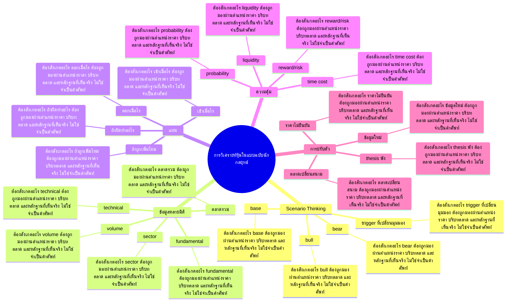

# Mind Map: การวิเคราะห์หุ้นในแบบฉบับนักกลยุทธ์

## Central Idea
นักกลยุทธ์ไม่ถามว่าหุ้นจะขึ้นไหม แต่สร้าง scenario แล้วเลือกแผนที่คุ้มที่สุดตามหลักฐาน

## Learning Context
- Phase: คิดเป็น scenario
- Category: Strategy

## Learning Goals
- สร้าง bullish/base/bearish scenario
- เชื่อม technical, volume, fundamental และ timing
- ตัดสินใจจากความคุ้มค่า ไม่ใช่ความมั่นใจ

## Keywords To Remember
market, super, value, trader, cap, flow, หุ้น, sect, bottom, ก็คือ, perform, วิเคราะห์

## Big Branches + Deep Branches
### Scenario Thinking
- ภาพรวม: กิ่งนี้เชื่อมกับบทเรียนหลักเพราะ Scenario Thinking เป็นตัวแปลงความรู้ให้กลายเป็นการตัดสินใจ โดยเฉพาะเรื่อง bull, base, bear
- bull
  - ต้องสังเกตอะไร: bull ต้องถูกมองผ่านตำแหน่งราคา บริบทตลาด และหลักฐานที่เห็นจริง ไม่ใช่จำเป็นคำศัพท์
  - ใช้ตอนไหน: ใช้ bull เพื่อช่วยตัดสินใจว่าแผนในกิ่ง Scenario Thinking ควรเดินต่อ รอ ย่อขนาด หรือยกเลิก
  - ถ้าผิดต้องทำอะไร: ถ้าหลักฐานไม่ยืนยัน bull ให้ลดความมั่นใจทันที และกลับไปถามจุดผิดทางของแผน
- base
  - ต้องสังเกตอะไร: base ต้องถูกมองผ่านตำแหน่งราคา บริบทตลาด และหลักฐานที่เห็นจริง ไม่ใช่จำเป็นคำศัพท์
  - ใช้ตอนไหน: ใช้ base เพื่อช่วยตัดสินใจว่าแผนในกิ่ง Scenario Thinking ควรเดินต่อ รอ ย่อขนาด หรือยกเลิก
  - ถ้าผิดต้องทำอะไร: ถ้าหลักฐานไม่ยืนยัน base ให้ลดความมั่นใจทันที และกลับไปถามจุดผิดทางของแผน
- bear
  - ต้องสังเกตอะไร: bear ต้องถูกมองผ่านตำแหน่งราคา บริบทตลาด และหลักฐานที่เห็นจริง ไม่ใช่จำเป็นคำศัพท์
  - ใช้ตอนไหน: ใช้ bear เพื่อช่วยตัดสินใจว่าแผนในกิ่ง Scenario Thinking ควรเดินต่อ รอ ย่อขนาด หรือยกเลิก
  - ถ้าผิดต้องทำอะไร: ถ้าหลักฐานไม่ยืนยัน bear ให้ลดความมั่นใจทันที และกลับไปถามจุดผิดทางของแผน
- trigger ที่เปลี่ยนมุมมอง
  - ต้องสังเกตอะไร: trigger ที่เปลี่ยนมุมมอง ต้องถูกมองผ่านตำแหน่งราคา บริบทตลาด และหลักฐานที่เห็นจริง ไม่ใช่จำเป็นคำศัพท์
  - ใช้ตอนไหน: ใช้ trigger ที่เปลี่ยนมุมมอง เพื่อช่วยตัดสินใจว่าแผนในกิ่ง Scenario Thinking ควรเดินต่อ รอ ย่อขนาด หรือยกเลิก
  - ถ้าผิดต้องทำอะไร: ถ้าหลักฐานไม่ยืนยัน trigger ที่เปลี่ยนมุมมอง ให้ลดความมั่นใจทันที และกลับไปถามจุดผิดทางของแผน

### ข้อมูลหลายมิติ
- ภาพรวม: กิ่งนี้เชื่อมกับบทเรียนหลักเพราะ ข้อมูลหลายมิติ เป็นตัวแปลงความรู้ให้กลายเป็นการตัดสินใจ โดยเฉพาะเรื่อง ตลาดรวม, sector, fundamental
- ตลาดรวม
  - ต้องสังเกตอะไร: ตลาดรวม ต้องถูกมองผ่านตำแหน่งราคา บริบทตลาด และหลักฐานที่เห็นจริง ไม่ใช่จำเป็นคำศัพท์
  - ใช้ตอนไหน: ใช้ ตลาดรวม เพื่อช่วยตัดสินใจว่าแผนในกิ่ง ข้อมูลหลายมิติ ควรเดินต่อ รอ ย่อขนาด หรือยกเลิก
  - ถ้าผิดต้องทำอะไร: ถ้าหลักฐานไม่ยืนยัน ตลาดรวม ให้ลดความมั่นใจทันที และกลับไปถามจุดผิดทางของแผน
- sector
  - ต้องสังเกตอะไร: sector ต้องถูกมองผ่านตำแหน่งราคา บริบทตลาด และหลักฐานที่เห็นจริง ไม่ใช่จำเป็นคำศัพท์
  - ใช้ตอนไหน: ใช้ sector เพื่อช่วยตัดสินใจว่าแผนในกิ่ง ข้อมูลหลายมิติ ควรเดินต่อ รอ ย่อขนาด หรือยกเลิก
  - ถ้าผิดต้องทำอะไร: ถ้าหลักฐานไม่ยืนยัน sector ให้ลดความมั่นใจทันที และกลับไปถามจุดผิดทางของแผน
- fundamental
  - ต้องสังเกตอะไร: fundamental ต้องถูกมองผ่านตำแหน่งราคา บริบทตลาด และหลักฐานที่เห็นจริง ไม่ใช่จำเป็นคำศัพท์
  - ใช้ตอนไหน: ใช้ fundamental เพื่อช่วยตัดสินใจว่าแผนในกิ่ง ข้อมูลหลายมิติ ควรเดินต่อ รอ ย่อขนาด หรือยกเลิก
  - ถ้าผิดต้องทำอะไร: ถ้าหลักฐานไม่ยืนยัน fundamental ให้ลดความมั่นใจทันที และกลับไปถามจุดผิดทางของแผน
- technical
  - ต้องสังเกตอะไร: technical ต้องถูกมองผ่านตำแหน่งราคา บริบทตลาด และหลักฐานที่เห็นจริง ไม่ใช่จำเป็นคำศัพท์
  - ใช้ตอนไหน: ใช้ technical เพื่อช่วยตัดสินใจว่าแผนในกิ่ง ข้อมูลหลายมิติ ควรเดินต่อ รอ ย่อขนาด หรือยกเลิก
  - ถ้าผิดต้องทำอะไร: ถ้าหลักฐานไม่ยืนยัน technical ให้ลดความมั่นใจทันที และกลับไปถามจุดผิดทางของแผน
- volume
  - ต้องสังเกตอะไร: volume ต้องถูกมองผ่านตำแหน่งราคา บริบทตลาด และหลักฐานที่เห็นจริง ไม่ใช่จำเป็นคำศัพท์
  - ใช้ตอนไหน: ใช้ volume เพื่อช่วยตัดสินใจว่าแผนในกิ่ง ข้อมูลหลายมิติ ควรเดินต่อ รอ ย่อขนาด หรือยกเลิก
  - ถ้าผิดต้องทำอะไร: ถ้าหลักฐานไม่ยืนยัน volume ให้ลดความมั่นใจทันที และกลับไปถามจุดผิดทางของแผน

### แผน
- ภาพรวม: กิ่งนี้เชื่อมกับบทเรียนหลักเพราะ แผน เป็นตัวแปลงความรู้ให้กลายเป็นการตัดสินใจ โดยเฉพาะเรื่อง เข้าเมื่อไร, ออกเมื่อไร, ถ้าผิดทำอะไร
- เข้าเมื่อไร
  - ต้องสังเกตอะไร: เข้าเมื่อไร ต้องถูกมองผ่านตำแหน่งราคา บริบทตลาด และหลักฐานที่เห็นจริง ไม่ใช่จำเป็นคำศัพท์
  - ใช้ตอนไหน: ใช้ เข้าเมื่อไร เพื่อช่วยตัดสินใจว่าแผนในกิ่ง แผน ควรเดินต่อ รอ ย่อขนาด หรือยกเลิก
  - ถ้าผิดต้องทำอะไร: ถ้าหลักฐานไม่ยืนยัน เข้าเมื่อไร ให้ลดความมั่นใจทันที และกลับไปถามจุดผิดทางของแผน
- ออกเมื่อไร
  - ต้องสังเกตอะไร: ออกเมื่อไร ต้องถูกมองผ่านตำแหน่งราคา บริบทตลาด และหลักฐานที่เห็นจริง ไม่ใช่จำเป็นคำศัพท์
  - ใช้ตอนไหน: ใช้ ออกเมื่อไร เพื่อช่วยตัดสินใจว่าแผนในกิ่ง แผน ควรเดินต่อ รอ ย่อขนาด หรือยกเลิก
  - ถ้าผิดต้องทำอะไร: ถ้าหลักฐานไม่ยืนยัน ออกเมื่อไร ให้ลดความมั่นใจทันที และกลับไปถามจุดผิดทางของแผน
- ถ้าผิดทำอะไร
  - ต้องสังเกตอะไร: ถ้าผิดทำอะไร ต้องถูกมองผ่านตำแหน่งราคา บริบทตลาด และหลักฐานที่เห็นจริง ไม่ใช่จำเป็นคำศัพท์
  - ใช้ตอนไหน: ใช้ ถ้าผิดทำอะไร เพื่อช่วยตัดสินใจว่าแผนในกิ่ง แผน ควรเดินต่อ รอ ย่อขนาด หรือยกเลิก
  - ถ้าผิดต้องทำอะไร: ถ้าหลักฐานไม่ยืนยัน ถ้าผิดทำอะไร ให้ลดความมั่นใจทันที และกลับไปถามจุดผิดทางของแผน
- ถ้าถูกเพิ่มไหม
  - ต้องสังเกตอะไร: ถ้าถูกเพิ่มไหม ต้องถูกมองผ่านตำแหน่งราคา บริบทตลาด และหลักฐานที่เห็นจริง ไม่ใช่จำเป็นคำศัพท์
  - ใช้ตอนไหน: ใช้ ถ้าถูกเพิ่มไหม เพื่อช่วยตัดสินใจว่าแผนในกิ่ง แผน ควรเดินต่อ รอ ย่อขนาด หรือยกเลิก
  - ถ้าผิดต้องทำอะไร: ถ้าหลักฐานไม่ยืนยัน ถ้าถูกเพิ่มไหม ให้ลดความมั่นใจทันที และกลับไปถามจุดผิดทางของแผน

### ความคุ้ม
- ภาพรวม: กิ่งนี้เชื่อมกับบทเรียนหลักเพราะ ความคุ้ม เป็นตัวแปลงความรู้ให้กลายเป็นการตัดสินใจ โดยเฉพาะเรื่อง reward/risk, probability, liquidity
- reward/risk
  - ต้องสังเกตอะไร: reward/risk ต้องถูกมองผ่านตำแหน่งราคา บริบทตลาด และหลักฐานที่เห็นจริง ไม่ใช่จำเป็นคำศัพท์
  - ใช้ตอนไหน: ใช้ reward/risk เพื่อช่วยตัดสินใจว่าแผนในกิ่ง ความคุ้ม ควรเดินต่อ รอ ย่อขนาด หรือยกเลิก
  - ถ้าผิดต้องทำอะไร: ถ้าหลักฐานไม่ยืนยัน reward/risk ให้ลดความมั่นใจทันที และกลับไปถามจุดผิดทางของแผน
- probability
  - ต้องสังเกตอะไร: probability ต้องถูกมองผ่านตำแหน่งราคา บริบทตลาด และหลักฐานที่เห็นจริง ไม่ใช่จำเป็นคำศัพท์
  - ใช้ตอนไหน: ใช้ probability เพื่อช่วยตัดสินใจว่าแผนในกิ่ง ความคุ้ม ควรเดินต่อ รอ ย่อขนาด หรือยกเลิก
  - ถ้าผิดต้องทำอะไร: ถ้าหลักฐานไม่ยืนยัน probability ให้ลดความมั่นใจทันที และกลับไปถามจุดผิดทางของแผน
- liquidity
  - ต้องสังเกตอะไร: liquidity ต้องถูกมองผ่านตำแหน่งราคา บริบทตลาด และหลักฐานที่เห็นจริง ไม่ใช่จำเป็นคำศัพท์
  - ใช้ตอนไหน: ใช้ liquidity เพื่อช่วยตัดสินใจว่าแผนในกิ่ง ความคุ้ม ควรเดินต่อ รอ ย่อขนาด หรือยกเลิก
  - ถ้าผิดต้องทำอะไร: ถ้าหลักฐานไม่ยืนยัน liquidity ให้ลดความมั่นใจทันที และกลับไปถามจุดผิดทางของแผน
- time cost
  - ต้องสังเกตอะไร: time cost ต้องถูกมองผ่านตำแหน่งราคา บริบทตลาด และหลักฐานที่เห็นจริง ไม่ใช่จำเป็นคำศัพท์
  - ใช้ตอนไหน: ใช้ time cost เพื่อช่วยตัดสินใจว่าแผนในกิ่ง ความคุ้ม ควรเดินต่อ รอ ย่อขนาด หรือยกเลิก
  - ถ้าผิดต้องทำอะไร: ถ้าหลักฐานไม่ยืนยัน time cost ให้ลดความมั่นใจทันที และกลับไปถามจุดผิดทางของแผน

### การปรับตัว
- ภาพรวม: กิ่งนี้เชื่อมกับบทเรียนหลักเพราะ การปรับตัว เป็นตัวแปลงความรู้ให้กลายเป็นการตัดสินใจ โดยเฉพาะเรื่อง ข้อมูลใหม่, ราคาไม่ยืนยัน, thesis พัง
- ข้อมูลใหม่
  - ต้องสังเกตอะไร: ข้อมูลใหม่ ต้องถูกมองผ่านตำแหน่งราคา บริบทตลาด และหลักฐานที่เห็นจริง ไม่ใช่จำเป็นคำศัพท์
  - ใช้ตอนไหน: ใช้ ข้อมูลใหม่ เพื่อช่วยตัดสินใจว่าแผนในกิ่ง การปรับตัว ควรเดินต่อ รอ ย่อขนาด หรือยกเลิก
  - ถ้าผิดต้องทำอะไร: ถ้าหลักฐานไม่ยืนยัน ข้อมูลใหม่ ให้ลดความมั่นใจทันที และกลับไปถามจุดผิดทางของแผน
- ราคาไม่ยืนยัน
  - ต้องสังเกตอะไร: ราคาไม่ยืนยัน ต้องถูกมองผ่านตำแหน่งราคา บริบทตลาด และหลักฐานที่เห็นจริง ไม่ใช่จำเป็นคำศัพท์
  - ใช้ตอนไหน: ใช้ ราคาไม่ยืนยัน เพื่อช่วยตัดสินใจว่าแผนในกิ่ง การปรับตัว ควรเดินต่อ รอ ย่อขนาด หรือยกเลิก
  - ถ้าผิดต้องทำอะไร: ถ้าหลักฐานไม่ยืนยัน ราคาไม่ยืนยัน ให้ลดความมั่นใจทันที และกลับไปถามจุดผิดทางของแผน
- thesis พัง
  - ต้องสังเกตอะไร: thesis พัง ต้องถูกมองผ่านตำแหน่งราคา บริบทตลาด และหลักฐานที่เห็นจริง ไม่ใช่จำเป็นคำศัพท์
  - ใช้ตอนไหน: ใช้ thesis พัง เพื่อช่วยตัดสินใจว่าแผนในกิ่ง การปรับตัว ควรเดินต่อ รอ ย่อขนาด หรือยกเลิก
  - ถ้าผิดต้องทำอะไร: ถ้าหลักฐานไม่ยืนยัน thesis พัง ให้ลดความมั่นใจทันที และกลับไปถามจุดผิดทางของแผน
- ตลาดเปลี่ยนสนาม
  - ต้องสังเกตอะไร: ตลาดเปลี่ยนสนาม ต้องถูกมองผ่านตำแหน่งราคา บริบทตลาด และหลักฐานที่เห็นจริง ไม่ใช่จำเป็นคำศัพท์
  - ใช้ตอนไหน: ใช้ ตลาดเปลี่ยนสนาม เพื่อช่วยตัดสินใจว่าแผนในกิ่ง การปรับตัว ควรเดินต่อ รอ ย่อขนาด หรือยกเลิก
  - ถ้าผิดต้องทำอะไร: ถ้าหลักฐานไม่ยืนยัน ตลาดเปลี่ยนสนาม ให้ลดความมั่นใจทันที และกลับไปถามจุดผิดทางของแผน

## Transcript Signals
> เนี่ยถ้าเผื่อเหลือเผื่อขาดนะครับอะไรที่ เราไม่รู้อ่ะทำarioไว้ดีที่สุดว่า success แล้วมันจะเพิ่มมูลค่าเท่าไหร่ไม่ success มันจะหายไปเท่าไหร่อย่างเงี้ยครับอันนี้ คือสิ่งที่เราที่เราทำนะเบื้องต้นนะครับ แต่ถ้าเกิดไปลงทุนในแบบพวก Startup ที่...

> นะครับตลาดมันจะขึ้นไปแรงๆอ่ะไม่ได้หรอก มันจะsidewayยนะครับคำว่า sideway ของผม เนี่ยไม่ใช่แบบบก -10 จุดนะมันอาจจะแบบ 50 จุด 100 จุดนะในเชิงของนักกลยุทธบางทีเรา มองเป็นรายไตรมาสอย่างเงี้ยมันอาจจะกว้าง เกินไปแต่อยากให้ทุกท่านเห็นภาพว่าข้าง ล่างมันคือ 1550...

> ให้ข้อมูลของนักวิเคราะห์คือเราต้องให้ ข้อมูลทุกคนเท่าเทียมกันเป็นpublicับนะ ครับเอ่อใครมาขอข้อมูลผมเนี่ยผมไม่เคยให้ ข้อมูลที่มันยังไม่เปิดเผยอ่ะนะครับเราจะ ต้องแฟร์ นะคือไม่มีใครรู้แต่เรารู้เองนะครับเพราะ ฉะนั้นเนี่ยเค้าก็จะได้ข้อมูลแต่ข้อมูล...

## Decision Rules
- Scenario Thinking: จะใช้กิ่งนี้ได้เมื่อเห็น bull และ base พร้อมกัน ถ้าเจอเงื่อนไขตรงข้ามกับ trigger ที่เปลี่ยนมุมมอง ให้ลดขนาดหรือหยุด
- ข้อมูลหลายมิติ: จะใช้กิ่งนี้ได้เมื่อเห็น ตลาดรวม และ sector พร้อมกัน ถ้าเจอเงื่อนไขตรงข้ามกับ volume ให้ลดขนาดหรือหยุด
- แผน: จะใช้กิ่งนี้ได้เมื่อเห็น เข้าเมื่อไร และ ออกเมื่อไร พร้อมกัน ถ้าเจอเงื่อนไขตรงข้ามกับ ถ้าถูกเพิ่มไหม ให้ลดขนาดหรือหยุด
- ความคุ้ม: จะใช้กิ่งนี้ได้เมื่อเห็น reward/risk และ probability พร้อมกัน ถ้าเจอเงื่อนไขตรงข้ามกับ time cost ให้ลดขนาดหรือหยุด
- การปรับตัว: จะใช้กิ่งนี้ได้เมื่อเห็น ข้อมูลใหม่ และ ราคาไม่ยืนยัน พร้อมกัน ถ้าเจอเงื่อนไขตรงข้ามกับ ตลาดเปลี่ยนสนาม ให้ลดขนาดหรือหยุด

## Common Mistakes
- จำชื่อบทได้ แต่ไม่รู้ว่า Scenario Thinking ต้องเปลี่ยนพฤติกรรมการเทรดตรงไหน
- เห็นสัญญาณหนึ่งอย่างแล้วรีบสรุป ทั้งที่ยังไม่ได้เช็กบริบทและหลักฐานประกอบ
- วางแผนตอนใจเย็น แต่พอราคาเคลื่อนไหวจริงกลับเปลี่ยนกฎตามอารมณ์
- สนใจ การปรับตัว แค่ตอนอยากเข้า แต่ไม่ใช้เป็นเงื่อนไขตอนต้องออกหรือหยุด

## Practice Checklist
- ทวนเป้าหมายบทนี้ก่อนเริ่ม: สร้าง bullish/base/bearish scenario
- เปิดกราฟหรือกรณีศึกษาจริง 1 ตัว แล้วระบุว่าเกี่ยวกับกิ่ง 'Scenario Thinking' ตรงไหน
- เขียนก่อนเข้าว่า thesis คืออะไร หลักฐานคืออะไร และถ้าผิดจะยอมรับตรงไหน
- แยกสิ่งที่เห็นจริงออกจากสิ่งที่อยากให้เกิด แล้วให้คะแนนความมั่นใจ 1-5
- หลังจบเคส ให้บันทึกว่าแพ้/ชนะเพราะระบบ หรือเพราะอารมณ์

## Final Destination
คิดเป็นแผนหลายทาง ไม่แต่งเรื่องทางเดียวเพื่อให้ตัวเองกล้าเข้า

## Questions for Patiphan
1. กิ่งไหนคือแก่นที่สุดของบทนี้
2. กิ่งไหนเกี่ยวกับจุดอ่อนของ Patiphan มากที่สุด
3. ถ้าจะเอาไปใช้กับกราฟจริง ต้องเห็นหลักฐานอะไร
4. ถ้าทำผิด บทนี้เตือนให้หยุดตรงไหน
5. ปลายทางของบทนี้จะเข้าไปอยู่ในระบบเทรดส่วนไหน
