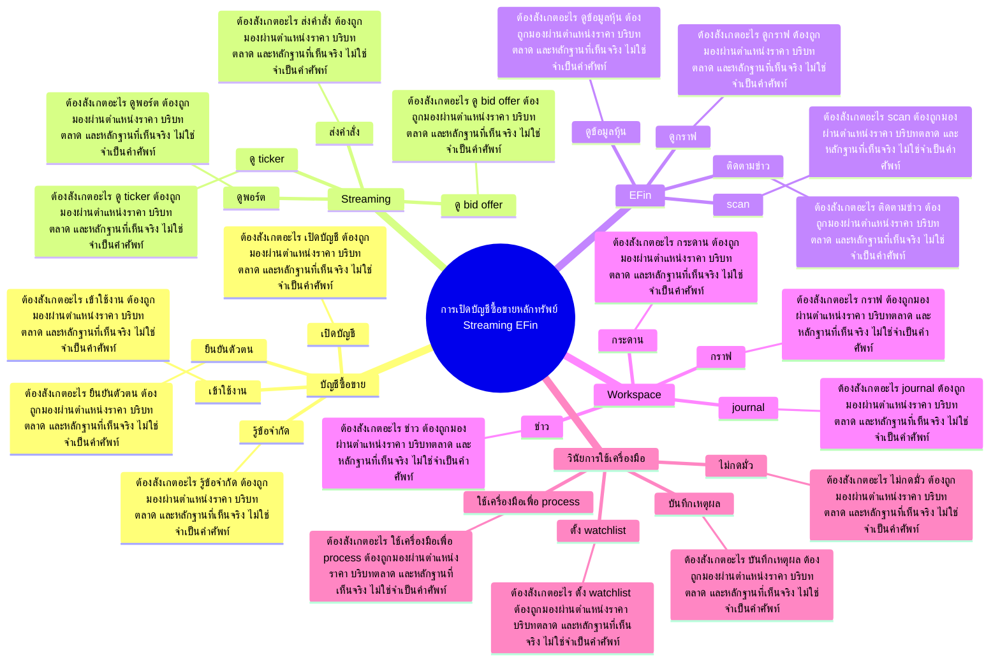

# Mind Map: การเปิดบัญชีซื้อขายหลักทรัพย์ Streaming EFin

## Central Idea
เครื่องมือที่พร้อมทำให้การฝึกไม่สะดุด แต่เครื่องมือไม่ใช่ edge ต้องผูกกับระบบเรียนและระบบเทรด

## Learning Context
- Phase: เตรียมเครื่องมือ
- Category: Tools

## Learning Goals
- รู้เครื่องมือพื้นฐานสำหรับซื้อขายและดูข้อมูล
- จัด workspace ให้พร้อมฝึกตามบทเรียน
- ลด friction ระหว่างการเรียนกับการลงมือจริง

## Keywords To Remember
นะครับ, ndid, โอเค, infinit, ais, volume, sms, navy, เนาะ, เนี่ย, stock, อ่ะ

## Big Branches + Deep Branches
### บัญชีซื้อขาย
- ภาพรวม: กิ่งนี้เชื่อมกับบทเรียนหลักเพราะ บัญชีซื้อขาย เป็นตัวแปลงความรู้ให้กลายเป็นการตัดสินใจ โดยเฉพาะเรื่อง เปิดบัญชี, ยืนยันตัวตน, เข้าใช้งาน
- เปิดบัญชี
  - ต้องสังเกตอะไร: เปิดบัญชี ต้องถูกมองผ่านตำแหน่งราคา บริบทตลาด และหลักฐานที่เห็นจริง ไม่ใช่จำเป็นคำศัพท์
  - ใช้ตอนไหน: ใช้ เปิดบัญชี เพื่อช่วยตัดสินใจว่าแผนในกิ่ง บัญชีซื้อขาย ควรเดินต่อ รอ ย่อขนาด หรือยกเลิก
  - ถ้าผิดต้องทำอะไร: ถ้าหลักฐานไม่ยืนยัน เปิดบัญชี ให้ลดความมั่นใจทันที และกลับไปถามจุดผิดทางของแผน
- ยืนยันตัวตน
  - ต้องสังเกตอะไร: ยืนยันตัวตน ต้องถูกมองผ่านตำแหน่งราคา บริบทตลาด และหลักฐานที่เห็นจริง ไม่ใช่จำเป็นคำศัพท์
  - ใช้ตอนไหน: ใช้ ยืนยันตัวตน เพื่อช่วยตัดสินใจว่าแผนในกิ่ง บัญชีซื้อขาย ควรเดินต่อ รอ ย่อขนาด หรือยกเลิก
  - ถ้าผิดต้องทำอะไร: ถ้าหลักฐานไม่ยืนยัน ยืนยันตัวตน ให้ลดความมั่นใจทันที และกลับไปถามจุดผิดทางของแผน
- เข้าใช้งาน
  - ต้องสังเกตอะไร: เข้าใช้งาน ต้องถูกมองผ่านตำแหน่งราคา บริบทตลาด และหลักฐานที่เห็นจริง ไม่ใช่จำเป็นคำศัพท์
  - ใช้ตอนไหน: ใช้ เข้าใช้งาน เพื่อช่วยตัดสินใจว่าแผนในกิ่ง บัญชีซื้อขาย ควรเดินต่อ รอ ย่อขนาด หรือยกเลิก
  - ถ้าผิดต้องทำอะไร: ถ้าหลักฐานไม่ยืนยัน เข้าใช้งาน ให้ลดความมั่นใจทันที และกลับไปถามจุดผิดทางของแผน
- รู้ข้อจำกัด
  - ต้องสังเกตอะไร: รู้ข้อจำกัด ต้องถูกมองผ่านตำแหน่งราคา บริบทตลาด และหลักฐานที่เห็นจริง ไม่ใช่จำเป็นคำศัพท์
  - ใช้ตอนไหน: ใช้ รู้ข้อจำกัด เพื่อช่วยตัดสินใจว่าแผนในกิ่ง บัญชีซื้อขาย ควรเดินต่อ รอ ย่อขนาด หรือยกเลิก
  - ถ้าผิดต้องทำอะไร: ถ้าหลักฐานไม่ยืนยัน รู้ข้อจำกัด ให้ลดความมั่นใจทันที และกลับไปถามจุดผิดทางของแผน

### Streaming
- ภาพรวม: กิ่งนี้เชื่อมกับบทเรียนหลักเพราะ Streaming เป็นตัวแปลงความรู้ให้กลายเป็นการตัดสินใจ โดยเฉพาะเรื่อง ส่งคำสั่ง, ดูพอร์ต, ดู bid offer
- ส่งคำสั่ง
  - ต้องสังเกตอะไร: ส่งคำสั่ง ต้องถูกมองผ่านตำแหน่งราคา บริบทตลาด และหลักฐานที่เห็นจริง ไม่ใช่จำเป็นคำศัพท์
  - ใช้ตอนไหน: ใช้ ส่งคำสั่ง เพื่อช่วยตัดสินใจว่าแผนในกิ่ง Streaming ควรเดินต่อ รอ ย่อขนาด หรือยกเลิก
  - ถ้าผิดต้องทำอะไร: ถ้าหลักฐานไม่ยืนยัน ส่งคำสั่ง ให้ลดความมั่นใจทันที และกลับไปถามจุดผิดทางของแผน
- ดูพอร์ต
  - ต้องสังเกตอะไร: ดูพอร์ต ต้องถูกมองผ่านตำแหน่งราคา บริบทตลาด และหลักฐานที่เห็นจริง ไม่ใช่จำเป็นคำศัพท์
  - ใช้ตอนไหน: ใช้ ดูพอร์ต เพื่อช่วยตัดสินใจว่าแผนในกิ่ง Streaming ควรเดินต่อ รอ ย่อขนาด หรือยกเลิก
  - ถ้าผิดต้องทำอะไร: ถ้าหลักฐานไม่ยืนยัน ดูพอร์ต ให้ลดความมั่นใจทันที และกลับไปถามจุดผิดทางของแผน
- ดู bid offer
  - ต้องสังเกตอะไร: ดู bid offer ต้องถูกมองผ่านตำแหน่งราคา บริบทตลาด และหลักฐานที่เห็นจริง ไม่ใช่จำเป็นคำศัพท์
  - ใช้ตอนไหน: ใช้ ดู bid offer เพื่อช่วยตัดสินใจว่าแผนในกิ่ง Streaming ควรเดินต่อ รอ ย่อขนาด หรือยกเลิก
  - ถ้าผิดต้องทำอะไร: ถ้าหลักฐานไม่ยืนยัน ดู bid offer ให้ลดความมั่นใจทันที และกลับไปถามจุดผิดทางของแผน
- ดู ticker
  - ต้องสังเกตอะไร: ดู ticker ต้องถูกมองผ่านตำแหน่งราคา บริบทตลาด และหลักฐานที่เห็นจริง ไม่ใช่จำเป็นคำศัพท์
  - ใช้ตอนไหน: ใช้ ดู ticker เพื่อช่วยตัดสินใจว่าแผนในกิ่ง Streaming ควรเดินต่อ รอ ย่อขนาด หรือยกเลิก
  - ถ้าผิดต้องทำอะไร: ถ้าหลักฐานไม่ยืนยัน ดู ticker ให้ลดความมั่นใจทันที และกลับไปถามจุดผิดทางของแผน

### EFin
- ภาพรวม: กิ่งนี้เชื่อมกับบทเรียนหลักเพราะ EFin เป็นตัวแปลงความรู้ให้กลายเป็นการตัดสินใจ โดยเฉพาะเรื่อง ดูกราฟ, ดูข้อมูลหุ้น, scan
- ดูกราฟ
  - ต้องสังเกตอะไร: ดูกราฟ ต้องถูกมองผ่านตำแหน่งราคา บริบทตลาด และหลักฐานที่เห็นจริง ไม่ใช่จำเป็นคำศัพท์
  - ใช้ตอนไหน: ใช้ ดูกราฟ เพื่อช่วยตัดสินใจว่าแผนในกิ่ง EFin ควรเดินต่อ รอ ย่อขนาด หรือยกเลิก
  - ถ้าผิดต้องทำอะไร: ถ้าหลักฐานไม่ยืนยัน ดูกราฟ ให้ลดความมั่นใจทันที และกลับไปถามจุดผิดทางของแผน
- ดูข้อมูลหุ้น
  - ต้องสังเกตอะไร: ดูข้อมูลหุ้น ต้องถูกมองผ่านตำแหน่งราคา บริบทตลาด และหลักฐานที่เห็นจริง ไม่ใช่จำเป็นคำศัพท์
  - ใช้ตอนไหน: ใช้ ดูข้อมูลหุ้น เพื่อช่วยตัดสินใจว่าแผนในกิ่ง EFin ควรเดินต่อ รอ ย่อขนาด หรือยกเลิก
  - ถ้าผิดต้องทำอะไร: ถ้าหลักฐานไม่ยืนยัน ดูข้อมูลหุ้น ให้ลดความมั่นใจทันที และกลับไปถามจุดผิดทางของแผน
- scan
  - ต้องสังเกตอะไร: scan ต้องถูกมองผ่านตำแหน่งราคา บริบทตลาด และหลักฐานที่เห็นจริง ไม่ใช่จำเป็นคำศัพท์
  - ใช้ตอนไหน: ใช้ scan เพื่อช่วยตัดสินใจว่าแผนในกิ่ง EFin ควรเดินต่อ รอ ย่อขนาด หรือยกเลิก
  - ถ้าผิดต้องทำอะไร: ถ้าหลักฐานไม่ยืนยัน scan ให้ลดความมั่นใจทันที และกลับไปถามจุดผิดทางของแผน
- ติดตามข่าว
  - ต้องสังเกตอะไร: ติดตามข่าว ต้องถูกมองผ่านตำแหน่งราคา บริบทตลาด และหลักฐานที่เห็นจริง ไม่ใช่จำเป็นคำศัพท์
  - ใช้ตอนไหน: ใช้ ติดตามข่าว เพื่อช่วยตัดสินใจว่าแผนในกิ่ง EFin ควรเดินต่อ รอ ย่อขนาด หรือยกเลิก
  - ถ้าผิดต้องทำอะไร: ถ้าหลักฐานไม่ยืนยัน ติดตามข่าว ให้ลดความมั่นใจทันที และกลับไปถามจุดผิดทางของแผน

### Workspace
- ภาพรวม: กิ่งนี้เชื่อมกับบทเรียนหลักเพราะ Workspace เป็นตัวแปลงความรู้ให้กลายเป็นการตัดสินใจ โดยเฉพาะเรื่อง กราฟ, กระดาน, ข่าว
- กราฟ
  - ต้องสังเกตอะไร: กราฟ ต้องถูกมองผ่านตำแหน่งราคา บริบทตลาด และหลักฐานที่เห็นจริง ไม่ใช่จำเป็นคำศัพท์
  - ใช้ตอนไหน: ใช้ กราฟ เพื่อช่วยตัดสินใจว่าแผนในกิ่ง Workspace ควรเดินต่อ รอ ย่อขนาด หรือยกเลิก
  - ถ้าผิดต้องทำอะไร: ถ้าหลักฐานไม่ยืนยัน กราฟ ให้ลดความมั่นใจทันที และกลับไปถามจุดผิดทางของแผน
- กระดาน
  - ต้องสังเกตอะไร: กระดาน ต้องถูกมองผ่านตำแหน่งราคา บริบทตลาด และหลักฐานที่เห็นจริง ไม่ใช่จำเป็นคำศัพท์
  - ใช้ตอนไหน: ใช้ กระดาน เพื่อช่วยตัดสินใจว่าแผนในกิ่ง Workspace ควรเดินต่อ รอ ย่อขนาด หรือยกเลิก
  - ถ้าผิดต้องทำอะไร: ถ้าหลักฐานไม่ยืนยัน กระดาน ให้ลดความมั่นใจทันที และกลับไปถามจุดผิดทางของแผน
- ข่าว
  - ต้องสังเกตอะไร: ข่าว ต้องถูกมองผ่านตำแหน่งราคา บริบทตลาด และหลักฐานที่เห็นจริง ไม่ใช่จำเป็นคำศัพท์
  - ใช้ตอนไหน: ใช้ ข่าว เพื่อช่วยตัดสินใจว่าแผนในกิ่ง Workspace ควรเดินต่อ รอ ย่อขนาด หรือยกเลิก
  - ถ้าผิดต้องทำอะไร: ถ้าหลักฐานไม่ยืนยัน ข่าว ให้ลดความมั่นใจทันที และกลับไปถามจุดผิดทางของแผน
- journal
  - ต้องสังเกตอะไร: journal ต้องถูกมองผ่านตำแหน่งราคา บริบทตลาด และหลักฐานที่เห็นจริง ไม่ใช่จำเป็นคำศัพท์
  - ใช้ตอนไหน: ใช้ journal เพื่อช่วยตัดสินใจว่าแผนในกิ่ง Workspace ควรเดินต่อ รอ ย่อขนาด หรือยกเลิก
  - ถ้าผิดต้องทำอะไร: ถ้าหลักฐานไม่ยืนยัน journal ให้ลดความมั่นใจทันที และกลับไปถามจุดผิดทางของแผน

### วินัยการใช้เครื่องมือ
- ภาพรวม: กิ่งนี้เชื่อมกับบทเรียนหลักเพราะ วินัยการใช้เครื่องมือ เป็นตัวแปลงความรู้ให้กลายเป็นการตัดสินใจ โดยเฉพาะเรื่อง ไม่กดมั่ว, ตั้ง watchlist, บันทึกเหตุผล
- ไม่กดมั่ว
  - ต้องสังเกตอะไร: ไม่กดมั่ว ต้องถูกมองผ่านตำแหน่งราคา บริบทตลาด และหลักฐานที่เห็นจริง ไม่ใช่จำเป็นคำศัพท์
  - ใช้ตอนไหน: ใช้ ไม่กดมั่ว เพื่อช่วยตัดสินใจว่าแผนในกิ่ง วินัยการใช้เครื่องมือ ควรเดินต่อ รอ ย่อขนาด หรือยกเลิก
  - ถ้าผิดต้องทำอะไร: ถ้าหลักฐานไม่ยืนยัน ไม่กดมั่ว ให้ลดความมั่นใจทันที และกลับไปถามจุดผิดทางของแผน
- ตั้ง watchlist
  - ต้องสังเกตอะไร: ตั้ง watchlist ต้องถูกมองผ่านตำแหน่งราคา บริบทตลาด และหลักฐานที่เห็นจริง ไม่ใช่จำเป็นคำศัพท์
  - ใช้ตอนไหน: ใช้ ตั้ง watchlist เพื่อช่วยตัดสินใจว่าแผนในกิ่ง วินัยการใช้เครื่องมือ ควรเดินต่อ รอ ย่อขนาด หรือยกเลิก
  - ถ้าผิดต้องทำอะไร: ถ้าหลักฐานไม่ยืนยัน ตั้ง watchlist ให้ลดความมั่นใจทันที และกลับไปถามจุดผิดทางของแผน
- บันทึกเหตุผล
  - ต้องสังเกตอะไร: บันทึกเหตุผล ต้องถูกมองผ่านตำแหน่งราคา บริบทตลาด และหลักฐานที่เห็นจริง ไม่ใช่จำเป็นคำศัพท์
  - ใช้ตอนไหน: ใช้ บันทึกเหตุผล เพื่อช่วยตัดสินใจว่าแผนในกิ่ง วินัยการใช้เครื่องมือ ควรเดินต่อ รอ ย่อขนาด หรือยกเลิก
  - ถ้าผิดต้องทำอะไร: ถ้าหลักฐานไม่ยืนยัน บันทึกเหตุผล ให้ลดความมั่นใจทันที และกลับไปถามจุดผิดทางของแผน
- ใช้เครื่องมือเพื่อ process
  - ต้องสังเกตอะไร: ใช้เครื่องมือเพื่อ process ต้องถูกมองผ่านตำแหน่งราคา บริบทตลาด และหลักฐานที่เห็นจริง ไม่ใช่จำเป็นคำศัพท์
  - ใช้ตอนไหน: ใช้ ใช้เครื่องมือเพื่อ process เพื่อช่วยตัดสินใจว่าแผนในกิ่ง วินัยการใช้เครื่องมือ ควรเดินต่อ รอ ย่อขนาด หรือยกเลิก
  - ถ้าผิดต้องทำอะไร: ถ้าหลักฐานไม่ยืนยัน ใช้เครื่องมือเพื่อ process ให้ลดความมั่นใจทันที และกลับไปถามจุดผิดทางของแผน

## Transcript Signals
> เราต้องใส่คือ 1 ข้อมูลตัวเราเองกับ 2 ใน กรณีที่ฉุกเฉินติดต่อเราไม่ได้ให้ติดต่อ ใครสำคัญคืออีเมลต้องไม่ซ้ำกัน นะครับตรงเนี้ยเตรียมไว้ตั้งแต่แรกเลย ก่อนที่เปิดพอร์ตก็ดีเพราะพี่นึกสภาพนะ กำลังกำลังกรอกอันนี้อยู่ใช่ป่ะกรอกๆใน...

> นี้เปิดบัญชีต่างจากเดิมเพราะมี NDID ใช่ มั้ครับมี NDID ในการยืนยันตัวตนอ่าอาจจะ ต่างจากเดิมเอ่อกระบวนการขั้นตอนเป็นยัง ไงติดขัดกันตรงไหนส่วนมากอะไรอย่างเงี้ย นะฮะผมก็จะมาเล่ามาอธิบายให้ฟังเนาะแล้ว ก็ต่อไปก็คือจะเป็นการใช้ streaming แล้ว ก็ eIN...

> อ่าธนาคารเสีย 130 บาทจ่ายที่หน้าเว็บ หยวนตอนเปิดบัญชีเนาะแต่ของ AIS เนี่ย 60 บาทอ่าผ่านก้าวมาพูดถึง AIS นิดนึงของ AIS เนี่ยสามารถทำได้ประมาณ 2 ช่องทางเหมือน กันช่องทางแรกไปที่ shop หมื่กว่าสาขา ทั่วประเทศครับก็บอกเค้าว่าทำ MD เนาะช่องทางที่ 2 คือทำผ่านคีอสของ...

## Decision Rules
- บัญชีซื้อขาย: จะใช้กิ่งนี้ได้เมื่อเห็น เปิดบัญชี และ ยืนยันตัวตน พร้อมกัน ถ้าเจอเงื่อนไขตรงข้ามกับ รู้ข้อจำกัด ให้ลดขนาดหรือหยุด
- Streaming: จะใช้กิ่งนี้ได้เมื่อเห็น ส่งคำสั่ง และ ดูพอร์ต พร้อมกัน ถ้าเจอเงื่อนไขตรงข้ามกับ ดู ticker ให้ลดขนาดหรือหยุด
- EFin: จะใช้กิ่งนี้ได้เมื่อเห็น ดูกราฟ และ ดูข้อมูลหุ้น พร้อมกัน ถ้าเจอเงื่อนไขตรงข้ามกับ ติดตามข่าว ให้ลดขนาดหรือหยุด
- Workspace: จะใช้กิ่งนี้ได้เมื่อเห็น กราฟ และ กระดาน พร้อมกัน ถ้าเจอเงื่อนไขตรงข้ามกับ journal ให้ลดขนาดหรือหยุด
- วินัยการใช้เครื่องมือ: จะใช้กิ่งนี้ได้เมื่อเห็น ไม่กดมั่ว และ ตั้ง watchlist พร้อมกัน ถ้าเจอเงื่อนไขตรงข้ามกับ ใช้เครื่องมือเพื่อ process ให้ลดขนาดหรือหยุด

## Common Mistakes
- จำชื่อบทได้ แต่ไม่รู้ว่า บัญชีซื้อขาย ต้องเปลี่ยนพฤติกรรมการเทรดตรงไหน
- เห็นสัญญาณหนึ่งอย่างแล้วรีบสรุป ทั้งที่ยังไม่ได้เช็กบริบทและหลักฐานประกอบ
- วางแผนตอนใจเย็น แต่พอราคาเคลื่อนไหวจริงกลับเปลี่ยนกฎตามอารมณ์
- สนใจ วินัยการใช้เครื่องมือ แค่ตอนอยากเข้า แต่ไม่ใช้เป็นเงื่อนไขตอนต้องออกหรือหยุด

## Practice Checklist
- ทวนเป้าหมายบทนี้ก่อนเริ่ม: รู้เครื่องมือพื้นฐานสำหรับซื้อขายและดูข้อมูล
- เปิดกราฟหรือกรณีศึกษาจริง 1 ตัว แล้วระบุว่าเกี่ยวกับกิ่ง 'บัญชีซื้อขาย' ตรงไหน
- เขียนก่อนเข้าว่า thesis คืออะไร หลักฐานคืออะไร และถ้าผิดจะยอมรับตรงไหน
- แยกสิ่งที่เห็นจริงออกจากสิ่งที่อยากให้เกิด แล้วให้คะแนนความมั่นใจ 1-5
- หลังจบเคส ให้บันทึกว่าแพ้/ชนะเพราะระบบ หรือเพราะอารมณ์

## Final Destination
จัดเครื่องมือให้พร้อมเพื่อฝึกและลงมือจริง แต่ให้ระบบคิดเป็นคนขับ ไม่ใช่หน้าจอเป็นคนสั่ง

## Questions for Patiphan
1. กิ่งไหนคือแก่นที่สุดของบทนี้
2. กิ่งไหนเกี่ยวกับจุดอ่อนของ Patiphan มากที่สุด
3. ถ้าจะเอาไปใช้กับกราฟจริง ต้องเห็นหลักฐานอะไร
4. ถ้าทำผิด บทนี้เตือนให้หยุดตรงไหน
5. ปลายทางของบทนี้จะเข้าไปอยู่ในระบบเทรดส่วนไหน
