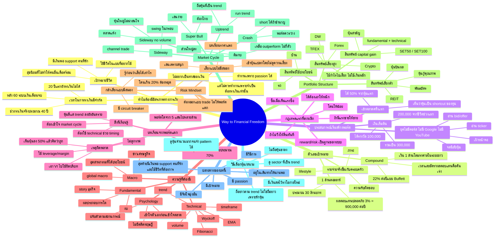

# Mind Map บทที่ 1: สร้างพอร์ต 300 เท่า / Way to Financial Freedom

## Central Idea
**Technical Analysis เป็นแค่ 10% ของเกม การมีอิสรภาพทางการเงินต้องสร้างจากเป้าหมายชีวิต + เวลา + ระบบคิด + risk/reward + การอยู่รอดครบ market cycle**



## Outline แบบอ่านลึก

### 1. ภาพใหญ่: ทำไมต้องเล่นเกมนี้
อาจารย์เริ่มด้วยการบอกว่า Technical Analysis เป็นเพียงส่วนเล็กของความสำเร็จ ประมาณ 10% แล้วโยนคำถามใหญ่กว่า: ถ้าอยากมีอิสรภาพทางการเงิน ต้องมีแผนอย่างไร

กิ่งนี้เป็นรากของบท เพราะถ้าไม่มีเหตุผลชีวิต ความรู้เทคนิคจะกลายเป็นของสะสม ไม่ใช่ระบบเปลี่ยนชีวิต

### 2. เหตุผลชีวิต: เวลาไม่ได้เยอะอย่างที่คิด
เขาอธิบายว่าเวลาหาเงินจริงของคนมีจำกัด ช่วง 20 ปีแรกส่วนใหญ่ยังหาเงินไม่ได้ และหลังเกษียณก็หาเงินแบบเดิมไม่ได้ ช่วงทำเงินจริงอาจมีประมาณ 40 ปี

สรุปกิ่งนี้: **อิสรภาพทางการเงินไม่ใช่ความโลภ แต่เป็นการเอาเวลาชีวิตคืนมา**

### 3. ตัวเลขเป้าหมาย: อิสรภาพต้องคำนวณได้
เขายกนิยามประมาณ 1 ล้านดอลลาร์ หรือราว 30 ล้านบาท ถ้าได้ผลตอบแทนปลอดภัย 3% จะมี passive income ประมาณ 900,000 บาทต่อปี แต่จำนวนที่พอจริงขึ้นกับครอบครัว ภาระ และวิถีชีวิต

สรุปกิ่งนี้: **เป้าหมายชีวิตต้องแปลงเป็นตัวเลข ไม่อย่างนั้นจะวางแผนไม่ได้**

### 4. เส้นทางชีวิตเทรดเดอร์: จาก 300,000 สู่หลายล้าน แล้วพอร์ตแตก
เขาเล่าจุดเริ่มจากเงินเก็บและรางวัลรวมประมาณ 300,000 บาท เข้าเทรดหุ้นแรกได้กำไรดี จึงเห็นว่าตลาดหุ้นเป็น shortcut ของทุน แต่ต่อมาเมื่อพอร์ตโตและเจอวิกฤต พอร์ตหายหนัก เพราะตีความ VI ผิด ซื้อหุ้นที่คิดว่าถูกโดยไม่ดู trend และกราฟ

สรุปกิ่งนี้: **ตลาดให้รางวัลเร็วได้ แต่ถ้าไม่มีระบบ ตลาดก็เอาคืนเร็วได้เหมือนกัน**

### 5. กฎแรกที่ใช้ได้จริง: โดนให้น้อย ได้ให้หนัก
ช่วงแรกเขายังดูกราฟไม่เป็น แต่ฝึกอ่าน ticker, bid/offer, movement และนิสัยหุ้น หลักคือซื้อเมื่อเห็นแรง ถ้าไม่ไปให้คืน ถ้าเริ่มมีแรงขายให้ขาย ยอมโดนค่าคอมหลายครั้งเพื่อรอไม้ที่วิ่งแรง

สรุปกิ่งนี้: **พื้นฐานของระบบไม่ใช่ indicator แต่คือ reward/risk**

### 6. จากสัญชาตญาณสู่ระบบ: ต้องรวม Fundamental + Technical
หลังพอร์ตแตก เขาเริ่มเรียนกราฟและพบว่าไม้ที่ดีมักเกิดจากผลประกอบการโตบวกกับ technical setup ที่ดี Technical จึงไม่ใช่ทั้งหมด แต่เป็นตัวช่วย timing และช่วยไม่ให้ซื้อของดีใน trend ที่ผิด

สรุปกิ่งนี้: **Fundamental บอกว่าหุ้นดีไหม Technical บอกว่าควรวางเงินตอนไหน**

### 7. Mindset: เข้าใจตัวเองก่อนเข้าใจตลาด
เขาพูดถึงนิสัยตัวเองว่า adapt เก่ง ไม่ยึดติดทฤษฎี กล้าเสี่ยง แต่ต้องเสี่ยงแบบมีจุดยอม ไม่ใช่เสี่ยงเพราะสนุก ตัวอย่างการเสี่ยงผิดทำให้เสียหนักและกลายเป็นบทเรียน

สรุปกิ่งนี้: **นักเทรดต้องรู้ character ตัวเอง เพราะระบบที่ดีต้องเหมาะกับนิสัยคนใช้**

### 8. Risk: Circuit breaker ก่อนพอร์ตแตก
เขาย้ำว่าถ้าลงทุน 10 ล้าน ต้องรู้ตั้งแต่แรกว่าเสียได้กี่ล้าน มีจุดหยุด เช่นไม่ให้โดนเกิน 20% แนวคิดนี้ไม่ใช่ทำให้กลัว แต่ทำให้กล้าเสี่ยงแบบมีสมอง

สรุปกิ่งนี้: **กล้าได้ต้องมาพร้อมกล้าเสียแบบมีขอบเขต**

### 9. Portfolio Structure: เงินแต่ละก้อนควรมีหน้าที่
บทนี้ไม่ได้สอนให้เอาทุกอย่างไปเสี่ยง เขาแยกสินทรัพย์เป็นกลุ่ม เช่นเสี่ยงต่ำเพื่อความมั่นคง สินทรัพย์ใช้ประโยชน์ หุ้นเพื่อ capital gain และสินทรัพย์เสี่ยงสูงที่ควรใช้เงินกำไรไปเสี่ยง

สรุปกิ่งนี้: **พอร์ตที่ดีไม่ใช่ก้อนเดียว แต่เป็นระบบของเงินหลายหน้าที่**

### 10. Market Cycle: เล่นให้ถูกสนาม
ตอนท้ายบทโยงเข้าสู่สภาวะตลาด เช่น super bull, uptrend, sideway, sideway no volume, ต้มกบ, crash แต่ละสนามต้องใช้วิธีต่างกัน ช่วง super bull ต้องโกย ช่วงต้มกบต้องเลือก outperform ช่วง crash ต้องพอร์ตว่างหรือ short เฉพาะคนที่ชำนาญ

สรุปกิ่งนี้: **ไม่มีกลยุทธ์เดียวที่ใช้ได้ทุกตลาด ต้องรู้ก่อนว่าตอนนี้อยู่สนามไหน**

### 11. ปลายทางของบท
ปลายทางของบทนี้ไม่ใช่ “ไปเรียนกราฟต่อ” แต่คือ:

- มี passion
- มีเป้าหมาย
- มีวิธีการ
- มีจิตใจมุ่งมั่น
- อยู่ในเส้นทางให้นานพอ
- เอาเงินไป support คนที่รักและใช้ชีวิตที่ต้องการ

## Mind Map สำหรับ Patiphan

ถ้าปรับบทนี้ให้เข้ากับคุณ แกนต้องเป็นแบบนี้:

```text
อิสรภาพทางการเงิน
└─ เพื่อดูแลครอบครัวและเลือกชีวิตเอง
   └─ ต้องมีตัวเลขเป้าหมาย
      └─ ต้องสร้างพอร์ต
         └─ ก่อนสร้างพอร์ตต้องรอด
            └─ ก่อนรอดต้องมี risk/reward
               └─ ก่อนใช้ risk/reward ต้องรู้สนามตลาด
                  └─ ก่อนรู้สนามต้องฝึกดูกราฟ/volume/fundamental
                     └─ ก่อนฝึกทั้งหมดต้องไม่ FOMO และไม่หลุดวินัย
```

## คำถามที่บทนี้ต้องให้คุณตอบ
1. เป้าหมาย 30 ล้านบาทของคุณคืออะไรในภาษาชีวิต ไม่ใช่ภาษาตัวเลข
2. ถ้าพอร์ตคุณแตก 70% เหมือนเรื่องในบทนี้ คุณจะรู้ได้อย่างไรว่าเกิดจากอะไร
3. ระบบของคุณตอนนี้มี circuit breaker ก่อนพอร์ตแตกหรือยัง
4. คุณกำลังเรียน technical เพื่อใช้เป็น 10% ที่คมขึ้น หรือกำลังหวังให้มันแก้ทั้งชีวิต
5. ตอนนี้ตลาดที่คุณเล่นอยู่เป็นสนามแบบไหน: uptrend, sideway, ต้มกบ หรือ crash

## ข้อสรุปสุดท้าย
บทที่ 1 สอนว่า **การสร้างพอร์ต 300 เท่าไม่ได้เริ่มจากสูตรเข้าออก แต่เริ่มจากชีวิตที่อยากได้ ตัวเลขที่ต้องไปถึง ความเข้าใจตัวเอง ระบบกันตาย และความสามารถในการเลือกสนามให้ถูก**

ถ้าคุณเข้าใจบทนี้จริง คุณจะไม่ถามแค่ว่า “ซื้อหุ้นตัวไหนดี” แต่จะถามว่า:

> ตอนนี้ฉันอยู่ในสนามไหน เงินก้อนนี้มีหน้าที่อะไร ถ้าผิดจะเสียเท่าไร และ trade นี้พาฉันเข้าใกล้อิสรภาพทางการเงินจริงไหม
